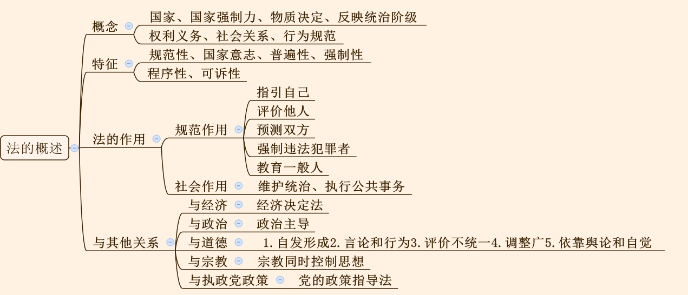

## 一、法的概述

1. 法的概念：由国家制定、国家强制力保障实施，由物质生活条件决定，反映统治阶级的意志，以权利、义务为主要内容，是一种行为规范体系。

2. 特征（理解含义）：重点掌握普遍性，法律面前人人平等，但不包括立法平等。

3. 法的作用包括规范作用和社会作用，其中规范作用是重点。 规范作用包括五种， 指引针对本人、评价针对他人、预测针对双方之间的行为、强制针对违法犯罪者、教育针对一般人。

4. 与其他关系：
   - （1）与道德：道德是自发形成的；表现为言论和行为；评价标准不统一；调整范围更宽、更广；依靠舆论和自觉保障实施。
   - （2）与经济：经济基础决定法。
   - （3）与政治：政治主导法。
   - （4）与宗教：简单了解即可。
   - （5）与执政党政策：党的政策指导法。

---
## 二、法的关系

1. 主体：自然人（活人）、法人、其他组织、国家。

2. 内容：**权利（自主决定）和义务（必须做或者必须不得做出）**；权利是主要的，义务是次要的，**履行义务是为了更好的享有权利**。

3. 客体：物、人身、行为结果、智力成果。

4. 法律关系的形成、变更和消灭：
   - （1）依据：法律规范。
   - （2）条件和中介：法律事实。
   - （3）法律事实分为法律事件和法律行为：法律行为以人的意志为转移，法律事件不以人的意志为转移。

## 三、法的效力

1. 效力层次：
   - （1）上位高于下位。
   - （2）同一机关制定的：特别优于一般，新法优于旧法。

2. 效力范围：有学术争议。
   - （1）三分法：对人、空间、时间。
   - （2）四分法：对人、事、空间、时间。

3. 对人：**以属地为主，与属人主义和保护主义相结合。**

4. 空间：
   - （1）原则上主权都适用。
   - （2）特殊：驻外使馆、船舶飞机。

5. 时间效力：
   - （1）生效：必须经公布。
   - （2）失效：明示和默示。
   - （3）溯及力：原则上不溯及既往。

---
## 四、立法

1. 立法权：(和`人大`有关的都是`法`+自治条例和单行条例)
   - （1） 全国人大和人常制定的文件称为`法律`。
   - （2） 行政法规由国务院制定。
   - （3） 国务院下属部门制定的文件称为部门规章。
   - （4） 某省人大制定的文件称为地方性`法`规， 某省政府制定的文件称为政府规章。
   - （5） 自治条例和单行条例由自治地方的人大制定。

2. 立法的效力： 上级＞下级，同级人大＞同级政府。

   - (1). 立法的效力： 无需死记硬背。**上级大于下级，同级人大大于同级政府。**
   - (2). 宪法（根本法、 母法） ＞法律（全人大和全人常） ＞行政法规（国务院，又称中央人民政府） ＞地方性法规（地方人民政府）。
   - (3). 宪法＞法律＞行政法规（国务院制定）＞部门规章（国务院下属部门、直属机构制定）。
   - (4). 本级地方性法规（如山东省人大制定） ＞本级地方政府规章（如山东省政府制定）：同级人大大于同级政府。
   - (5). 省级地方性法规＞设区的市地方性法规：省大于市。
   - (6). 省级政府规章＞设区的市政府规章：省大于市。

3. 立法裁决：地方性法规和部门规章出现冲突，由国务院提意见，防止国务院护短；政府规章和部门规章发生冲突，由国务院裁决。

4. 法律部门是调整同一类社会关系的总称；法律体系是现行法律组成的总和。在我国法律体系是以宪法为核心的中国特色社会主义法律体系。

5. 法律渊源：正式渊源（我国主要表现为以宪法为核心的制定法）和非正式渊源。

---
## 五、法的实施

1. 执法：
   - （1） 主体： 行政机关和公职人员。
   - （2） 内容：对社会进行全面管理。
   - （3） 特征： 强制性、主动性、单方面性。

2. 司法：
   - （1） 主体： 司法机关， 即法院和检察院。
   - （2） 内容： 处理案件。
   - （3） 特征： 强制性、被动性、程序性。

3. 守法：
   - （1）主体：所有人。
   - （2）内容：依法行使权利和履行义务。

4. 法律责任：
   - （1）违法、违约、法律规定。
   - （2）分类：民事、刑事、行政、违宪。
