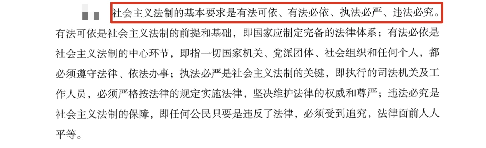

## 一、法的概述

1. 法的概念：由国家制定、国家强制力保障实施，由物质生活条件决定，反映统治阶级的意志，以权利、义务为主要内容，是一种行为规范体系。**有了国家才有了法**。

2. 特征（理解含义）：重点掌握普遍性，法律面前人人平等，但不包括立法平等。

3. 法的作用包括规范作用和社会作用，其中规范作用是重点。 

4. 规范作用包括五种， 指引针对本人、评价针对他人、预测针对双方之间的行为、强制针对违法犯罪者、教育针对一般人。
   - （1）指引作用：针对个体行为（本人）。分为：个别指引、规范性指引(通过一般的规则，对一类人或情况进行规范，如刑法等)
   - （2）评价作用：针对他人。
   - （3）预测作用：针对双方之间（相互）。
   - （4）强制作用：针对违法犯罪者。
   - （5）教育作用：针对一般人（通过案例对一般人行为产生影响）。

> 例子：醉驾入刑，甲、乙两人喝酒，甲觉得自己喝多了，表示自己不能开车，要打车回家，是**法对甲本人行为的指引，属于指引作用**。甲、乙喝酒之后乙要开车上路，**甲表示乙的行为可能涉嫌违法，此时属于评价作用，是对乙行为的评价**。乙不听劝阻，**甲预测乙上路后遇到警察，警察看到乙会将其拦下来，属于预测作用（双方之间的行为）**。乙开车上路后果然被抓，**被判处拘役 6 个月，此时属于强制作用，针对违法犯罪者**。乙的**案例告知大家不能酒驾，张三行为对一般人起到的警示教育作用**。

5. 与其他关系：
   - （1）与道德：道德是自发形成的；表现为言论和行为；评价标准不统一；调整范围更宽、更广；依靠舆论和自觉保障实施。
   - （2）与经济：经济基础决定法。
   - （3）与政治：政治主导法。
   - （4）与宗教：简单了解即可。
   - （5）与执政党政策：党的政策指导法。

   

6. 人权与法律

   - 1.人权指生而为人应当享有的权利，比如甲作为一个人，应该能够吃饱饭、有媳妇、有 尊严的活着，但在现实生活中甲可能会挨饿、单身，因此人权是人理论上应该有的权利，但实际中不确定。
   
   - 2.法律权利:用法律明确规定的权利，也就是立法者把一部分最重要的人权写入法律，用法律的方式加以规定后形成法律权利，如财产权、人身权都属于法律权利，**人权被写入法律后就更有可能得到国家的保障**。
   
   - 3.人权和法律权利中**人权是基础，人权是生而为人就有的权利，范围更大**。

---
## 二、法的关系

1. 主体：自然人（活人）、法人、其他组织、国家。

2. 内容：**权利（自主决定）和义务（必须做或者必须不得做出）**；权利是主要的，义务是次要的，**履行义务是为了更好的享有权利**。

3. 客体：物、人身、行为结果、智力成果。

4. 法律关系的形成、变更和消灭：
   - （1）依据：法律规范。
   - （2）条件和中介：法律事实。
   - （3）法律事实分为法律事件和法律行为：
     - 法律行为：以人的意志为转移；
     - 法律事件：(客观事件，不以人的意志为转移，如地震、泥石流，人的生死)不以人的意志为转移。

## 三、法的效力

1. 效力层次：
   - （1）上位高于下位。
   - （2）同一机关制定的：特别优于一般，新法优于旧法。

2. 效力范围：有学术争议。
   - （1）三分法：对人、空间、时间。
   - （2）四分法：对人、事、空间、时间。

3. 对人：**以属地为主，与属人主义和保护主义相结合。**

4. 空间：
   - （1）原则上主权都适用。
   - （2）特殊：驻外使馆、船舶飞机。

5. 时间效力：
   - （1）生效：必须经公布。
   - （2）失效：明示和默示。
   - （3）溯及力：原则上不溯及既往。

---
## 四、立法

1. 立法权：(和`人大`有关的都是`法`+自治条例和单行条例)
   - （1） `全国人大和人常`制定的文件称为`法律`。
   - （2） `行政法规`由`国务院`制定。
   - （3） `国务院下属部门`制定的文件称为`部门规章`。
   - （4） `某省人大、设区的市人大/人常`制定的文件称为`地方性法规`， `某省政府、设区的市政府`制定的文件称为`政府规章`。
   - （5） `自治条例和单行条例`由`自治地方的人大`制定。
   - （6） 制定`地方性法规`得是`地方省级和设区的市的人大、人常`。海淀区不是设区的市的级别。

2. 自治区、自治州、自治县的**人民代表大会常务委员会**中应当由实行区域自治的民族的公民担任主任或者副主任。**自治区主席、自治州州长、自治县县长**由实行区域自治的民族的公民担任。(自治区州县的行政一把手必须本民族人担当)

3. 立法的效力： 上级＞下级，同级人大＞同级政府。

   
   - (1). 立法的效力： 无需死记硬背。**上级大于下级，同级人大大于同级政府。**
   - (2). 宪法（根本法、 母法） ＞法律（全人大和全人常） ＞行政法规（国务院，又称中央人民政府） ＞地方性法规（地方人民政府）。
   - (3). 宪法＞法律＞行政法规（国务院制定）＞部门规章（国务院下属部门、直属机构制定）。
   - (4). 本级地方性法规（如山东省人大制定） ＞本级地方政府规章（如山东省政府制定）：同级人大大于同级政府。
   - (5). 省级地方性法规＞设区的市地方性法规：省大于市。
   - (6). 省级政府规章＞设区的市政府规章：省大于市。

3. 立法裁决：地方性法规和部门规章出现冲突，由国务院提意见，防止国务院护短；政府规章和部门规章发生冲突，由国务院裁决。

4. 法律部门是调整同一类社会关系的总称；法律体系是现行法律组成的总和。在我国法律体系是以宪法为核心的中国特色社会主义法律体系。

5. 法律渊源：正式渊源（我国主要表现为以宪法为核心的制定法）和非正式渊源。

---
## 五、法的实施

1. 执法：
   - （1） 主体： 行政机关和公职人员。
   - （2） 内容： 对社会进行全面管理。
   - （3） 特征： 强制性、主动性、单方面性。

2. 司法：又称法的适用，通常是指国家司法机关根据法定职权和程序，具体应用法律处理案件的专门活动。
   - （1） 主体： 司法机关， 即法院和检察院。
   - （2） 内容： 处理案件。
   - （3） 特征： 强制性、被动性、程序性。

> 要掌握司法的含义，必须了解司法的特点：
   
   - （1）司法是由特定的国家机关及其工作人员按照法定职权实施法律的专门活动;
   - （2）司法具有国家强制性;
   - （3）司法是司法机关依照法定程序处理案件的活动;
   - （4）司法必须有表明法的适用的结果的法律文书。而本题中，A是法官个人行为，而不是依照法定程序而为的活动。B则不是依职权行使的专门活动，同样是个人行为。而D则更是自己的个人行为，不代表国家意志性。C则是国家司法机关根据法定职权运用法律的活动，故本题应该选C。

3. 守法：
   - （1）主体：所有人。
   - （2）内容：依法行使权利和履行义务。

4. 法律责任：
   - （1）违法、违约、法律规定。
   - （2）分类：民事、刑事、行政、违宪。

5. 法律平等体现在 法的实施

6. 社会主义法制的基本要求：**有法可依、有法必依、执法必严、违法必究**

