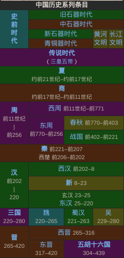
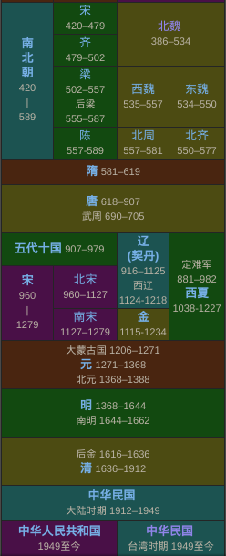
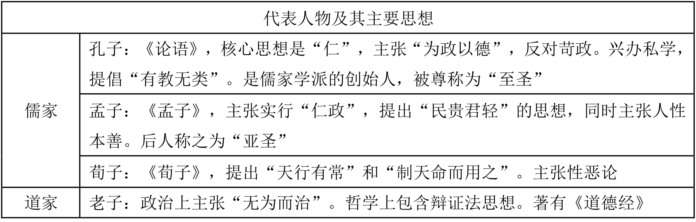
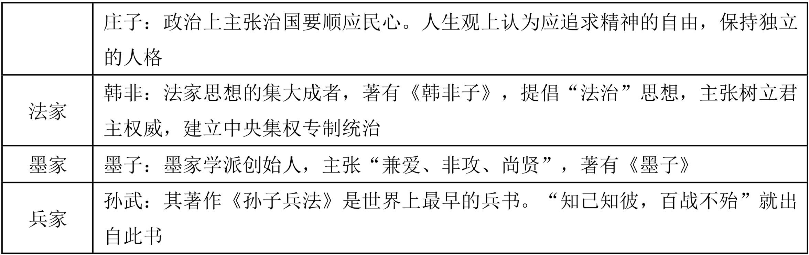
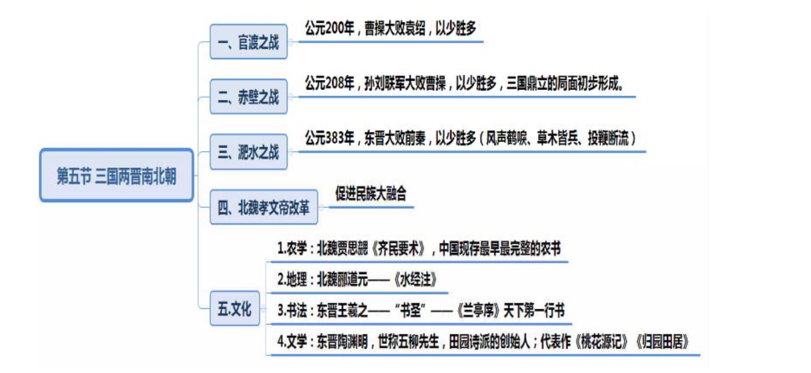
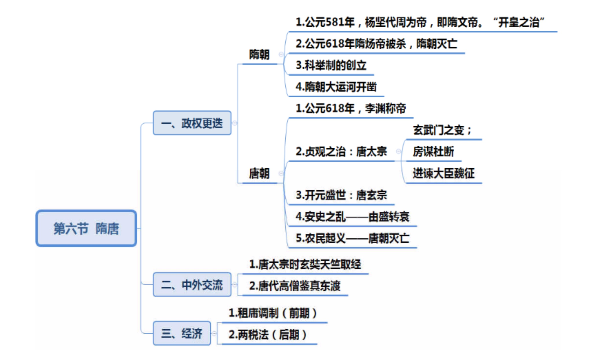
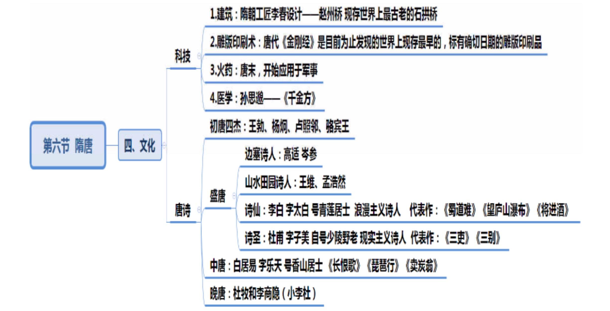
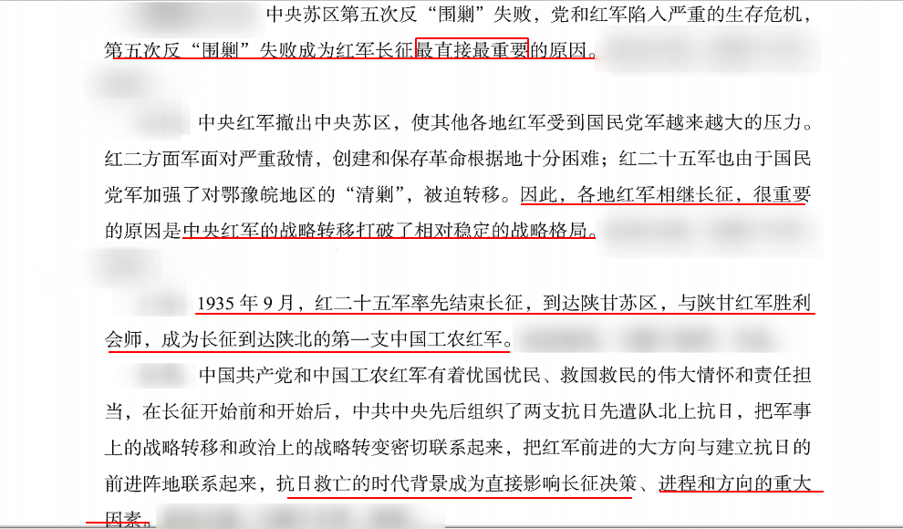

## 一、中国古代史
1. 中国古代朝代更迭顺序（朝代歌）：




```
夏商与西周，东周分两段；
春秋和战国，一统秦两汉；
三分魏蜀吴，二晋前后延；
南北朝并立，隋唐五代传；
宋元明清后，皇朝至此完。
```

2. 考查方式：考查朝代出现的先后顺序，如秦朝、隋朝、元朝和清朝的先后顺序。

### （一） 夏、商、西周的更替


1. 夏朝：
   - （1）建立者：禹。
   - （2）禹死后，儿子启继承王位，世袭制代替禅让制，公天下变为家天下。

2. 商朝：
   - （1）开国君主：商汤。 商汤灭夏。
   - （2）盘庚迁殷：殷指今河南安阳。
   - （3）青铜器： 中国的青铜铸造在商朝达到繁盛， 工艺极其精湛， 如司母戊鼎和四羊方尊。
   - （4）甲骨文：
     - ①中国最早有文字可考的历史开始于商朝。
     - ②王懿荣被称为“甲骨文之父”。

3. 西周：
   - （1）武王伐纣： 史称牧野之战。 周武王以少胜多，商朝士兵临阵倒戈。
   - （2） 西周： 定都镐京（今陕西西安）， 位置在西面，史称西周。
   - （3） 两个重要制度：
     - ①分封制（常考）：西周确立的重要政治制度。
     - ②井田制。《诗经》中有一句话“普天之下，莫非王土”，就是对井田制的形象描述，说明当时的土地都归周王所有。由于当时的土地纵横交错，形同“井” 字，便将这种制度称为井田制。

### （二） 春秋战国


1. 西周灭亡：亡国之君为周幽王，烽火戏诸侯，西周被犬戎所灭。

2. 东周： 周平王迁都洛邑（今河南洛阳），史称东周，因政治形态不同分两段时期。
   - （1）春秋五霸：先后称霸的五个人物。
     - ①齐桓公姜小白是春秋时期第一个霸主。
     - ②晋文公重耳退避三舍。
     - ③楚庄王熊旅问鼎中原。
     - ④越王勾践卧薪尝胆，立志复国（常考）。
   - （2）战国七雄：1.由春秋进入战国的标志:赵魏韩三家分晋(多选题)，田氏代齐。战国时期出现七个实力雄厚的国家，统称战国七雄，即秦、韩、赵、魏、楚、燕、齐(顺口溜:请喊赵薇去演戏)
     - ①秦国商鞅变法。
     - ②三次著名战役：将战役和典故相结合。

> 三次著名战役

- 1. 桂陵之战: 
   - (1)交战国家:魏、赵、齐。魏国的大将是庞涓，齐国的大将是孙膑，两人都是鬼谷子的徒弟，庞涓嫉妒孙膑的才能，设计陷害孙膑，孙膑被实行膑刑，膝盖骨被挖。 
   - (2)围魏救赵(典故):庞涓带兵攻打赵国，赵国向齐国求救，齐国派孙膑解救，孙膑趁魏国国力空虚，带兵攻打魏国都城大梁，庞涓连夜撤兵回救，在桂陵中埋伏，被孙膑打败，史称桂陵之战。 

- 2. 马陵之战:魏国庞涓带兵攻打韩国，韩国向齐国求救。孙膑采用减灶计，减少做饭用的军灶，庞涓一路追击，发现军灶减少，以为对方的人数越来越少，便加速追击，结果在马陵中了埋伏，庞涓被杀。

- 3. 长平之战:秦、赵。战国杀伤人数最多、最惨烈的一场战争。赵国一开始以廉颇为大将，廉颇根据当时的地形跟秦国打疲劳战，以逸待劳，坚守不出。于是秦国到赵国散布谣言 称廉颇坚守不出是要投降了，而且秦国不怕廉颇，怕的是赵括。于是赵国换大将为赵括，赵括只会纸上谈兵，熟读兵法但不懂实战经验，改变廉颇的战术，开始主动出击，而秦国的将领是战神白起，结果秦军大败赵军，赵军四十多万人被活埋。长平之战后，六国再也无力与秦国抗衡，加速秦国一统天下的步伐。

1. 百家争鸣：学术空前繁盛。
   



   - （1） 儒家：
     - ①孔子：
       - a 儒家学派创始人，被称为“至圣”。
       - b《论语》不是孔子所写，而是其弟子整理的。
       - c 核心思想：“仁”，“ 仁者爱人”；兴办私学， 被称为“ 万世师表”。
     - ②孟子： “亚圣”。主张：“ 仁政”； “民贵君轻”；“人性本善”。
     - ③荀子： “ 天行有常”， 古代朴素唯物主义观点； “ 人性本恶”； 其著作首篇为《劝学》；提出“ 君者舟也， 庶人者水也， 水则载舟， 水则覆舟”。
   - （2） 道家：
     - ①老子： 道家学派创始人，主张“无为而治”，顺其自然。
     - ②庄子： 追求精神上的自由，著《逍遥游》；喜欢讲寓言故事。
   - （3） 墨家：墨子，代表贫民阶层。主张：爱一切人；反对不义战争；任人唯贤。
   - （4） 兵家：孙武的《孙子兵法》， 是世界上最早的兵书。
   - （5） 法学：韩非子是法家的集大成者，主张为君主服务。

2. 医学和天文成就：
   - （1） 战国名医扁鹊，提出望闻问切“四诊法”，现在中医仍然沿用。扁鹊被称为“脉学之宗”。
   - （2）《甘石星经》： 我国最早的天文学著作。我国最早的天文学著作。“甘”指甘德，“石”指石申，两人本来各有一本天文学著作，后人将其合并成《甘石星经》。
   - （3）《墨经》：《墨子》内容的一部分，记载很多物理学知识，如杠杆原理、小孔成像、光学八条。2016 年我国发射的世界第一颗量子通讯卫星被命名为“墨子号”，因为墨子在 战国时期就已经提出光沿直线传播，体现了我国的文化自信。

### （三） 秦朝

#### 一、秦朝的建立
1. 公元前 230 年至公元前 221 年，秦王嬴政采取“远交近攻”的策略，陆续灭掉六国， 最后灭掉的是齐国。灭亡顺序:韩赵魏楚燕齐(口诀:喊赵薇去演戏)。

2. 公元前 221 年，秦朝建立，是我国历史上第一个统一的中央集权的封建王朝。疆域: 定都咸阳，东临大海，西到陇西，北抵长城一带。秦长城绵延万里，也称万里长城，是为抵 御匈奴，西到临洮，东到辽东。注意:现存长城为明长城。

#### 二、专制主义中央集权制的建立

1. 政治方面: (1)中央:三公九卿制。三公:丞相管理行政事务;太尉管理军事;御史大夫负责监察百官，各司其职。九卿:丞相下设的各部门，类似国务院下设的教育部、财政部等。 (2)地方:郡县制，分郡、县两级。
2. 经济方面:
   - (1)统一货币。 
   - (2)统一度量衡:度指长度单位，量指容积单位，衡指重量单位。 
3. 文化方面:统一文字，利于政务推行。当时全国的规范文字是小篆。编创小篆的是李斯(小篆之祖)。 

4. 焚书坑儒:加强自身的统治，控制思想，从思想上加强中央集权。

#### 三、秦末农民战争

1. 大秦帝国成于法家，也亡于法家。从商鞅变法到后来的韩非子，都主张法家思想，乱 世用重典，严刑峻法，才使得秦国不断强大，但秦朝建立之后，对百姓太残暴，激起了民愤。 

2. 陈胜、吴广在大泽乡揭竿起义:口号“王侯将相宁有种乎”(称王拜相的人难道天生就是贵种吗?)，体现了当时农民阶级的反抗精神。

3. 刘邦和项羽带领的起义军: 

   - (1)巨鹿之战:项羽一战成名，大败秦军主力。典故:破釜沉舟，鼓舞士气，以少胜多打败秦军主力。
   - (2)巨鹿之战后，秦朝名存实亡，刘邦攻占秦朝都城咸阳，公元前 207 年，秦朝灭亡。刘邦进入咸阳后以主人自居，与百姓约法三章，秋毫未犯。项羽不满，意欲出兵攻打刘邦， 刘邦自知实力悬殊，主动去项羽驻扎的地方鸿门向其请罪，于是便有了一场“鸿门宴”。项 羽的谋士范增认为刘邦野心太大应当杀掉，但项羽认为刘邦与自己实力悬殊，又因道义上没 有杀刘邦的理由，最后放走刘邦。
   - (3)楚汉相争长达四年，最后心怀天下的刘邦取胜，项羽在乌江自刎。


### （四） 两汉


#### 一、西汉
1. 西汉:建立者刘邦(汉高祖)，定都长安(今西安)，史称西汉。

2. 文景之治:西汉建立后，经过多年战争整个国家经济非常衰弱，当时刘邦出行时都找 不到四匹毛色相同的马，百姓的温饱问题也不能解决，因此统治者采取休养生息的政策。“休 养生息”指实行道家的一系列主张，减免百姓的赋税和徭役，让百姓都进行农业生产，同时 也废除严刑峻法。到汉文帝、汉景帝统治时期，经济不断得到恢复和发展，百姓生活也越来 越安定，因此出现的治世局面，被称为“文景之治”。

3. 汉武帝大一统:在汉武大帝刘彻统治时期进行了大一统，“大一统”指在政治、经济、 思想、文化上都高度统一。
   - (1)政治上:颁布推恩令。背景:当时诸侯王的势力过大，会威胁王权，为了解决此 问题颁布推恩令。推恩令规定诸侯王死后，除嫡长子继承之外，还要分割王国的部分土地分 给其他子弟，诸侯王的封地越分越小，其实力被削弱，皇权也就得到加强。
   - (2)思想上:采用董仲舒“罢黜百家，独尊儒术”的建议，唯独推崇儒家思想，把儒家思想作为正统思想，其他各家思想都遭到不同程度的排斥。原因:由于儒家思想提倡忠君 守礼，有利于大一统。
   - (3)经济上:盐铁专营、统一铸币等。在汉武帝统治时期，整个西汉的国力达到最鼎 盛时期，历史上一提到西汉，都说强汉。

4. 西汉后期:皇帝比较年幼，公元 9 年，王莽自立为帝，建立新莽政权，西汉灭亡。 

   - (1)朝代顺序:西汉——短暂的新莽政权——东汉。 
   - (2)针对王莽的评价:现在很多史学评论王莽为“伟大的改革家”“穿越者”。原因:读史书发现，对于王莽的评价都是负面的，因为中国古代等级森严，皇帝可以昏庸，但臣子不能篡权。从中国近代开始，对王莽出现正面评价，甚至认为王莽是“社会主义的皇帝”， 因其建立新莽政权后就大刀阔斧地进行改革，改革的举措过于超前(比如土地全部实行国有、 废除奴隶、鼓励科技创新等)，均失败，导致统治走向终点。

#### 二、东汉

1. 东汉:建立者刘秀。刘秀采取一系列举措让社会安定下来，在其统治时期出现的治世 局面称为“光武中兴”。

2. 东汉后期皇帝大多年幼(主幼国疑)，出现外戚专权、宦官专权，后期统治日益腐朽， 百姓遭殃，苦不堪言，只能发动农民起义。张角领导的起义军头戴黄巾，被称为黄巾起义， 口号“苍天已死，黄天当立，岁在甲子，天下大吉”。注意:秦末的农民起义是陈胜、吴广 的大泽乡揭竿起义。

3. 正是因为东汉末期的农民起义，当时的统治者要求当地的州郡长官、豪强地主镇压各 地的起义军，在镇压的过程中他们不断扩充自己的武装、积蓄力量，因此出现军阀割据/军 阀林立的局面(比如曹操、刘备、袁绍等)。

#### 三、两汉的文化

1. 史学方面: 

   - (1)西汉史学家司马迁:著我国古代第一部纪传体通史《史记》。“纪传体”指以人物传记为中心反映历史事件，“通史”指连贯的历史，非某个时期、朝代的历史。《史记》是从上古的黄帝时期一直写到汉武帝统治时期，共三千多年的历史。鲁迅评价《史记》为“史家之绝唱，无韵之离骚”，既肯定在史学上的成就，又肯定在文学上的成就。

   - (2)东汉史学家班固:著我国第一部断代史《汉书》(主要记录西汉一朝的历史)。 班固的弟弟是投笔从戎的班超(投笔从戎，经营西域;“不入虎穴，焉得虎子”讲的就是班 超的故事)，其妹妹班昭是当时的女史学家，其父亲班彪也是当时的史学家。

2. 科技方面:

   - (1)东汉蔡伦:改进造纸术，并不是发明造纸术。在西汉时已经出现纸张(考古发现， 在甘肃天水的放马滩出现制地图的麻纸)，当时的纸张非常粗糙，不便书写。东汉蔡伦改进 造纸术后，使得制造纸张的原料更容易得到、造价更加低廉，更便于书写，因此是人类书写 材料的一场巨大的革命。后蔡伦被封为“龙亭侯”，纸张被称为“蔡侯纸”。没有纸张出现 之前，把文字写在竹简、木渎上。假设没有纸这种书写材料，都需推一个车来上公基课。纸 张对世界也有深远影响，比如之前欧洲将文字写在羊皮卷上，印度将文字写在树皮上。
   - (2)东汉张衡:发明地动仪，是世界上最早测量地震的仪器。

3. 医学方面: (1)张仲景:著《伤寒杂病论》，对后人影响深远，因此被称为“医圣”。 (2)华佗:擅长外科手术，发明麻沸散(全身麻醉)、强身健体的医学体操五禽戏(模仿虎、鹿、猿、熊、鸟五种动物的形体)。

4. 医学方面: 

- (1)张仲景:著《伤寒杂病论》，对后人影响深远，因此被称为“医圣”。 
- (2)华佗:擅长外科手术，发明麻沸散(全身麻醉)、强身健体的医学体操五禽戏(模仿虎、鹿、猿、熊、鸟五种动物的形体)。 

4. 宗教方面:
   - (1)佛教:产生于古印度。张骞通西域后，西汉末期佛教传入中国。
   - (2)道教:东汉时期创立，是我国土生土长的宗教。道教≠道家思想，道教是将民间 的神仙方术和老子的道家学说杂糅在一起所创立的教派，道教将老子奉为教主，称其为“太上老君”。

#### 四、民族关系
1. 张骞通西域被司马迁称为“凿空之旅”。
2. 目的:军事上寻找盟友。 
   - (1)西汉时期，经常受到少数民族匈奴的侵扰。汉初汉高祖刘邦想要消灭匈奴，但是白登之围险些丧命，后与匈奴进行和亲。到汉武帝刘彻统治时期，国家强盛，国力已经“不 可同日而语”，想要彻底打败匈奴，得到大月氏与匈奴有世仇的消息，因此想派一人联合大 月氏一起抗击匈奴，张骞主动请缨，因此就有了张骞出使西域。
 - (2)公元 138 年，张骞第一次出使西域比较艰难，刚到匈奴地区就被关押十多年，逃 出后找到大月氏说明来意，但大月氏表示不想再报仇。但张骞第一次通西域并不是完全没有 收获，比如了解到西域各个地方的风土人情，西域指甘肃西门关、阳关以西，新疆天山南北 的大部分地区，共有大大小小 36 个国家，最大的是乌孙国，最小的是楼兰古国，他们想摆 脱匈奴的奴役、控制，很多国家都想与汉朝进行交往。后来张骞第二次出使西域，从长安出 发，经过甘肃、新疆，到达西亚，其所带的东西最远已经传至欧洲。比如将铸铁、开渠、凿 井技术、瓷器、丝绸等传至西亚，乃至欧洲，同时从西域带回的葡萄、核桃、苜蓿、石榴、 汗血宝马、歌舞等也传入中原地区，这条沟通东西方经济、文化往来的路上要道命名为“丝 绸之路”(由德国地理学家李希霍芬命名)。


### （五）三国两晋南北朝



#### 一、三国鼎立
1. 官渡之战: 

- (1)交战双方是曹操和袁绍。东汉末期有黄巾起义，在镇压农民起义的过程中出现军阀割据/军阀林立的局面，在北方比较有实力的军阀为曹操和袁绍，为争夺北方的统治权， 发动官渡之战。
- (2)结果:曹操以少胜多，打败袁绍。
- (3)原因:火烧乌巢。许攸原本是袁绍身边的谋士，后投靠曹操并献计，告诉袁绍粮 草的囤积地在乌巢，如果能夜袭乌巢，断其粮草，袁绍就会不攻自破，曹操听从建议，火烧 乌巢，袁绍被打败，曹操统一了北方。

2. 赤壁之战:曹操不满足统一北方，其目的是统一全国，因此胜胜追击，又剑指南方。 南方有依附荆州的刘备和割据江东的孙权，孙刘选择联合抗曹，因此就有了赤壁之战(一方 是曹操，一方是孙刘联军)，最后孙刘联军以少胜多大败曹操。这场战役之后，曹操再也不 敢轻易南下，赤壁之战后三国鼎立的局面初步形成。

3. 淝水之战:交战双方一方是前秦政权，一方是东晋。三国鼎立局面正式形成的标志是 先后称帝，最先称帝的是曹操(“治世之能臣，乱世之奸雄;挟天子以令诸侯”)的儿子曹丕，定都洛阳，建立曹魏政权，紧接着刘备称帝，定都成都，建立蜀汉政权，最后称帝的是 孙权，建立孙吴政权。

#### 二、西晋、东晋

1. 三国中实力最弱的是蜀汉政权，最先被魏国所灭，紧接着曹魏政权走向灭亡(曹魏政 权全部被司马家族控制，后司马炎称帝，灭魏建立西晋政权)，后西晋又灭吴。三国鼎立局 面结束后进入统一的朝代，即西晋。

2. 晋武帝司马炎作为西晋的开国皇帝，很昏庸，据说司马炎的后宫有数千美女，皇帝骑 着羊车选美人，羊车停在谁的门口，皇帝晚上就宠幸谁，妃子们想尽办法吸引羊跑到自己的 门口。

3. 西晋的灭亡:司马炎的儿子晋惠帝是中国历史上有名的白痴皇帝。故事:大臣反映百姓因闹饥荒吃不上饭，皇帝就说“吃不上饭就喝肉粥”。其他的皇兄、皇叔、皇侄等看不上 皇帝，都想争夺皇位，因此出现“八王之乱”(西晋后期)，最后西晋被少数民族匈奴所灭。 

4. 东晋:司马睿跑到南方以建康为都城建立东晋延续其统治。北方出现“五胡乱华”的 局面(北方是被少数民族所灭，因此北方被少数民族所控制)，所谓“五胡”指匈奴、鲜卑、 羯、氐、羌五个主要的少数民族。大量少数民族内迁至中原，建立很多少数民族政权，统称 为五胡十六国。当时的少数民族还处在原始社会状态，存在茹毛饮血的现象，北方的百姓深受其害。 

5. 前秦政权:北方多个政权林立，其中一个少数民族氐族快速发展，建立前秦政权，在当时统治者苻坚的统治之下不断强大，统一了北方。 

6. 淝水之战:由于苻坚不满足统一北方，还想要统一全国，因此出兵攻打东晋，发动淝水之战(一方是前秦政权，一方是东晋)。当时苻坚号称百万大军(实际是 87 万人)，东晋只有 8 万人，双方实力相差悬殊，最后东晋以少胜多大败前秦。当时双方部队交战于淝水河，东晋的前锋谢玄隔着淝水河向苻坚喊话说“我们隔着淝水河不方便打仗，你给我腾个地方，让我过河，再痛痛快快打一场”，苻坚自认为可以在东晋士兵过河的途中将其打败，因此命令自己的部队后撤，由于苻坚的部队有一些汉人和少数民族不是一条心，在苻坚命令士兵后撤时，就有汉人高喊“前秦已经大败”，因此造成严重的踩踏事件，就在前秦部队混乱 时，东晋的北府兵快速过河，大败前秦部队。与战争相关的典故:投鞭断流、风声鹤唳、草木皆兵。

#### 四、南北朝

1. 孝文帝改革:北魏时期。 
2. 前秦政权统一了北方，淝水之战后前秦政权瓦解，北方再次进入混乱，后少数民族鲜卑族建立的北魏政权再次统一了北方。
3. 孝文帝改革内容的特点:汉化。
   - (1)迁都:从平城(山西大同)迁往中原的洛阳。 
   - (2)服装、姓氏:穿汉服、姓汉姓，比如北魏孝文帝拓跋宏改名为元宏，再如独孤姓改为刘姓。
   - (3)与汉族通婚。
   - (4)说汉话。 

4. 孝文帝的改革促进了民族融合(常考查)。

#### 五、三国两晋南北朝时期的文化
1. 农学:北魏农学家贾思勰著《齐民要术》，是我国最早最完整的农书。注意:有两个 “最”字。
2. 地理:北魏地理学家郦道元专著《水经注》。注意:明朝徐霞客著《徐霞客游记》。

3. 书法:东晋大书法家王羲之，被称为“书圣”，代表作品《兰亭序》，被称为“天下 第一行书”。与儿子王献之合称“二王”，王献之的代表作品是《中秋贴》。

4. 文学:东晋陶渊明。
   - (1)田园诗派的创始人。 
   - (2)自称“五柳先生”(门前种了五棵柳树)，死后世人又称“靖节先生”。 
   - (3)代表作品:《饮酒》《归园田居》《桃花源记》。《饮酒》中名句“采菊东篱下，悠然见南山”。后“东篱”二字代指种菊花的地方。


### （六） 第六节 隋唐




#### 一、政权的更迭
1. 隋朝:建立者是北周外戚杨坚(小皇帝的姥爷，主幼国疑)，代周为帝，建立隋朝， 即隋文帝。隋文帝统治时期出现的治世局面，被称为“开皇之治”。

2. 杨坚去世后，隋炀帝杨广继承皇位。在杨广统治时期，隋朝走向灭亡。隋朝是一个短 命的王朝，二世而亡。隋炀帝杨广并非像影视剧中所演绎的，是一个残暴、好色、讲排场、 好大喜功的君主，也有一些功绩，比如大家所熟知的隋朝大运河的开通。

3. 隋朝创立科举制度。

4. 唐朝的开国皇帝是唐高祖李渊。 

5. 贞观之治:第一个盛世局面，在唐太宗李世民统治时期。 
   - (1)玄武门之变:秦王李世民本身并非太子人选(太子是李建成)，发动玄武门之变，杀死哥哥李建成、弟弟李元吉，最终夺得皇位，当上皇帝。 
   - (2)李世民是中国历史上非常有作为的一位帝王，明君体现在: 1知人善任:房谋杜断。“房”指房玄龄(善于谋略);“杜”指杜如晦(善于用人)。 2虚怀纳谏:魏征(直言进谏)。 

6. 开元盛世:唐玄宗李隆基统治时期把唐朝推向鼎盛/极盛(杜甫《忆昔》中的诗句“忆昔开元全盛日，小邑犹藏万家室”)。在唐玄宗统治后期专宠杨贵妃、任用奸臣(李林甫、杨国忠)、不理朝政，晚年时期的军事举措也出现失当，外重内轻，把兵力都放在边境，在边境设立很多军镇，军镇的长官为节度使，安禄山是三个军镇的长官，相当于现在的三军总司令，权力很大，最后起兵叛唐，即安史之乱。

7. 安史之乱(乱了八年)只是让唐朝由盛转衰，真正让唐朝走向灭亡的是农民起义(黄 巢起义)。

8. 朱温一开始是起义军的首领，后投靠唐朝帮助镇压起义军，自己的权力越来越大，最 后灭唐，建立后梁政权。

9. 唐朝灭亡后，进入五代十国时期(考试不涉及)。

#### 二、科举制的创立和完善

1. 科举制创立:隋朝。科举制指采用分科考试选拔人才，不看门第和家世。而看读书的 能力。唐朝时期科举制不断完善，武则天统治时期首创武举和殿试。当时的情况下，找不到 比科举更好的选拔人才的方式，类似现在的高考。

2. 明清时期，确立三级考试制度: 
   - (1)乡试:参加省一级考试，考中为举人，第一名为解元。省一级考试中考取第一名。 
   - (2)会试:参加礼部(相当于现在的教育部)举行的考试，考中为贡士，第一名为会元。 
   - (3)殿试:皇帝亲自主持考试，考中为进士，第一名为状元，第二名为榜眼，第三名为探花。 

3. 范进中举参加的是乡试;“连中三元”指在乡试、会试、殿试均是第一名;《小李飞刀》中有一个词是“小李探花”，可知其在殿试中考取第三名。 

4. 并非人人都能参加乡试，需要通过资格考试，即童生试/童试，考中成为秀才后才有资格参加乡试。


#### 三、中外交流
1. 玄奘:唐太宗时期的高僧。玄奘去古印度(天竺)求取真经，是《西游记》中唐僧的原型。 

2. 鉴真:六次东渡日本弘扬佛法。

#### 四、经济
1. 大运河: 
   - (1)隋炀帝统治时期兴修、开凿大运河，北到涿郡、南到余杭，以洛阳为中心。 
   - (2)主要目的:政治上(加强南北的统治)和经济上(促进南北方经济交流)的目的。 

2. 唐朝的赋税制度: 

   - (1)租庸调制(唐朝前期):唐朝前期的土地制度为均田制，全国的土地是等量授田，百姓手中都有一块田地，需要给国家交地租。“租”指田租;“调”指每家除了交纳一定田租 外，还需交纳一定丝织品;“庸”指古代成年男子服劳役，不想服劳役可以纳绢代役。
   - (2)两税法(唐朝后期):经历安史之乱后，唐朝后期土地兼并问题严重，有些人良田 万顷，有些人无立锥之地，均田制无法施行，租庸调制也就无法施行，因此根据当时的情况，实行两税法。两税法:一方面以夏秋两季征税，简化征税程序;另一方面按照土地和资产的 多少进行征税(符合当时的实际情况)。

#### 五、文化

1. 雕版印刷术:隋唐时期已经就有雕版印刷术。唐朝印制的《金刚经》是目前为止发现 的世界上现存最早的，标有确切日期的雕版印刷品。

2. 火药的发明:当时古代炼丹道士每天守着丹炉想要得道升仙，在炉子中放入硫磺、硝 石、木炭，达到一定比例后炉子发生爆炸，偶然之中得到火药的配方。唐朝末期，火药开始 应用于军事。

3. 医学的进步:“药王”孙思邈。陕西有一些供奉孙思邈的祠堂，祠堂内的碑文用英文 “Drug King”介绍孙思邈。注意:“Drug King”不是毒枭，而是“药王”。医学著作是《千金方》，其认为“人命至重，有贵千金”。

4. 建筑的成熟:隋朝工匠李春所建造赵州桥(河北赵县)，是现存世界上最古老的一座 石拱桥。

5. 唐代诗歌发展经历四个阶段:初唐、盛唐、中唐、晚唐。每个阶段的代表人物各不相同。 

6. 初唐:
   - (1)初唐四杰:王勃、杨炯、卢照邻、骆宾王。
   - (2)四人中，王勃的成就最高，代表作品《滕王阁序》，流传千古的名句“落霞与孤鹜 齐飞，秋水共长天一色”;还有名句“海内存知己，天涯若比邻。无为在歧路，儿女共沾巾”。

7. 盛唐:
   - (1)边塞诗人:高适、岑参(常考)。王昌龄也属于边塞诗人。 
   - (2)山水田园诗人:王维、孟浩然。 
     - 1王维:名维，字摩诘(名字合之为维摩诘，维摩诘是佛教著名居士的名字)，通过名字可看出王维是一位虔诚的佛教信徒，一生受到佛教深远影响，非常熟悉、精通禅学，因此 被称为“诗佛”。
     - 2王维擅长画山水画，苏轼评价其“诗中有画，画中有诗”。
   
   - (3)诗仙:李白，字太白，号青莲居士，浪漫主义诗人。作品(常考):《将进酒》《蜀 道难》《梦游天姥吟留别》《望庐山瀑布》《早发白帝城》等。《将进酒》中的名句“天生我才 必有用，千金散尽还复来”。
   - (4)诗圣:杜甫，字子美，自号少陵野老，现实主义诗人。杜甫的年龄小于李白，但 二人创作风格非常不同。李白比较浪漫，有个性，不畏权贵;杜甫是现实主义诗人，其作品 以小见大，反映史实，与李白合称“李杜”。代表作品:
     - 1《蜀相》中“出师未捷身先死，长使英雄泪满襟”描写的人物是诸葛亮。
     - 2《三吏》指《潼关吏》《石壕吏》《新安吏》，《三别》指《新婚别》《无家别》《垂老别》， 均创作于安史之乱之后，途径潼关、石壕、新安看到酷吏对百姓的欺压，百姓生活在水深火 热之中。通过《三吏》《三别》表现出对酷吏的讽刺和抨击，同时也表现出对百姓的一种同 情。
     - 3从创作的《望岳》中可看出杜甫年轻时非常有理想。《望岳》中的名句“会当凌绝顶， 一览众山小”(描写的是泰山)。

8. 中唐:白居易，字乐天，号香山居士。代表作品:《长恨歌》《卖炭翁》《琵琶行》等。 重点关注叙事长诗《长恨歌》，主要描写唐玄宗和杨贵妃之间的缠绵悱恻的爱情故事，名句 “在天愿作比翼鸟，在地愿为连理枝。天长地久有时尽，此恨绵绵无绝期”。白居易被称为 “诗魔”(不疯魔，不成活)。注意:“诗鬼”是李贺

9. 晚唐:杜牧、李商隐合称为“小李杜”。


### （七） 
 

> 国别体:《国语》和《战国策》。《国语》最早的一部国别史著作,按照国别记录西周、春秋贵族关于治国相关的言论,一定程度上反应了历史事件,作者无定论,现在学者认为并不是一时一人所著,无定论的事情一般不会考查。 《战国策》记录战国时期的言论,原作者不详,后是刘向编定整理的。

> 《左传》和《春秋》都是编年体,**区别在于《春秋》中国现存最早的一部编年体史书**,《左传》是中国第一部叙事详细的编年体史书,《左转》内容是《春秋》的十多倍。

> 古代农业书籍
1. 徐光启的《农政全书》综合介绍了我国的传统农学成就,其中又贯穿着他治国治民的“农政”思想,这也是与其他农书相比的特色之所在。
2. 《齐民要术》是中国现存最早最完整的综合性农书,作者是北魏的贾思勰。 
3. 沈括著《梦溪笔谈》,这是一本综合类的科学著作。
4. 明代宋应星的《天工开物》是世界上第一部关于农业和手工业生产的综合性著作。

> 农政全书包含农业和政治
> 齐名要术，齐了就是最完整最早的农书
> 笔谈，综合性的科学著作
> 天工开物，世界第一的涉及到手工业和农业

> 唐宋八大家：唐代韩愈、柳宗元,宋代 欧阳修、苏轼、苏洵、苏辙、王安石、曾巩。

## 二、中国近现代史

> 辛亥革命失败的原因：
1. 领导者资产阶级革命派本身存在着许多弱点和错误，根源是由于中国民族资产阶级的软弱性和妥协性。
2. 资产阶级革命派始终没有一个彻底的反封建纲领。
3. 资产阶级革命派始终没有一个彻底的反帝纲领。 

> 鸦片战争之后签订《南京条约》标志中国开始沦为半殖民地半封建社会。

> 《辛丑条约》中清政府承诺镇压人民的反帝斗争,将原来主管外交的总理衙门改成外务部,方便清政府按照西方列强的意志实行卖国的外交政策,**标志着清政府完全成为帝国主义统治中国的工具,中国半殖民地半封建社会彻底形成**。

> 甲午中日战争之后签订的《马关条约》(南京条约之后最严重的条约),**标志中国半殖民地半封建社会大大加深**。第二次鸦片期间主凶英国、法国、俄国、美国先后强迫清政府在天津分别签订的不平等条约,主要内容为外国公使进驻北京,开放一些通商口岸。

## 三、世界历史

### （一） 资本主义在欧洲的兴起

1. 地理大发现：哥伦布发现美洲新大陆，麦哲伦环球航行，证明地球是圆的。

2. 人的发现：文艺复兴，重视人的价值，崇尚人性，打破教会的束缚。主要掌握代表人物，比如先驱但丁、美术三杰、 英国戏剧之父莎士比亚，可能考查相关作品，比如：莎士比亚的四大悲剧。（英国戏剧之父，代表作《罗密欧与朱丽叶》不属于四大悲剧之一， 被称为正剧或悲喜剧，四大悲剧指《哈姆雷特》《奥赛罗》《李尔王》《麦克白》。）

### （二） 各国资产阶级革命


1. 英国资产阶级革命：光荣革命标志着资产阶级革命完成，《权利法案》的颁布标志着君主立宪制在英国形成。

2. 美国资产阶级革命：英国对北美经济进行殖民统治，对经济进行压制，因此出现莱克星顿的枪声。
   - （1）美国独立战争的开端： 莱克星顿的枪声。
   - （2）《独立宣言》的发表标志美国诞生。
   - （3）美国内战：美国独立之后，在资本主义的发展仍存在障碍（奴隶制），矛盾激化，爆发南北战争，南方失败，奴隶制废除。当时的美国总统林肯支持废除奴隶制，战争结束后，被奴隶制的狂热拥护者暗杀。

3. 法国资产阶级革命：
   - （1）启蒙运动：欧洲的思想文化解放运动，在法国推向高潮。 代表人物是孟德斯鸠和卢梭。但丁、莎士比亚不是启蒙运动时期的代表，而是文艺复兴时期的代表。
   - （2）法国《人权宣言》，美国《独立宣言》。
   - （3）拿破仑：世界上第一部资本主义民法典是拿破仑时期颁布的《民法典》。

### （三） 两次工业革命


1. 第一次工业革命，最先在英国开始的， 1765 年，珍妮纺纱机的发明，机器被发明出来，代替手工生产。 人类进入以蒸汽为动力的蒸汽时代，相关发明：蒸汽轮船（泰坦尼克号）、蒸汽机车/火车。

2. 第二次工业革命：电的广泛应用，使人类进入电气时代。重点关注德国和美国，比如：德国的西门子发明发电机、德国的本茨发明汽车、美国莱特兄弟发明飞机、美国的爱迪生。

3. 第三次工业革命让人类进入信息时代，比如：原子能技术、航天技术、电子计算机的应用等。现在努力进行第四次工业革命，即工业 4.0，人类将进入智能时代。

### （四） 第一次世界大战

1. 时间:1914 年——1918 年。导火索：萨拉热窝事件。

2. 两大军事集团，以英国为首的协约国胜利。

3. 战役：凡尔登战役（绞肉机）。

4. 巴黎和会重新瓜分世界，对德国进行掠夺性的惩罚，埋下了复仇的种子。


### （五） 二战


1. 爆发标志： 德国闪电突袭波兰，两天之后英法对德宣战，二战爆发。

2. 二战达到最大规模：日本偷袭美国在太平洋的海军基地珍珠港。

3. 美国加入，形成反法西斯联盟， 26 个国家签署《联合国家宣言》， 其中包括中国。

4. 斯大林格勒战役：二战的重要转折点。

5. 会议：
   - （1） 1943 年召开开罗会议：与中国相关，《开罗宣言》 主要针对日本。
   - （2） 德黑兰会议：主要开辟第二战场，加速战争进程，第二战场指诺曼底登陆。
   - （3） 雅尔塔会议：苏美英主要商量如何惩罚德国、惩罚军国主义和战犯，德国投降，希特勒自杀身亡。
   - （4） 日本投降，二战结束。

6. 考查会议。

7. 考查电影，比如：《诺曼底登陆》《珍珠港》《敦刻尔克大撤退》《血战钢锯岭》 都是以二战为背景。

8. 考查标志性事件，比如： 二战爆发的标志、 二战达到最大规模的事件。

### （六） 外国文学与艺术


1. 浪漫主义文学：法国大文豪维克多雨果，代表作《巴黎圣母院》《悲惨世界》；英国作家雪莱，代表作《西风颂》。

2. 现实主义文学：法国巴尔扎克的巨著《人间喜剧》，被称为资本主义社会的百科全书；莫泊桑代表作《羊脂球》《项链》。俄国契科夫的代表作《变色龙》《套中人》；列夫·托尔斯泰代表作《战争与和平》《安娜·卡列尼娜》《复活》。美国作家马克·吐温代表作《竞选州长》《百万英镑》。

3. 现代主义文学：海明威的代表作《老人与海》《太阳照常升起》，反映人对生活的恐惧、迷茫。

4. 印度的泰戈尔是亚洲第一个活动诺贝尔文学奖的人，代表作《飞鸟集》《吉檀迦利》。哥伦比亚的马尔克斯，代表作《百年孤独》，被称为拉丁美洲魔幻现实主义的代表作。

5. 绘画：常考荷兰梵高， 代表作《向日葵》； 西班牙毕加索，代表作《格尔尼卡》。

6. 音乐：贝多芬、约翰·施特劳斯。

### （七） 总结
1. 国民党一大的召开标志着国共第一次合作的实现（正确）。

2. 国共第一次合作破裂的时间是 1927 年（正确），原因：蒋介石发动四一二反革命政变，汪精卫发动七一五反革命政变。

3. 打响了武装反抗国民党反动派第一枪的起义是秋收起义（错误）， 原因： 是八一南昌起义，因此 8 月 1 日是建军节。

4. 1927 年 8 月 7 日在武汉的汉口召开八七会议，毛主席提出枪杆子里出政权（正确）。

5. 1927 年 10 月底，建立第一个革命根据地井冈山革命根据地（正确）。

6. 长征的原因是第五次反围剿的失败（正确）。



7. 长征的时间： 1934 年 10 月——1936 年 10 月（正确）。

8. 1935 年 1 月在贵州遵义召开的遵义会议是党历史上生死攸关的会议，挽救了党，挽救了红军，挽救了革命（正确）。

9. 14 年抗战的起点是 1931 年九一八事变（正确）。

10. 1937 年，七七卢沟桥事变，日本开始全面侵华（正确）。

11. 抗日战争以来的首次大捷平型关大捷粉碎了日本不可战胜的神话（正确）。

12. 八路军在华北地区与日本进行的规模最大、 持续时间最长的是百团大战，正面战场取得的最大规模的胜利是台儿庄战役（正确）。

13. 9 月 3 日抗日战争胜利纪念日（正确）。

14. 蒋介石假和谈真内战， 假和谈指重庆谈判（正确）。

15. 三大战役中规模最大的是淮海战役（正确）。

16. 毛主席的诗“宜将剩勇追穷寇，不可沽名学霸王。 天若有情天亦老，人间正道是沧桑” 指渡江战役，要将革命进行到底（正确）。

17. 但丁的文艺复兴时期的代表人物（正确）。

18. 莎士比亚是文艺复兴时期的代表人物，代表作是四大悲剧，即： 《哈姆雷特》《奥赛罗》《李尔王》《麦克白》（正确）。

19. 《独立宣言》 对应的国家是法国（错误）， 原因： 美国的是《独立宣言》， 法国的是《人权宣言》。

20. 启蒙运动代表人物是卢梭、孟德斯鸠（正确）。

21. 拿破仑说“我真正的光荣并非打了 40 次胜仗，滑铁卢之战抹去了关于这一切的记忆。但是我相信，有一样东西人们是不会忘记的，那就是我的《民法典》”（正确）。

22. 蒸汽机车是第一次工业革命的发明成果， 本茨发明的汽车是第二次工业革命的产物（正确）。

23. 萨拉热窝事件发生在第一次世界大战的导火索（正确）。

24. 一战中， 以英国为首的协约国胜利（正确）。

25. 二战中， 苏德战场转折性的战役是莫斯科战役（错误）， 原因：是斯大林格勒战役。

26. 开罗会议通过的《开罗宣言》， 要求日本必须归还中国的澎湖列岛（正确）。

27. 《尚书》是我国最早的一部政治文件汇编本/我国古代应用文形成的标注/我国最早的散文集。 

28. 《珍珠港》 发生在二战时期（正确）。

29. 《巴黎圣母院》《悲惨世界》 作者是维克多· 雨果（正确）。

30. 《羊脂球》《项链》的作者是法国小说家莫泊桑（正确）。

31. 《百年孤独》的作者是马尔克斯（正确）。

32. 亚洲第一个获得诺贝尔文学家的是印度的泰戈尔，代表作《新月集》《飞鸟集》《吉檀迦利》（正确）。

33. 《百万英镑》《竞选州长》作者是美国作家马克· 吐温（正确）。

34. 契诃夫代表作是《安娜·卡列尼娜》（错误），原因： 契诃夫是短篇小说家， 代表作是《变色龙》《套中人》， 《安娜· 卡列尼娜》 长篇巨著的作者是列夫· 托尔斯泰。

35. 荷兰梵高的作品是《向日葵》，西班牙毕加索的作品是《格尔尼卡》（正确）。

36. 金砖国家：中国、俄罗斯、巴西、 印度、南非

37. 四大悲剧(哈罗李白):《哈姆雷特》《奥赛罗》《李尔王》《麦克白》。四大喜剧(大威种地):《仲夏夜之梦》《威尼斯商人》《第十二夜》《皆大欢喜》。

38. 江西历史名人

    - （1）江西历史文化名人——文化：
      - ①王安石：北宋，唐宋八大家，王安石变法（也称熙宁变法），代表作：《伤仲永》《登飞来峰》。
      - ②曾巩：唐宋八大家。
      - ③陶渊明：号“五柳先生”、谥号“靖节先生”，田园诗创始人，代表作：《归园田居》《饮酒》《桃花源记》《归去来兮辞》。
      - ④欧阳修，江西历史文化名人。考点：唐宋八大家之一。自号“醉翁”，号“六一居士”。代表作：《醉翁亭记》
      - ⑤汤显祖。临川四梦：《南柯记》《邯郸记》《牡丹亭》《紫钗记》。《牡丹亭》讲述大家闺秀、官宦之女杜丽娘和贫苦书生柳梦梅的爱情故事。
    
    - （2）江西历史文化名人——科技：
      - ①宋应星：明代，《天工开物》，被英国科学史专家李·约瑟评价为“17 世纪的百科全书”。
      - ②詹天佑：清末—民国，主持修建的京张铁路是我国第一条独立自主设计修建的铁路，被誉为“中国铁路之父”“我国近代的工程之父”。
      - ③民族英雄文天祥：南宋，抗元，代表作：《过零丁洋》，“人生自古谁无死，留取丹心照汗青”。
      - ④朱熹：了解即可，程朱理学/宋明理学的集大成者。

## 四、快速记忆

1. 关键词“武王伐纣、临阵倒戈、以少胜多”:牧野之战。 

2. 关键词“庞涓、孙膑、围魏救赵”:桂陵之战。 
3. 关键词“战国时期规模最大，杀伤人数最多的战役;从此之后六国再无力和秦国抗衡”:长平之战。 

4. 关键词“风声鹤唳、草木皆兵、投鞭断流、以少胜多”:淝水之战 

5. 关键词“曹操和袁绍、以少胜多、火烧乌巢、统一了北方”:官渡之战。 

6. 三国鼎立的局面初步形成对应的战役:赤壁之战。 

7. 关键词“改进造纸术，纸神、东汉时期的人物”:蔡伦。 

8. 关键词“五禽戏(虎鹿熊猿鸟)、麻沸散、东汉时期的医学家”:华佗。 

9. 关键词“药王、唐代、《千金方》”:孙思邈。

10. 司马迁在《史记》中评价其为“凿空之旅”、汉武帝派其出使西域:张骞。 

11. 著我国第一部纪传体通史《史记》:司马迁。鲁迅评价为“史家之绝唱，无韵之离骚”。 

12. 关键词“唐朝皇帝、在其统治时期唐朝达到鼎盛/极盛、开元盛世”:唐玄宗李隆基。 

13. 关键词“东晋的大书法家、《兰亭序》被称为天下第一行书、书圣”:王羲之。 

14. 关键词“在其统治时期采用董仲舒罢黜百家、独尊儒术的建议，实现思想上的大一统”:汉武大帝刘彻。 

15. 关键词“儒家学派的代表人物、被称为万世师表、核心主张是仁”:孔子。 

16. 关键词“主张是简爱、非攻、尚贤;在物理方面的成就非常高(比如杠杆原理、光学八条)”:墨家学派的创始人墨子。 

17. 关键词“三公九卿制、统一货币和度量衡、焚书坑儒”:发生秦始皇统治时期。 

18. 在东汉后期出现的农民起义是黄巢起义(错误)，原因:黄巢起义发生在唐朝末期，东汉末期发生的是黄巾起义。 

19. “破釜沉舟，百二秦关终属楚”，看到“破釜沉舟”想到的人物是项羽(正确)。 

20. 越王勾践是战国时期的人物(错误)，原因:勾践是春秋时期最后一个霸主。 

21. 榜眼是第二名(正确)。探花是第三名。范进中举参加的是乡试。 

22. “诗魔”是白居易(正确)。 

23. “诗中有画，画中有诗”评价的是唐代的王维(正确)。 

24. “会当凌绝顶，一览众山小”的作者是李白(错误)，原因:应该出自杜甫的《望月》。 

25. 投笔从戎对应的人物是班固(错误)，原因:对应的人物应该是其弟弟班超。 

26. 佛教在西汉末期传入我国(正确)。

27. 盘庚迁殷的“殷”在河南的安阳(正确)。