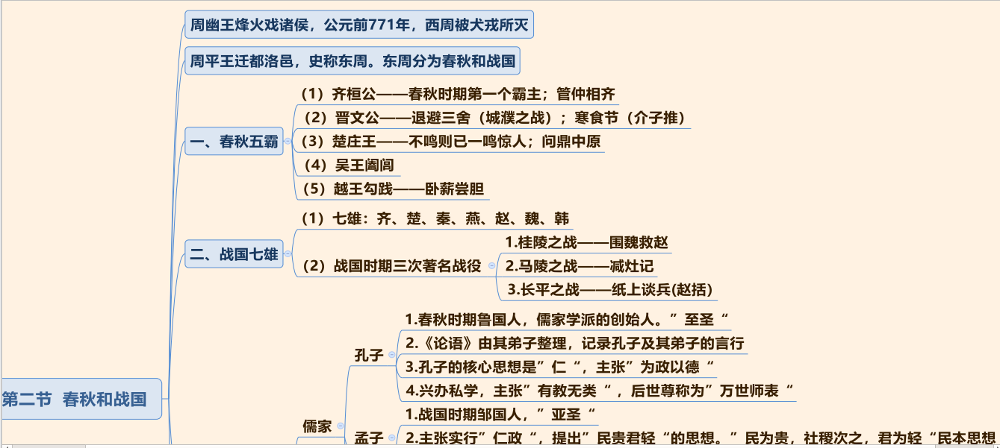

## 一、中国古代史
1. 中国古代朝代更迭顺序（朝代歌）：

```
夏商与西周，东周分两段；
春秋和战国，一统秦两汉；
三分魏蜀吴，二晋前后延；
南北朝并立，隋唐五代传；
宋元明清后，皇朝至此完。
```

2. 考查方式：考查朝代出现的先后顺序，如秦朝、隋朝、元朝和清朝的先后顺序。

### （一） 夏、商、西周的更替


1. 夏朝：
   - （1）建立者：禹。
   - （2）禹死后，儿子启继承王位，世袭制代替禅让制，公天下变为家天下。

2. 商朝：
   - （1）开国君主：商汤。 商汤灭夏。
   - （2）盘庚迁殷：殷指今河南安阳。
   - （3）青铜器： 中国的青铜铸造在商朝达到繁盛， 工艺极其精湛， 如司母戊鼎和四羊方尊。
   - （4）甲骨文：
     - ①中国最早有文字可考的历史开始于商朝。
     - ②王懿荣被称为“甲骨文之父”。

3. 西周：
   - （1）武王伐纣： 史称牧野之战。 周武王以少胜多，商朝士兵临阵倒戈。
   - （2） 西周： 定都镐京（今陕西西安）， 位置在西面，史称西周。
   - （3） 两个重要制度：
     - ①分封制（常考）：西周确立的重要政治制度。
     - ②井田制。

### （二） 春秋战国



1. 西周灭亡：亡国之君为周幽王，烽火戏诸侯，西周被犬戎所灭。

2. 东周： 周平王迁都洛邑（今河南洛阳），史称东周，因政治形态不同分两段时期。
   - （1）春秋五霸：先后称霸的五个人物。
     - ①齐桓公姜小白是春秋时期第一个霸主。
     - ②晋文公重耳退避三舍。
     - ③楚庄王熊旅问鼎中原。
     - ④越王勾践卧薪尝胆，立志复国（常考）。
   - （2）战国七雄：
     - ①秦国商鞅变法。
     - ②三次著名战役：将战役和典故相结合。

3. 百家争鸣：学术空前繁盛。
   - （1） 儒家：
     - ①孔子：
       - a 儒家学派创始人，被称为“至圣”。
       - b《论语》不是孔子所写，而是其弟子整理的。
       - c 核心思想：“仁”，“ 仁者爱人”；兴办私学， 被称为“ 万世师表”。
     - ②孟子： “亚圣”。主张：“ 仁政”； “民贵君轻”；“人性本善”。
     - ③荀子： “ 天行有常”， 古代朴素唯物主义观点； “ 人性本恶”； 其著作首篇为《劝学》；提出“ 君者舟也， 庶人者水也， 水则载舟， 水则覆舟”。
   - （2） 道家：
     - ①老子： 道家学派创始人，主张“无为而治”，顺其自然。
     - ②庄子： 追求精神上的自由，著《逍遥游》；喜欢讲寓言故事。
   - （3） 墨家：墨子，代表贫民阶层。主张：爱一切人；反对不义战争；任人唯贤。
   - （4） 兵家：孙武的《孙子兵法》， 是世界上最早的兵书。
   - （5） 法学：韩非子是法家的集大成者，主张为君主服务。

4. 医学和天文成就：
   - （1） 战国名医扁鹊：“ 四诊法”。
   - （2）《甘石星经》： 我国最早的天文学著作。
   - （3）《墨经》：有很多物理学和光学知识，如杠杆原理、光学八条。

### （三） 秦朝


### （四） 两汉


### （五）

### （六） 

## 二、中国近现代史

## 三、世界历史

