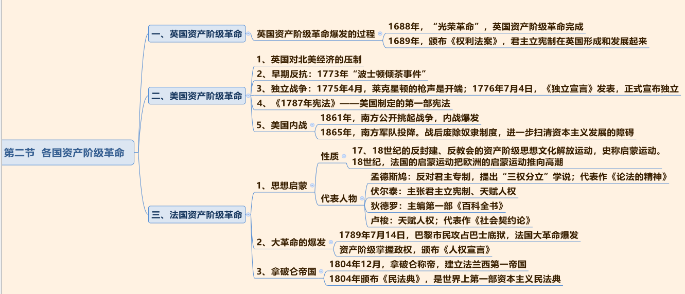

## 一、中国古代史
1. 中国古代朝代更迭顺序（朝代歌）：

```
夏商与西周，东周分两段；
春秋和战国，一统秦两汉；
三分魏蜀吴，二晋前后延；
南北朝并立，隋唐五代传；
宋元明清后，皇朝至此完。
```

2. 考查方式：考查朝代出现的先后顺序，如秦朝、隋朝、元朝和清朝的先后顺序。

### （一） 夏、商、西周的更替


1. 夏朝：
   - （1）建立者：禹。
   - （2）禹死后，儿子启继承王位，世袭制代替禅让制，公天下变为家天下。

2. 商朝：
   - （1）开国君主：商汤。 商汤灭夏。
   - （2）盘庚迁殷：殷指今河南安阳。
   - （3）青铜器： 中国的青铜铸造在商朝达到繁盛， 工艺极其精湛， 如司母戊鼎和四羊方尊。
   - （4）甲骨文：
     - ①中国最早有文字可考的历史开始于商朝。
     - ②王懿荣被称为“甲骨文之父”。

3. 西周：
   - （1）武王伐纣： 史称牧野之战。 周武王以少胜多，商朝士兵临阵倒戈。
   - （2） 西周： 定都镐京（今陕西西安）， 位置在西面，史称西周。
   - （3） 两个重要制度：
     - ①分封制（常考）：西周确立的重要政治制度。
     - ②井田制。

### （二） 春秋战国


1. 西周灭亡：亡国之君为周幽王，烽火戏诸侯，西周被犬戎所灭。

2. 东周： 周平王迁都洛邑（今河南洛阳），史称东周，因政治形态不同分两段时期。
   - （1）春秋五霸：先后称霸的五个人物。
     - ①齐桓公姜小白是春秋时期第一个霸主。
     - ②晋文公重耳退避三舍。
     - ③楚庄王熊旅问鼎中原。
     - ④越王勾践卧薪尝胆，立志复国（常考）。
   - （2）战国七雄：
     - ①秦国商鞅变法。
     - ②三次著名战役：将战役和典故相结合。

3. 百家争鸣：学术空前繁盛。
   - （1） 儒家：
     - ①孔子：
       - a 儒家学派创始人，被称为“至圣”。
       - b《论语》不是孔子所写，而是其弟子整理的。
       - c 核心思想：“仁”，“ 仁者爱人”；兴办私学， 被称为“ 万世师表”。
     - ②孟子： “亚圣”。主张：“ 仁政”； “民贵君轻”；“人性本善”。
     - ③荀子： “ 天行有常”， 古代朴素唯物主义观点； “ 人性本恶”； 其著作首篇为《劝学》；提出“ 君者舟也， 庶人者水也， 水则载舟， 水则覆舟”。
   - （2） 道家：
     - ①老子： 道家学派创始人，主张“无为而治”，顺其自然。
     - ②庄子： 追求精神上的自由，著《逍遥游》；喜欢讲寓言故事。
   - （3） 墨家：墨子，代表贫民阶层。主张：爱一切人；反对不义战争；任人唯贤。
   - （4） 兵家：孙武的《孙子兵法》， 是世界上最早的兵书。
   - （5） 法学：韩非子是法家的集大成者，主张为君主服务。

4. 医学和天文成就：
   - （1） 战国名医扁鹊：“ 四诊法”。
   - （2）《甘石星经》： 我国最早的天文学著作。
   - （3）《墨经》：有很多物理学和光学知识，如杠杆原理、光学八条。

### （三） 秦朝


### （四） 两汉


### （五）

### （六） 

## 二、中国近现代史

> 辛亥革命失败的原因：
1. 领导者资产阶级革命派本身存在着许多弱点和错误，根源是由于中国民族资产阶级的软弱性和妥协性。
2. 资产阶级革命派始终没有一个彻底的反封建纲领。
3. 资产阶级革命派始终没有一个彻底的反帝纲领。 


## 三、世界历史

### （一） 资本主义在欧洲的兴起

1. 地理大发现：哥伦布发现美洲新大陆，麦哲伦环球航行，证明地球是圆的。

2. 人的发现：文艺复兴，重视人的价值，崇尚人性，打破教会的束缚。主要掌握代表人物，比如先驱但丁、美术三杰、 英国戏剧之父莎士比亚，可能考查相关作品，比如：莎士比亚的四大悲剧。（英国戏剧之父，代表作《罗密欧与朱丽叶》不属于四大悲剧之一， 被称为正剧或悲喜剧，四大悲剧指《哈姆雷特》《奥赛罗》《李尔王》《麦克白》。）

### （二） 各国资产阶级革命


1. 英国资产阶级革命：光荣革命标志着资产阶级革命完成，《权利法案》的颁布标志着君主立宪制在英国形成。

2. 美国资产阶级革命：英国对北美经济进行殖民统治，对经济进行压制，因此出现莱克星顿的枪声。
   - （1）美国独立战争的开端： 莱克星顿的枪声。
   - （2）《独立宣言》的发表标志美国诞生。
   - （3）美国内战：美国独立之后，在资本主义的发展仍存在障碍（奴隶制），矛盾激化，爆发南北战争，南方失败，奴隶制废除。当时的美国总统林肯支持废除奴隶制，战争结束后，被奴隶制的狂热拥护者暗杀。

3. 法国资产阶级革命：
   - （1）启蒙运动：欧洲的思想文化解放运动，在法国推向高潮。 代表人物是孟德斯鸠和卢梭。但丁、莎士比亚不是启蒙运动时期的代表，而是文艺复兴时期的代表。
   - （2）法国《人权宣言》，美国《独立宣言》。
   - （3）拿破仑：世界上第一部资本主义民法典是拿破仑时期颁布的《民法典》。

### （三） 两次工业革命


1. 第一次工业革命，最先在英国开始的， 1765 年，珍妮纺纱机的发明，机器被发明出来，代替手工生产。 人类进入以蒸汽为动力的蒸汽时代，相关发明：蒸汽轮船（泰坦尼克号）、蒸汽机车/火车。

2. 第二次工业革命：电的广泛应用，使人类进入电气时代。重点关注德国和美国，比如：德国的西门子发明发电机、德国的本茨发明汽车、美国莱特兄弟发明飞机、美国的爱迪生。

3. 第三次工业革命让人类进入信息时代，比如：原子能技术、航天技术、电子计算机的应用等。现在努力进行第四次工业革命，即工业 4.0，人类将进入智能时代。

### （四） 第一次世界大战

1. 时间:1914 年——1918 年。导火索：萨拉热窝事件。

2. 两大军事集团，以英国为首的协约国胜利。

3. 战役：凡尔登战役（绞肉机）。

4. 巴黎和会重新瓜分世界，对德国进行掠夺性的惩罚，埋下了复仇的种子。


### （五） 二战


1. 爆发标志： 德国闪电突袭波兰，两天之后英法对德宣战，二战爆发。

2. 二战达到最大规模：日本偷袭美国在太平洋的海军基地珍珠港。

3. 美国加入，形成反法西斯联盟， 26 个国家签署《联合国家宣言》， 其中包括中国。

4. 斯大林格勒战役：二战的重要转折点。

5. 会议：
   - （1） 1943 年召开开罗会议：与中国相关，《开罗宣言》 主要针对日本。
   - （2） 德黑兰会议：主要开辟第二战场，加速战争进程，第二战场指诺曼底登陆。
   - （3） 雅尔塔会议：苏美英主要商量如何惩罚德国、惩罚军国主义和战犯，德国投降，希特勒自杀身亡。
   - （4） 日本投降，二战结束。

6. 考查会议。

7. 考查电影，比如：《诺曼底登陆》《珍珠港》《敦刻尔克大撤退》《血战钢锯岭》 都是以二战为背景。

8. 考查标志性事件，比如： 二战爆发的标志、 二战达到最大规模的事件。

### （六） 外国文学与艺术


1. 浪漫主义文学：法国大文豪维克多雨果，代表作《巴黎圣母院》《悲惨世界》；英国作家雪莱，代表作《西风颂》。

2. 现实主义文学：法国巴尔扎克的巨著《人间喜剧》，被称为资本主义社会的百科全书；莫泊桑代表作《羊脂球》《项链》。俄国契科夫的代表作《变色龙》《套中人》；列夫·托尔斯泰代表作《战争与和平》《安娜·卡列尼娜》《复活》。美国作家马克·吐温代表作《竞选州长》《百万英镑》。

3. 现代主义文学：海明威的代表作《老人与海》《太阳照常升起》，反映人对生活的恐惧、迷茫。

4. 印度的泰戈尔是亚洲第一个活动诺贝尔文学奖的人，代表作《飞鸟集》《吉檀迦利》。哥伦比亚的马尔克斯，代表作《百年孤独》，被称为拉丁美洲魔幻现实主义的代表作。

5. 绘画：常考荷兰梵高， 代表作《向日葵》； 西班牙毕加索，代表作《格尔尼卡》。

6. 音乐：贝多芬、约翰·施特劳斯。

### （七） 总结
1. 国民党一大的召开标志着国共第一次合作的实现（正确）。

2. 国共第一次合作破裂的时间是 1927 年（正确），原因：蒋介石发动四一二反革命政变，汪精卫发动七一五反革命政变。

3. 打响了武装反抗国民党反动派第一枪的起义是秋收起义（错误）， 原因： 是八一南昌起义，因此 8 月 1 日是建军节。

4. 1927 年 8 月 7 日在武汉的汉口召开八七会议，毛主席提出枪杆子里出政权（正确）。

5. 1927 年 10 月底，建立第一个革命根据地井冈山革命根据地（正确）。

6. 长征的原因是第五次反围剿的失败（正确）。

7. 长征的时间： 1934 年 10 月——1936 年 10 月（正确）。

8. 1935 年 1 月在贵州遵义召开的遵义会议是党历史上生死攸关的会议，挽救了党，挽救了红军，挽救了革命（正确）。

9. 14 年抗战的起点是 1931 年九一八事变（正确）。

10. 1937 年，七七卢沟桥事变，日本开始全面侵华（正确）。

11. 抗日战争以来的首次大捷平型关大捷粉碎了日本不可战胜的神话（正确）。

12. 八路军在华北地区与日本进行的规模最大、 持续时间最长的是百团大战，正面战场取得的最大规模的胜利是台儿庄战役（正确）。

13. 9 月 3 日抗日战争胜利纪念日（正确）。

14. 蒋介石假和谈真内战， 假和谈指重庆谈判（正确）。

15. 三大战役中规模最大的是淮海战役（正确）。

16. 毛主席的诗“宜将剩勇追穷寇，不可沽名学霸王。 天若有情天亦老，人间正道是沧桑” 指渡江战役，要将革命进行到底（正确）。

17. 但丁的文艺复兴时期的代表人物（正确）。

18. 莎士比亚是文艺复兴时期的代表人物，代表作是四大悲剧，即： 《哈姆雷特》《奥赛罗》《李尔王》《麦克白》（正确）。

19. 《独立宣言》 对应的国家是法国（错误）， 原因： 美国的是《独立宣言》， 法国的是《人权宣言》。

20. 启蒙运动代表人物是卢梭、孟德斯鸠（正确）。

21. 拿破仑说“我真正的光荣并非打了 40 次胜仗，滑铁卢之战抹去了关于这一切的记忆。但是我相信，有一样东西人们是不会忘记的，那就是我的《民法典》”（正确）。

22. 蒸汽机车是第一次工业革命的发明成果， 本茨发明的汽车是第二次工业革命的产物（正确）。

23. 萨拉热窝事件发生在第一次世界大战的导火索（正确）。

24. 一战中， 以英国为首的协约国胜利（正确）。

25. 二战中， 苏德战场转折性的战役是莫斯科战役（错误）， 原因：是斯大林格勒战役。

26. 开罗会议通过的《开罗宣言》， 要求日本必须归还中国的澎湖列岛（正确）。

27. 《尚书》是我国最早的一部政治文件汇编本/我国古代应用文形成的标注/我国最早的散文集。 

28. 《珍珠港》 发生在二战时期（正确）。

29. 《巴黎圣母院》《悲惨世界》 作者是维克多· 雨果（正确）。

30. 《羊脂球》《项链》的作者是法国小说家莫泊桑（正确）。

31. 《百年孤独》的作者是马尔克斯（正确）。

32. 亚洲第一个获得诺贝尔文学家的是印度的泰戈尔，代表作《新月集》《飞鸟集》《吉檀迦利》（正确）。

33. 《百万英镑》《竞选州长》作者是美国作家马克· 吐温（正确）。

34. 契诃夫代表作是《安娜·卡列尼娜》（错误），原因： 契诃夫是短篇小说家， 代表作是《变色龙》《套中人》， 《安娜· 卡列尼娜》 长篇巨著的作者是列夫· 托尔斯泰。

35. 荷兰梵高的作品是《向日葵》，西班牙毕加索的作品是《格尔尼卡》（正确）。

36. 金砖国家：中国、俄罗斯、巴西、 印度、南非

37. 江西历史名人

    - （1）江西历史文化名人——文化：
      - ①王安石：北宋，唐宋八大家，王安石变法（也称熙宁变法），代表作：《伤仲永》《登飞来峰》。
      - ②曾巩：唐宋八大家。
      - ③陶渊明：号“五柳先生”、谥号“靖节先生”，田园诗创始人，代表作：《归园田居》《饮酒》《桃花源记》《归去来兮辞》。
      - ④欧阳修，江西历史文化名人。考点：唐宋八大家之一。自号“醉翁”，号“六一居士”。代表作：《醉翁亭记》
      - ⑤汤显祖。临川四梦：《南柯记》《邯郸记》《牡丹亭》《紫钗记》。《牡丹亭》讲述大家闺秀、官宦之女杜丽娘和贫苦书生柳梦梅的爱情故事。
    
    - （2）江西历史文化名人——科技：
      - ①宋应星：明代，《天工开物》，被英国科学史专家李·约瑟评价为“17 世纪的百科全书”。
      - ②詹天佑：清末—民国，主持修建的京张铁路是我国第一条独立自主设计修建的铁路，被誉为“中国铁路之父”“我国近代的工程之父”。
      - ③民族英雄文天祥：南宋，抗元，代表作：《过零丁洋》，“人生自古谁无死，留取丹心照汗青”。
      - ④朱熹：了解即可，程朱理学/宋明理学的集大成者。