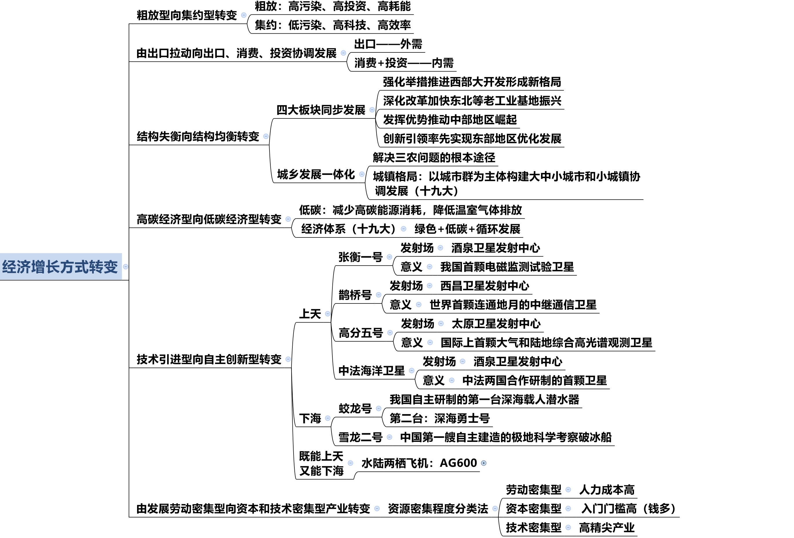

## 一、马克思主义政治经济学
### （一） 商品经济及其规律

1. 商品经济的由来：
   - （1）迄今为止的两种经济形态：
     - ①自然经济：自给自足。
     - ②商品经济：用于交换。
     - ③二者的区分标准：生产目的。
   - （2）迄今为止人类社会一共经历过两种经济形态，但人类社会有三种经济形态。
   - （3）商品经济产生的前提和基础是社会分工（列宁所说）。
2. 商品：
   - （1）两个条件：劳动产品；用于交换。
   - （2）商品的二重属性：使用价值（自然属性）；价值（社会属性、特有属性）。
3. 劳动二重性：具体劳动产生**使用价值**；抽象劳动形成**价值**。

4. 商品的价值量由社会必要劳动时间（平均时间）决定，平均时间越长，商品的价值量越高，价格就越高，因为价值决定价格。

5. 价值规律：
   - （1）内容：社会必要劳动时间决定价值量；商品交换的依据是等价交换。
   - （2）表现形式：价格围绕价值上下波动，因为供求关系影响价格。
   - （3）三个作用（多选题）：“棒子”、“鞭子”、“筛子”。

### （二） 资本主义经济制度

1. 资本主义特有的本质：生产资料私有制。
2. 资本主义的特征：剥削，剥削的是剩余价值。
   - （1）剩余价值是工人的剩余劳动带来的（唯一来源）。
   - （2）剩余价值在生产阶段而非流通阶段产生。
   - （3）数量上：剩余价值=利润。区别在于来源不同：马克思认为剩余价值是工人劳动带来的；资本家认为利润是资本家全部预付产物带来的。
   - （4）资本分类：可变资本（工人工资）、不变资本，区分标准是能否带来剩余价值。
   - （5）获取方式：加班获得绝对剩余价值、通过提高劳动生产率获得相对剩余价值。超额剩余价值：个别企业提高劳动生产率。
3. 资本积累：
   - （1）动力或目的：为赚取更多的剩余价值。
   - （2）结果：两极分化，导致马太效应。

### （三）例子剖析
1. 经济形态上：
   - （1）金莲种黄瓜自己吃：**自给自足的自然经济**。
   - （2）金莲种黄瓜与西门的大力丸**交换：商品经济**。
   - （3）金莲需要啥社会提供啥：共产主义社会出现的**产品经济**，注意不是共产经济。

2. 金莲购买了一件貂皮大衣：
   - （1）是商品：是劳动产品且用于交换。是商品就具有使用价值：可以保暖；价值：制造大衣的过程中消耗的人类劳动。
   - （2）制造大衣的动作是看得见的劳动、一种外在的表现，因此属于具体劳动，产生了使用价值。
   - （3）在制作大衣的过程中消耗的体能属于抽象劳动，形成了价值的实体。消耗的体能用时间衡量。
   - （4）貂皮大衣的价值量由社会必要劳动时间决定。

3. 资本家投入 100 万生产皮鞋：
   - （1） 70 万购买原材料和厂房：不能带来价值增殖，因此称为不变资本。
   - （2） 30 万雇佣工人：可变资本。
   - （3）产品卖了 120 万，赚了 20 万：数量上看既是利润也是剩余价值；资本家认为是全部投入赚取的利润，马克思认为是榨取工人的剩余价值。
   - （4）增加剩余价值的方法：工人每天加班 3 小时获得绝对剩余价值；提高效率，每小时多生产一双属于相对剩余价值；提高个别劳动生产率属于超额剩余价值。
   - （5）用 20 万买更多的设备和厂房：即“钱生钱”，属于资本积累（扩大再生产），结果是资本家越来越有钱、工人越来越穷，即导致两极分化（马太效应）。

## 二、社会主义市场经济

### （一） 计划经济体制与市场经济体制

1. 计划经济：指令性经济，听政府、国家的指令（了解即可）。

2. 市场经济（重点）的特征：
   - （1）共性特征：所有实行市场经济的国家所共有的特征：
     - ①自主性：自主决策。
     - ②平等性：地位平等，理论上强调国企私企的地位平等，注意不要用现实生活中的经验做题。
     - ③竞争性：市场经济的弱点和缺陷，自发性、盲目性、滞后性（常考多选题），或通过给出例子判断体现哪种缺陷的方式来考查。
     - ④开放性：市场不是封锁的。
     - ⑤有序性：相对有序。
   
   - （2）社会主义市场经济独有特点（下节课讲解）。

### （二） 社会主义市场经济的基本特征

1. 社会主义市场经济独有特点（多选题） ： 所有制结构、 分配制度、 宏观调控。

2. 所有制结构：
   - （1） 公有制为主体， 多种所有制经济共同发展（基本经济制度）
   - （2） 公有制范围： 国有经济（主导作用） 、 集体经济、 混合所有制中的国有成分和集体成分。
   - （3） 多种所有制（非公有制） ： 个体、 私营、 外资、 混合所有制中的非公有制成分。是社会主义市场经济的重要组成部分。

3. 分配制度： 按劳分配为主体， 多种分配方式并存。
   - （1） 按劳分配前提——公有制。
   - （2） 按生产要素分配——非公有制。

4. 宏观调控（ 多选题） ： 物质、 政治、 群众基础。

### （三）　国有企业改革

1. 原因： 国企是国民经济的支柱。
2. 方向： 建立现代企业制度， 实行公司制。 特征（ 多选题） ： 产权清晰、 权责明确、 政企分开、 管理科学。
3. 形式（单选题） ： 股份制。

### （四） 产业结构

#### 三大产业

1. 第一产业： 直接取自自然界， 从自然界获取可直接使用。 如农业、 林业、 牧业、 渔业。

2. 第二产业： 对初级产品再加工。 如工业、 建筑业、 制造业（ 服装、 食品制造业） 。 注意： 采矿业（ 钢铁、 煤炭、 石油、 化工） 在我国属于第二产业， 如铁矿、 煤矿挖上来不能直接使用， 需要再加工。

3. 第三产业： 提供服务。
   - （1） 流通部门： 交通运输、 快递、 物流、 仓储业。 如双十一全国快递件达到 4.16 亿。
   - （2） 服务部门： 旅游业、 餐饮业、 教育服务、 金融保险。 如粉笔不生产物质， 仅提供服务。 注意： 房地产业属于第三产业（ 法律明确规定房地产业从事开发、 经营和管理） ， 建筑业属于第二产业。

#### 优化产业结构

1. 三农： 农业、 农村、 农民。

2. 邓小平提出“两个飞跃” ：
   - （1） 第一个飞跃： 废除人民公社， 实行家庭联产承包责任制。 安徽凤阳小岗村， 18 个不怕死的村民按手印分集体土地， 即分田到户， 由于在文革时期， 村民粮食不够吃， 当地流传民谣“ 凤阳地多不打粮， 只见凤阳女出嫁， 不见新娘进凤阳” ， 因此才有冒险分土地。
     - ①“ 家庭承包” ： 分给个人家， 自己种， 自己经营。
     - ②“ 联产” ： 联产计酬， 联系产量来计算报酬， 非联合生产。
     - ③“责任制” ： 分田到户， 自负盈亏。 克服了平均主义， 提高了效率， 该政策实行后整个凤阳产量大增， 三年跨了一大步， 开创了家庭联产承包责任制的先河。
     - ④改革开放的突破口： 安徽凤阳小岗村/农村。
   - （2） 第二个飞跃： 适应科学种田和生产社会化的需要， 发展适度规模经营， 发展集体经济。 分田到户的局限性是规模较小， 因此要发展规模经营。

3. 拓展：
   - （1） 解决三农问题的根本途径（ 单选题） ： 城乡发展一体化。 我国原来是城乡二元化，城市主要发展工业， 农村主要发展种植业， 农村和城市的发展极其不同步， 差距越来越大。
   - （2） 我国的耕地红线： “ 红” 即警戒。 必须保有的耕地面积最低值。 现行： 18 亿亩，目标： 2020 年 18.65 亿亩。
   - （3） 三权分置： 改革开放之初只有所有权和承包经营权， 后来把承包经营权一分为二，变为所有权、 承包权和经营权。 原因： 如一农民在农村有地， 现在该农民想去城市打工， 不想种地， 某天该农民在城市混不下去， 但地却已经荒废了， 因此为保障农民利益， 可以把地包给别人种， 当自己再回到农村时还有地可种。
     - ①所有权： 归集体。 城市土地归国家， 城郊、 农村土地归集体。
     - ②承包权： 分给谁归谁， 归农户。
     - ③经营权： 归土地经营权人。 全国土地日： 每年的 6 月 25 日， 我国是世界第一个为保护土地而专门设立纪念日的国家， 2018 年是第 28 个土地日。
   - （4） 乡村振兴（ 时政） ： 以前经常提“ 建设社会主义新农村” ， 十九大提出“ 乡村振兴” ， 今年的一号文件也说的是乡村振兴， 5 月 31 日， 中共中央政治局召开会议， 审议《国家乡村振兴战略规划（ 2018-2022 年） 》 。
     - ①乡村振兴战略是党的十九大提出的一项重大战略： 十九大共提出七大战略， 首次提出乡村振兴战略。
     - ②是关系全面建设社会主义现代化国家的全局性、 历史性任务。
     - ③新时代“ 三农” 工作总抓手。
     - ④“三步走” ： 2020 年取得重要进展； 2035 年取得决定性进展； 2050 年实现全面振兴。

1. 以信息化带动工业化， 以工业化促进信息化： 两化融合， 考查概率较低。 山东曾考查“ 新四化” ： 新型工业化、 新型信息化、 新型城镇化、 新型农业现代化。

2. 大力发展第三产业： 服务业。

1. 劳动密集型产业： 在生产过程中依靠大量劳动力， 需要很多人工成本。 如手工业、 富士康、 纺织业、 服装业， 都属低端制造业。

2. 资本密集型产业： 依靠的钱非常多， 投资门槛较高， 设备昂贵。 如石油、 电力、 钢铁，为常见的资本密集型产业。

3. 技术密集型产业： 高精尖的行业。 如 IT、 微电子、 新材料（ 最薄、 最坚硬的石墨烯，纳米材料）

### （五）经济增长方式的转变

1. 粗放型→集约型：即不好的向好的转变。

2. 出口拉动→出口、消费、投资协调发展：最重要的是内需，消费是基础，投资是关键。

3. 结构失衡型→均衡型：四大板块是区域的，城乡一体化。

4. 高碳经济型→低碳经济型：绿色+低碳+循环发展。

5. 技术引进型→自主创新型。

6. 劳动密集型→资本技术密集型。

（六）收入分配
 1. 初次分配：
    - （1）指在物质生产领域内进行分配，物质生产领域即生产物质的领域，如甲在一汽工 作，一汽每个月发的工资属于初次分配。
    - （2）常考：工资。不是所有的工资都是初次分配。一般而言，物质生产领域大部分指 的是企业，企业员工的工资一般是初次分配，公务员、事业单位工作人员的工资靠国家财政 拨款，属于再分配。
 
 2. 再分配：企业效益不同，如有的企业效益好，一个月挣 2 万，有的企业效益不好，一 个月挣 2000 元，这样光靠市场分配差距较大，还得进行第二次分配，即靠政府，通过国家 财政及各种经济杠杆来调解。注意：十八大明确提出再分配的主要形式有税收、社会保障、 转移支付（选择）。
    - （1）税收：如一个月工资 2000 元无需交税，一个月工资 2 万则需要交 3000 元左右的 税，挣得少就少收或不收，挣得多就多收。
    - （2）社会保障：无论是社会保险、社会优抚还是社会福利等主要是依靠国家出钱，如 国家出一部分或者出全部的钱，因此社会保障主要依靠的是政府，属于第二次分配。
    - （3）转移支付：可以理解成政府的无偿支出，如无生活来源的人领政府低保、再如失业救济金、退伍军人补助、农产品价格补贴等。