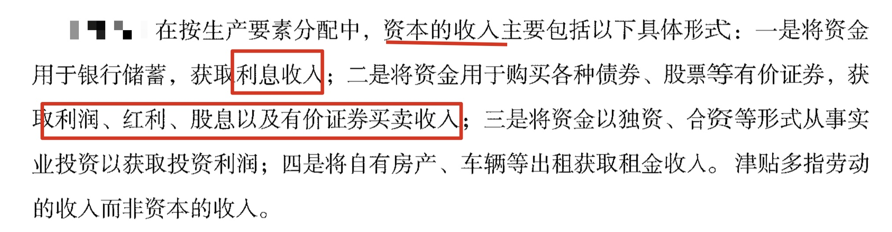
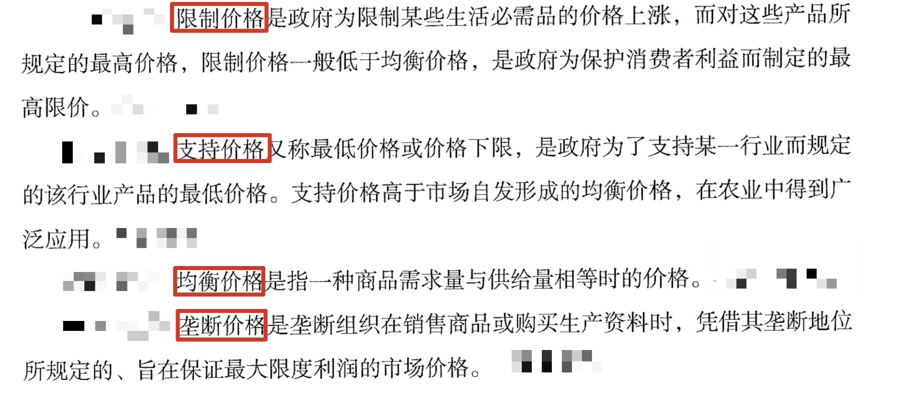
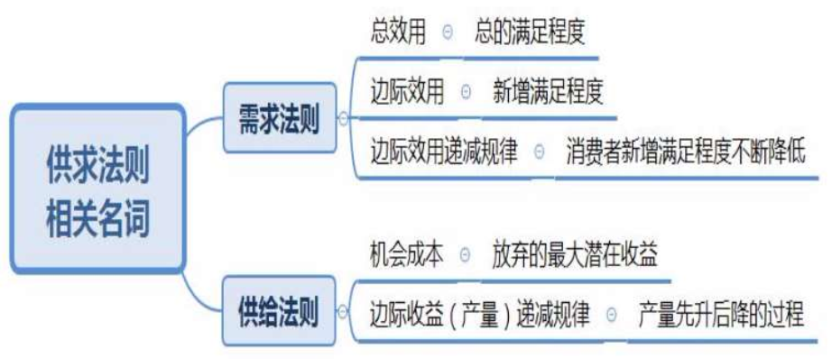
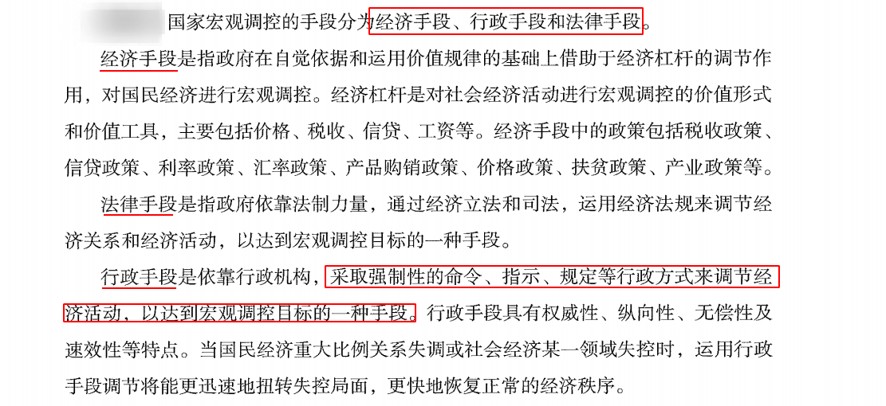

## 一、马克思主义政治经济学
### （一） 商品经济及其规律


1. 商品经济的由来：
   - （1）迄今为止的两种经济形态：
     - ①自然经济：自给自足。
     - ②商品经济：用于交换。
     - ③二者的区分标准：生产目的。
   - （2）迄今为止人类社会一共经历过两种经济形态，但人类社会有三种经济形态。
   - （3）商品经济产生的前提和基础是社会分工（列宁所说）。
2. 商品：
   - （1）两个条件：劳动产品；用于交换。
   - （2）商品的二重属性：使用价值（自然属性）；价值（社会属性、特有属性）。
3. 劳动二重性：具体劳动产生**使用价值**；抽象劳动形成**价值**。

4. 商品的价值量由社会必要劳动时间（平均时间）决定，平均时间越长，商品的价值量越高，价格就越高，因为价值决定价格。

5. 价值规律：
   - （1）内容：社会必要劳动时间决定价值量；商品交换的依据是等价交换。
   - （2）表现形式：价格围绕价值上下波动，因为供求关系影响价格。
   - （3）三个作用（多选题）：“棒子”、“鞭子”、“筛子”。
   - （4）价值规律是商品经济（社会主义市场经济）的基本规律。

### （二） 资本主义经济制度


1. 资本主义特有的本质：生产资料私有制。
2. 资本主义的特征：剥削，剥削的是剩余价值。
   - （1）剩余价值是工人的剩余劳动带来的（唯一来源）。
   - （2）剩余价值在生产阶段而非流通阶段产生。
   - （3）数量上：剩余价值=利润。区别在于来源不同：马克思认为剩余价值是工人劳动带来的；资本家认为利润是资本家全部预付产物带来的。
   - （4）资本分类：可变资本（工人工资，劳动力价值形态存在的资本）、不变资本（生产资料形态存在的资本），区分标准是能否带来剩余价值。
   - （5）获取方式：加班获得绝对剩余价值、通过提高劳动生产率获得相对剩余价值。超额剩余价值：个别企业提高劳动生产率。

> 提高劳动生产率的方式


1. 资本积累：
   - （1）动力或目的：为赚取更多的剩余价值。
   - （2）结果：两极分化，导致马太效应。

2. 在资本主义制度下，工人劳动一段时间后，资本家支付工人一定数量的*工资*，实质上工人出卖的并不是劳动的价值或价格，而*是劳动力的价格或价值*。

3. 剩余价值率和利润率：使用同一个剩余价值所计算的不同比率。
   - （1）剩余价值率=剩余价值/可变资本=M/V
   - （2）利润率=剩余价值/(全部预付资本)=M/(C+V)
   - （3）利润率 <= 剩余价值率


### （三）例子剖析
1. 经济形态上：
   - （1）金莲种黄瓜自己吃：**自给自足的自然经济**。
   - （2）金莲种黄瓜与西门的大力丸**交换：商品经济**。
   - （3）金莲需要啥社会提供啥：共产主义社会出现的**产品经济**，注意不是共产经济。

2. 金莲购买了一件貂皮大衣：
   - （1）是商品：是劳动产品且用于交换。是商品就具有使用价值：可以保暖；价值：制造大衣的过程中消耗的人类劳动。
   - （2）制造大衣的动作是看得见的劳动、一种外在的表现，因此属于具体劳动，产生了使用价值。
   - （3）在制作大衣的过程中消耗的体能属于抽象劳动，形成了价值的实体。消耗的体能用时间衡量。
   - （4）貂皮大衣的价值量由社会必要劳动时间决定。

3. 资本家投入 100 万生产皮鞋：
   - （1） 70 万购买原材料和厂房：不能带来价值增殖，因此称为不变资本。
   - （2） 30 万雇佣工人：可变资本。
   - （3）产品卖了 120 万，赚了 20 万：数量上看既是利润也是剩余价值；资本家认为是全部投入赚取的利润，马克思认为是榨取工人的剩余价值。
   - （4）增加剩余价值的方法：工人每天加班 3 小时获得绝对剩余价值；提高效率，每小时多生产一双属于相对剩余价值；提高个别劳动生产率属于超额剩余价值。
   - （5）用 20 万买更多的设备和厂房：即“钱生钱”，属于资本积累（扩大再生产），结果是资本家越来越有钱、工人越来越穷，即导致两极分化（马太效应）。

## 二、社会主义市场经济

### （一） 计划经济体制与市场经济体制


1. 计划经济：指令性经济，听政府、国家的指令（了解即可）。

2. 市场经济（重点）的特征：
   - （1）共性特征：所有实行市场经济的国家所共有的特征：
     - ①自主性：自主决策。
     - ②平等性：地位平等，理论上强调国企私企的地位平等，注意不要用现实生活中的经验做题。
     - ③竞争性：市场经济的弱点和缺陷，自发性、盲目性、滞后性（常考多选题），或通过给出例子判断体现哪种缺陷的方式来考查。
     - ④开放性：市场不是封锁的。
     - ⑤有序性：相对有序。
   
   - （2）社会主义市场经济独有特点（下节课讲解）。

### （二） 社会主义市场经济的基本特征


1. 社会主义市场经济独有特点（多选题） ： 所有制结构、 分配制度、 宏观调控。

2. 所有制结构：
   - （1） 公有制为主体， 多种所有制经济共同发展（基本经济制度）
   - （2） 公有制范围： 国有经济（主导作用，体现在**控制力上**） 、 集体经济、 混合所有制中的国有成分和集体成分。
   - （3） 多种所有制（非公有制） ： 个体、 私营、 外资、 混合所有制中的非公有制成分。是社会主义市场经济的重要组成部分。

3. 分配制度： 按劳分配为主体， 多种分配方式并存。
   - （1） 按劳分配前提——公有制。
   - （2） 按生产要素分配——非公有制。

> 国家对不同经济形式的政策
   
   - 1. 国有经济: 保障。国有经济是国民经济命脉，相当于共和国的“长子”，所以要细心照顾、不能有失，要“抱着”发展。 
   - 2. 集体经济: 鼓励、指导、帮助。相当于“次子”，年级比较小，发展起来比较困难，所以国家“牵着”他发展，有好的方法就指导他，有好的政策就帮助他，待遇也很好。 
   - 3. 非公有制经济: 鼓励、支持、引导;监督、管理。理解为“庶出”，国家“引着”发展，要是跌倒就没有那么好的条件和政策。

4. 资本的收入(钱赚钱💰)



5. 宏观调控（多选题）：物质、 政治、 群众基础。

6. 我国现阶段存在多种所有制经济的根本原因是：生产力状况决定的。

7. 社会主义基本经济制度的基础： 公有制（不是所有制）。社会主义社会的根本经济特征： 公有制（不是共同富裕）。

8. **只有发展社会生产力**，才能极大的丰富人民的物质生活，解决我国社会的主要矛盾，巩固社会制度，而且这也是社会本质的内在要求，发展市场经济是为了更好的发展生产力。

9. 生产要素：劳动力、土地、资本、企业家的才干


### （三）国有企业改革

1. 原因： 国企是国民经济的支柱。

2. 方向： 建立现代企业制度， 实行公司制。 特征（ 多选题） ： 产权清晰、 权责明确、 政企分开、 管理科学。

3. 形式（单选题） ： 股份制。

### （四） 产业结构


#### 三大产业


1. 第一产业： 直接取自自然界， 从自然界获取可直接使用。 如农业、 林业、 牧业、 渔业。

2. 第二产业： 对初级产品再加工。 如工业、 建筑业、 制造业（ 服装、 食品制造业） 。 注意： 采矿业（ 钢铁、 煤炭、 石油、 化工） 在我国属于第二产业， 如铁矿、 煤矿挖上来不能直接使用， 需要再加工。

3. 第三产业： 提供服务。
   - （1） 流通部门： 交通运输、 快递、 物流、 仓储业。 如双十一全国快递件达到 4.16 亿。
   - （2） 服务部门： 旅游业、 餐饮业、 教育服务、 金融保险。 如粉笔不生产物质， 仅提供服务。 注意： 房地产业属于第三产业（ 法律明确规定房地产业从事开发、 经营和管理） ， 建筑业属于第二产业。

#### 优化产业结构


1. 三农： 农业、 农村、 农民。

2. 邓小平提出“两个飞跃” ：
   - （1） 第一个飞跃： 废除人民公社， 实行家庭联产承包责任制。 安徽凤阳小岗村， 18 个不怕死的村民按手印分集体土地， 即分田到户， 由于在文革时期， 村民粮食不够吃， 当地流传民谣“ 凤阳地多不打粮， 只见凤阳女出嫁， 不见新娘进凤阳” ， 因此才有冒险分土地。
     - ①“ 家庭承包” ： 分给个人家， 自己种， 自己经营。
     - ②“ 联产” ： 联产计酬， 联系产量来计算报酬， 非联合生产。
     - ③“责任制” ： 分田到户， 自负盈亏。 克服了平均主义， 提高了效率， 该政策实行后整个凤阳产量大增， 三年跨了一大步， 开创了家庭联产承包责任制的先河。
     - ④改革开放的突破口： 安徽凤阳小岗村/农村。
   - （2） 第二个飞跃： 适应科学种田和生产社会化的需要， 发展适度规模经营， 发展集体经济。 分田到户的局限性是规模较小， 因此要发展规模经营。

3. 拓展：
   - （1） **解决三农问题的根本途径（ 单选题） ： 城乡发展一体化**。 我国原来是城乡二元化，城市主要发展工业， 农村主要发展种植业， 农村和城市的发展极其不同步， 差距越来越大。
   - （2） 我国的耕地红线： “ 红” 即警戒。 必须保有的耕地面积最低值。 现行： 18 亿亩，目标： 2020 年 18.65 亿亩。
   - （3） 三权分置： 改革开放之初只有所有权和承包经营权， 后来把承包经营权一分为二，变为所有权、 承包权和经营权。 原因： 如一农民在农村有地， 现在该农民想去城市打工， 不想种地， 某天该农民在城市混不下去， 但地却已经荒废了， 因此为保障农民利益， 可以把地包给别人种， 当自己再回到农村时还有地可种。
     - ①所有权： 归集体。 城市土地归国家， 城郊、 农村土地归集体。
     - ②承包权： 分给谁归谁， 归农户。
     - ③经营权： 归土地经营权人。 全国土地日： 每年的 6 月 25 日， 我国是世界第一个为保护土地而专门设立纪念日的国家， 2018 年是第 28 个土地日。
   - （4） 乡村振兴（ 时政） ： 以前经常提“ 建设社会主义新农村” ， 十九大提出“ 乡村振兴” ， 今年的一号文件也说的是乡村振兴， 5 月 31 日， 中共中央政治局召开会议， 审议《国家乡村振兴战略规划（ 2018-2022 年） 》 。
     - ①乡村振兴战略是党的十九大提出的一项重大战略： 十九大共提出七大战略， 首次提出乡村振兴战略。
     - ②是关系全面建设社会主义现代化国家的全局性、 历史性任务。
     - ③新时代“ 三农” 工作总抓手。
     - ④“三步走” ： 2020 年取得重要进展； 2035 年取得决定性进展； 2050 年实现全面振兴。

1. 以信息化带动工业化， 以工业化促进信息化： 两化融合， 考查概率较低。 山东曾考查“ 新四化” ： 新型工业化、 新型信息化、 新型城镇化、 新型农业现代化。

2. 大力发展第三产业： 服务业。


1. 劳动密集型产业： 在生产过程中依靠大量劳动力， 需要很多人工成本。 如手工业、 富士康、 纺织业、 服装业， 都属低端制造业。

2. 资本密集型产业： 依靠的钱非常多， 投资门槛较高， 设备昂贵。 如石油、 电力、 钢铁，为常见的资本密集型产业。

3. 技术密集型产业： 高精尖的行业。 如 IT、 微电子、 新材料（ 最薄、 最坚硬的石墨烯，纳米材料）

4. 农业是支撑我国国民经济建设与发展的基础


### （五）经济增长方式的转变


1. 粗放型→集约型：即不好的向好的转变。

2. 出口拉动→出口、消费、投资协调发展：最重要的是内需，消费是基础，投资是关键。

3. 结构失衡型→均衡型：四大板块是区域的，城乡一体化。

4. 高碳经济型→低碳经济型：绿色+低碳+循环发展。

5. 技术引进型→自主创新型。

6. 劳动密集型→资本技术密集型。

（六）收入分配


 1. 初次分配：
    - （1）指在物质生产领域内进行分配，物质生产领域即生产物质的领域，如甲在一汽工作，一汽每个月发的工资属于初次分配。
    - （2）常考：工资。不是所有的工资都是初次分配。一般而言，物质生产领域大部分指 的是企业，**企业员工的工资一般是初次分配，公务员、事业单位工作人员的工资靠国家财政拨款，属于再分配**。
 
 2. 再分配：企业效益不同，如有的企业效益好，一个月挣 2 万，有的企业效益不好，一 个月挣 2000 元，这样光靠市场分配差距较大，还得进行第二次分配，即靠政府，通过国家财政及各种经济杠杆来调解。注意：**十八大明确提出再分配的主要形式有税收、社会保障、转移支付**（选择）。
    - （1）税收：如一个月工资 2000 元无需交税，一个月工资 2 万则需要交 3000 元左右的税，挣得少就少收或不收，挣得多就多收。
    - （2）社会保障：无论是社会保险、社会优抚还是社会福利等主要是依靠国家出钱，如 国家出一部分或者出全部的钱，因此社会保障主要依靠的是政府，属于第二次分配。
    - （3）转移支付：可以理解成政府的无偿支出，福利的一种形式。如无生活来源的人领政府低保、再如失业救济金、退伍军人补助、农产品价格补贴等。

3. 个人出于自愿，在习惯与道德的影响下把可支配收入的一部分或大部分捐赠出去，可称为“第三次分配”。譬如：社会救助。

> 经济杠杆 ： 价格杆杠、税收杆杠、信贷杆杠。为最重要的三大杆杠。其中价格杆杠居首要地位，最有效、最灵敏。

## 三、微观经济


### （一） 经济人假定

1. 经济人假定： 学微观经济有前提性假设， 即假设市场上所有的主体都是自私自利的，整个市场交易过程中都在追求自身利益最大化。 若大家都是活雷锋， 免费给人干活， 则没有研究经济的必要。

2. 经济人： 使自身利于最大化； 经济人假定： 最早是亚当· 斯密（著有《国富论》 ） 提出。

### （二） 需求与供给

> 替代品与互补品


- （1） 替代品： 两种商品可以替代使用， 其功能相近或相同。 如馒头与花卷、 洗衣粉和洗衣液、 羊肉与牛肉、 火车与飞机等。 以洗衣粉与洗衣液为例， 若洗衣粉价格上涨， 对洗衣粉的需求就会下降， 洗衣粉与洗衣液功效相同， 不买洗衣粉就会买洗衣液， 故对洗衣液的需求上升。 洗衣粉的价格上升， 替代品的需求也随之上升， 提高与增加同向变化， 成正比。
- （2） 互补品： 不能单独用一个， 要配套使用， 如羽毛球和羽毛球拍、 手机与手机充电器、 眼镜片和眼镜框、 针和线等。 以球拍与球为例， 若羽毛球拍价格上涨， 对其需求变少，因为不需要球拍则不需要买球， 故对羽毛球需求下降， 二者反向变动， 成反比。
- （3） 结论： 替代品成正比； 互补品成反比。

> 影响需求的因素


> 价格分类：限制价格、支持价格、均衡价格、垄断价格



1. 价格、 相关商品和利率： 常考， 重点掌握。 单选：**影响需求的最主要因素是价格。**

2. 利率： 存款利率、 贷款利率。 若存款利率上涨， 存到银行的钱变多， 因为收益变多，可消费的钱会变少， 需求下降， 此为反比。 贷款利率： 贷款利率提高说明贷款利息变多， 还得多则不愿意贷款， 不愿意贷款则没钱花、 没钱买， 需求下降， 也成反比。 无论是存款利率还是贷款利率， 都成反比关系。

> 需求法则

0. 假定其他因素不变， 只研究价格与需求的关系， 得出需求法则/需求定理。 **需求法则：市场价格越高， 需求数量越少； 市场价格越低， 需求数量越多， 消费者的需求价格与需求数量是反向变动的。**

> 需求价格弹性： 由于价格的变动导致需求的变动程度。

1. 需求缺乏弹性： 需求变动小， 考试一般会给出例子要求判断是缺乏弹性还是富有弹性。 例： 生活必需品， 如大米 3 元一斤或 6 元一斤都要买、都要用。
2. 需求富有弹性： 需求变动大， 如奢侈品。 一个 LV 包 2 万可能不买， 若 200 元一个则可能会买十个。

> 需求收入弹性： 指收入的变化对需求的影响。
1. 正常品： 弹性为正， 收入增加， 需求也增加， 二者同向变化。
   - （1） 奢侈品： 收入增加之后， 需求量增加幅度大， 如原来一个月工资 2000 元， 买不起LV， 现在每个月工资 20 万， 每月可以买十个， 从 0 到 10， 增加幅度比较大。
   - （2） 必需品： 收入增加之后， 需求量增加幅度小， 这叫做必需品， 如一个月工资 2000元时一天用一卷卫生纸； 月入 20 万， 一天用两卷。 虽然有增加， 但增加幅度小。

2. 劣等品： 弹性为负， 随着收入增加， 对商品的需求量减少。 原来月入 2000 总是逛 2元店， 月入两万元则会逛精品店。 劣等品： 不是指质量不好， 而是比较便宜， 指廉价品， 如各种盗版（有钱听正版、 现场） 、 地摊货， 收入越多， 买得越少。


> 影响供给的因素

1. 供给： 从厂商/生产者的角度考虑。

2. 影响供给的主要因素：
   - （1） 产品成本： 成本上升， 获得的利润下降， 厂商不愿意生产， 供给下降， 二者成反比。
   - （2） 商品的价格： 价格上涨后利润空间变多， 对于理性经济人而言更愿意生产， 供给量上涨， 二者成正比。
   - （3） 生产技术的变化： 技术提高， 产量增加， 供给量增加， 二者成正比。
   - （4） 相关商品的价格： ①替代品： 洗衣粉价格上涨， 说明生产洗衣粉的利润上涨， 此时厂商愿意生产洗衣粉， 洗衣粉供给量会上涨， 洗衣液供给量会下降，一个上涨， 一个下降，成反比； ②互补品： 手机与手机充电器。 手机价格上涨， 生产手机的利润提高， 手机供给量上涨， 手机充电器供给量也会上涨， 二者成正比。
   - （5） 政府的税收或补贴政策： 政府征税多， 说明生产的利润都缴税了， 利润下降， 不愿意生产， 故供给下降， 成反比； 国家给的补贴越高， 利润越高， 越愿意生产， 成正比。

> 直接成本与间接成本


> 供给法则：(预期)价格越高，利润增加，供给增加； 价格降低， 利润减少， 供给减少，成正比。

### （三） 总结

1. 前提： 经济人假定（追求自身利益最大化）， 亚当· 斯密提出。

2. 对象：
   - （1） 需求是重点。 影响因素： 最主要的是价格。
   - （2） 相关商品： 替代品（正向）、 互补品（反向）。
   - （3） 需求法则： 价格越高， 需求越少； 价格越低， 需求越高。
   - （4） 需求弹性： 程度变化的大小。
     - ①需求价格弹性： 富有弹性——奢侈品； 缺乏弹性——必需品。 重点记例子。
     - ②需求收入弹性： a 正常品： 同向变化， 收入增加， 需求增加。 变化大的是奢侈品， 变化小的是必需品； b 劣等品： 反向变化， 收入增加， 需求减少。

3. 供给： 了解即可， 考查较少。

### （四） 供求法则相关名词


1. 总效用和边际效用：
   - （1）总效用：“效用”指一种满足程度或者满足感。总效用指从消费一定量某种物品中所得到的总满足程度，比如喝 5 杯可乐带来的总满足感。
   - （2）边际效用：“边际”在经济学中指“新增”，即新增加的满足程度。比如都是喝可乐，喝一杯和喝两杯满足程度不一样，喝两杯会更满足。假如喝第一杯解 3 分渴，喝两杯解 5 分渴，新增的 2 分满足程度就称为边际效用。
   - （3）比如：当极度口渴时喝的第一杯可乐感觉最解渴，带给的满足程度最大。但继续喝第二杯、第三杯、第四杯，直到第五杯，随着口渴程度逐渐降低，下一杯所带来的新增满足感也在逐渐降低，喝到第五杯时甚至会感到恶心，此时边际效用会逐渐递减。

2. 边际效用递减规律：消费同一个物品时，随着消费数量的增加，边际效用是递减的。此规律在生活中很常见，如某人家中养的金毛狗特别馋，主人每天都喂肉给它吃，某天出去遛弯时发现金毛狗开始吃草；因为边际效用递减规律，金毛狗每天都在吃肉，肉带给它的满足程度在不断的减少，于是开始寻找其它新鲜的刺激。此规律也体现我们追求多样化的生活乐趣，因为总是消费同样的东西带来的满足感越来越少，这也给喜新厌旧找到科学解释。

3. 机会成本（高频考点）：指我们做决策时可能不止有一种方案，可能有两种以上的方案供选择，而只能选择其中一个，放弃另外一个，机会成本就是放弃的方案带来的潜在收益。
```
例如：王某在北京郊区有一块地（如上图），他可以养牛或者养马，养牛的机会成本是八千，
养马的机会成本是五千。关键词：放弃（放弃的方案带来的收益）。
```
4. 思考：决策时，应选择机会成本少的好。如生产厂家在做决策时会选择机会成本越少的越好。

5. 沉没成本：指决策已经发生了，不可收回的成本，类似覆水难收的意思。
```
比如电影《爱情公寓》宣传说是原版人马的十年重聚，但影片实际并非为此效果，只是忽悠粉丝的一个口号，有关情怀的部分是临时加上去的，若中途放弃离场，电影票的钱不会退还，即电影票的钱无法收回，这就是沉没成本。
```
6. 机会成本和沉没成本的区分：
   - （1）张某在粉笔上班年薪 100 万，自己开火锅店一年可赚 50 万，若张某选择在粉笔上班而放弃开火锅店，此时其机会成本为 50 万。
   - （2）张某吃 280 元/位的自助餐，吃一半时因不好吃选择离开，此时 280 元为沉没成本。


7. 边际收益（产量）递减规律：“收益”指产量，也称边际产量递减规律。
   - （1）“生产东西的时候，最初投入一些生产要素（生产要素包括很多，比如人工、机器等），投入生产要素多会使产量增加，当生产要素增加到一定程度后，产量增加幅度会逐渐减少。
   - （2）比如：给农田施肥，不是施肥越多苗长得越好越壮，因为除了施肥之外，还要考虑土地的承载量。假定施肥 3 袋时可以达到最高产量，即从施第 1 袋肥到第 3 袋肥，施肥越多，产量越高，当施第三袋肥已经达到土城承载极限。如果继续投入第 4 袋、第 5 袋，第 6袋，此时土地受不了，开始烧苗，新增的产量就越来越少，这就是边际产量（收益）递减规律，即“肥田出瘪稻”。如“三个和尚挑水吃”的故事也体现边际收益递减规律，此故事说明如果一件事做的人太多，大家都不愿意去做，都指望别人，效率就下降，管理学中称为“人浮于事”。


8. 区分：
   - （1）边际效用递减规律：效用指满足程度，是针对消费者而言，即消费一件东西时带来的满足感。
   - （2）边际收益递减规律：也称为边际产量递减规律，这是针对厂商或者生产者而言的，产量是先升后降，达到峰值后下降

### （五） 市场类型


1. 市场类型：主要考查市场中有哪几个类型，以及通过对特征的判断，去对应生活中有哪些市场属于这些类型。

2. 表格中后三种名字（垄断竞争、寡头垄断、完全垄断）里都带有“垄断”二字，因此统称为“不完全竞争市场”。考试中曾考查过“下列属于不完全竞争市场的有……”。

3. 完全竞争市场：在这种市场类型中，没有任何的垄断，所有厂商可以自由竞争。完全竞争市场在生活中不可能实现，因为其提供的是无差别的产品，也就是同质的产品，即包括质量、服务、包装、广告宣传、规格，甚至购物场所都一致，这也是无法实现的一种市场，被称为最理想的市场类型。常考的最接近完全竞争市场的一个部门就是农产品市场，比如白菜、土豆、黄瓜、西红柿等是比较相似的产品。

4. 垄断竞争：生活中最常见，但是不常考，因为特点不明显，不好出题。在这种市场类型中，大多数厂商都可以自由竞争，既有垄断，也有竞争，其中竞争较多。垄断竞争市场在生活中最接近的就是轻工业，比如日用品、服装市场，如李宁、安踏等都是生产服装类的，虽然产品相似但也有差别。

5. 寡头垄断：“寡”指少，即能够给我们提供产品的只有少数几家，提供的产品是有差别的或者是无差别的，如果提供的产品有差别称为“差别寡头”，无差别的称为“纯粹寡头”。只有与自然资源相关的才称为纯粹寡头，寡头指几个厂商霸占整个市场。
   - （1）**纯粹寡头**：比如中国的中石化、中石油、中海油，“三桶油”垄断了几乎整个石油市场。
   - （2）**差别寡头**：比如移动、联通、电信三大通讯部门垄断了整个的通讯市场，提供的产品虽然类似，但业务不一样。考试中只考查“三桶油”和三大运营商属于什么市场，能选出即可。典型部分：重工业，包括大型的机械和制造业。

6. 完全垄断市场（考查较多）：原则上市场上只有一家，比如电和水属于典型的完全垄断市场。原则上完全垄断市场只有一家，理论上想卖多少钱就可以卖多少钱，即原则上自主定价，没有竞争。我国的完全垄断市场都是国企，由国家定价，防止价格过高。


1. 四种类型重点掌握特征。其中**完全竞争**产品无差别，如果打广告等于也替别人打广告，所以无打广告的必要；而**完全垄断**市场只有一家，没有打广告的必要；二者合称为**极端市场**。

### （六）市场机制


## 四、宏观经济
### （一） 宏观调控概述


```
促进经济增长。
增加就业。
稳定物价。
保持国际收支平衡。
```
1. 主要目标：作为多选题考点要会选，可总结为“两增一稳保平衡”，即经济增、就业增，物价稳，国际收支保平衡。

2. 概念：凯恩斯提出；是一种宏观的**间接**的调控。

3. 目标：促进经济增长；增加就业：掌握其反面失业的四种形式；稳定物价；保持国际收支平衡：防止过度的贸易顺差和逆差。



4. 手段：经济、行政和法律是最主要的手段，计划和道德手段了解即可。

### （二） 总供给与总需求

1. 总供给是指一个国家或地区在一定时期内(通常为 1 年)由社会生产活动实际可以提供给市场的可供最终使用的产品和劳务总量。

2. 总需求是指一个国家或地区在一定时期内(通常为 1 年)由社会可用于投资和消费的支出所实际形成的对产品和劳务的需求总量。

3. 总供给与总需求是宏观经济学中的一对基本概念。 **总需求过大， 往往会引起通货膨胀，而通货膨胀往往导致企业生产行为和居民消费购买行为的混乱**。由于企业无法依据正常的信息进行生产和引发的居民的抢购行为， 社会经济秩序难以稳定。 因此， 为保证经济体制改革的顺利进行， 必须保持社会总需求与总供给的基本平衡。

4. 通货膨胀：“通”指流通；“货”指货币；“膨胀”指多，即流通中的货币量过多，即市场上的钱变多。当市场上的钱变多，会引起货币贬值，即钱不值钱，那么物价会上涨。
   - （1）通货膨胀的表现：货币贬值和物价水平全面而持续上涨。
   - （2）判断：物价上涨就意味着通货膨胀（错误），原因：比如北方冬天大白菜价格上涨，过年鸡鸭鱼肉价格上涨都不属于通货膨胀；物价水平全面持续上涨才属于通货膨胀，比如旅游、吃饭、理发等价格全面上涨。

5. 原因：
   - （1）**最主要的原因（表面原因）：纸币发行量过多——市场“钱”多**。钱的发行量也有度，如果市场上的钱只是多了一小部分（不是特别多），此时没有关系，适度的通货膨胀反而会刺激经济增长。如果纸币发行量太多大，会导致严重的经济问题。
     - ①2008 年津巴布韦发生严重的通货膨胀，周一买一个苹果为 1 元钱，周日需要 64 元，一个月后涨到 100万。
     - ②委内瑞拉 2016 年开始进入恶性通货膨胀，物价每 18 天就可以翻一番，其通货膨胀一直持续到现在，截止上周，通货膨胀率达到 14990%，有权威组织预测，到今年年底，其通货膨胀会达到 100 万%。其国内的公民都是百万富翁，但是他们的工资只够购买一公斤的肉，一整年物价上涨了 460 倍。由于钱太不值钱，有人拿钱当废纸、包装纸、卫生纸等。
     - ③严重的通货膨胀对经济的打击是毁灭性的，但是适度的通货膨胀可以刺激经济增长。
   - （2）**深层次原因：社会总需求过大——“经济过热”**。这里的总需求指对商品的总需求，总需求过多，意味着买东西的人多，钱花在市场上，市场上钱就多会产生通过膨胀。
   - （3）**通货膨胀的实质：社会总需求过＞社会总供给。--> 钱都流入市场。考试中可能会明确告诉我们发生了通过膨胀，若表明总需求大于总供给，能判断就是发生了通货膨胀**。

6. 治理措施：财政政策、货币政策。

### （三） 财政政策


> 财政从本质上说，是国家对社会财富的再分配。

1. 财政政策：财政是国家对社会财富的再分配，主体是国家或者政府。货币政策：制定者是央行。

2. 财政政策：具体包括 2 个方面，即财政收入（指政府收钱）和财政支出（指政府花钱）。

3. 财政政策有三种， 重点掌握**扩张性财政政策**和**紧缩性财政政策**，**中性财政政策**考查较少， 了解即可。

4. 假设市场上总的货币量不变， 此时政府或者央行手中的钱变多，意味着市场上（主要指企业和消费者） 的钱变少。扩张即钱变多，紧缩即钱变少，此处指市场上的钱。**扩张就是让市场上的钱变多，即扩张性的财政政策就是政府多花钱，少收钱，也称为积极的财政政策**。紧缩性的财政政策就是让市场上的钱变少，就是少花钱，多收钱。中性是一种稳定的政策，既不刺激，也不抑制消费。

5. 财政手段
> 1. 国家预算：国家在年初制定的财政收支计划，即收多少钱，花多少钱。假如出现通货膨胀，即市场上钱多了，则要让市场上的钱变少，也就是少花点钱，此时的预算就是增收减支，目的是变平衡。

> 2. 税收（常考）：
   - （1）三大特征（多选题考点）：
     - ①强制性： 不交不行。比如本月不想交税不行， 因为税收是国家强制力保证征收，如最近很热的范冰冰偷税事件。
     - ②无偿性： 交了不还，即税收缴纳后不返还。
     - ③固定性： 不改不变。 税收的种类和起征点、税率、税目相对固定的，只要我国的税法不改，就不会变。
   - （2） 税收的应用： 发生通货膨胀时，市场上的钱多，要将钱收回来， 因此需要增加税收。
   - （3） 拉弗曲线： 美国经济学家拉弗提出，是专门研究税收的曲线，曲线是先升后降。我们需要按照税率纳税，比如原来税率为 8%，现在税率为 10%，意味着给国家缴纳的税变多，即通过提高税率就会增加税收。 但税率提高后税收不一定会增加，一般情况下，确实可以通过提高税率达到增加税收的目的， 但税率达到一定峰值后， 税收反而会下降。比如之前税率为 8%，现在税率为 80%，故企业所赚取的钱都用于交税， 那么企业负担加重，利润下降，生产积极性下降，企业还需要给工人发工资等，因赋税过重会导致企业破产， 此时政府的税收反而下降。 拉弗曲线体现着过犹不及，在哲学中体现为适度原则。结论：税收并不是随着税率的增高而增高，当税率高过一定点后，税收的总额不仅不会增加，反而会下降。 命题： 提高税率一定会增加税收（错误）。 管子曾提出“取民有度”，即要掌握适度原则。
> 5. 财政投资：指政府投资，即财政的投资。发生通货膨胀时， 财政投资应该少， 本来市场上钱就多， 要让市场上的钱变少， 需要减少政府投资。

> 6. 财政补贴：指政府无偿给企业的钱， 通货膨胀时期， 让市场上的钱变少， 政府应当减少财政补贴。

> 7. 国债： 考查最多。债：即借的钱。国债：属于公债的一种，即政府对公众的债务，也就是政府向百姓借的钱， 中央政府向百姓借钱称为国债；地方政府也可以向百姓借钱，称为地方性政府债券，考查很少，地方性政府债券要经过中央政府批准才可以发行。
   - （1）建设性国债：大多数情况下，因为没有钱，所以借钱，借来后花了即可，国家也如此，国家一般花在基础设施建设上的国债称为建设性国债。假如国家发行了建设性国债，发行后需要投资基础设施的建设，即要购买原材料和劳动力，那么钱要花到市场上，则市场上的钱变多了。若此时出现了通货膨胀，国家需要少发国债。
   - （2）第二种少数的情况：国家发行国债的目的就是为减少市场上的货币量，此时收上来的钱不花，放着不动。此类债券发行后百姓需要花钱购买，市场上的钱变少，此时若出现通货膨胀，应该多发此债券。
   - （3）具体要看通货膨胀时发行国债的目的，如果是为了建设需要少发，如果是为了减少货币量需要多发。国债利息高于银行，是以国家信用为担保发行，稳定性好、安全性高，称为“金边债券”，百姓比较愿意购买。

> 财政政策总结

1. 国家预算：通货膨胀时期，应增收减支(减少市场资金)。
2. 税收：通货膨胀时期，应增加税收。
3. 财政投资和财政补贴：通货膨胀时期都应减少财政投资和财政补贴。
4. 国债：两种情况，看通货膨胀时期发行国债的目的。假如要减少货币量： 应增发国债；如果发行建设型国债： 应少发国债。 注意：此处的钱、货币量都是针对市场上的钱而言。

### （四） 货币政策


1. 货币：来自马克思的货币概念，指充当一般等价物的特殊**商品**。

2. 一般等价物指用物品自身的价值可以去衡量其他一切商品的价值。最典型的一般等价物为黄金，比如用黄金可以买牛、车、土地等。

3. **纸币（人民币）不是货币也不是商品， 而是国家强制使用的货币符号，有使用价值，但没有价值**。 假设我国宣布第五套人民币退出流通领域， 那么手里的纸币就没有使用价值了。

4. **本质上是一般等价物的是货币，而不是货币符号（纸币、人民币）**

5. 货币的职能


   - （1）**价值尺度**： 指一切商品的标价。比如手机标价 1000 元， 电脑标价 8000 元等。注意：货币在履行价值尺度职能时，只需要观念上的货币即可。
   
   - （2）**流通手段**：一手交钱一手交货，二者几乎**同时进行**。比如去商场买电脑，一手给钱、 一手给电脑，两者同时进行。
   
   - （3）**支付手段**：
     - ①去超市买瓶水忘带钱，跟老板娘说“先把水拿走，明天再来给钱”，这种属于支付手段，**支付手段最主要指延期支付。支付手段既可以提前支付也可以延期支付，只要是钱货分离的状态，都可以称为支付手段**。
     - ②最常考的支付手段：赊账、工资（先干一个月活，下月发工资）、税款（直接在工资中代扣代缴）、 租金（租房子）、 还账、定金。
   
   - （4）**贮藏**（不能写成“收藏”） 手段：指足值的金属货币或金属条块，**纸币不能履行贮藏手段的职能**。
   
   - （5）**世界货币**：在世界市场上被当作一般等价物的商品， 可以在国际间进行结算。比如美元、英镑、欧元、日元、人民币。

6. 考点：
   - （1）货币有 5 种职能，其中有 2 个基本职能。
   - （2）了解给出的案例对应的是哪种职能。

7. 五项货币职能中，**流通手段和支付手段可能引发经济危机（常考查）**。 原因：
   - （1）资本主义经济危机的实质是生产相对过剩。生产相对过剩指工人想买却买不起的危机， 货币在买东西时所履行的职能是流通手段，因此流通手段可以引发经济危机。
   - （2）支付手段引发的是次贷危机，金融机构为了赚钱把钱贷款给信用等级很低的人，这些信用等级很低的人存在到期还不上钱的可能，货币在清偿债务时履行的职能是支付手段。

8. 我国的金融机构主要有三个，重点掌握前两个， 第三个很少考查。
   - (1) 中央银行：即中国人民银行。 干扰项：中国银行。 央行的职能（多选题）：制定货币政策、发行货币、监管国库。
   - (2) 政策性银行：
     - ①政策性银行和商业银行都以盈利为目的（错误），原因：政策性银行帮助央行制定经济政策，不以盈利为目的。
     - ②我国的政策性银行包括三个，即国家开发银行、中国进出口银行、中国农业发展银行（不是中国农业银行）。
   - （3）商业银行：日常生活中办理存贷款的银行，比如国有五大行：中国银行、 中国农业银行、 中国工商银行、 中国建设银行、 中国交通银行。

9. 货币政策
```
a.公开市场业务
中央银行通过买进或卖出有价证券，吞吐基础货币，调节货币供应量的活动。

b.存款准备金率
存款准备金，也称法定存款准备金或存储准备金，是指金融机构为保证客户提取存款和资金清算需要而准备的在中央银行的存款。

c.再贴现率
商业银行将其贴现的未到期票据向中央银行申请再贴现时的预扣利率。

d.利率
也称利息率，是指货币所有者因贷出货币资金而从借款人处获得的报酬。

e.汇率
一国货币兑换另一国货币的比率。一般来说，本币汇率降低，即本币对外币贬值，能起到促进出口，抑制进口的作用。
```

10. 货币政策的“三大法宝”（多选）：
   
   - （1）**公开市场业务**： 央行买卖有价证券（常考国债）。个人一般喜欢低价买，高价卖，为了赚钱；但央行买卖债券是为了吞吐货币量来调节市场上的货币供应量。央行卖出有价债券，公民需要花钱来买，市场上的钱减少。 所以发生通货膨胀时，央行应卖出有价证券。 先是政府发行国债（财政政策），后是央行买卖债券（货币政策）。
   
   - （2）**存款准备金率**：
     - ①存款准备金： 也称法定存款准备金，个人去商业银行存款，商业银行的主营业务是贷款，但不能把个人的存款全部贷出去， 此时公民可能无钱可取。国家为了防止此类事件发生，规定商业银行每吸收一笔存款就需要将其中的一小部分钱放在央行，这笔放在央行的钱就为存款准备金。
     - ②存款准备金率：商业银行要把多少钱放在央行。如果央行规定我国存款准备金率为10%， 意味着商业银行每吸收 1000 万存款， 就需要把 100 万放在央行。 发生通货膨胀时，市场上的钱多，要把更多的钱放在央行，因此应提高存款准备金率。
   
   - （3）**再贴现率**：
     - ①贴现： 拿未到期的票据去商业银行把钱提前兑换成现金。 比如个人有一张 6 个月到期的 600 万汇票，但到 3 个月时急需用钱，于是去商业银行兑现，此时商业银行如果同意兑现，相当于损失 3 个月的利息，此时的损失需要由个人去弥补，于是扣除个人 50 万，贴现率为50/600。
     - ②再贴现：商业银行拿着手中未到期的票据央行提前兑换，这个兑换过程就为再贴现。正常情况下，贴现率应该大于再贴现率。发生通货膨胀，应把更多的钱放到央行，因此央行应提高再贴现率。
  
   - （4）**以上三类，最“猛烈”的为法定存款准备金率**，如果上调，相当于每一家银行放在央行的钱都变多，称为“一剂猛药”。

11. 利率：利息率（存款利息率、 贷款利息率）。
   - （1） 假设银行提高存款利率，人们更愿意存钱，手中的钱相对变少，市场上的钱也相应变少，因此通货膨胀时期，应提高利率。
   - （2） 假设银行提高贷款利率， 人们不愿意贷款，手中的钱相对变少， 市场上的钱也相应变少，因此通货膨胀时期，应提高利率。

12. 汇率：指一个国家的货币兑换另一个国家的货币之间的比例关系，比如 1 美元=6.3人民币。
    
    - （1） 汇率对进出口的影响：对于中国而言，本币是人民币。**本币汇率降低意味着人民币贬值，能促进出口，抑制进口**。例子：
      - ①假设之前 1 人民币=0.5 美金，贬值后 1 人民币=0.2 美金；之前 1 元的中国货需要花0.5 美金购买，现在 1 元的中国货只需要花 0.2 美元就可以买到，对外国人来讲，外国人更愿意购买中国货，利于出口。
      - ②之前 1 人民币=0.5 美金，人民币贬值后 1 人民币=0.2 美金；之前 100 元的人民币可以购买 50 美元的化妆品，人民币贬值后，同样的 100 元人民币只能购买 20 美元的化妆品，对于中国人来讲，相同的钱，获得的东西变少了，因此中国人不愿意购买外国货，抑制进口。
    
    - （2） 汇率对热钱的影响（了解）：热钱指短期投机性资金，属于炒外汇的一种。比如乔治是美国人，预计未来人民币价格会上涨， 于是提前将手里的美元兑换成人民币，等人民币上涨后，用手中的人民币兑换更多的美元，赚取中间的差价，这笔钱就是热钱。结论：如果人民币有升值的趋势，热钱涌入中国； 如果人民币贬值，热钱撤离中国。 即升值涌入，贬值撤离。


13. 通货膨胀时期：市场钱多，需要让钱变少。
    - （1） 公开市场业务： 央行应该卖出有价证券， 吸引公民花钱去买。
    - （2） 存款准备金率和再贴现率：需要提高，让放在央行的钱变多。
    - （3） 利率： 无论存、贷，都应该提高利率。
    - （4）以上都是同向变化，记忆其中之一即可。
    - （5） 汇率：人民币贬值时， 增加出口，减少进口，热钱流出中国。而且还会加重留学生负担，同样的零花钱（人民币）在外国买到的东西变少。

14. 一定时期内商品流通所需要的货币量，取决于三个要素
$$ 货币量 = 商品价格(商品量*平均价格) / 货币流通速度 $$    
    - （1）待销售商品量。
    - （2）商品价格水平。
    - （3）货币流通速度。


### （五） 国际金融


### （六） 宏观经济学名词


1. 国内生产总值： GDP。考查概念和核算。

   - （1） GDP 指一个国家或地区所生产出的全部最终产品和劳务的价值，常被公认为衡量国家经济状况的最佳指标。
   
   - （2） GDP 强调地域概念：
     - ①**衡量的是最终产品，即直接到消费者手里的产品**。比如王某一个面包卖 10 元， 10 元是最终产品，用到的鸡蛋和面粉属于中间产品，不核算。
     - ②**衡量的是生产出的产品，不是销售出的产品**。比如王某一年生产 800 件产品，卖出790 件， 10 件没有卖出，核算的是生产出来的 800 件，和卖出多少件无关。
     - ③**核算的是市场价值，自给自足的不核算**。比如家务劳动，自己给自己干不算 GDP，雇佣保姆、请家政算 GDP。
     - ④**核算的是正当经济活动**，非法交易不核算。比如地下交易、黄赌毒类交易在我国不算GDP。

2. 国民生产总值（GNP）和国内生产总值（ GDP）二者的区别：核算对象不同。国内生产总值衡量地域概念， 但凡在中华人民共和国领土范围内（无论是中国人还是外国人）创造出来的价值都记入我国 GDP；国民生产总值是一个国籍概念， 衡量具有中华人民共和国国籍的人所创造出来的价值为 GNP。只要具有中华人民共和国国籍，在全世界任何地方所创造出的价值都要计入中国 GNP。

3. CPI：衡量物价变动的指标，是衡量通货膨胀的指标。

4. 数值： **当 CPI＞3%时我们称为通货膨胀；当 CPI＞5%时，就是严重的通货膨胀**。 2018年 10 月我国 CPI 上涨 2.5%，意味着我国没有发生通货膨胀，可以判断即可。

5. 财政赤字：比如甲每月赚 5000 元，但花呗花 10000 元，**此时支出大于收入，入不敷出，这种情况称为赤字**（收入大于支出称为财政盈余）。赤字增加，意味着政府的支出增多，市场上的钱就变多， 因此容易导致通胀。
   - （1）**欧盟公布财政赤字率安全警戒线为 3%**； 比如欧债危机最早在希腊爆发，财政赤字率为 13%，想要加入欧盟，于是财政造假，成功加入后爆发危机，蔓延到整个欧盟。
   - 财政赤字的弥补方法（多选题）：
     - ①动用历年结余： 比如用去年的钱补上今年的亏空。
     - ②增加税收：比如今年有 100 亿财政赤字， 就向百姓多收 100 亿的税。这种方法是百姓最不喜欢的。
     - ③增发货币：易引发通货膨胀。
     - ④发行公债： 最好是发行国债。

6. 基尼系数：定量测定**收入分配差异程度**，是国际上用来综合考察居民内部收入分配差异状况的一个重要分析指标。通常把 0.4 作为收入分配差距的“警戒线”。
   - (1) 基尼系数最大为“1”，最小等于“0”。
   - (2)基尼系数，按照联合国有关组织规定：
     - 低于 0.2 表示收入绝对平均； 
     - 0.2-0.3 表示比较平均； 
     - 0.3-0.4 表示相对合理； 
     - 0.4-0.5表示收入差距较大； 
     - 0.6 以上表示收入差距悬殊。

7. 恩格尔系数：衡量我国生活水平高低的指标。
   - （1）公式：恩格尔系数=食物支出金额/总支出金额×100%。
   - （2）假设家庭总支出 1000 元，购买食物花 500 元，此时恩格尔系数是 500/1000=0.5。
   - （3） 假设家庭总支出 2000 元，购买食物花 500 元，此时恩格尔系数为 500/2000=0.25。
   - （4）结论：**恩格尔系数越低，代表生活水平越高。 即恩格尔系数与生活水平成反比**。
   - （5）数值： 40-50%为小康水平， 30-40%为富裕水平。 2017 年我国公布的恩格尔系数为29.33%，说明我国已经进入富裕的水平。

8. IS曲线、菲利普斯曲线、洛伦兹曲线


9. 失业率和充分就业


10. 刘易斯拐点：劳动力从过剩走向短缺的转折点。比如中国农村的很多地方已经空巢，壮劳力都外出打工，只剩下留守儿童和留守老人。

11. 格雷欣法则: 劣币驱逐良币。比如同样可以当做 100 元花费，第一个是黄金做的，第二个是铁做的，持有者更乐意将铁做的花出去，将金的留下。因为同样可以当作 100 元花费， 一定会将黄金留在手中。最后市场上流通的都是铁的，意味着劣币驱逐良币，称之为格雷欣法则。

12. CPI 超过 3% 一般认为是发生了通货膨胀。财政赤字率的警戒线:3%

13. 时政重要的日子

