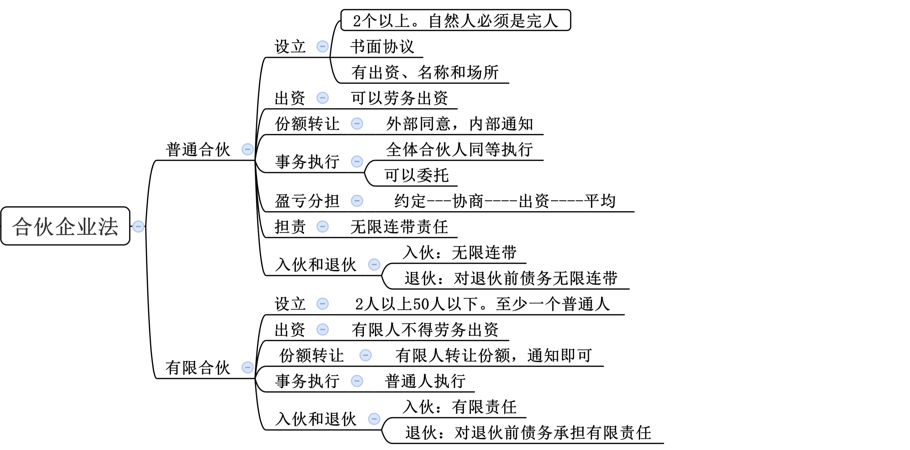
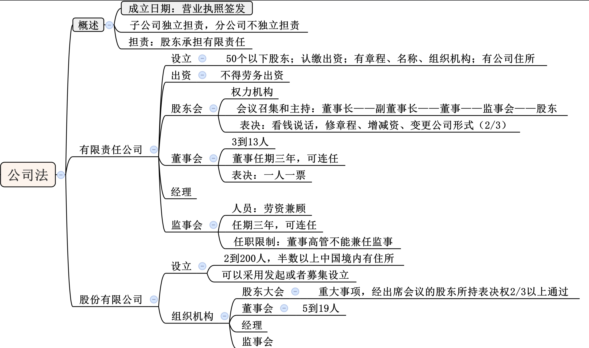
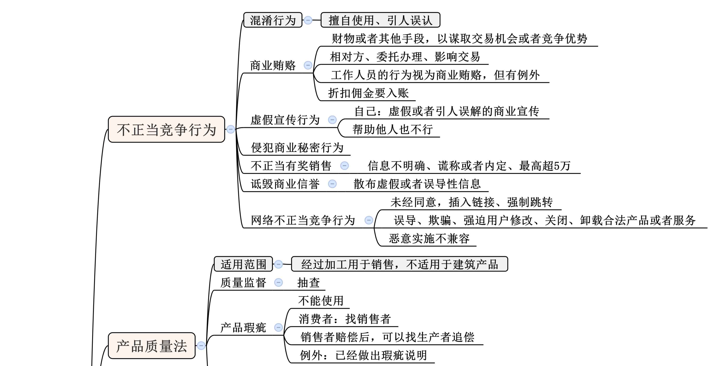
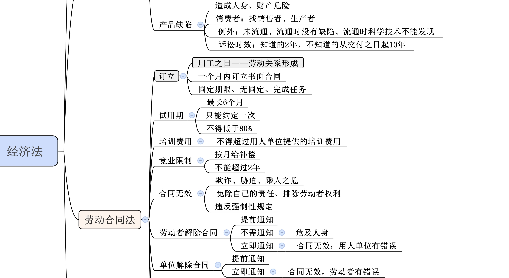
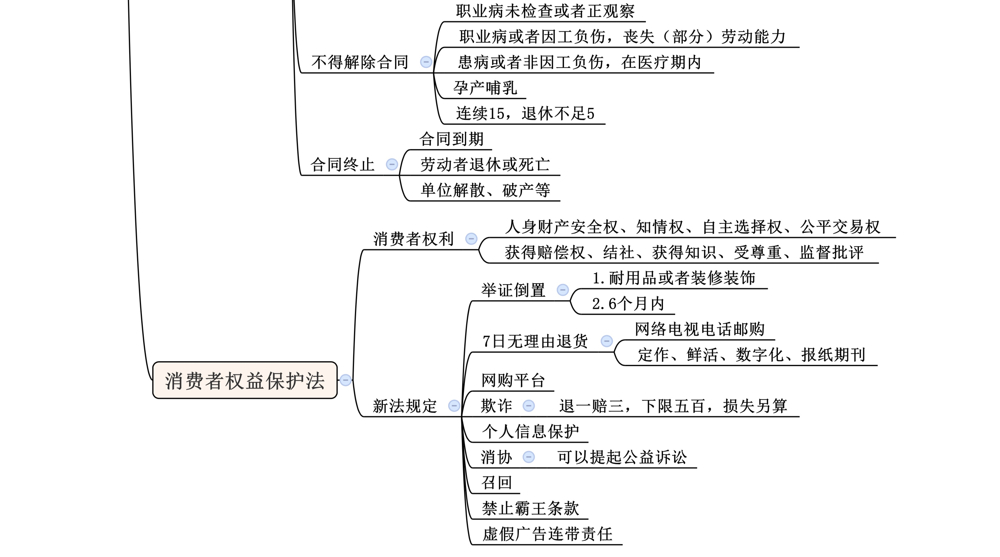

## 一、商法

### （1）合伙企业法
#### 普通合伙

合伙协议的**禁止约定**：全部利润分配给部分合伙人；由部分合伙人承担全部亏损。

新合伙人对入伙前合伙企业的债务承担无限连带责任
#### 有限合伙

### （2）公司法

## 二、经济法

1. 劳动合同期限三个月以上不满一年的，试用期不得超过一个月；劳动合同期限一年以上不满三年的，试用期不得超过二个月；三年以上固定期限和无固定期限的劳动合同，试用期不得超过六个月。本题中，小王的劳动合同期限为两年半，属于一年以上不满三年的情形，试用期不得超过二个月。

> - 3个月 < 劳务合同 < 1年       |试用期 <= 1个月
> - 1年 < 劳务合同 < 3年         |试用期 <= 2个月
> - 3年 < 劳务合同、无固定期限     |试用期<= 6个月

1. 合同法：一方以欺诈、迫胁的手段签订的合同、损害国家利益的，为无效合同。

> 合同生效后，当事人**不得**因姓名、名称的变更或者法定代表人、负责人、承办人的变动而不履行合同义务。
> 法人≠法定代表人，法人是一个组织，是一个集合体，比如格力电器、粉笔公考都是法人。法定代表人是代表法人行使权利、履行义务的主要负责人，如工厂的厂长、公司的董事长(格力电器的董明珠)、粉笔公考的 CEO。比如格力电器，“格力电器”就是法人，董明珠是法定代表人;法定代表人可以代表法人订立合同，假如董明珠代表 格力签订合同，合同的一方当事人是格力电器，而不是董明珠个人，假如法定代表人换成张三，合同一方当事人没有变化，依然为格力电器，合同需要继续履行。

> 赠与的撤销
   
   - 1. “赠与人在赠与财产的权利转移之前可以撤销赠与”。 比如老师要送手机给甲同学，甲马上从老师手中拿过手机，如果甲没有及时拿走手机，即手机没有完成交付(动产以交付为准)，老师随时可以收回自己说的话，即不赠送手机。
   - 2. “具有救灾、扶贫等社会公益、道德义务性质的赠与合同或者经过公证的赠与合同，不适用前款规定”。属于救灾性质的，不是想撤就能撤。《合同法》 第一百八十八条:具有救灾、扶贫等社会公益、道德义务性质的赠与合同或者经过公证的赠与合同，赠与人不交付赠与的财产的，受赠人可以要求交付(即有些人既想要好名声，比如 自己救灾了、扶贫了，但实际又不想捐赠)。

3. 租赁：属于债权

5. 抗辩权

   - 同时履行抗辩权：是指当事人互负债务，**没有先后履行顺序**，应当同时履行。一方在对方履行之前有权拒绝其履行要求。即一手交钱一手交货，题目中甲先交付货物，乙后给钱，有先后履行顺序。 

   - 先履行抗辩权：是指当事人互负债务，**有先后履行顺序**，先履行一方未履行，后履行一方有权拒绝其履行请求。题目中若是描述为甲应该先交货，乙后给钱，甲没有正当理由拒绝交货，乙作为后履行一方拒绝给钱，则先履行抗辩权。

   - 不安抗辩权：是指应当**先履行债务的当事人**，有确切证据证明对方有下列情形之一的，可以中止履行(暂时停止履行)，包括: 经营状况严重(考点，需要“严重”)恶化;转移财产、抽逃资金以逃避债务;丧失商业信誉;有丧失或者可能丧失履行债务能力的情况其他情形。当事人没有确切证据中止履行的， 应当承担违约责任。在先履行一方惴惴不安，“有确切证据证明乙负债累累，丧失支付能力” 说明乙有履行不能的可能，甲为了保证自己安全，暂时不向乙交付货物，且因为有确切证据证明，不构成违约。

6. 分公司和子公司
   - 1、**子公司具有法人资格，以子公司自身的全部财产为限对其经营负债承担责任。分公司则不具备企业法人资格，没有独立的名称，其名称应冠以隶属公司的名称，由隶属公司依法设立，只是公司的一个分支机构。**

   - 2、依据《中华人民共和国公司法》具体规定如下：第十四条 公司可以设立分公司。设立分公司，应当向公司登记机关申请登记，领取营业执照。分公司不具有法人资格，其民事责任由公司承担。公司可以设立子公司，子公司具有法人资格，依法独立承担民事责任。

7. 劳务合同的期限分为：固定期限、无固定期限、以完成一定的工作任务为期限。三种情况。