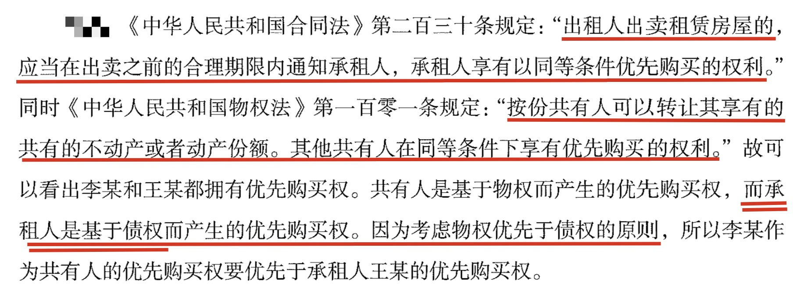

## 一、商法

### （1）合伙企业法
#### 普通合伙

合伙协议的**禁止约定**：全部利润分配给部分合伙人；由部分合伙人承担全部亏损。

新合伙人对入伙前合伙企业的债务承担无限连带责任
#### 有限合伙

### （2）公司法

## 二、经济法

1. 劳动合同期限三个月以上不满一年的，试用期不得超过一个月；劳动合同期限一年以上不满三年的，试用期不得超过二个月；三年以上固定期限和无固定期限的劳动合同，试用期不得超过六个月。本题中，小王的劳动合同期限为两年半，属于一年以上不满三年的情形，试用期不得超过二个月。

2. 合同法：一方以欺诈、迫胁的手段签订的合同、损害国家利益的，为无效合同。

3. 租赁：属于债权

4. 法律修改与宪法修改

