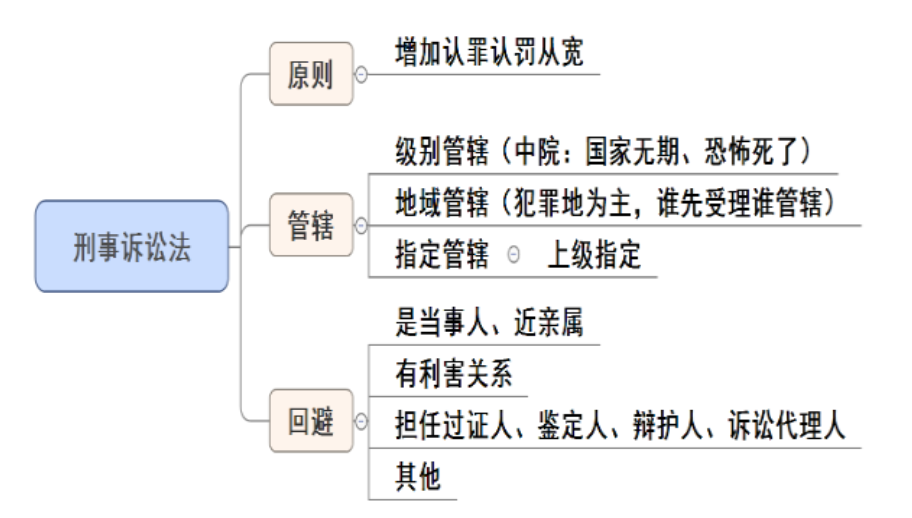
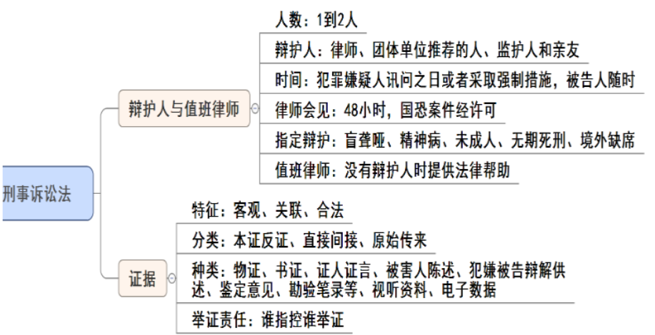
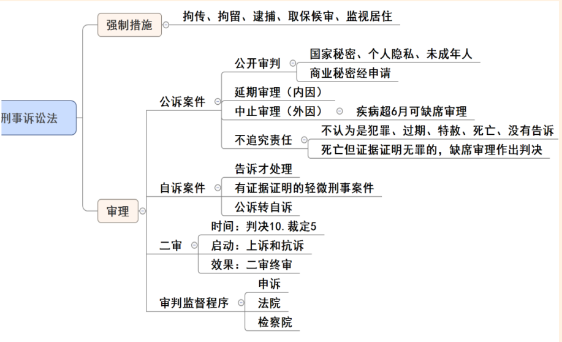
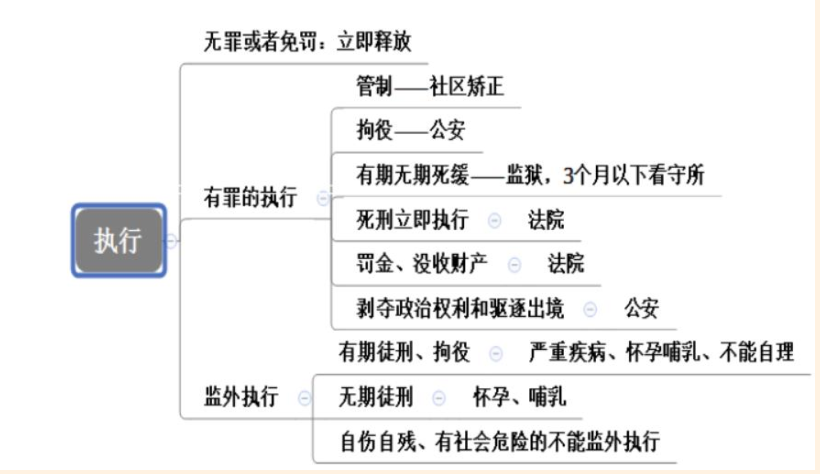
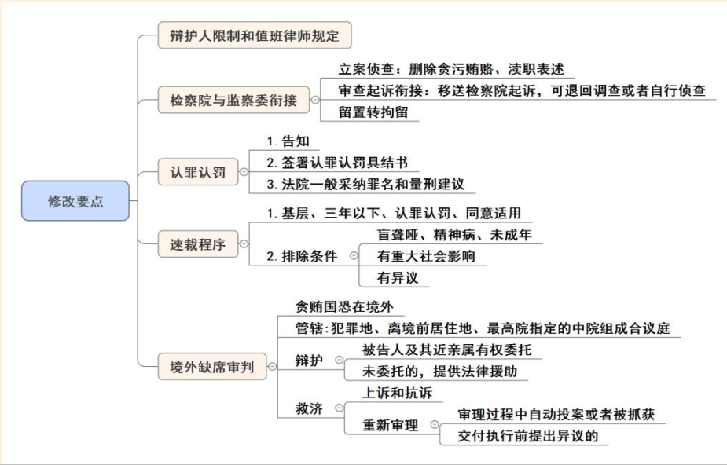
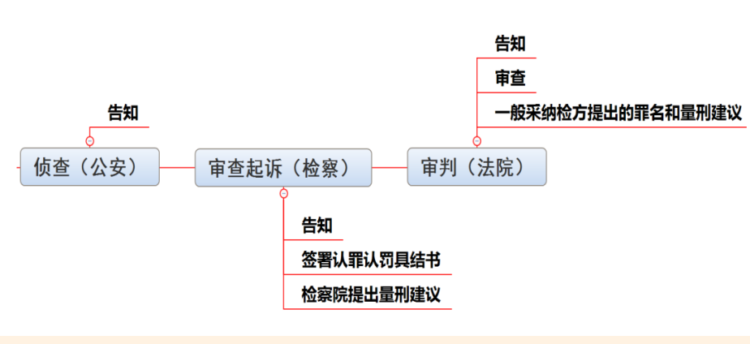

## 一、原则、管辖、回避、辩护人与值班律师、证据

1. 刑诉的原则： 掌握关键考点，新增认罪认罚从宽原则。

2. 管辖（重点）：
   - （1）级别管辖： **中院管辖危害国家安全的恐怖案件，有可能判处无期徒刑、死刑的案件**。
   - （2）地域管辖：以犯罪地为主， 居住地为主， 当几个地方法院都可以管辖时，谁先受理谁管辖。
   - （3）指定管辖：由上级法院指定管辖。

3. 回避情形：为了案件的公平公正，如果是当事人、近亲属、有利害关系、担任过证人、鉴定人、辩护人、诉讼代理人以及有其他关系可能影响案件的公正处理的需要回避。

4. 辩护人：
   - （1）人数： 1-2人。
   - （2）辩护人：律师、团体事业单位推荐的人、监护人和亲友。
   - （3）时间：犯罪嫌疑人第一次接受讯问或者采取强制措施之日可以委托辩护人。
   - （4）律师会见： 48小时内安排会见， 两类案件（危害国家安全、恐怖活动）需要经过允许。
   - （5）指定辩护： 如果是盲聋哑、精神病、未成年人、有可能被判处无期和死刑、境外缺席的案件，依法提供指定辩护。 **经济困难的需要经过申请才可以**。
   - （6）值班律师：没有辩护人时提供法律帮助。

5. 证据：
   - （1）特征：客观性、关联性、合法性。
   - （2）分类；
     - ①本证反证（本证证明案件符合事实，反证证明不符合案件事实）；
     - ②直接（单独证明）间接（不能单独证明）；
     - ③原始（一手）传来（二手）。
   - （3）种类：物证（外在形态）、书证（内在内容）、证人证言（证人提供的证据）、被害人陈诉、犯嫌被告辩解供述等。
   - （4）**举证责任：谁指控谁举证**。 公诉案件中由检察院举证，自诉案件由自诉人举证。

## 二、强制措施、审理、执行

1. 强制措施：拘传、拘留、逮捕、取保候审、监视居住。掌握对象（犯罪嫌疑人、被告人）和时间两个考点。

2. 审理：包括一审、二审和再审。

3. 一审：
   - （1）公诉案件：
     - ①公诉案件一般公开审判，但国家秘密、个人隐私、未成年人不公开，商业秘密经申请不公开。
     - ②延期审理为内因。
     - ③中止审理为外因。
     - ④不追究责任：不认为是犯罪、已过追诉期、免除刑罚、犯罪嫌疑人/被告人宣告死亡、没有告诉。
   - （2）自诉案件：
     - ①告诉才处理：虐待轻罪、暴力干涉婚姻自由的轻罪、侮辱诽谤的轻罪、侵占。
     - ②有证据证明的轻微刑事案件：故意伤害致人轻伤。
     - ③公诉转自诉：公检不作为，移交法院。

4. 二审：
   - （1）公诉：检察院可以抗诉，被告人可以上诉。
   - （2）自诉：自诉人可以上诉、被告人可以上诉。
   - （3）判决不服 10 日，裁定不服 5 日。

5. 审判监督程序：当事人可以申诉、法院可以开启，检察院可以抗诉。

6. 执行：
   - （1）无罪或者免罚：当庭立即释放。
   - （2）有罪的执行：
     - ①管制：不关押，实行社区矫正。
     - ②拘役：时间短，找公安。
     - ③有期无期死缓：找监狱，但 3 个月以下由看守所执行。
     - ④死刑立即执行：找法院。
     - ⑤罚金、没收财产：和钱有关，找法院。
     - ⑥剥夺政治权利和驱逐出境：需要干活，找公安。
  
   - （3）监外执行：
     - ①有期徒刑、拘役：严重疾病、怀孕哺乳、不能自理。
     - ②无期徒刑：怀孕、哺乳。  
     - ③自伤自残、有社会危险的不能监外执行。

## 三、修改要点

1. 增加辩护人限制：如果一个人被开除公职，吊销律师证书、公证员证书，一般不能当辩护人，近亲属、监护人除外。

2. 值班律师：不上庭辩护，可以提供法律帮助。

3. 检察院和监察委衔接：
   - （1）在立案侦查阶段，贪污贿赂、渎职类犯罪归监察机关调查。
   - （2）如果移送检察院起诉后，证据不充分的可以退回监察机关调查或检察院自行侦查。
   - （3）监察机关已经采用留置措施，检察院接手案件后留置转拘留。

4. 认罪认罚：
   
   - （1）侦查机关、法院、检察院要告知犯罪嫌疑人、被告人认罪认罚相关规定。
   - （2）一般情况下，犯罪嫌疑人、被告人要签署认罪认罚具结书；半疯傻精神病人、未成年人、代理人和辩护人有异议、盲聋哑**不签署犯罪认罚具结书（盲聋哑、精神病、小孩家人有异）**。
   - （3）法院一般会采纳检察院罪名和量刑建议，但如果罪名不对、不应当负刑责、被告人否认的情况下不采纳。

5. 速裁程序：基三认同。
   - （1）基：基层人民法院管辖。
   - （2）三：三年有期徒刑以下的刑罚。
   - （3）认：犯罪嫌疑人、被告人认罪认罚。
   - （4）同：犯罪嫌疑人、被告人同意适用速裁程序。
   - （5）排除条件：盲聋哑、精神病、未成年、有重大社会影响、有异议。

6. 总结
   - （1） 盲聋哑、精神病、无期死刑、未成年、境外缺席：法律援助（应当进行法律援助）。
   - （2） 盲聋哑、精神病、小孩家人有异议：不签署认罪认罚具结书。
   - （3） 盲聋哑、精神病、未成年人有影响、被告异议：不速裁（不能适用速裁程序）。