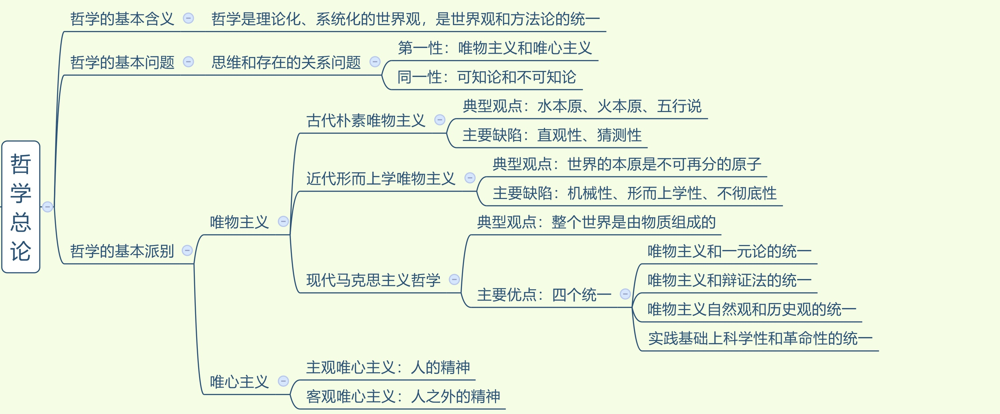
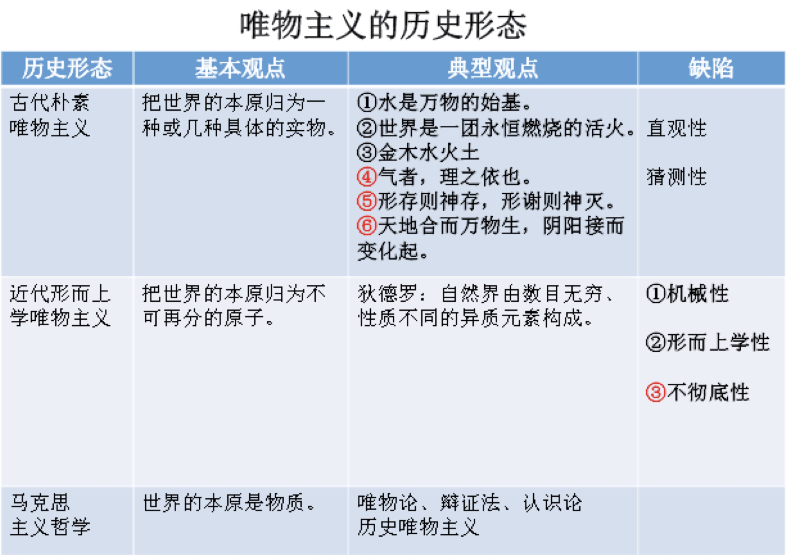
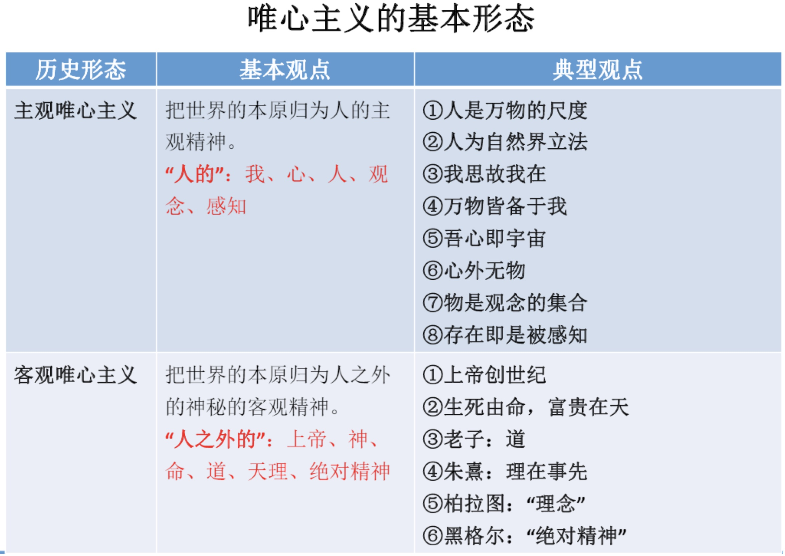
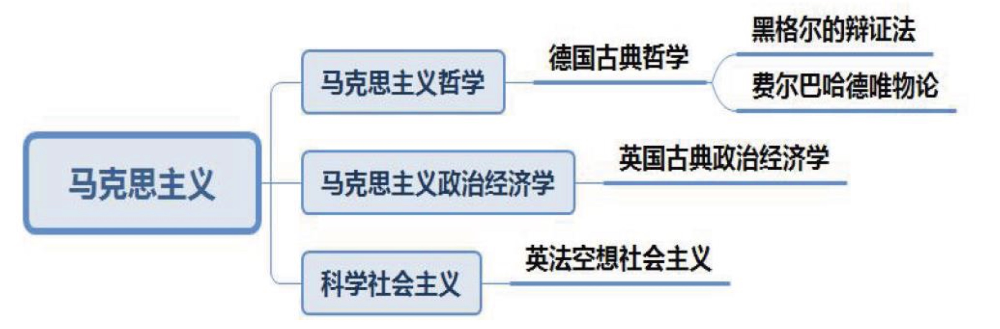
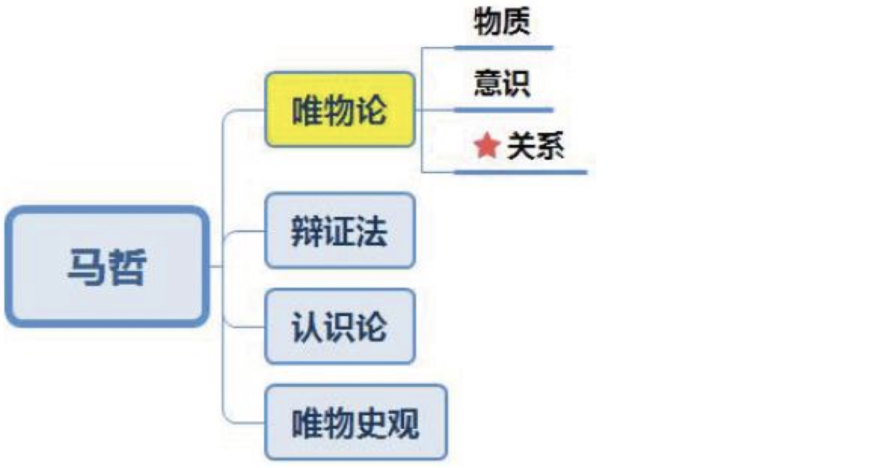
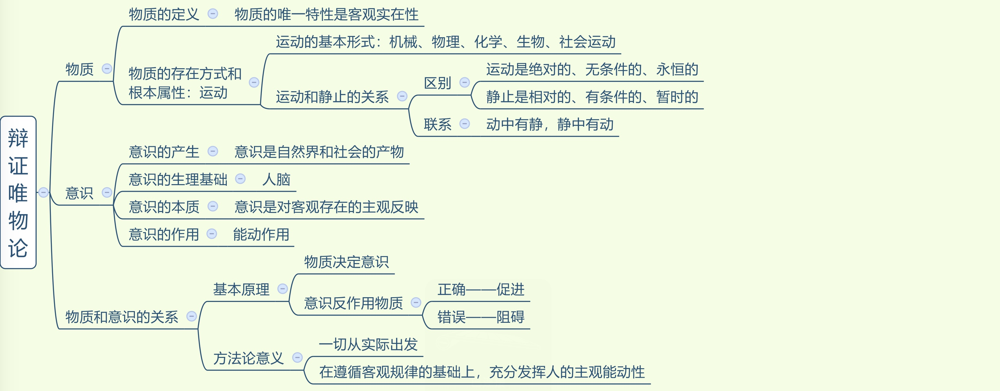
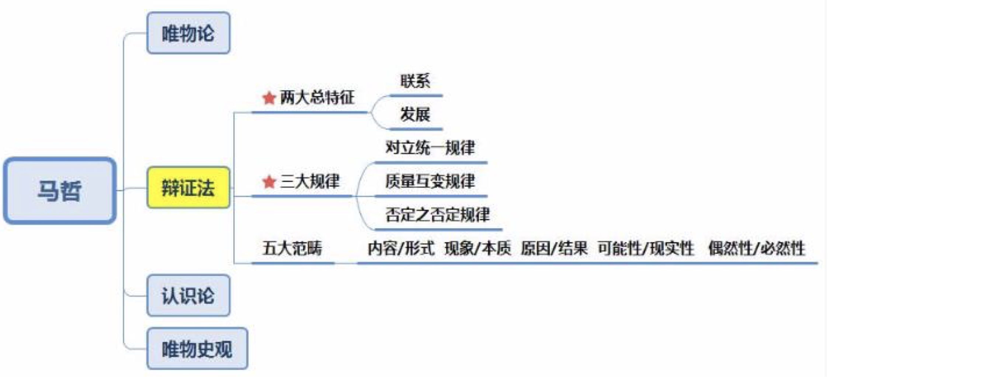

## 一、马克思主义哲学
### （一）总论

 
 #### 唯物主义
 1. 哲学的基本派别（单选）：唯物主义和唯心主义。哲学的党派/党性：唯物主义、唯心主义。
 
 2. 唯物主义：物质先产生，不是所有的唯物主义者对物质的理解都是一样的，不同的唯 物主义者认为的“物”不同。区分唯物主义的三种历史形态：对“物”理解的深度、广度的 不同（单选）。
    - （1）**古代朴素唯物主义**：对物的理解较简单，把世界的本原归为一种或几种具体的实 物。
      - ①典型观点：
        - a 水是万物的始基。
        - b 世界是一团永恒燃烧的活火。
        - c 中国传统五行说，金木水火土。
        - d 气（物质实体）者，理（客观规律）之依也：王夫之所说，指客观规律依赖物质实体 而存在。
        - e 形存则神存，形谢则神灭：“形”指身体，身体在人的灵魂就存在，身体不在则灵魂 不在。
        - f 天地合则万物生，阴阳接而变化起：万物的本原是天地，天和地是看得见的，是具体 的实物。
      - ②缺陷：直观性、猜测性。
    - （2）**近代形而上学唯物主义**：随着科技的不断发展，其认为看得见的物不一定是本原， 而把世界的本原归为不可再分的原子，出现原子论的观点。缺陷： 
      -  ①机械性：把人比作机器，由开关控制，是错误的观点，人除了机械运动外，还包括生 物运动、化学运动、新陈代谢等。
      -  ②形而上学性：哲学中经常看到“形而上学”。形而上学：用孤立的、静止的、片面的 观点看问题。要用联系、发展的观点看问题。
      -  ③不彻底性：在自然观上是唯物的，在历史观上是唯心的。如问其先有黄河还是先有对 黄河的意识，其认为先有黄河，即在自然观上是唯物的；若问中国历史是谁推动的，其认为 历史的长河是上帝、神推动的，这是唯心的，没有将唯物主义贯彻到底，故近代形而上学唯 物主义也称为“半截子唯物主义”。
    - （3）马克思主义哲学。

> 古代朴素唯物主义：把握典型观点。
> 近代形而上学唯物主义：**把握三个缺陷（机械性、形而上学性、不彻底性）**。口诀： 畸型不。

#### 唯心主义

1. 唯心主义：认为意识（精神）先产生。不同的唯心主义者对“精神”的理解不一样， 有人认为是人的精神，即主观唯心主义；有人认为是人之外、神秘的客观精神，如上帝、女 娲等，属于客观唯心主义。

2. 区分主观唯心主义和客观唯心主义：核心词——人。人的为主观，人之外的为客观。
   - （1）**主观唯心主义**：
     - ①人是万物的尺度：核心词是人。
     - ②人为自然界立法：自然界没有客观规律，是人主观立的法。
     - ③我思故我在：“我”是人，是主观的。
     - ④万物皆备于我：“我”，是主观的。
     - ⑤吾心即是宇宙：“心”指人心。
     - ⑥心外无物：“心”指人心。
     - ⑦物是观念的集合：“观念”指人的观念。
     - ⑧存在即是被感知：被人感知。
   - （2）**客观唯心主义：人之外的神秘力量**。
     - ①上帝创世纪：上帝是外在的、客观的、神秘的、全能的存在。
     - ②生死有命，富贵在天：如考上考不上是命中注定的，怎么努力都是没用的。“命”是 客观的，不由人决定。
     - ③老子：道。“道”不是主观存在，而是外在的、不以人的主观意志转移，是客观的。
     - ④朱熹：理在事先。“理”指天理，存天理、灭人欲。
     - ⑤柏拉图“理念说”。
     - ⑥黑格尔“绝对精神”：“绝对精神”是绝对的、客观的精神。

#### 总论
 1. 基本含义：哲学是理论化、系统化的世界观，是对世界总的观点和看法；是世界观和 方法论的统一，即“如何看待世界、世界是什么”和“怎样观察、处理问题”。世界观决定 方法论，方法论体现世界观。
 
 2. 基本问题：恩格斯提出的思维与存在的关系问题/意识与物质的关系问题。体现在两 个方面：
    - （1）第一性：谁先产生，根据不同回答区分唯物主义（物质先产生）和唯心主义（意 识先产生）两个派别。
    - （2）同一性：思维和存在能否统一，思维能否认识客观存在，由此区分为可知论和不 可知论。

3. 基本派别/党派/党性：唯物主义和唯心主义。
   - （1）唯物主义：古代朴素唯物主义（对物的理解比较简单，如金木水火土）、近代形而 上学（认为物是原子，缺陷是机械性、形而上学性、不彻底性）、马克思主义哲学。
   - （2）唯心主义：主观唯心主义和客观唯心主义。区分标准：人，人的是主观，人之外 的是客观的。

4. **辩证法用联系的、发展的、全面的观点看待世界。形而上学用孤立的、静止的、片面的观点看待世界**。

5. 扩展
    - （1）2018 年是马克思诞辰 200 周年，马克思出生于 1818 年 5 月 5 日（一巴掌、一巴掌拍 得资本主义呜呜直哭）。
   - （2）马克思的理论来源（多选）：三个，掌握一一对应的关系。
     - ①**马克思主义哲学**对应德国的古典哲学（黑格尔辩证法、费尔巴哈唯物论）。
     - ②**马克思主义政治经济学**对应英国古典政治经济学。
     - ③**科学社会主义**对应英法空想社会主义。
   - （3）马克思主义的创始人是马克思（错误）。原因：还有恩格斯。
   - （4）马克思主义诞生的标志：《共产党宣言》（1848 年）的发表。2018 年是《共产党宣言》 发表 170 周年。
   - （5）第一个《共产党宣言》中文译本的作者是陈望道。中国的第一个马克思主义者是李大钊，著有《我的马克思主义观》。

### （二）唯物论

#### 物质
1. 物质的唯一特性是客观实在性，即不以主观意愿而转移。
2. 对物质下定义：列宁。

#### 物质的存在方式和根本属性
1. 物质的根本属性与存在方式：运动。物质是运动的，而非静止的。注意区分，物质的唯一特性是客观实在性。

2. 运动是物质的根本属性。
   - （1）世界上的一切事物都在运动（正确）。原因：例如坐着听课只是没有进行相对位置 的移动，但血液在流动、心脏在跳动、地球在转动。
   - （2）物质是运动的载体：运动的只能是物质。例：一阵风刮过，帆动了。一个和尚说 是风在动，另一个说帆在动，还有一个和尚说不是风动、不是帆动，而是心在动。第三个人 的观点即主观唯心的观点，这种观点是错误的。再如夏天常说“心静自然凉”，认为不是天 热，而是心在躁动，此为主观唯心，是错误的。
 
 3. 物质是运动的物质，运动是物质的运动（正确）。物质是运动的，不运动的是形而上学，强调运动；第二个运动强调是物质的运动。

#### 运动与静止
1. 运动与静止的关系（重点）：
   - （1）运动是绝对、无条件、永恒的，任何时刻都是运动的。
   - （2）静止是相对的、有条件的、暂时的。
   - （3）运动和静止的关系：动中有静，静中有动，二者互相交叉、彼此不可分离。例： 甲这辈子无论如何变都是甲的，对甲本身而言就是静止，不会变成他人的一生。这辈子并非 一成不变，如由女婴变为少女、妇女、老妇人，这体现的是动，即动中有静，静中有动。

2. **割裂二者关系会导致形而上学不变论和相对主义诡辩论**（常考）：
   - （1）**形而上学不变论**：不承认运动，只承认静止。例：刻舟求剑，一个人坐在船上， 剑不小心掉到河里，船依旧在前行，他没有马上去捞，而是船靠岸后再去找剑。
   - （2）**相对主义诡辩论**：只承认运动，不承认静止。例：古文“方生方死，方死方生”， 意思是生下来就死了，死了又活了，不承认暂时的静止。再如甲问乙借 100 元，乙说明要记 得还。甲不承认有相对的静止，诡辩：上一秒借钱的我不是现在的我，此时与彼时不是同一 个我。
   - （3）经典考点：
     - ①赫拉克利特：人不能两次踏进同一条河流（正确）。今天踏进的河流和明天踏入的河 流不是同一条河流，因为今天踏入的河水已经流走了或者河水里有杂质了，故人不能两次踏 进同一条河流，承认了运动和静止。
     - ②克拉底鲁：人一次都不能踏入同一条河流（错误）。原因：认为看到河流那刻和踏入河流的那刻，河流已经发生了变化，不承认有暂时的静止，属于诡辩论。

#### 意识
1. 意识：意识的产生是自然界长期发展的产物，马克思称意识为地球上最美的花朵。
   - （1）**只有人才有意识**（正确）。原因：其他的称为感觉、心理、反映特性、刺激感应性 等，只有人才有意识。 
   - （2）意识是人脑特有的机能。意识是大脑特有的机能（错误）。必须是人脑，动物也有 脑，但人脑才能产生意识。
   - （3）有人脑就有意识/意识是人脑自生的（错误）。例：甲的意识是考公/考编，不是生 下来就有这一意识，而是外在环境使得自己产生此意识，故人脑不是意识的源泉，**意识的源泉来自于客观世界**。

2. **意识的本质：对客观存在的主观反映，来源于客观存在**。
   - （1）意识从内容上是客观的。例：龙。现实生活中没有龙，但是有对龙的意识，此意 识来源于客观存在，如龙的身体像蛇，眼睛像兔子，角像鹿，爪像鹰等。
   - （2）意识从形式上是主观的，仁者见仁智者见智。例：甲认为自己的女朋友很漂亮， 但别人眼中则不一定也如此认为，不同人看到会获得不一样的意识。再如维纳斯雕塑，对于 同样的雕塑不同人看到的具有主观性，艺术家认为很美，社会学家认为太过暴露，有伤风化， 医学家眼中认为有残疾，男性认为性感，女性则很羡慕。

3. **意识具有能动作用。能动：要主动，不要被动，主要体现在有目的性、创造性**。
   - （1）目的性：如觉得很困但依然坚持听课，这是因为人有意识，有计划，要考上的意 念使其坚持听课。
   - （2）创造性：意识具有创造性：意识在我们主观世界基础上可以创造一些事物，如龙、 鬼。意识能够自由地创造世界（错误）。如龙的来源、素材都是客观世界，受客观世界的束 缚。

4. 物质决定意识，意识对物质具有反作用。正确的意识对事物发展具有促进作用，错误 的意识对事物发展起阻碍作用。
   - （1）所有的意识都是正确的（错误）。原因：有的意识是错误的意识。
   - （2）意识对客观事物的发展具有促进作用（错误）。原因：正确的意识对客观事物的发 展具有促进作用，错误的意识对事物发展起阻碍作用。
   - （3）应用：
     - ①巧妇难为无米之炊。米就是物质，物质决定意识，没有米巧妇也无法做饭。
     - ②望梅止渴、画饼充饥：体现的是意识的反作用。

5. 方法论意义：物质决定意识，一切从实际出发；意识反作用于物质，要求发挥人的主 观能动性。
   - （1）注意：不可夸大人的主观能动性，如“人有多大胆、地有多大产”就夸大了人的 主观能动性。
   - （2）人在大自然面前无能为力（错误）。不是无能为力，人有主观能动性，可以认识、改造自然界。即不能夸大、也不能否认，要在遵循客观规律的前提下发挥主观能动性。改造自然界。即不能夸大、也不能否认，要在遵循客观规律的前提下发挥主观能动性。

#### 总结
1. 物质：
   - （1）**物质的唯一特性是客观实在性**，列宁对物质下了权威的定义。
   - （2）**物质的存在方式和根本属性：运动**。物质是运动的载体，运动是绝对的，静止是 相对的。关系：静中有动，动中有静。
   - （3）任何时候都是**物质决定意识**。

2. 意识：
   - （1）意识的本质：对客观存在的主观反映；意识内容上是客观的；形式上是主观的。
   - （2）意识具有能动作用。

3. 物质和意识的关系：
   - （1）物质决定意识（一切从实际出发）。
   - （2）意识对物质具有反作用。发挥人的主观能动性的前提、基础：尊重客观规律。

### （三） 唯物辩证法

> 唯物辩证法的总特征：事物是普遍联系和事物的永恒发展。

#### 普遍联系
1. 总特征：联系是横向的（事物和事物之间的联系），发展是纵向的。

2. 特征：
   - （1）联系具有普遍性，任何事物之间和事物内部之间都存在联系。如蝴蝶效应，即南 美洲的蝴蝶轻轻煽动一下翅膀，可以引起千里之外的龙卷风，蝴蝶和龙卷风看起来没有什么 关系，但却联系在一起，体现联系的普遍性；中国常说的“唇亡齿寒”，嘴唇没有了，牙齿 就掉光了。
   - （2）客观性：事物和事物联系是客观存在的，不是人想怎么联系就怎么联系。
   - （3）条件性：联系是有条件的，如老师和同学之间的师生联系是通过粉笔的平台建立的。
   - （4）多样性：联系是多样的，有直接的、间接的联系，如老师和同学是师生关系，与 其老公是夫妻关系，与其孩子是母子关系，与王某是同事关系，因此联系是多样的。

3. 系统：指整体，常考整体和部分之间的关系。
   - （1）整体起到主导和统帅的作用，比如此人在北京，此人的手不可能到美国。部分起制约影响的作用。
   - （2）经典考点：
     - ①整体寓于部分之中（错误），原因：“**部分寓于整体之中**”。
     - ②部分有时也决定着整体（正确），原因：大多数时候整体决定部分，整体起主导和统 帅的作用，但有时候部分也决定整体，比如短板效应，最短的部分决定整个桶容积。如果人 的心脏不动了，人也不会活，关键部分决定整体。
     - ③整体是各部分之和（错误），原因：整体不是各部分简单的叠加、堆积，整体是各部分的有机结合。部分以有序的方式结合成整体，部分之和大于整体；部分以不合理的方式结合成整体，部分之和小于整体。
     - ④花在树则生，离枝则死：意思是花在树上就能够生存，离开树就死亡，强调整体的重要性。
     - ⑤牵一发而动全身：“一发”强调部分。

#### 永恒发展
1. 概念：
   - （1）发展是前进的、上升的运动。
   - （2）判断：所有运动都是发展的（错误），原因：运动有可能向上、前进、上升，也有 可能是倒退的；但发展只能是前进的、上升的。

2. 发展：
   - （1）实质：新事物的产生旧事物的灭亡，旧的不去新的不来。如一个人不发生任何的 改变就不会发展，只有不断的学习、抛弃自身不好的恶习，才能提高发展。
   - （2）新事物：新出现的就是新事物（错误），原因：新旧事物的区别根本标志——是否 符合事物发展的必然趋势，符合为新事物，不符合为旧事物。如电脑算命，有了电脑才出现电脑算命，电脑是新事物，但核心是算命，代表封建迷信，因此不属于新事物。社会主义是 新事物，社会主义符合历史的发展和时代潮流。新事物必须符合发展趋势。
 
 3. 方法论：用发展的眼光看问题。比如所有的女生都想嫁“高富帅”，所有的男生想要 娶“白富美”，这种观点没有用发展的眼光看待问题。“白富美”只能说这个女生现在比较漂 亮，50 年之后就不一样了，“高富帅”只能证明他祖上还不错，将来怎样还不一定，因此要 嫁（娶）给“潜力股”，即用发展的眼光看问题。经典考点：
   - （1）士别三日，即当刮目相看（正确），原因：体现用发展眼光看待问题。
   - （2）长江后浪推前浪，一代新人换旧人（正确），原因：“后浪”指新事物，“前浪”指 旧事物，体现用发展的眼光看问题。
   - （3）芳林新叶催陈叶，流水前波让后波（正确），原因：旧的叶子，“新叶”会代替它； 旧的事物要让位新起之秀。
   - （4）“十三五规划”、“两个百年目标”（正确），原因：“十三五规划”“两个百年目标” 都是用发展的眼光看待问题。
