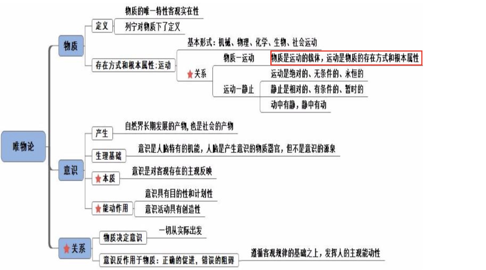

## 一、马克思主义哲学
### （一）总论

 
 #### 唯物主义
 1. 哲学的基本派别（单选）：唯物主义和唯心主义。哲学的党派/党性：唯物主义、唯心主义。
 
 2. 唯物主义：物质先产生，不是所有的唯物主义者对物质的理解都是一样的，不同的唯 物主义者认为的“物”不同。区分唯物主义的三种历史形态：对“物”理解的深度、广度的 不同（单选）。
    - （1）**古代朴素唯物主义**：对物的理解较简单，把世界的本原归为一种或几种具体的实 物。
      - ①典型观点：
        - a 水是万物的始基。
        - b 世界是一团永恒燃烧的活火。
        - c 中国传统五行说，金木水火土。
        - d 气（物质实体）者，理（客观规律）之依也：王夫之所说，指客观规律依赖物质实体 而存在。
        - e 形存则神存，形谢则神灭：“形”指身体，身体在人的灵魂就存在，身体不在则灵魂 不在。
        - f 天地合则万物生，阴阳接而变化起：万物的本原是天地，天和地是看得见的，是具体 的实物。
      - ②缺陷：直观性、猜测性。
    - （2）**近代形而上学唯物主义**：随着科技的不断发展，其认为看得见的物不一定是本原， 而把世界的本原归为不可再分的原子，出现原子论的观点。缺陷： 
      -  ①机械性：把人比作机器，由开关控制，是错误的观点，人除了机械运动外，还包括生 物运动、化学运动、新陈代谢等。
      -  ②形而上学性：哲学中经常看到“形而上学”。形而上学：用孤立的、静止的、片面的 观点看问题。要用联系、发展的观点看问题。
      -  ③不彻底性：在自然观上是唯物的，在历史观上是唯心的。如问其先有黄河还是先有对 黄河的意识，其认为先有黄河，即在自然观上是唯物的；若问中国历史是谁推动的，其认为 历史的长河是上帝、神推动的，这是唯心的，没有将唯物主义贯彻到底，故近代形而上学唯 物主义也称为“半截子唯物主义”。
    - （3）马克思主义哲学。

> 古代朴素唯物主义：把握典型观点。
> 近代形而上学唯物主义：**把握三个缺陷（机械性、形而上学性、不彻底性）**。口诀： 畸型不。

> 运动涉及时间、空间
-  时间: 持续性(不停止、不中断)、顺序性(从过去到现在到将来)、一维性(一去不复返，不可逆，回不来)。 
-  空间: 伸张性、广延性、三维性。

> 物质运动的形式：机械运动、物理运动、化学运动、生物运动、社会运动。

#### 唯心主义

1. 唯心主义：认为意识（精神）先产生。不同的唯心主义者对“精神”的理解不一样， 有人认为是人的精神，即主观唯心主义；有人认为是人之外、神秘的客观精神，如上帝、女 娲等，属于客观唯心主义。

2. 区分主观唯心主义和客观唯心主义：核心词——人。人的为主观，人之外的为客观。
   - （1）**主观唯心主义**：
     - ①人是万物的尺度：核心词是人。
     - ②人为自然界立法：自然界没有客观规律，是人主观立的法。
     - ③我思故我在：“我”是人，是主观的。
     - ④万物皆备于我：“我”，是主观的。
     - ⑤吾心即是宇宙：“心”指人心。
     - ⑥心外无物：“心”指人心。
     - ⑦物是观念的集合：“观念”指人的观念。
     - ⑧存在即是被感知：被人感知。
   - （2）**客观唯心主义：人之外的神秘力量**。
     - ①上帝创世纪：上帝是外在的、客观的、神秘的、全能的存在。
     - ②生死有命，富贵在天：如考上考不上是命中注定的，怎么努力都是没用的。“命”是 客观的，不由人决定。
     - ③老子：道。“道”不是主观存在，而是外在的、不以人的主观意志转移，是客观的。
     - ④朱熹：理在事先。“理”指天理，存天理、灭人欲。
     - ⑤柏拉图“理念说”。
     - ⑥黑格尔“绝对精神”：“绝对精神”是绝对的、客观的精神。

#### 总论
 1. 基本含义：哲学是理论化、系统化的世界观，是对世界总的观点和看法；是世界观和 方法论的统一，即“如何看待世界、世界是什么”和“怎样观察、处理问题”。世界观决定 方法论，方法论体现世界观。
 
 2. 基本问题：恩格斯提出的思维与存在的关系问题/意识与物质的关系问题。体现在两个方面：
    - （1）第一性：谁先产生，根据不同回答区分唯物主义（物质先产生）和唯心主义（意 识先产生）两个派别。
    - （2）同一性：思维和存在能否统一，思维能否认识客观存在，由此区分为可知论和不 可知论。

3. 基本派别/党派/党性：唯物主义和唯心主义。
   - （1）唯物主义：古代朴素唯物主义（对物的理解比较简单，如金木水火土）、近代形而 上学（认为物是原子，缺陷是机械性、形而上学性、不彻底性）、马克思主义哲学。
   - （2）唯心主义：主观唯心主义和客观唯心主义。区分标准：人，人的是主观，人之外 的是客观的。

4. **辩证法用联系的、发展的、全面的观点看待世界。形而上学用孤立的、静止的、片面的观点看待世界**。

5. 扩展
    - （1）2018 年是马克思诞辰 200 周年，马克思出生于 1818 年 5 月 5 日（一巴掌、一巴掌拍 得资本主义呜呜直哭）。
   - （2）马克思的理论来源（多选）：三个，掌握一一对应的关系。
     - ①**马克思主义哲学**对应德国的古典哲学（黑格尔辩证法、费尔巴哈唯物论）。
     - ②**马克思主义政治经济学**对应英国古典政治经济学。
     - ③**科学社会主义**对应英法空想社会主义。
   - （3）马克思主义的创始人是马克思（错误）。原因：还有恩格斯。
   - （4）马克思主义诞生的标志：《共产党宣言》（1848 年）的发表。2018 年是《共产党宣言》 发表 170 周年。
   - （5）第一个《共产党宣言》中文译本的作者是陈望道。中国的第一个马克思主义者是李大钊，著有《我的马克思主义观》。

### （二）唯物论

#### 物质
1. 物质的唯一特性是客观实在性，即不以主观意愿而转移。
2. 对物质下定义：列宁。

#### 物质的存在方式和根本属性
1. 物质的根本属性与存在方式：运动。物质是运动的，而非静止的。注意区分，物质的唯一特性是客观实在性。

2. 运动是物质的根本属性。
   - （1）世界上的一切事物都在运动（正确）。原因：例如坐着听课只是没有进行相对位置 的移动，但血液在流动、心脏在跳动、地球在转动。
   - （2）物质是运动的载体：运动的只能是物质。例：一阵风刮过，帆动了。一个和尚说 是风在动，另一个说帆在动，还有一个和尚说不是风动、不是帆动，而是心在动。第三个人 的观点即主观唯心的观点，这种观点是错误的。再如夏天常说“心静自然凉”，认为不是天 热，而是心在躁动，此为主观唯心，是错误的。
 
 3. 物质是运动的物质，运动是物质的运动（正确）。物质是运动的，不运动的是形而上学，强调运动；第二个运动强调是物质的运动。

#### 运动与静止
1. 运动与静止的关系（重点）：
   - （1）运动是绝对、无条件、永恒的，任何时刻都是运动的。
   - （2）静止是相对的、有条件的、暂时的。
   - （3）运动和静止的关系：动中有静，静中有动，二者互相交叉、彼此不可分离。例： 甲这辈子无论如何变都是甲的，对甲本身而言就是静止，不会变成他人的一生。这辈子并非 一成不变，如由女婴变为少女、妇女、老妇人，这体现的是动，即动中有静，静中有动。

2. **割裂二者关系会导致形而上学不变论和相对主义诡辩论**（常考）：
   - （1）**形而上学不变论**：不承认运动，只承认静止。例：刻舟求剑，一个人坐在船上， 剑不小心掉到河里，船依旧在前行，他没有马上去捞，而是船靠岸后再去找剑。
   - （2）**相对主义诡辩论**：只承认运动，不承认静止。例：古文“方生方死，方死方生”， 意思是生下来就死了，死了又活了，不承认暂时的静止。再如甲问乙借 100 元，乙说明要记 得还。甲不承认有相对的静止，诡辩：上一秒借钱的我不是现在的我，此时与彼时不是同一 个我。
   - （3）经典考点：
     - ①赫拉克利特：人不能两次踏进同一条河流（正确）。今天踏进的河流和明天踏入的河 流不是同一条河流，因为今天踏入的河水已经流走了或者河水里有杂质了，故人不能两次踏 进同一条河流，承认了运动和静止。
     - ②克拉底鲁：人一次都不能踏入同一条河流（错误）。原因：认为看到河流那刻和踏入河流的那刻，河流已经发生了变化，不承认有暂时的静止，属于诡辩论。

#### 意识
1. 意识：意识的产生是自然界长期发展的产物，马克思称意识为地球上最美的花朵。
   - （1）**只有人才有意识**（正确）。原因：其他的称为感觉、心理、反映特性、刺激感应性 等，只有人才有意识。 
   - （2）意识是人脑特有的机能。意识是大脑特有的机能（错误）。必须是人脑，动物也有 脑，但人脑才能产生意识。
   - （3）有人脑就有意识/意识是人脑自生的（错误）。例：甲的意识是考公/考编，不是生 下来就有这一意识，而是外在环境使得自己产生此意识，故人脑不是意识的源泉，**意识的源泉来自于客观世界**。

2. **意识的本质：对客观存在的主观反映，来源于客观存在**。
   - （1）意识从内容上是客观的。例：龙。现实生活中没有龙，但是有对龙的意识，此意 识来源于客观存在，如龙的身体像蛇，眼睛像兔子，角像鹿，爪像鹰等。
   - （2）意识从形式上是主观的，仁者见仁智者见智。例：甲认为自己的女朋友很漂亮， 但别人眼中则不一定也如此认为，不同人看到会获得不一样的意识。再如维纳斯雕塑，对于 同样的雕塑不同人看到的具有主观性，艺术家认为很美，社会学家认为太过暴露，有伤风化， 医学家眼中认为有残疾，男性认为性感，女性则很羡慕。

3. **意识具有能动作用。能动：要主动，不要被动，主要体现在有目的性、创造性**。
   - （1）目的性：如觉得很困但依然坚持听课，这是因为人有意识，有计划，要考上的意 念使其坚持听课。
   - （2）创造性：意识具有创造性：意识在我们主观世界基础上可以创造一些事物，如龙、 鬼。意识能够自由地创造世界（错误）。如龙的来源、素材都是客观世界，受客观世界的束 缚。

4. 物质决定意识，意识对物质具有反作用。正确的意识对事物发展具有促进作用，错误 的意识对事物发展起阻碍作用。
   - （1）所有的意识都是正确的（错误）。原因：有的意识是错误的意识。
   - （2）意识对客观事物的发展具有促进作用（错误）。原因：正确的意识对客观事物的发 展具有促进作用，错误的意识对事物发展起阻碍作用。
   - （3）应用：
     - ①巧妇难为无米之炊。米就是物质，物质决定意识，没有米巧妇也无法做饭。
     - ②望梅止渴、画饼充饥：体现的是意识的反作用。

5. 方法论意义：物质决定意识，一切从实际出发；意识反作用于物质，要求发挥人的主 观能动性。
   - （1）注意：不可夸大人的主观能动性，如“人有多大胆、地有多大产”就夸大了人的 主观能动性。
   - （2）人在大自然面前无能为力（错误）。不是无能为力，人有主观能动性，可以认识、改造自然界。即不能夸大、也不能否认，要在遵循客观规律的前提下发挥主观能动性。改造自然界。即不能夸大、也不能否认，要在遵循客观规律的前提下发挥主观能动性。

#### 总结
1. 物质：
   - （1）**物质的唯一特性是客观实在性**，列宁对物质下了权威的定义。
   - （2）**物质的存在方式和根本属性：运动**。物质是运动的载体，运动是绝对的，静止是 相对的。关系：静中有动，动中有静。
   - （3）任何时候都是**物质决定意识**。

2. 意识：
   - （1）意识的本质：对客观存在的主观反映；意识内容上是客观的；形式上是主观的。
   - （2）意识具有能动作用。

3. 物质和意识的关系：
   - （1）物质决定意识（一切从实际出发）。
   - （2）意识对物质具有反作用。发挥人的主观能动性的前提、基础：尊重客观规律。

### （三） 唯物辩证法

> 唯物辩证法的总特征：事物是普遍联系和事物的永恒发展。

#### 普遍联系
1. 总特征：联系是横向的（事物和事物之间的联系），发展是纵向的。

2. 特征：
   - （1）联系具有普遍性，任何事物之间和事物内部之间都存在联系。如蝴蝶效应，即南 美洲的蝴蝶轻轻煽动一下翅膀，可以引起千里之外的龙卷风，蝴蝶和龙卷风看起来没有什么 关系，但却联系在一起，体现联系的普遍性；中国常说的“唇亡齿寒”，嘴唇没有了，牙齿 就掉光了。
   - （2）客观性：事物和事物联系是客观存在的，不是人想怎么联系就怎么联系。
   - （3）条件性：联系是有条件的，如老师和同学之间的师生联系是通过粉笔的平台建立的。
   - （4）多样性：联系是多样的，有直接的、间接的联系，如老师和同学是师生关系，与 其老公是夫妻关系，与其孩子是母子关系，与王某是同事关系，因此联系是多样的。

3. 系统：指整体，常考整体和部分之间的关系。
   - （1）整体起到主导和统帅的作用，比如此人在北京，此人的手不可能到美国。部分起制约影响的作用。
   - （2）经典考点：
     - ①整体寓于部分之中（错误），原因：“**部分寓于整体之中**”。
     - ②部分有时也决定着整体（正确），原因：大多数时候整体决定部分，整体起主导和统 帅的作用，但有时候部分也决定整体，比如短板效应，最短的部分决定整个桶容积。如果人 的心脏不动了，人也不会活，关键部分决定整体。
     - ③整体是各部分之和（错误），原因：整体不是各部分简单的叠加、堆积，整体是各部分的有机结合。部分以有序的方式结合成整体，部分之和大于整体；部分以不合理的方式结合成整体，部分之和小于整体。
     - ④花在树则生，离枝则死：意思是花在树上就能够生存，离开树就死亡，强调整体的重要性。
     - ⑤牵一发而动全身：“一发”强调部分。

#### 永恒发展
1. 概念：
   - （1）**发展是前进的、上升的运动**。
   - （2）判断：所有运动都是发展的（错误），原因：运动有可能向上、前进、上升，也有 可能是倒退的；但发展只能是前进的、上升的。

2. 发展：
   - （1）**实质：新事物的产生旧事物的灭亡**，旧的不去新的不来。如一个人不发生任何的 改变就不会发展，只有不断的学习、抛弃自身不好的恶习，才能提高发展。
   - （2）新事物：新出现的就是新事物（错误），原因：新旧事物的区别根本标志——是否 符合事物发展的必然趋势，符合为新事物，不符合为旧事物。如电脑算命，有了电脑才出现电脑算命，电脑是新事物，但核心是算命，代表封建迷信，因此不属于新事物。社会主义是 新事物，社会主义符合历史的发展和时代潮流。新事物必须符合发展趋势。
 
 3. 方法论：用发展的眼光看问题。比如所有的女生都想嫁“高富帅”，所有的男生想要 娶“白富美”，这种观点没有用发展的眼光看待问题。“白富美”只能说这个女生现在比较漂 亮，50 年之后就不一样了，“高富帅”只能证明他祖上还不错，将来怎样还不一定，因此要 嫁（娶）给“潜力股”，即用发展的眼光看问题。经典考点：
    - （1）士别三日，即当刮目相看（正确），原因：体现用发展眼光看待问题。
    - （2）长江后浪推前浪，一代新人换旧人（正确），原因：“后浪”指新事物，“前浪”指 旧事物，体现用发展的眼光看问题。
    - （3）芳林新叶催陈叶，流水前波让后波（正确），原因：旧的叶子，“新叶”会代替它； 旧的事物要让位新起之秀。
    - （4）“十三五规划”、“两个百年目标”（正确），原因：“十三五规划”“两个百年目标” 都是用发展的眼光看待问题。

#### 唯物辩证法的三大规律

1. **对立统一规律是唯物辩证法的实质和核心**。

   
   - （1）矛盾的含义和基本属性

     - ①矛盾的含义：现实生活中的矛盾，如老师说话前后矛盾是逻辑上的矛盾；某人和自己的女朋友闹矛盾， 指二人之间产生意见的分歧， 是生活中的矛盾。 **哲学中的矛盾不是生活中的矛盾，哲学中的矛盾指对立统一关系**。“对立” 比如“好”和“坏”，是一对矛盾；“统一”指二者可以相互转换，如一个人不能一辈子是坏人，也可以变成好人， 相反好人也能变成坏人。
     - ②基本属性（单选题）：矛盾有很多属性，**矛盾的基本属性是矛盾的同一性和斗争性，“统一”是同一性，“对立”是斗争性**。矛盾的基本属性之间不能转化，只是矛盾的同一性可以相互转化。
   
   - （2）斗争性几乎不考，指事物之间的相互分离， 重点考查**矛盾的同一性。矛盾的同一性主要体现二者相互依存、相互转化**。
     - ①相互依存：矛盾的双方彼此离不开。 比如没有高就没有矮； 爱之深恨之切， 没有爱哪来的恨； 现实生活中的高富帅不要瞧不起“矮矬穷”，没有“矮矬穷”的衬托就显不出高富帅。
     - ②相互转化：如甲身高 162cm， 乙身高 150cm， 乙相对甲是矮的，但如果相对于姚明甲也是矮的。

   - （3）矛盾的普遍性和特殊性的辩证关系原理
     - ①普遍性：指共性，“事事有矛盾、时时有矛盾”，所有的事物在任何阶段都有矛盾。比如老师和学生之间有矛盾，课堂中双方是对立的； 课下可以相互转化，学生是情场的“老司机”，感情方面可以指导老师。
     - ②表述：离别时常说“一路顺风、万事如意”（错误），原因：没有体现矛盾的普遍性。
     - ③表述：事物只有发展到关键阶段才有矛盾（错误），原因：时时都有矛盾，不管是关键阶段还是非关键阶段都有矛盾。
     - ④矛盾的特殊性（个性）：“世界上没有两片完全相同的叶子”。
        a. 因材施教：都是讲哲学的课程，有的时间长、有的时间短， 因为不同班级的同学的水平不同， 要因材施教。
        b. 因地制宜：不同的地要种不一样的东西。
        c. 量体裁衣：做衣服不能都是 XXL 号，人的身材不同， 还有 M、 L 号，体现矛盾的特殊性。
        d. 对症下药：不同的病要对症下药。
        e. 矛盾的特殊性要求具体问题具体分析。

   - （4） 两点论和重点论

      - ①辩证法的两点论和重点论的统一。
        a. 两点论：指全面的看问题， 要看到事物的两个方面。
        b. 重点论：有重点的看，两方面都看到，知道哪一个是重点。如现在反腐要“苍蝇老虎一起打” ， 重拳出击的是老虎，这句话体现两点论和重点论的统一。“苍蝇”和“老虎”指既要看到小的贪腐， 又要看到大的贪腐， 体现两点论；重拳出击的是老虎，体现重点论。 比如某些人相亲或找对象时，秉持“全面撒网、重点培养”的理念，“全面撒网” 是两点论，“重点培养” 是重点论。
      - ②矛盾不平衡性：**复杂事物**中有多个矛盾， 有主要矛盾和次要矛盾； **单个矛盾中**，有矛盾的主要方面和次要方面。
      a. 对事物的发展起决定性作用：主要矛盾。
      b. 主要矛盾是在做事情，矛盾的主要方面是在定性。

......

#### 总结
1. 辩证法包括两大总特征（普遍联系、永恒发展）、三大基本规律，五大范畴。

2. 两大总特征：
   - （1）联系：整体和部分关系中，整体起主导作用，部分起制约和影响的作用。
   - （2）发展：发展是前进的、上升的运动。发展的实质是新事物的产生，旧事物的灭亡（旧的不去新的不来），因此要用发展的眼光看问题。

3. 三大规律：**对立统一规律是根本，是辩证法的实质和核心**。

   - （1）对立统一规律：矛盾在哲学中的含义是对立统一关系；**矛盾的基本属性是同一性和斗争性**；矛盾的种类有内在矛盾（内因）和外在矛盾（外因），**内因是事物发展的根据**和第一位的原因。
   - （2）质量互变规律：质变和量变的区分标志为是否超过度，超过度是质变， 在度范围内是量变。量变是质变的必要准备，质变是量变的必然结果。
   - （3）否定之否定规律：辩证否定的实质是扬弃，好的保留，坏的克服。 三个阶段：肯定、否定、否定之否定；整体方向是前进的，但道路是曲折的，是前进和曲折的统一。

### （四）认识论

1. 唯物论:回答“世界是什么样的”，马克思主义认为世界是由物质组成的。 

2. 辩证法:回答“世界是怎样存在的”，马克思主义哲学认为世界是运动的。 

3. 认识论:回答“人的思维是否能够认识世界”，马克思主义认为人的思维可以认识世界。人通过实践才能获得认识、如何获得认识、实践和认识的关系是第四节的逻辑。

#### 实践
1. 实践是人类能动地改造世界的客观物质活动，**关键词“人类”**。比如机器人的活动不属于实践活动，因为机器人不是人，**实践的主体是人类**。

2. 人类所有的活动都是实践活动(错误)，原因:不是所有的活动，**只有客观物质活动 (改变现实生活中客观的东西)才是实践活动**，不是精神层面的主观思维。比如甲不喜欢乙， 在心里画圈圈诅咒乙，这不属于实践活动，因为在心里想并没有引起客观物质变化;再如甲 千里迢迢找到乙，给乙一巴掌，这属于实践活动，因为甲在乙的脸上留下了印记，改变了客 观物质。此处只需理解，若题目给出一些选项，能够判断即可。

3. 实践的特点:
   - (1)**主观能动性**:根据实践的含义(实践是人类能动地改造世界的客观物质活动)，因此实践具有主观能动性。
   - (2)**客观物质性**:实践是改造世界的客观物质活动，因此实践具有客观物质性。
   - (3)**社会历史性**:比如秦始皇在统一六国之余不会拿着 ipad 打 DOTA、玩王者荣耀， 不可能实现，因为在秦始皇的历史时期没有 ipad、王者荣耀，因此实践活动受到当时社会 历史时期的制约。
   - (4)**直接现实性**(补充点，不是由马克思提出，而是毛泽东后来加上的):实践可以将 主观的理念变成客观的现实，比如甲脑海中想着小鸡炖蘑菇，这是一种思想/理念，通过实 践可以将此变为实实在在、热气腾腾的一盘小鸡炖蘑菇。
   - (5)考查方式:
     - 1蜜蜂筑巢、蜘蛛织网不属于实践，因为蜜蜂和蜘蛛不是人，缺少实践的主观能动性(只有有意识的人类才具有主观能动性)。
     - 2有人听到愚公移山的故事认为愚公很傻，认为愚公为何不用炸药炸、用汽车运，此人 没有看到实践的社会历史性，因为愚公所在的时期有社会历史局限性的存在。
     - 3马云在各地讲解成功学，有年轻人说:“你说的道理大家都懂，为什么你我之间差距 那么大呢?”马云回复说:“因为你只是在看，而我在做。”反映实践的直接现实性。

4. 实践的基本形式:
   - (1) **生产实践**:体现人和自然的关系，人为了满足基本的物质生活需要而进行的实践， 比如王某种田、张某采矿、李某放牛等。
   - (2) **社会实践**:处理人与人之间的关系。比如老师给学生上课是处理老师和学生的关 系、警察抓小偷是处理警察和小偷之间的关系。
   - (3) **科学实验**:科学家进行的探索性活动，比如袁隆平研究杂交水稻、屠呦呦提取青 蒿素。
   - (4)考查方式:
     - 1考查概念:实践的基本形式中最基本的是生产实践。只有吃饱穿暖，才有精力处理人 和人的关系，才有精力探索实验。
     - 2考查应用:以下活动属于实践的哪些形式。
       - a 农民种田属于生产实践(处理人与自然的关系)。 
       - b 物理实验属于科学实验。
       - c 医生给病人看病属于社会实践。
       - d 老鼠打洞不属于实践，因为老鼠不是人。

#### 认识
##### (一)感性认识

1. 感性认识是认识的低级阶段，通过眼、耳、鼻、舌、身获取对事物表面的认识。比如 老师通过学生甲的发言认为甲是一个高大帅气的男孩，此时老师获得的认识就是感性认识。

2. 感性认识的三种形式:
   - (1)感觉:对事物的个别属性的认识。
   - (2)知觉:对事物多种感觉认识的总和。
   - (3)表象:对之前感觉和知觉的回忆。 
   - (4)例子:比如甲正在听课，突然从厨房飘来一阵饭香，通过鼻子闻到的饭香是个别认识，属于感觉;甲赶紧跑到厨房，桌子上放着一盘色香味俱全的红烧排骨，甲看了看、闻 了闻、尝了尝，此时是多种感觉的总和，属于知觉;吃完后又回到电脑面前继续上课，但脑 海浮现的都是红烧排骨，此时脑中浮现的红烧排骨是对前面的回忆、想象，属于表象。

##### (二)理性认识
1. 理性认识是认识的高级阶段。因为理性认识是对事物本质规律的认识，而感性认识只 是对事物表面的认识。比如之前甲认为乙高大帅气，属于感性认识，通过深入接触后发现乙 是渣男，渣男是乙的本质，属于理性认识。

2. 理性认识的三种形式:
   - (1)概念:对事物本质的抽象和概括。比如人本身就是一个概念。
   - (2)判断:断定一种事物“是”或者“不是”的断定。比如人是会死的，本身就是一 种判断。
   - (3)推理:由已知推出未知。比如人是会死的(已知)，甲是人，推出甲是会死的(未知)，这就是一种推理。

##### (三)感性认识和理性认识的辩证关系
1. **理性认识依赖于感性认识: 强调感性认识重要**。要想获得理性认识，需要依赖感性认识，比如要获取张某是否是一位好老师，既可以通过老师的照片，还可以通过听老师的上课、 观察老师的行为来判断，从而得到理性认识;再如生活中的一些不良商贩冷冰冰地说“不买 别摸”，“买不买”是理性认识，但要依赖于摸一摸、闻一闻等感性认识判断是否购买。

2. **感性认识有待于发展为理性认识:强调理性认识重要，因为有些感性认识只是表象， 需要发展为对事物本质的一种理性认识**。比如张某认为王某留着两缕小胡子，像小流氓，即 感性认识，但深接触后发现王某是个才子，即理性认识，因此感性认识不可靠，需要发展为 理性认识。

3. **感性认识和理性认识相互渗透:我们有纯粹的感性认识/理性认识(错误)**，原因:既 没有纯粹的感性认识，也没有纯粹的理性认识，感性认识和理性认识是相互渗透的。比如甲 一看乙就是个好人，“看”是通过眼、耳、鼻、舌、身感知的，即感性认识;“是”或者“不 是”是一种判断，即理性认识，二者互相渗透。

##### (四)认识运动的基本规律
1. 认识是会运动的，有两次飞跃(多选题): 
   - (1)第一次飞跃:感性认识到理性认识，需要大量的感性材料和科学的思维方法两个条件。比如大学的毕业论文，首先要搜集与论文素材相关的大量材料，然后通过人的理性思 维对材料进行整合(去粗取精)。
   - (2)第二次飞跃:认识到实践。认识的目的是指导实践。

2. 两次飞跃中第二次飞跃更重要(单选题)，认识的第一次飞跃是为第二次飞跃做铺垫， 为了到实践中去。

3. 完整的认识过程(单选题):认识都来源于实践→开始是感性认识，慢慢再上升为理性认识→认识回归到实践，从实践中来，到实践中去。

4. 认识的运动具有反复性和无限性: 
   - (1)反复性:由于主体能力有限(别人只需认识一次，自己需要认识 N 次)或客观事物过于复杂(比如宇宙，认识一次认识不清楚，需要反复认识)。 
   - (2)无限性:任何事物都在不断变化，认识之后又发生变化。 

5. 例子:听完政治、哲学的课程后不一定全部掌握，有些人课后需要不断地回放、看讲义，体现认识的反复性;有一天终于把十九大的内容理解明白，然而二十大又召开了，发生变化需要重新认识，体现认识的无限性。

#### 实践与认识的关系
1. 实践与认识二者的关系:实践决定认识，认识反作用于实践。“反作用”主要体现在两方面，科学的认识对实践起促进作用，错误的认识对实践起阻碍作用。 

2. 实践决定认识体现在四方面(重点把握，常考多选题):
   - (1)**实践是认识的来源**: 
     - 1比如面前放着一杯水，想知道这杯水是甜的、辣的、酸的、凉的还是热的，仅仅天马行空地想不能获得对这杯水的认识，只有喝一口后才知道水的味道。 
     - 2判断题:a 实践是认识的唯一来源(正确)，原因:不管是直接途径还是间接途径都来源于实践， 直接经验来源实践，间接经验是来源他人的实践，因此实践是认识的唯一来源。b 实践是认识的唯一途径(错误)，原因:获取认识的途径有两种，第一种为直接经验， 即实践(比如小马过河的故事);第二种为间接经验，比如通过他人告知、书本获得认识。 
   - (2)**实践是认识的动力:实践的推动获取认识**。比如推动同学学习哲学的热情和激情是考试(考试本身就是一种实践)。
   - (3)**实践是认识的目的:认识的目的是指导实践**。 
   - (4)**实践是检验认识正确与否的唯一标准**。 

3. “学以致用”体现实践是认识的目的。

4. 认识的本质是：主体对客体的能动反映，以实践为中介。

5. 社会革命的实质：两对矛盾的尖锐化。

#### 真理
1. 认识的结果是获得真理，认识正确，即真理;认识错误，即谬误。 

2. 真理:人们对于客观事物及其规律的正确反映。

3. 考点: 
   - (1)真理在内容上是客观的，形式上是主观的。因为真理属于一种意识，与上节课讲解的意识类似(内容上是客观的，形式上是主观的，“仁者见仁智者见智”)。 
   - (2)真理的根本属性是客观性。真理必须与客观事物的规律相符合。

4. 真理的具体性(条件性):真理在一定的条件范围内才会转移。比如平面范围内，三角 形的内角和为 180°，只有在平面范围这个条件内才成立，如果将条件换成球面，其内角和 就不是 180°，此时可能成为谬误。**在一定范围内，真理就是真理，谬误就是谬误，真理和谬误有严格的区分**，比如在平面范围内，三角形的内角和就是 180°，181°就是谬误。

#### 总结

1. 认识论:从三个层面进行讲解，第一个是实践，第二个是认识，第三个是二者的关系。 

2. 实践: 
   - (1)含义:实践是人类(比如老鼠打洞、蜜蜂筑巢不属于实践活动，因为实践主体不是人)能动地改造世界的客观物质活动。不是人类的所有活动都是实践，只有客观的物质活 动才是实践(不是思维活动)。
   - (2)四个特点:主观能动性、客观物质性、社会历史性、直接现实性。常考社会历史 性和直接现实性。
   - (3)三种基本形式:生产实践、社会实践(处理人与人之间的关系)、科学实验，其中 最基本的形式是生产实践，是满足人基本的物质生活需要的形式。

3. 认识:
   - (1)感性认识是认识的低级阶段，理性认识是认识的高级阶段。 
   - (2)二者关系:理性认识依赖于感性认识;感性认识有待于发展为理性认识(因为感性认识不可靠)。 
   - (3)认识运动的基本规律:两次飞跃。第一次飞跃:感性认识上升到理性认识;第二次飞跃:认识飞跃到实践中去，实践是认识的目的。两次飞跃中第二次飞跃更重要，第一次 飞跃为第二次飞跃做铺垫。
   - (4)一个完整的认识过程:从实践中来获得认识，再到实践之中，认识又回归到实践。
   - (5)认识的结果是获得真理，真理是对客观事物的正确反映，在内容上是客观的，形 式上是主观的。

4. 二者关系:**实践决定认识(体现在四个方面，实践是认识的来源、动力、目的、检验 标准);认识对实践有反作用**。

### （五）历史唯物主义

1. 唯物论:讲解“世界是什么样的”;辩证法:讲解“世界是怎样存在的”;认识论: 讲解“人和世界的关系，人是否能够认识世界”;唯物史观:不仅仅研究世界、自然界、人的思维是怎样的，马克思将此理论推演到更大的角度，即社会历史是如何推进的。马克思主义哲学的研究对象有三个，即自然界、人的思维和社会历史。

2. 马克思一生两大理论贡献:唯物史观和剩余价值学说。2018 年是马克思诞辰 200 周 年。

#### 历史观的基本问题
1. 哲学的基本问题:思维和存在的关系问题;历史观的基本问题:社会存在和社会意识 的关系问题(单选题)。概念相同，只不过是放在不同的领域中进行讲解。放在唯物论中是 意识和物质的关系，放在认识论中是实践和认识的关系，放在历史观中是社会意识和社会物质的关系。
   - (1)历史唯物主义:社会存在决定社会意识，认为社会历史由生产力等客观规律推动 的，生产力不断发展才推动历史由原始社会演变到社会主义社会，是人民群众推动的。
   - (2)历史唯心主义:社会意识决定社会存在，认为社会历史由主观的一些精神推动的， 比如上帝、个别英雄人物。
   - (3)历史唯物主义正确，历史唯心主义错误。

2. 判断题:
   - (1)时势造英雄(正确):强调时势很重要，大势所趋之下才会造就英雄，比如国家动荡、民族危难之际，即使历史没有毛泽东，也有李泽东，张泽东等，属于历史唯物主观点。 
   - (2)英雄造时势(错误):认为时势都是个别英雄造就的，属于历史唯心主义观点。

#### 社会存在与社会意识及其辩证关系

1. 社会存在的三个基本要素:社会中肯定有人，人存在需要在一定的地理环境之中，人 为了长久生存下去，就需要从地理环境中获取基本的物质生活资料，其中生产方式是决定一 个社会的决定力量。

2. 二者关系(重中之重):
   - (1)社会存在决定社会意识。 
   - (2)社会意识对社会存在具有反作用:先进的社会意识对社会存在起促进作用，落后的社会意识对社会存在起阻碍作用。 
   - (3)社会意识具有相对独立性:“相对独立性”指社会意识和社会存在发展不完全同步，有时社会意识可能先进/落后于社会存在。比如马克思主义是先进的理论，最先在落后 的苏联和一穷二白的中国传播开来，体现社会意识先于社会存在;再如社会主义发展的今天，但依旧存在落后的封建主义思想，比如现在的“女德学堂”很泛滥，要求女性在家庭中要“打不还手、骂不还口、逆来顺受、绝不能离婚”，体现社会意识落后于社会存在。

#### 社会的基本矛盾

##### （1）生产力与生产关系的相互作用及其矛盾运动

1. 我国现在社会的主要矛盾是人民日益增长的美好生活需要同不平衡不充分发展之间 的矛盾。社会的基本矛盾有两对，任何一个社会都会存在(不管是原始社会还是共产主义社 会都存在)，是不变的，但主要矛盾在不同的社会中会发生变化。

2. 两对矛盾:**生产力和生产关系之间的矛盾**;**经济基础和上层建筑之间的矛盾**。
   - (1)**生产力:处理人与自然的关系**。劳动者从大自然中进行生产，改造自然界和环境， 生产力指人类改造自然的能力，改造自然的能力越强，生产力越好，反之，改造自然的能力越小，生产力越弱。生产力包含的要素:
     - 1实体性要素:劳动者、劳动资料、劳动对象。
     - 2智能性要素:科学技术。“科学技术是第一生产力”是邓小平同志提出的，马克思提 出“科学技术是生产力”。
     - 3考查方式:
       - a 生产力的四个要素中，最活跃的要素是劳动者。只有人是活的，其它都是“死”的，劳动者起主导作用。
       - b 标志社会生产力的发展水平:劳动资料，主要指劳动工具。比如铁器时代和石器时代， 铁器时代的生产力水平高，通过劳动工具可以看出其生产力发展水平的高低;再如信息化时 代通过一些机器改造自然。
   - (2)生产关系:处理人与人之间的经济关系。有的人在社会中是平等的，有的人在社 会中是不平等的，人与人之间的地位关系由生产资料所有制决定。比如在资本主义国家，生 产资料归资本家所有，人与人之间的地位是雇佣/剥削关系，生产的产品分配是按资分配。 其中，生产资料所有制起决定作用。再如明天考试，老师将题目发给大家，大家都拿到题目， 生产资料大家占有，此时人与人的地位是平等的，但如果老师只将题目给甲，此时甲和其他 人的地位是不平等的，其他人会千方百计地讨好甲来获得题目。

3. 生产力和生产关系的关系:
   - (1)生产力决定生产关系。 
   - (2)生产关系对生产力具有反作用:适合的生产关系对生产力具有推动作用，不适合的生产关系对生产力具有阻碍作用。 
   - (3)判断题:先进的生产关系对生产力有促进作用(错误)，原因:**适合的生产关系才具有推动作用，不适合的生产关系具有阻碍作用**。比如大跃进时期的“一大二公”，生产关 系太过先进/超前，非但没有促进中国社会的发展，反而阻碍社会的发展，类似“娶媳妇”，媳妇不是越漂亮越好，适合自己的才是最重要的，又如鞋和脚的关系，鞋太大绊脚，鞋太小硌脚，鞋正好脚才舒服，因此不是先进的就是好的，适合的才可以。

##### （2）经济基础与上层建筑的相互作用及其矛盾运动

1. 我国的经济基础:以公有制经济为主体，多种所有制经济并存。 
   - (1)经济基础:占统治地位的生产关系的总和
   - (2)**生产关系中起决定作用的是生产资料归谁所有**，在我国生产资料公有，因此我国经济基础为以公有制为主体，多种所有制经济并存。 生产资料所有制属于经济基础范畴。

2. 上层建筑:我国生产资料公有，此时有些人不服，想据为己有，占有经济基础的人要通过政治上层建筑、思想上层建筑去维护经济基础。 
   - (1)政治上层建筑:“不听话”要硬性压制，如通过国家政权、法律制度、政府机构、党团、军队、监狱、警察等进行约束。 
   - (2)思想上层建筑:软的，通过政治思想(比如老师给学生洗脑“没有共产党就没有新中国”)、法律思想、哲学、文艺等维护我党。通俗讲，通过洗脑来维护经济基础。 
   - (3)上层建筑的核心:国家政权。其他一切都是为了维护国家政权。 

3. 意识形态和非意识形态:非常规范的政治表述。 
   - (1)意识形态:服务于一定的阶级。 
   - (2)非意识形态:不服务于一定阶级，任何国家、任何阶级社会都一样。 
   - (3)自然科学是非意识形态，比如万有引力定律在我国存在，在美国等其他国家依然存在。数学、逻辑学、语言学都属于非意识形态。注意:马克思主义哲学是意识形态，资本主义国家不会像我国一样学习马克思主义哲学，因为马克思主义哲学批判资本主义必定灭亡。 马克思主义哲学与我国现在的理念一致，因此我国学习马克思主义哲学。

4. **经济基础与上层建筑的关系:经济基础决定上层建筑，上层建筑对经济基础具有反作用**。比如在一个家庭中，谁挣的钱多，谁有更多的话语权，即谁就可以决定该家庭如何发展，买几套房、几辆车。

#### 人民群众是历史的主体和历史的创造者
1. 历史唯物主义认为人民群众推动历史的发展。 

2. 人民群众是历史的主体和历史的创造者(正确)，原因:不是因为人民群众人多，而是因为人民群众创造了物质财富、精神财富，是社会变革的决定力量。 

3. 每个人都是历史的主体和历史的创造者(错误)，原因:有的人不是人民群众，比如分裂分子、破坏分子是人民的敌人。

4. 十九大中，习总书记共提到“人民”这个词 203 次，其哲学依据是人民群众是历史的主体和历史的创造者。要时刻关心、关爱人民群众。 

5. 根本工作路线:要坚持党的群众路线。

#### 人的本质和人的价值
1. 人的属性有自然属性和社会属性。人的本质(选择题):社会属性。**人之所以为人，是因为有社会属性**。

2. 人的价值: 
   - (1)社会属性追求个人的社会价值，即个人对社会需要的满足，称为贡献。 
   - (2)自然属性追求个人的自我价值，即个人通过自己的活动来满足生存和发展的需要，称为索取。 
   - (3)在自我价值与社会价值中，社会价值(贡献)是第一位的。政治是维护统治的，社会弘扬、宣传向雷锋、焦裕禄、黄大年同志学习，鞠躬尽瘁、死而后已，尽可能的为社会做贡献。

#### 历史唯物主义 总结
1. 唯物史观讲述对历史的看法。 

2. 历史观的基本问题:社会存在与社会意识之间的关系。 
   - (1)唯物史观:认为社会存在决定社会意识，社会意识对社会存在具有反作用。
   - (2)社会意识有相对独立性，可以先于社会存在也可以落后于社会存在。注意:不是唯心主义，强调相对独立性，不是漫无目的的“先于”、“落后”，只是相对的，因为还要受 社会存在的制约。

3. 社会动力:
   - (1)两对基本矛盾。
     - 1**生产力与生产关系的矛盾**:生产力决定生产关系，生产关系反作用于生产力。 
     - 2**经济基础与上层建筑的矛盾**:经济基础决定上层建筑，上层建筑反作用于经济基础。 
   - (2)生产力:有实体性要素和智能型要素。其中最活跃的要素是劳动者;劳动资料是生产力水平的根本标志。邓小平同志指出“科学技术是第一生产力”
   - (3)生产关系:生产资料所有制起决定作用。谁手握生产资料谁为“老大”。 
   - (4)**上层建筑的核心:国家政权**。 

4. 方法论:人民群众是历史的主体和历史的创造者，不是个别的英雄、上帝。因此在工作过程中要坚持群众路线。 

5. 生产方式:生产力与生产关系的总和。

#### 马克思主义哲学 总结
1. 哲学:哲学是理论化、系统化的世界观。哲学除了告诉我们怎么去认识世界，还告诉 我们应该怎样做，即方法论。世界观决定方法论，方法论体现世界观。

2. 马克思主义哲学:
   - (1)世界是什么样的:区分唯物主义和唯心主义。马克思主义哲学是唯物主义，唯心 主义是错误的。第一节讲述了唯物主义，唯物主义中有两对范畴，即物质和意识。物质和意 识的关系:物质决定意识，意识对物质有反作用。
   - (2)世界是怎样存在的:认为世界是运动的为辩证法，认为世界是不动的为形而上学 (孤立、静止、片面)。辩证法是正确的，形而上学是错误的。辩证法两大基本特征是联系 和发展;三大基本规律，即对立统一规律(矛盾)、质量互变规律、否定之否定规律。
   - (3)人类思维能否认识世界:认为可以认识世界为可知论，认为不可以认识世界为不 可知论，马克思为可知论。人类可以认识世界，人类通过实践认识世界。实践决定认识，认 识反作用于实践。
   - (4)社会历史如何发展的:有些人认为历史的发展由人民群众、客观规律推动，有些 人认为由个别英雄、上帝推动。因此，要区分历史唯物主义(唯物史观)和历史唯心主义(唯 心史观)。马克思坚持唯物史观，即社会存在决定社会意识，社会意识反作用于社会存在。