1. 政府文化职能主要体现在科学、教育、文化、卫生、体育的建设。
2. 政治职能：对外——外交和国防；对内——维护治安、民主建设。
3. 社会职能：社会服务和保障、生态保护、计划生育。

## 一、行政管理概述
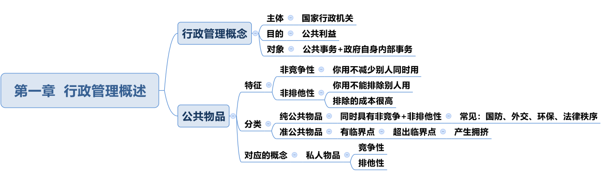
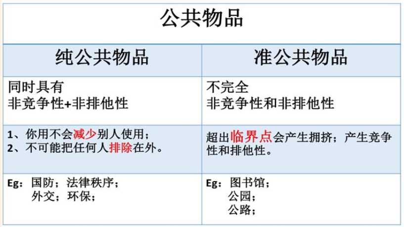

1. 公共物品：
   - （1）公共物品两大特征：非竞争性（受益上的不减少）和非排他性（不能排除）。
   - （2）公共物品分类：
     - ①纯公共物品：同时具有非竞争性和非排他性的物品。考试中记住：国防、法律、外交、环保。治安和法律是一个意思，都属于纯公共物品，考查概率不高，了解即可。
     - ②准公共物品：具有临界点的物品，当超出临界点，会产生拥挤，从而产生竞争性和排他性。生活中绝大部分物品都是准公共物品。比如生活中的自来水、教育、地铁、公交车、公厕都是准公共物品。

2. 私人物品：具有竞争性和排他性的物品。

## 二、人事管理
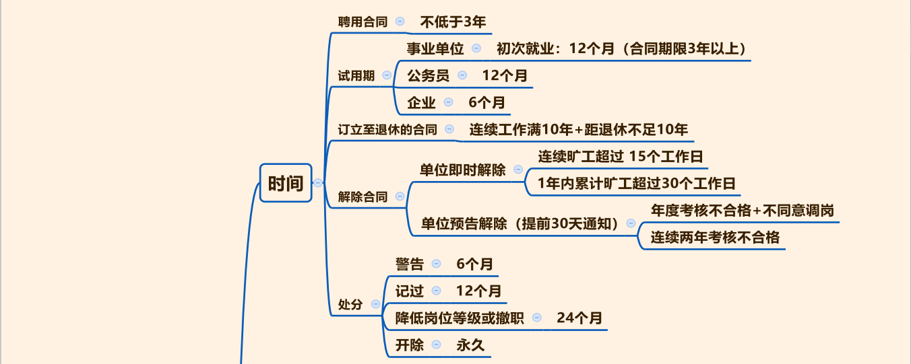
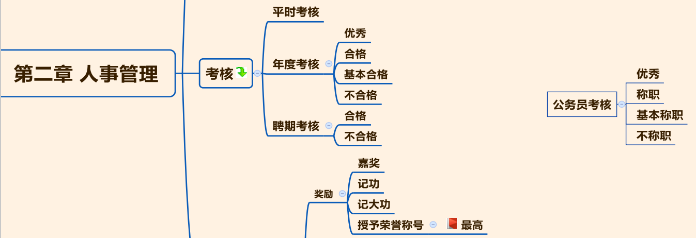

1. 聘用合同的期限：不低于 3 年（≥3）。

2. 试用期的问题：事业单位初次就业人员（合同期限 3 年以上） 的试用期 12 个月；公务员试用期 12 个月；企业试用期 6 个月。

3. “双十协定”：连续在单位工作满 10 年且距离退休不足 10 年，才能订立至退休的合同，单位必须签订。

4. 解除合同： 单位开除员工。
   - （1） 单位即时解除： 直接开除员工， 不用提前通知。情形：①连续旷工超过 15 个工作日。②1 年内累计旷工超过 30 个工作日。
   - （2） 单位预告解除：单位必须提前 30 天书面通知。情形：①年度考核不合格且不同意调岗（二者是“且”的关系）。②连续 2 年年度考核不合格。

5. 处分时间：警告 6 个月、记过 12 个月、降低岗位登记或撤职 24 个月，依次乘以 2 的关系。
6. 开除：永久。

7. 考核：平时考核、年度考核、聘期考核。 最常考是年度考核的结果（**优秀、合格、基本合格、不合格**）， 和公务员考核进行区分， 公务员的表述是把“合格”换成“称职”，其他都一样。

8.  奖励和处分：
    - （1）奖励分为 4 个：嘉奖、记功、记大功、授予荣誉称号， 其中授予荣誉称号是最高级别的奖励。
    - （2）处分分为 4 个： **警告、记过、降低岗位等级或撤职、开除**，要和党内处分的 5 种进行区分，党内处分是“撤销党内职务”。
    - （3）对处分决定不服的两个途径：
      - ①**复核**（找原机关）。
      - ②**申诉**（找事业单位人事综合管理部门：组织部、人社局）。

9. 如果事业单位工作人员与所在单位发生人事争议，依据《中华人民共和国劳动争议调解仲裁法》。

10. 企业员工与企业发生劳动争议的，依据《劳动合同法》。

11. 公务员依据《公务员法》。

## 三、行政组织

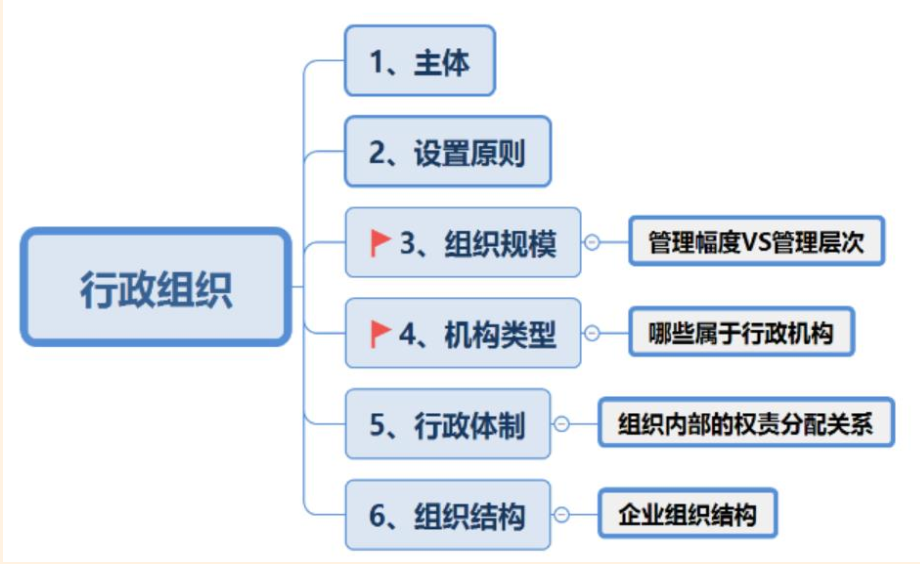

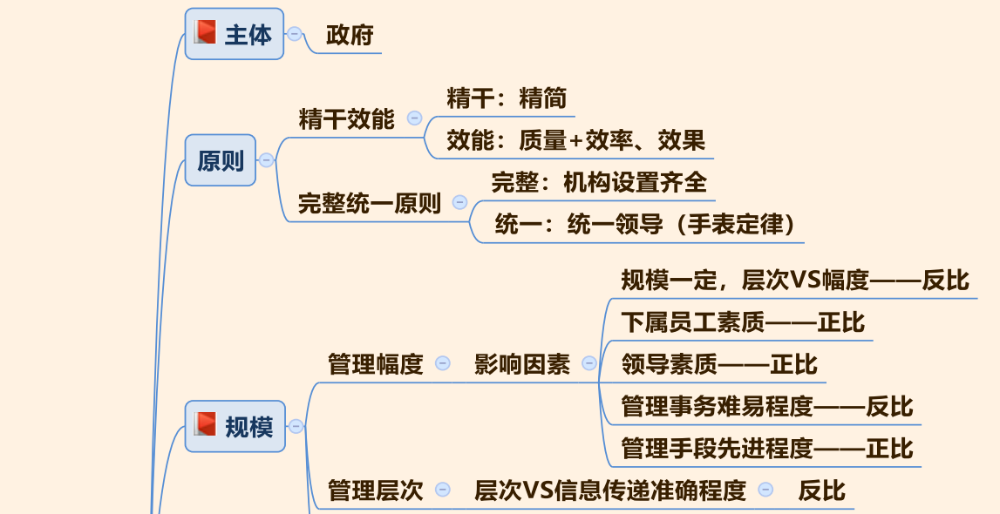
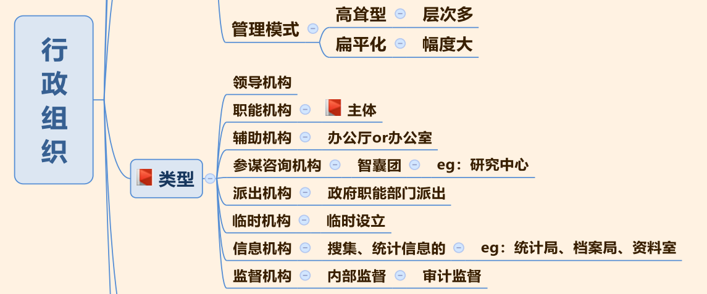
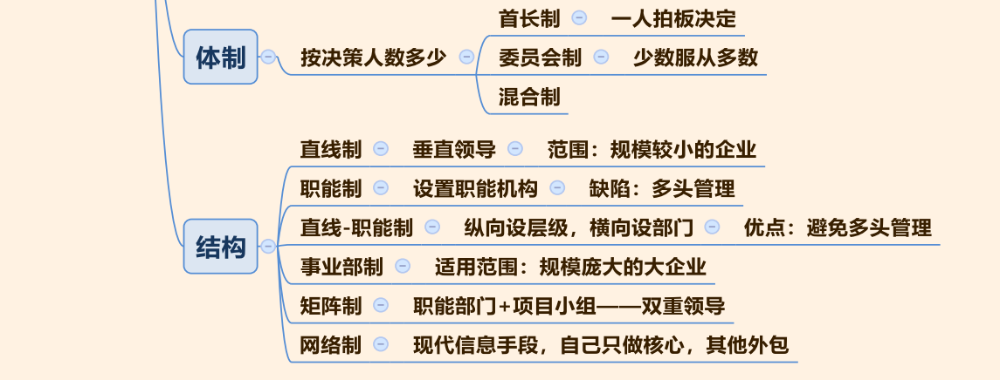

1. 管理幅度和管理层次的关系
   - （1）管理幅度：横向概念，一名主管人员可以直接指挥的下级人员数量。比如： 1 个科长领导 5 名科员， 5 名科员即管理幅度。
   - （2）1.管理层次：纵向概念，自上而下分几级，比如：我国政府自上而下分为国、省、市、县、乡 5 级，即 5 个管理层次。

2. 管理层次与管理幅度

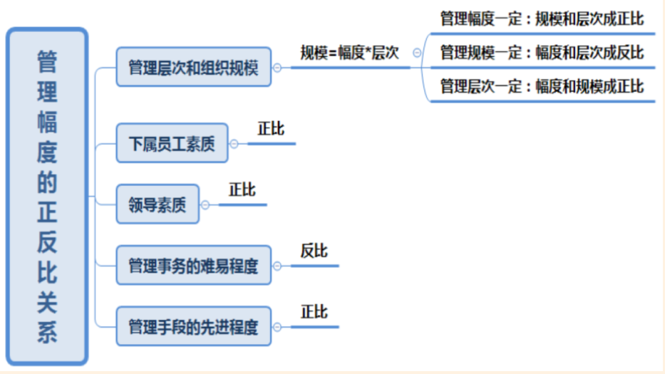
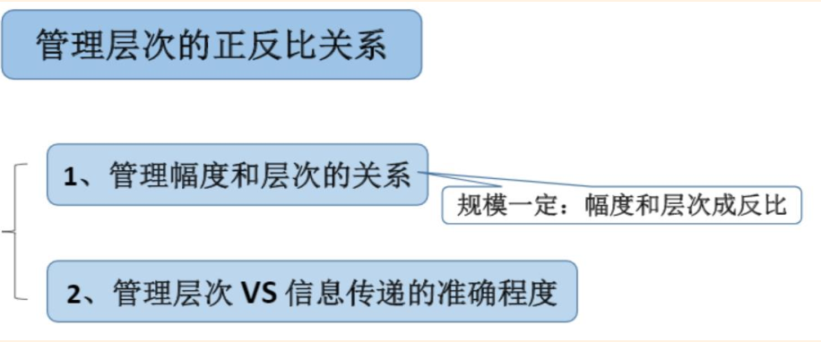

   - 管理幅度和管理层次的关系：组织规模=管理幅度×管理层次。假设一个单位中，每个领导横向可以管理 5 人，分 3 个层级，组织规模是 5× 3=15。

3. 管理幅度和管理层次的关系：两者必须同时兼顾，做到幅度适当，层次少而精。
4. 两种管理模式：
   - （1）高耸型管理（金字塔型）：以上而下层级很多，每一层的管理幅度比较窄。
     - ①一般国企和事业单位是高耸型的管理模式。比如：宝钢集团是典型的国企，曾有一次因为宝钢集团的钢板质量不好，大众汽车决定不用该公司钢板，这么重大的消息，在三个月后才传到宝钢的决策层。
     - ②缺点：效率低下。
   - （2）扁平化管理：
     - ①决策层和操作层之间互动频繁。比如：中国古代最典型的运用扁平化管理的是诸葛亮，一生事必躬亲、亲力亲为， 54 岁就死在军营中，虽然个人业绩彪悍，却没有为蜀国培养得力先锋，最后“蜀中无大将、廖化作先锋”，国家大业后继无人。
     - ②缺点：需要领导事必躬亲，缺乏职能部门。

5. 行政组织的类型

   - （1）（考试时会给出案例，问属于哪种行政组织类型，比如：教育局属于职能机构。
   
   - （2）领导机构：负责作决策、指挥的机构，中国政府中最高的领导机构为国务院。一般情况下，考国务院、省政府、市政府专门负责发号施令，是领导机构。
   
   - （3）职能机构：帮助领导工作的机构，**职能机构是主体，人数最多、机构最多、承担任务最重的是职能机构**。如国务院下设的各个部委、省政府下设各个厅、市政府下设各个局，都叫职能机构。
   
   - （4）辅助机构：辅助领导办公，只考办公厅、办公室。如果领导机构的级别较高，那么辅助机构叫办公厅，比如：国务院辅助机构为国务院办公厅；如果级别没有那么高，那么辅助机构叫办公室，比如：泰安市粮食局的辅助机构为办公室。
   
   - （5）参谋咨询机构：参谋在古代专门出主意，简言之是智囊团，比如：研究中心、顾问委员会。
   
   - （6）派出机构：
     - ①派出机关：政府直接派出，我国只有行政公署、区公所、街道办，行政公署、区公所现在几乎没有，一般考查街道办事处。
     - ②派出机构：政府职能部门派出，比如：公安局派出派出所、税务局派出税务所、工商局派出工商所。
     - ③临时机构：平时没有，出事情临时设立的机构，如救灾扶贫调查小组、事故调查小组、抗洪抢险应急办
   
   - （7）信息机构：主要负责搜集、统计、传递信息的机构，比如：统计局、档案局、资料室。
   
   - （8）监督机构：内部监督，只有一个机构，指审计监督，比如：审计署、审计局、审计厅。监察局并到监察委员会下，不是行政机关。

>【注意】派出所是派出机构，审计厅是监督机构，省政府是领导机构，公安局是职能机构，档案局是信息机构，如果考试中没有信息机构，也可以选职能机构。

6. 行政组织的体制
   - 根据行政组织最高决策权归属人数的多少，行政组织分为首长制、委员会制与混合制，掌握中国政府属于哪个即可。
     - ①首长制：决策权掌握在行政首长手中，其他人只能建议，但没有决策权。
     - ②委员会制：理解为少数服从多数，多个人组成委员会，按照少数服从多数的原则，票数高的当选。
     - ③混合制：世界上很少用。有时用首长负责制，有时用委员会制。
     - ④**中国政府：行政首长负责制**。比如：国务院实施总理负责制，国务院在讨论时，各个委员发言，最终决定方案的是李克强。一般政府的事情比较紧急，行政首长负责制能够保证政府命令能快速执行。

7. 行政组织的结构

   - 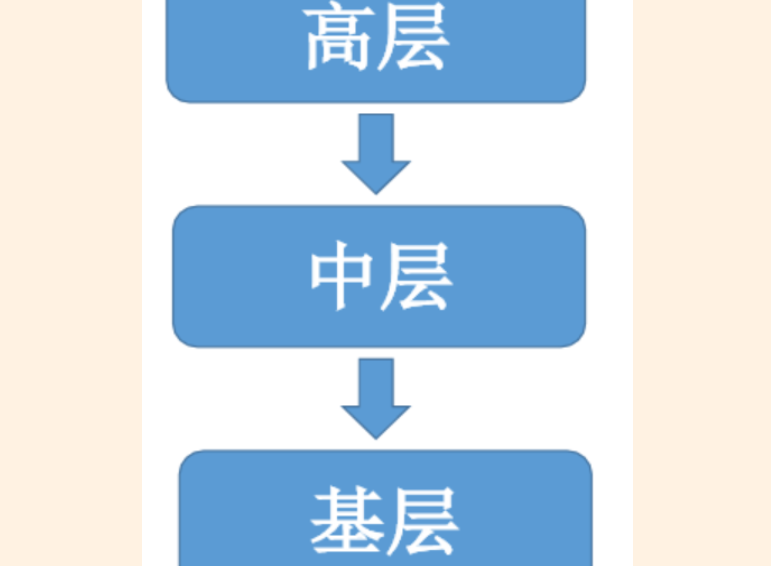
   - （1）直线制：最简单的组织形式，实施垂直管理，高层管理中层，中层管理基层，中层中的所有事情由高层自己决定，比如：生产、财务、广告、推广，要求高层是全才，适合小范围的企业。

   - 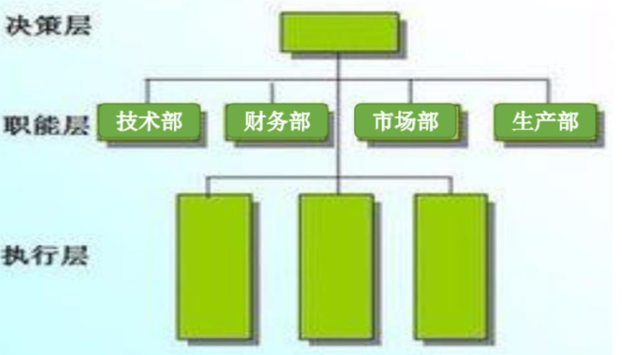
   - （2）职能制：设立职能部门，帮助领导分摊工作。比如：在决策层下，设立技术部、财务部、市场部、生产部。然而，对于执行层的王某而言，技术部、财务部、市场部、生产部都可以管理王某，假设 4 个部门同时下达不同的命令，王某会不知所措。缺陷（考点）：多头管理。
   
   - 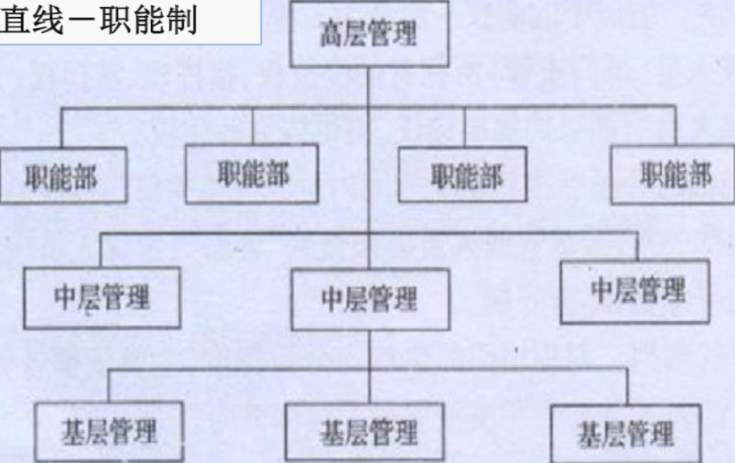
   - （3）直线-职能制：纵向有层级，有高级、中级、基层，横向设立财务部、生产部、销售部等职能部门，帮助领导分担压力，此时职能部门之间只能进行业务指导，对于中层的王某，其他部门职能进行业务指导，只有高层能够对王某下达命令。这是比较好的管理模式，考试可能考查“**直线-职能制的管理模式更为优秀/更有效率**”。
   
   - 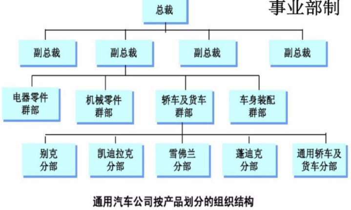
   - （4）事业部制：最早源于美国的通用汽车公司提出，一般应用于跨国公司。
     - ①适用范围（考点）：记忆关键词，适用于规模庞大、品种繁多、技术复杂的大型企业。
     - ②通用汽车公司组织结构图：在总裁下按照区域设立副总裁，比如：大中华区副总裁、亚太区副总裁、北美区副总裁；在亚太区之下，按照运营部门设置电器零件群部、轿车及货车群部、机械零件群部；在轿车下按照品牌分为别克、卡迪拉克、雪佛兰等。
     
   - 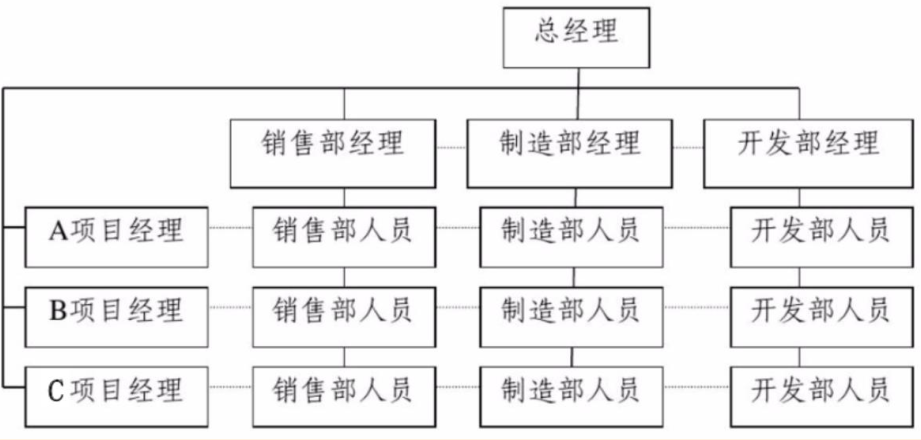
   - （5）矩阵型：既有职能部门，又有项目小组。
     - ①矩阵制组织结构图：一般用矩阵制研发新项目。比如：公司有 A、 B、 C 三个新项目研发，成立 A、 B、 C 三个项目部，原来有 3 个部门销售部、制造部、开发部，从原来的 3 个项目中抽人，如果从销售部、制造部、开发部各抽 2 人，如果王某在 A 项目小组，要听项目经理的，也要听直属上级销售部经理的，因为他是从销售部调来的，在矩阵制的管理模式下，每个人都要受双重领导，逐渐组成矩阵。
     - ②关键词：双重领导。用矩阵制研发新项目，新项目研发完成后，各个部门的人回到以前部门。
     
   - 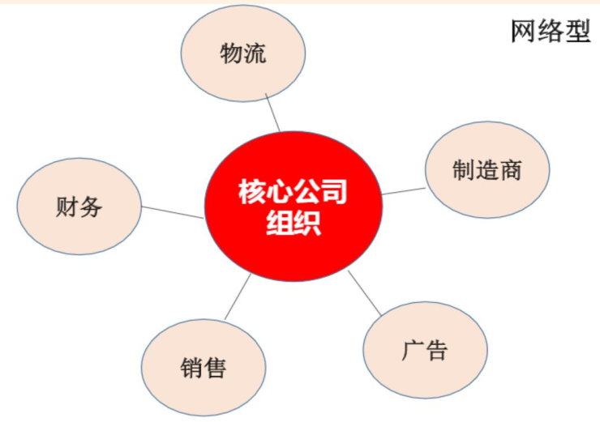
   - （6）网络型：利用现代高新信息手段组建的，比如： 4 个人都是学计算机的，开一个互联网公司，只做技术研发，把财务、广告、物流全部外包，像蜘蛛网一样向外蔓延的结构，叫网络型。
     - ①优点：管理成本小。
     - ②缺点：风险很高，外部依赖性大，一旦被其他公司欺骗，损失比较惨重。

   - （7）总结
     - ①直线制：最简单的管理模式，适合比较小的企业，自上而下垂直管理，要求领导是才。
     - ②职能制：设置职能部门，帮助领导分担压力，缺陷是多头管理。
     - ③直线-职能制：是比较优秀的管理模式。
     - ④事业部制：适用于庞大的跨国公司，比如：迪奥、香奈儿。
     - ⑤矩阵制：职能部门+项目小组，所有员工纵横受双重管辖。
     - ⑥网络制：自己只做核心，其他外包，像蜘蛛网一样

## 四、行政职能

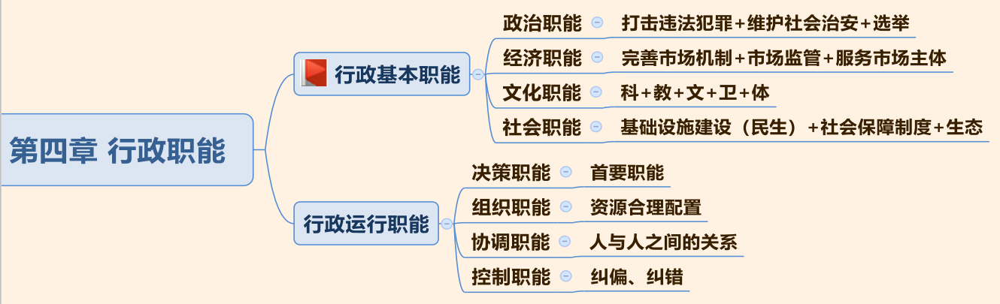

### 行政基本职能
#### （一）政治职能
1. 阶级专政职能：《宪法》中强调中国的国体是人民民主专政，是对广大人民进行民主，专政的对象是敌对势力和犯罪分子。

2. 军事保卫职能：捍卫领土主权，如中国军舰在钓鱼岛护航， 2017 年中国军队和印度军队在洞朗进行了对峙，只要涉及领土主权都是军事保卫职能。（常考）

3. 社会治安职能：常被误认为是社会职能，维护社会治安根本上是犯罪，只要是和社会有关的都是社会职能。（常考）

4. 民主政治职能：选举是最典型的民主政治职能。

5. 国际交往职能：国与国之间的外交，如中美外交、中印外交、中日外交。

#### （二）经济职能

1. 计划指导职能：十三五规划，是我国对五年一个周期的经济进行长远规划，属于计划指导职能。我国最早开始是一五计划、二五计划，从十一五开始为了避免计划经济过于明显的痕迹变为规划。

2. 培育和完善市场机制职能：经济学当中有所学习，如果市场中出现一家独大、垄断的局面，这个市场机制不能有效运行，如果所有的西瓜都是王某在卖，价格卖到 200 元/斤，价格机制和供求机制不能有效运转。因此政府要反垄断、反不正当竞争。

3. 宏观调控的职能：**经济职能有两个，一个是财政政策一个是货币政策，考试体现运用财政政策或货币政策调节经济都体现了经济职能**。市场上出现炒房的现象，政府为了打击炒房出台二套房购置税，通过税收的方式调节经济，这属于经济职能。

4. 经济职能中的服务职能的对象是市场主体，最典型的市场主体是企业，**我们在经济职能所涉及的服务都是对企业的服务**，如政府对企业提供优惠贷款。垄断价格的行为是经济行为，因此打击垄断是经济职能。

5. 检查监督职能：市场监管，政府对市场主体进行有效的监督和管理，规范市场秩序。如市场上出现假奶粉、苏丹红咸鸭蛋，政府要对其加强监管。

6. 第三、第五容易考查，第四要求学会区分服务的对象

#### （三） 文化职能
1. 文化职能只需要掌握 5 个字：科、教、文、卫、体。科学、教育、文化、体育、卫生都属于文化职能。

2. 政府为了更好的服务群众，修建免费的博物馆、图书馆、文化馆等体现文化职能。

#### （四） 社会职能
1. 社会服务：经济职能中也有服务职能，二者的区别是服务对象不同，经济职能的服务对象是对市场主体（企业）所进行的，是经济职能中的服务职能。在社会职能中的服务对象是广大老百姓，是对民生提供的服务，如修建地铁、公园等。

2. 社会保障：五重社会保障体系，最核心的社会保障是社会保险，其他还包括社会救济、社会福利、社会优抚、社会互助。五个中最核心、力度最大的是社会保险。

3. 环境保护：要保护生态环境，因此环境保护经常被称为生态职能。考试中如果出现生态职能，这种说法是正确的。

4. 人口控制：要进行优生优育，现在中国放开二孩政策，一个家庭只能生两个孩子，如果第一胎是双胞胎则不能生第二胎。中国现在仍在进行计划生育。

### 行政运行职能
#### （一）决策职能
- 政府运行的首要职能

#### （二）组织职能
- 强调要对资源进行合理分配，如单位要策划春游，在春游的过程中，要强调人财物的合理分配。

#### （三）协调职能
- 强调协调好人与人的关系、组织或组织的关系。在管理学中 1+1 不一定等于 2，如果协调好人与人的关系可以创造出大于 2 的价值。
- 三个和尚没水吃没有履行好协调职能，因为三个和尚之间没有进行合理分工。

#### （四）控制职能
- 强调纠偏和纠错，说明整个行政管理者要及时纠正运行过程中的偏差，确保目的的实现。

## 五、行政领导

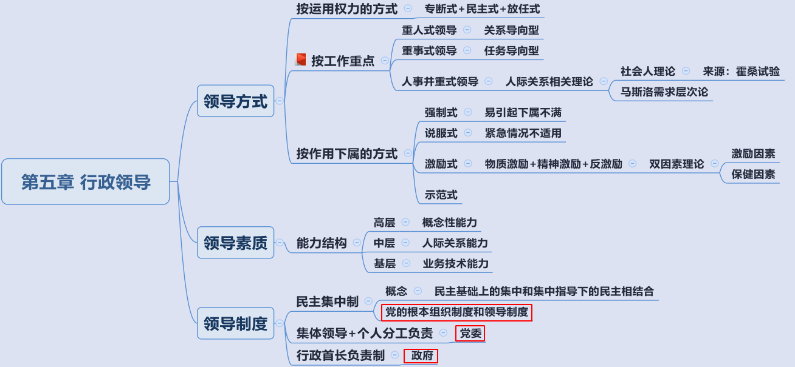

### 行政领导的概念
1. 行政领导是指在行政组织中经选举或任命而享有法定权威的领导者依法行使行政权力为实现一定的行政目标所进行的组织、管理、决策、指挥等活动。

2. 行政领导负责组织、管理、决策和指挥等活动，概念了解即可。

### 领导方式
#### （一） 按运用权利的方式分类
1. 口诀：民工放块转，分别是**民主、放任和专断式领导方式**。

2. 专断式指领导：做决定时个人独断专行，别人只能服从但不能反驳。

3. 民主式领导方式：下属和领导共同讨论做决定。

4. 放任式领导方式：比较松散的管理模式，领导很少运用权力，只看最终结果。

5. 权力集中于一个人手中属于集权，专断式领导方式属于集权。民主式和放任式属于分权

#### （二） 按工作重点分类
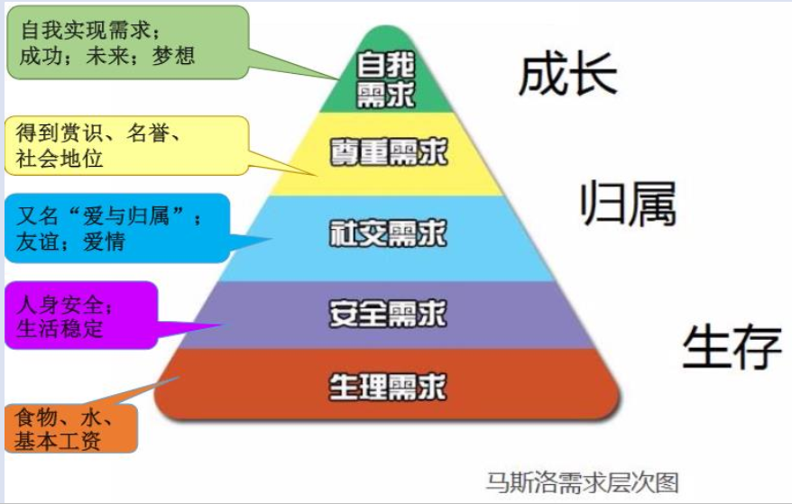

1. 按照领导工作重点不同分为重人式、重事式、人事并重式领导方式。

2. 重人式领导方式：以人为中心，在管理过程中，领导更看重和下属的良好的人际关系，是关系导向型领导关系。

3. 重事式领导方式：以事情为中心，是任务导向型领导，领导只关心工作结果、效率、质量等。

4. 重人式的领导方式通过人际关系来刺激员工热情，重事式领导方式领导以金钱刺激员工热情，因此重事式领导方式称为“胡萝卜+大棒”的方式

5. 人事并重领导方式：既要注重人际关系，也要注重工作效果。管理学中的人际理论分别是社会人理论和马斯洛需求层次论。
   - （1）经济中有亚当斯提出**经济人理论**，认为人都是经济人，人的所有行为以利益最大化作为根本目标，人都是自私自利的；*而社会人理论认为人更是社会人，人不光看钱，人际关系的好坏，员工的被认同感会影响工作效率*。通过**霍桑实验得出社会人理论**。考试中常考霍桑试验之所以命名霍桑，是因为做试验的工厂名字为霍桑，做试验的人是哈佛教授梅奥，比较著名的还有 照明试验(*当时关于生产效率的理论占统治地位的是劳动医学的观点，认为也许工人生产效率的是疲劳和单调感等，于是当时的实验假设便是“提高照明度有助于减少疲劳，使生产效率提高”。可是经过两年多实验发现，照明度的改变对生产效率无影响*。)。
   - （2）马斯洛需求层次论：人从高到低有五个层次需求，要学会辨别五个层次需求。
     - ①最低层次是生理需求，能够维持最低生理运转的需求。
     - ②安全需求是人身是否安全，生活是否稳定，《战狼 2》中非洲人民的安全得不到保证。
     - ③社交需求：有些题目表述为爱与归属，生活中遇到的各种亲情、友情、爱情等都属于社交需求。
     - ④尊重需求：名声、社会地位、名誉、领导的赞赏等。
     - ⑤自我的需求或自我实现的需求，理想和梦想以及目标都是自我实现的需求。

#### （三） 按作用下属的方式分类

1. 口诀：**鸡说我很强势**，激励式、说服式、强制式、示范式。

2. 强制式：领导通过发出命令约束员工的行为，如领导要求王某每天拖地 20 次。如果超出一定限度容易引起别人的反感。**最容易引起下属反感的是强制式**。

3. 说服式：通过劝告、商量、建议对下属进行双向沟通，是日常生活中最常用的方式。**如果发生紧急情况，不适用的方式是说服式**。

4. 激励式：领导通过夸奖等方式激励员工工作，分为物质激励、精神激励和反激励。物质激励是通过钱来进行，精神激励是表扬、夸奖等方式。**反激励**可以理解为激将法，是要人绝地反击，刺激人的好胜心。

5. 双因素理论：美国的赫茨伯格提出，激励因素和保健因素。**激励因素是能够给人们带来满足感的、能刺激工作热情的称为激励因素。保健因素只能消除不满情绪，但不能带来满意**。如甲是房地产公司销售人员，甲每月有 2000 元底薪，这就是保健因素；如果甲卖出房屋后得到 5000 元提成，这就是激励因素。又如工作安全属于保健因素，升职加薪等属于激励因素。

6. 示范式：领导会起到带头模范作用。

7. 最容易引起反感的是强制式，紧急情况不适用说服式，激励有三种方式物质激励、精神激励和反激励。激励有双因素理论为激励因素和保健因素。口诀：鸡说我很强势。

### 领导素质
1. 领导的能力结构：
   - （1）管理过程中可能有不同层次的领导，分为高层领导、中层领导和基层领导，对于不同的领导能力结构不同。
   - （2）**高层领导应该具有概念性能力，可以整体统筹概括、抽象看事物。中层领导要协调好上下级关系，强调更多的是人际关系的能力。基层/底层是要强调业务或技术能力**。

2. 年龄结构是指一个性质管理过程中出现老、中、青三代人，一个企业应该以中年人偏青年为主，管理学中有俗语“35 岁是个宝”。

3. 气质结构是心理学概念，简单了解即可，考查概率较低。
   - （1）按照人的不同性格可以分为不同的四种气质形式。
   - （2）胆汁质形容人比较直爽、勇敢、暴躁，如张飞、李逵。
   - （3）多血质比较敏捷好动，为人比较活泼机智，偶尔会有心浮气躁的表现，如《红楼梦》中的王熙凤。
   - （4）抑郁质比较多愁善感、孤僻，如《红楼梦》中的林黛玉。
   - （5）粘液质形容比较稳重踏实，如《西游记》中的沙和尚。

### 领导制度

1. 可以和法律结合考查。民主集中制是总纲的内容，剩下的对应不同的群体。

2. 民主集中制是我国党的根本组织制度和领导制度。
   - （1）民主的基础上进行集中，集中的指导下进行民主，中国最典型的民主集中制的人民代表大会制度。
   - （2）人大代表都是从老百姓中进行选举是民主；召开人大会时，人大代表代替老百姓做决策是集中。

3. 集体领导和个人分工负责制：在中国，党委的范畴内都是集体领导和个人分工负责制。
   - （1）在中国我国党内最有实权是七大常委（习近平、李克强、栗战书、汪洋、王沪宁、赵乐际、韩正），党内一旦有重大事项由七人投票决定，这就是集体领导。
   - （2）个人分工负责制如七个人可以集体领导外，还需要各管一摊，如习近平是中共中央总书记、中央军委主席，国家主席，赵乐际是中央纪委书记等。

4. 行政首长负责制：政府范畴是行政首长负责制，如国务院的总理。

## 六、行政监督

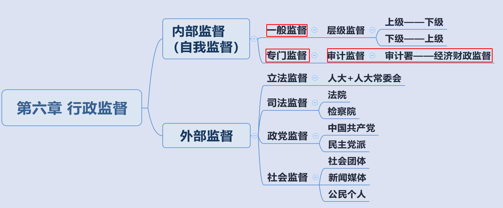

1. 行政监督：分为内部（自我）监督和外部监督。
   - （1）内部（自我）监督：政府监督政府、行政机关监督行政机关。
   - （2）外部监督：其他机关比如司法机关、权利机关对政府及其工作人员的监督。

2. 内部监督：
   - （1）一般监督：理解为层级监督。政府内部上级可以监督下级，下级可以监督上级，这种行政隶属关系的、自上而下或自下而上的监督即为一般监督。比如日常生活中省长监督市长、部长监督厅长、厅长监督局长即为一般监督。生活中下级不能很好的监督上级。比如：每年相关机关给下级机关发一份调查问卷，可以控告、检举上级，但是下级不会如实填写调查问卷，通常会写“我们领导最大的问题就是工作起来不知道休息，其他都挺好”，因此下级监督上级起不到实际作用。
   - （2）专门监督： 专门设立监督机关进行监督。现在我国专门监督只剩下审计监督，即审计署、审计局进行的监督。
     - ①审计监督：监督经济、财政状况。比如 2017 年我国审计署发现 20 多个省份有教育乱收费的情况，此属于审计局对经济、财政的监督。
     - ②注意：**监察机关独立于政府之外，属于外部监督**。行政机关（政府）、司法机关、监察机关是并列关系，不存在包含关系。行政内部监督指政府监督政府，而监察机关独立于行政机关之外。以前的确有行政监察属于内部监督的说法，但**现在宪法修改后，监察属于外部监督。在中国有一个特色，中国监察委员会与党的监督机关（纪委）合署办公，加强党对反腐的统一领导**。如果百度监察委员会官方网站，会发现监察委员会官方网站前边是党章，写有中共中央纪律检查委员会；后边是国徽，写有中华人民共和国国家监察委员会。宪法修改后，检察院的职权被大大抽离，**现在反贪案件归监察委，检察院已经没有反贪局**。

3. 外部监督：其他机关监督政府。
   - （1）立法监督：用立法机关进行监督。在我国，人大和人常是立法机关，人大与人常对政府的监督称为立法监督。
   - （2）司法监督：司法机关所进行的监督。我国的司法机关为法院和检察院，检察院与法院对政府的监督称为司法监督。
   - （3）政党监督：政党监督仅仅指中国共产党的监督（错误），原因：除了中国共产党以外，还包含多种党派对其监督。比如民主同盟、致公党、九三学社等民主党派的监督也称之为政党监督。我国有八大民主党派，称为参政党。
   - （4）社会监督：主要包括三方面。
     - ①社会团体的监督：共青团、妇联。
     - ②新闻媒体监督：人民日报、广播、影视、报刊、杂志、微博。
     - ③公民个人监督：百姓可以上访、写实名举报信。
   - （5）监察委员会的监督：监察委员会属于独立的外部监督体系。监察机关一般从时政角度考查。

## 七、行政决策

