## 一、科技
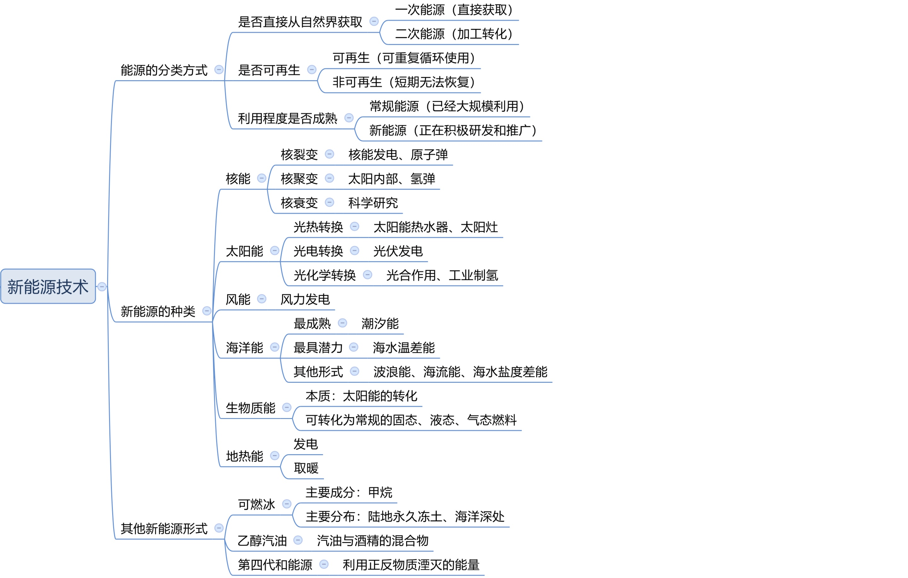
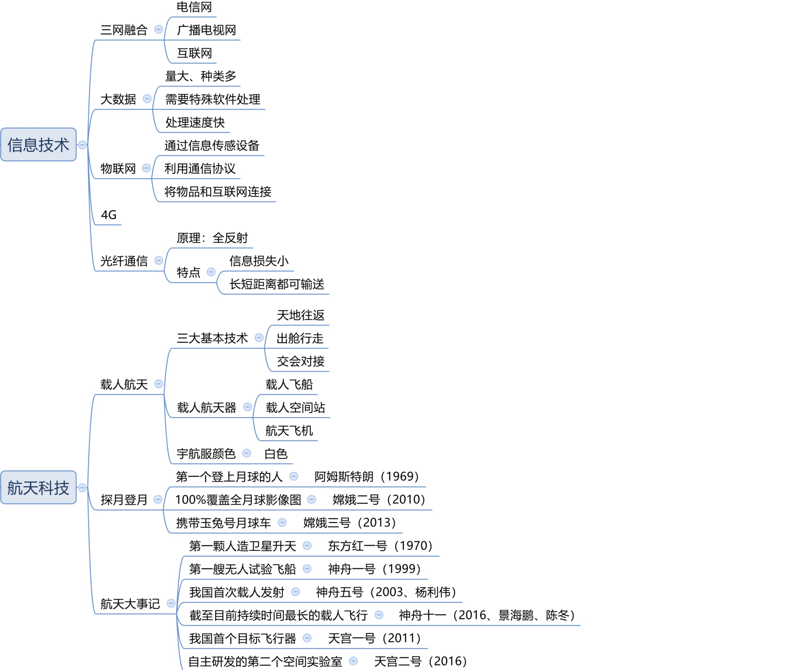
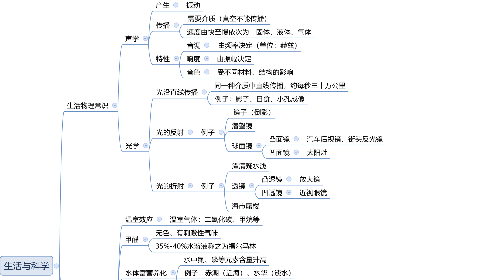
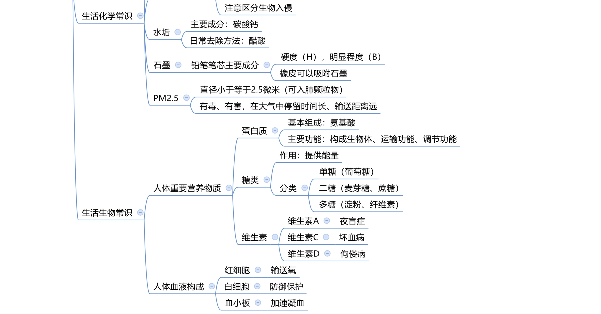

## X、历史
1. 莫逆之交：指非常要好，情投意合的朋友。
2. 竹马之交、总角：童年时代就要好的朋友。
3. 生死之交：共患难的好朋友。
4. 八拜之交：指异姓结拜的兄弟、姐妹。
5. 车笠之交——有钱人和穷人交朋友,虽然一个乘车,一个戴斗笠。
6. 布衣之交——古代平民老百姓只能穿粗麻布的衣服。
7. 刎颈之交——情谊深厚可以同生死共患难;
8. 金兰之交——结拜兄弟;
9. 君子之交——淡如水;
10. 八拜之交——拜把子。

11. 古代四大美女:沉鱼(西施,春秋时期越国美女,在河边浣纱,鱼儿看到她太漂亮游不动了,沉到水里)、落雁(王昭君,昭君出塞天上的大雁看到忘记扇翅膀掉了下来)、闭月(貂蝉,貂蝉拜月,貂蝉在后花园拜月,一阵风吹动了云遮住了月亮,之后人们说月亮比不过她的美躲了起来)、羞花(杨贵妃,杨贵妃摸到了花之后花缩了起来,宫女看到说杨玉环和花比美,花因为不如杨玉环美缩了起来,事实上杨玉环摸到的是含羞草)。
 
 1.  洋务派在中央的代表是恭亲王奕欣,地方上以左宗棠、李鸿章、张之洞、曾国藩为代表。

12. 古代父母称谓

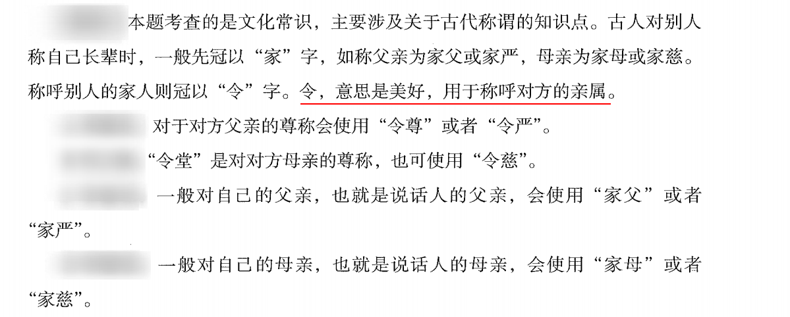

6. 三反运动

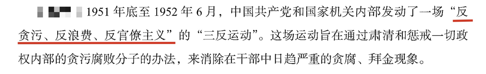

7. 古代时间

| 夜间时辰 | 五更  | 五鼓  | 五夜  |   现代时间    |
| :------: | :---: | :---: | :---: | :-----------: |
|   黄昏   | 一更  | 一鼓  | 甲夜  | 19:00 - 21:00 |
|   人定   | 二更  | 二鼓  | 乙夜  | 21:00 - 23:00 |
|   夜半   | 三更  | 三鼓  | 丙夜  | 23:00 - 01:00 |
|   鸡鸣   | 四更  | 四鼓  | 丁夜  | 01:00 - 03:00 |
|   平旦   | 五更  | 五鼓  | 戊夜  | 03:00 - 05:00 |

6. 通常把“生、旦、净、丑”作为行当的四种基本类型。旦 是女角色的统称。生 、净 两行是男角色。丑 行中除了有时兼扮丑旦和老旦外，大都是男角色。

7. 职业义务

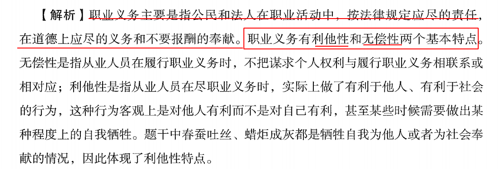

8. 几个年份 
- 1689-10 英国 《权利法案》
- 1776-7-4 美国 《独立宣言》
- 1862-9-22 美国 林肯 《解放黑人努力宣言》

9. 两会

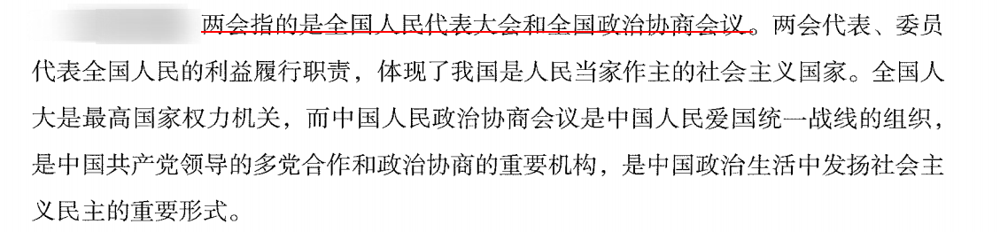

10. 我国古代最大的百科全书：《永乐大典》

## 地理

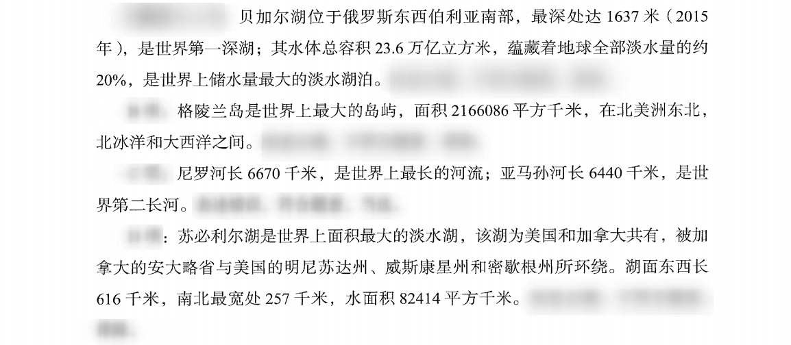

1. 《禹贡地域图》是西晋时期的地图学家裴秀所著,包括州郡县和重大活动发生地,还包括山脉、河流、湖泊等。《水经注》是北魏的郦道元所著,是一本综合性地理著作。《徐霞客游记》是明朝的徐霞客所著。《海国图志》是晚清的魏源所著,介绍西方的历史、地理等,帮助人们开阔眼界、认识世界,还提出“师夷长技以制夷”的思想,即利用外国的先进技术武装自己,抵制外国的侵略。

## 文化
1. 花中四君子：梅兰竹菊

2. 岁寒三友：松竹梅 (都是树)

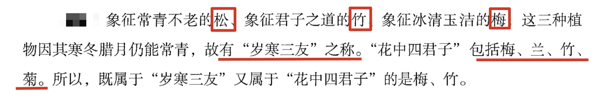

2. 二十四节气

> 一年二十四节气依次是:

> 立春(季节开始)、雨水、惊蛰(春雷一响惊醒蛰伏在泥土里的植物)、春分(太阳直射赤道)、清明、谷雨、

> 立夏(季节开始)、小满(种植农作物相关,夏收作物子粒饱满开始成熟)、芒种(麦芒作物种子已经成熟)、夏至(太阳直射北回归线)、小暑、大暑、

> 立秋(季节开始)、处暑、白露、秋分(太阳直射赤道)、寒露、霜降、

> 立冬(季节开始)、小雪、大雪、冬至(太阳直射南回归线,白天最短,之后白天变长)、小寒、大寒。

> 【注意】节气歌:春雨惊春 清谷天,夏满芒夏 暑相连,秋处露秋 寒霜降,冬雪雪冬 小大寒。

3. 书院：

> 江西九江的白鹿洞书院、湖南长沙的岳麓书院、河南商丘的应天书院、河南登封的嵩阳书院，合称为“中国四大书院”。应天嵩阳有双鹿(白鹿、岳麓)

> 江西九江的白鹿洞书院、江西吉安的白鹭洲书院、江西铅山的鹅湖书院、江西南昌的豫章书院，并称为“江西四大书院”。鹅鹿露在豫章上

4. 二十弱冠、三十而立、四十为惑。五十而知天命、六十花甲、七十古来稀、八十耄耋。

5. 古代年龄称谓小集

- 襁褓：不满周岁。
- 孩提：两至三岁。
- 始龀、髫年：女孩七岁。
- 始龀、龆年：男孩八岁。说明：根据生理状况，男孩八岁、女孩七岁换牙，脱去乳齿，长出恒牙，这时叫“龀”，“龆年”或“髫年”。
- 总角：幼年泛称。
- 垂髻之年：指儿童。（古代小孩头发下垂，引申以指未成年的人。）
- 黄口：十岁以下。
- 幼学：十岁。（《礼记•曲礼上》：“人生十年曰幼，学。”因为古代文字无标点，人们就截取“幼学”二字作为十岁代称。）
- 金钗之年：女孩十二岁。
- 豆蔻年华：女子十三岁。
- 志学：十五岁。（《论语》：子曰：“吾十有五而志于学……”）
- 及笄：女子十五岁。（《礼记•内则》：“女子十有五年而笄。”）
- 碧玉年华、破瓜之年：女子十六岁。（旧时文人拆“瓜”字为二八纪年，谓十六岁，多用于女子。）
- 弱冠：二十岁。（《礼记•曲礼上》：“二十曰弱冠。”）
- 桃李年华：女子二十岁。
- 花信年华：女子二十四岁。
- 而立：三十岁。
- 不惑：四十岁。
- 天命：五十岁。（《论语》：子曰：“吾十有五而志于学，三十而立，四十而不惑，五十而知天命，六十而耳顺，七十而从心所欲，不逾矩。“）
- 知非之年：五十岁。（《淮南子•原道训》：“伯玉年五十，而有四十九年非。”说春秋卫国有个伯玉，不断反省自己，到五十岁时知道了以前四十九年中的错误，后世因而用“知非”代称五十岁。）
- 耳顺、花甲之年：六十岁。（我国自古以来用天干地支互相错综相合纪年，可组成六十对干支，因而称作“六十干支”或“六十花甲子”，所以六十岁又称作“花甲之年”。）
- 古稀：七十岁。（杜甫《曲江二首》：“酒债寻常行处有，人生七十古来稀。”）
- 耄耋：八十、九十岁。（《礼记•曲礼》：“八十九十曰耄。”人们根据这解释，把耄耋两字连用代称八、九十岁。）
- 期颐：百岁之人。（《礼记•曲礼》：“百年曰期颐。”意思是人生以百年为期，所以称百岁为“期颐之年。”元人陈浩解释说：“人寿以百年为期，故曰期；饮食起居动人无不待于养，故曰颐。”）
- 男女统称：男称须眉、女称巾帼。
- 夫妻去世称：丧偶。
- 老师称：恩师、夫子。
- 学生称：门生、受业。

6. 先秦诸子百家：诸子百家之流传中最为广泛的是**法家、道家、墨家、儒家、阴阳家、名家、杂家、农家、小说家、纵横家、兵家、医家**

7. 联合国五大常任理事国：中美俄英法

8. 四书指《大学》《中庸》《论语》《孟子》；五经指《诗经》《书经》《礼记》《易经》《春秋》。--- 诗 书 礼 仪(易) 春
8. 江西的世界遗产名录

- 庐山国家公园                   入选时间：1996年
- 三清山                        入选时间：2008年
- “中国丹霞”项目龙虎山-龟峰        入选时间：2010年
- 铅山武夷山                    入选时间：2017年

## 生物

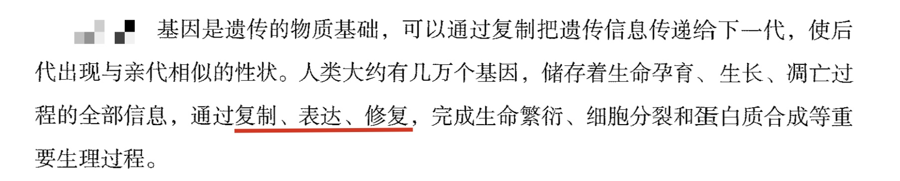

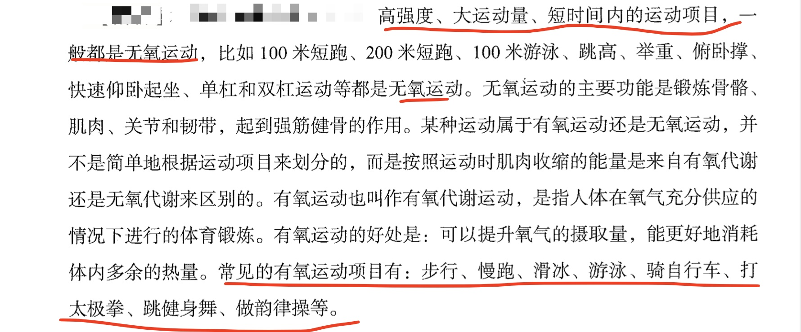
