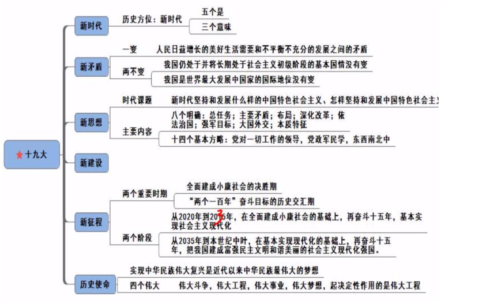
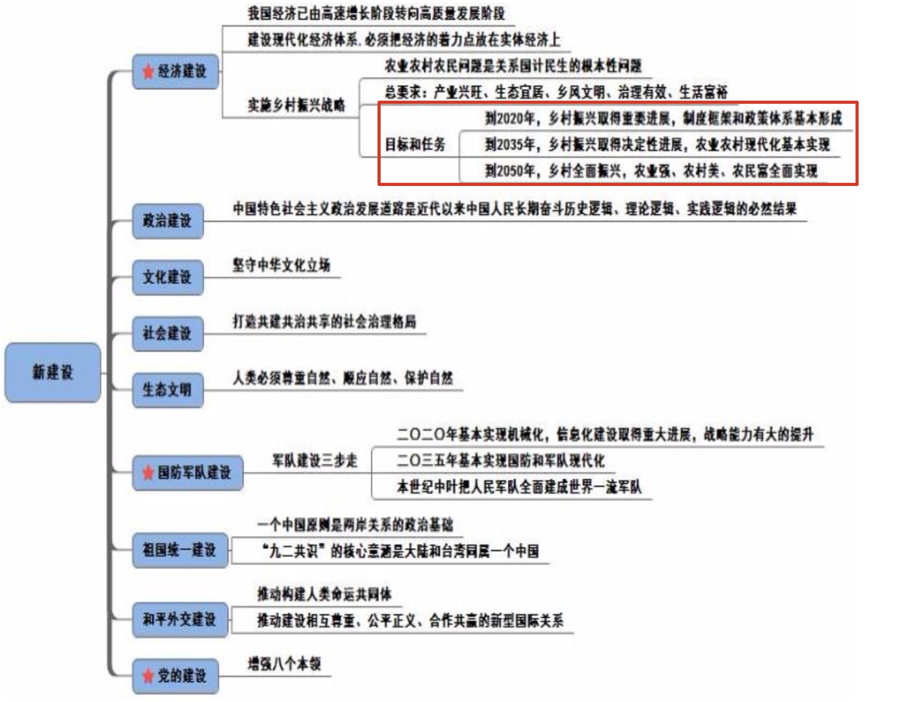
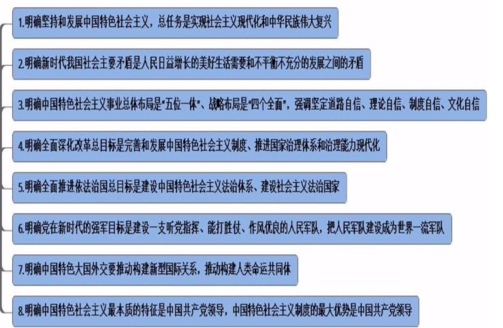
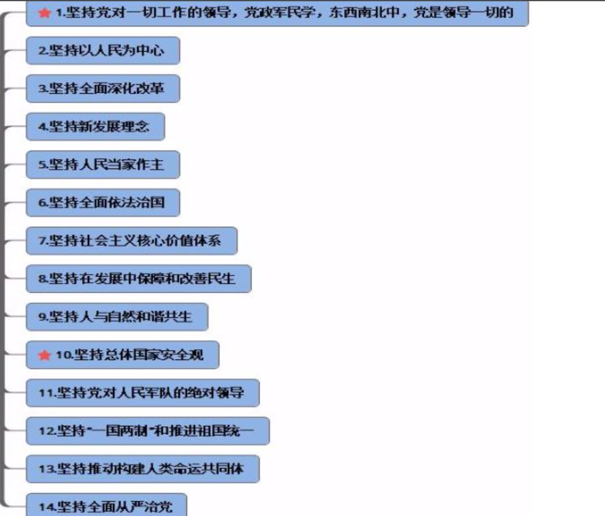
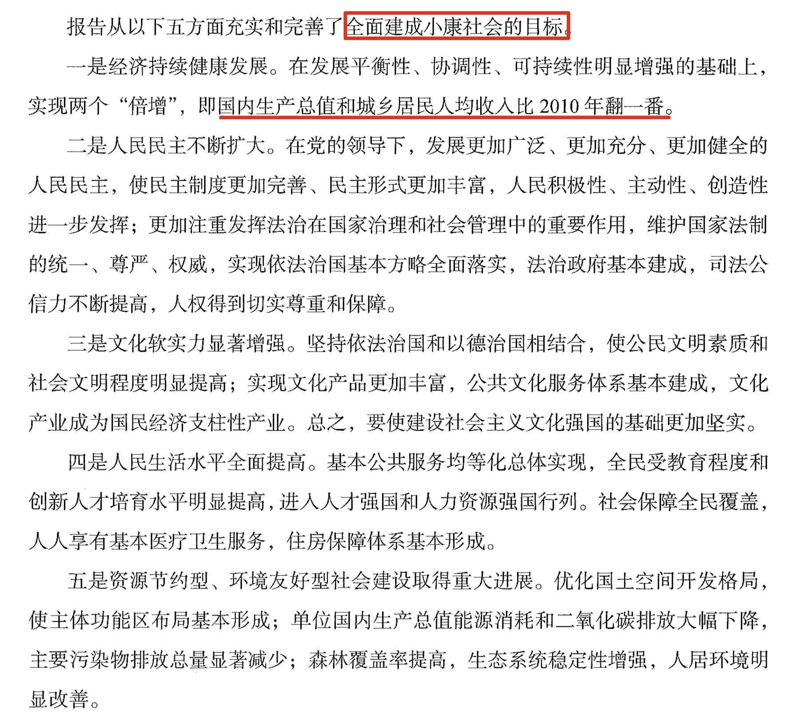

## 大会的主题
1. 大会的主题(常考): 
   - (1)不忘初心，牢记使命(常考)。干扰项:“不忘初心，方得始终”、“不忘初心，砥砺前行”。 
   - (2)高举中国特色社会主义伟大旗帜:我们当下的伟大旗帜是中国特色社会主义伟大旗帜。
   - (3)决胜全面建成小康社会:2020 年要全面建成小康社会。 
   - (4)夺取新时代中国特色社会主义伟大胜利:没有考点。 
   - (5)**中国梦:实现中华民族的伟大复兴。三个内涵是国家富强、民族振兴、人民幸福**。 

2. **党的初心和使命(单选题):为中国人民谋幸福，为中华民族谋复兴**。记忆方法:两谋。我党建立之初不是为了自己谋取蝇头小利。一大建党时只有 50 多名党员，现在已经发 展为 8900 多万人。中国共产党是全世界第一大党，人数最多。

## 一、过去五年的工作成就
### 经济建设取得重大成就
1.重要数据:
   - (1)在过去五年，国内生产总值从 54 万亿元增长到 80 万亿元。GDP 平均年增长 7.1%，党在政府工作报告中设定目标，即未来 10 年 GDP 年均增长为 6.5%。要稳中求进，不能冒进。 
   - (2)稳居世界第二，是世界第二大经济体。
   - (3)对世界经济增长贡献率超过 30%，位居世界首位。中国人的消费水平对世界经济拉动很大，比如:中国人去日本买马桶盖、奶粉，甚至中国大妈背着钱去别的地方买黄金。 (4)过去 5 年推出的改革 1500 多项。 

2. 在创新驱动中，科技创新最多、最厉害，十九大中习总书记点赞的科技成果如下: 
   - (1)天宫:空间实验室，用于航天员研究实验。现在已有天宫二号。 
   - (2)蛟龙:载人潜水器。 
   - (3)天眼(FAST):看外太空，是射电望远镜，已经发现多颗脉冲星。
   - (4)悟空:孙悟空的火眼金睛最厉害，悟空号是探测暗物质粒子的探测卫星。
   - (5)墨子号(常考):空间量子通讯卫星。通讯安全是大的研究方向，为了防止其他国 家监听我国，通讯安全要不断研发，墨子号应运而生。以“墨子”命名的原因是墨子最早提 出光线沿直线传播、小孔成像，墨子号利用的主要原理为此原理，体现我国文化自信。重点 掌握墨子号，因为它是世界上第一颗空间量子通讯卫星。
   - (6)大飞机:大型客机 C919。“C”是 China 的首字母，“9”代表长长久久，“19”代表最大载客量为 190 座。 2中国大飞机“三剑客”:C919、运-20(2013 年首飞成功)、水陆两栖 AG600。

### 全方位外交布局深入展开

1. 二十国集团领导人峰会:G20 日本大阪 2019 第十四次会议

2. 金砖国家在厦门会晤。金砖国家共五国(BRICS)，即巴西(B)、俄罗斯(R)、印度(I)、中国(C)、南非(S)，要精准记忆。现在已是 2018 年年底，考试对之前的知识点考查得很少，有可能考查 2018 年四大主 场外交。2018 年 11 月 5 日-11 月 10 日在上海召开中国国际进口博览会，需要重点掌握，结 合时政课程掌握主题、习总书记讲话等。

### 全面从严治党成效卓著

> 四个意识(十八界六中全会)都要和我党保持一致。口诀:正大心齐。
1. 政治意识:政治方向、政治道路和党保持一致。 
2. 大局意识:站在国家、党的大局。 
3. 核心意识:以党为核心。 
4. 看齐意识:和党看齐。 

## 二、两个重大判断
### 我国发展新的历史方位
1. 经过长期努力，中国社会主义进入新时代，这是我国发展新的历史方位。注意:历史方向、新时期都是错误表述，必须做到一字不差。 

2. 新时代(多选):“五个是”。虽然是新时代，但还是社会主义，底色不变，仍为中国特色社会主义。“新”体现在国家更加强大、人民更加富裕、离中国梦更近、为世界作出更 大贡献。记忆方法:底色不变的前提下，国强、民富、梦实现，为世界作出更大贡献

### 新时代我国社会主要矛盾
1. 一变:主要矛盾变化，我国社会主要矛盾已经转化为人民日益增长的美好生活需要和 不平衡不充分的发展之间的矛盾。

2. 两不变:
   - (1)基本国情没变，仍处于社会主义初级阶段。 
   - (2)国际地位没变，仍是世界上最大的发展中国家。因为我国人口多，GDP 再高，除以 13 多亿人口，人均就比较低。

## 三、新时代中国共产党的历史使命
### 党的历史使命

> 实现中华民族伟大复兴是近代以来中华民族最伟大的梦想。中国共产党一经成立，就把**实现共产主义**作为党的最高理想和最终目标，义无反顾肩负起实现中华民族伟大复兴的历史使命，团结带领人民进行了艰苦卓绝的斗争，谱写了气吞山河的壮丽史诗。

### 四个伟大
> 伟大斗争，伟大工程，伟大事业，伟大梦想，紧密联系、相互贯通、相互作用其中起决定性作用的是党的建设新的伟大工程。

1. 单选题:实现中华民族伟大复兴(中国梦)是近代以来中华民族最伟大的梦想。 
2. 四个伟大(多选题):中国梦决不是轻易就可以实现的，必须通过四个伟大来实现。 
   - (1)伟大斗争:在实现中国梦的过程中会遇到很多矛盾，需要进行伟大斗争。 
   - (2)**伟大工程:党的建设。党的建设是主心骨**。 
   - (3)伟大事业:建设中国特色社会主义伟大事业。
   - (4)伟大梦想:中国梦。
   - (5)口诀:宫斗是梦(宫斗是场噩梦)。 

3. 单选题:**在四个伟大中起决定作用的是伟大工程，党是实现中国梦的核心骨。没有党，则没有人领导我们进行斗争、没有人领导我们实现中华民族的伟大梦想**。

## 四、新时代中国特色社会主义思想和基本方略

### 重大时代课题
1. 主题(单选题):新时代坚持和发展什么样的中国特色社会主义、怎样坚持和发展中 国特色社会主义。邓小平理论的主题是“什么是社会主义、怎样建设社会主义”;“三个代表” 主题是“建设一个什么样的党，怎样建设党”;科学发展观主题是“实现什么样的发展，怎样发展”。

2. 对于坚持和发展什么样的中国特色社会主义(核心):习近平提出八个明确。 

3. 对于怎样坚持和发展中国特色社会主义:习近平提出十四个基本方略。

### 新时代中国特色社会主义思想的内容

> 不需要都记忆，以单选题的形式掌握即可。重点记忆第 1、6、8 条。 

- (1)明确坚持和发展中国特色社会主义，总任务是实现社会主义现代化和中华民族伟大复兴。总任务:至 2020 年要全面建成小康社会，要实现社会主义现代化，实现中国梦。 到 2020 年小康已经是确定的事，即将实现。实现社会主义现代化和中华民族伟大复兴为总 任务。

- (2)明确新时代我国社会主要矛盾是人民日益增长的美好生活需要和不平衡不充分的 发展之间的矛盾。

- (3)明确中国特色社会主义事业 **总体布局** 是“五位一体”、 **战略布局**是“四个全面 -- 小康改革，治国治党 -- (全面建成小康社会、全面深化改革、全面推进依法治国、全面从严治党)”， 强调坚定道路自信、理论自信、制度自信、文化自信。总体布局是“五位一体”，即政治、 经济、文化、社会、生态。战略布局是“四个全面”，现在还强调“四个自信”，即坚定道路自信、理论自信、制度自信、文化自信。注意:**其中文化自信更基础、更广泛、更深厚**。

- (4)明确全面深化改革总目标是完善和发展中国特色社会主义制度、推进国家治理体 系和治理能力现代化。改革不改向，仍要坚持和完善中国特色社会主义，通过完善国家治理 体系和治理能力的路径实现现代化。

- (5)明确全面推进依法治国总目标是建设中国特色社会主义法治体系、建设社会主义 法治国家。两个“法”，先有法制体系，才可以建设法治国家。

- (6)明确党在新时代的强军目标是建设一支听党指挥、能打胜仗、作风优良的人民军 队，把人民军队建设成为世界一流军队。强军目标:习近平于 2013 年提出，2018 年是提出 强军目标 5 周年。听党指挥是灵魂、能打胜仗是核心、作风优良是保证。口诀:挺(听党指 挥)能(能打胜仗)作(作风优良)。

- (7)明确中国特色大国外交要推动构建新型国际关系，推动构建人类命运共同体。不 作重点讲述。

- (8)明确中国特色社会主义最本质的特征是中国共产党领导，中国特色社会主义制度的最大优势是中国共产党领导。**最本质的特征、最大优势、根本保证必须是我党**。注意:中国共产党最大政治优势是人民群众，要密切联系人民群众。

### 十四个基本方略

1. 坚持党对一切工作的领导。党政军民学，东西南北中，党是领导一切的。题目出现我 党、人民群众，说法再绝对也不为过，强调“一切”。“党政军民学，东西南北中”，即各行 各业、各个地方的人都要听从我党，党领导一切。“党政军民学，东西南北中”由毛泽东同 志提出，他特别强调党领导一切，后来渐渐弱化，现在将习总书记称为“新毛派”，因为其 继承了毛主席的霸气，提出党领导一切，我党强势回归。

2. 坚持总体国家安全观:十九大表述为“总体安全观”，而非“全体安全观”。国家安全 狭隘理解为领土完整、其他国家没有侵犯我国，这实质是政治、国土安全;总体国家安全观 还包括文化不能入侵、经济上不能侵销商品、社会安全。比如:十九大召开期间，甲为了响 应十九大，扎了一个丸子头，乘坐地铁过安检时，被安检人员将丸子头捏成了马尾，为了保 证社会的安全。

## 五、决胜全面建成小康社会，开启全面建成社会主义现代化国家新征程

### 两个重要时期
1. **从现在到 2020 年，是全面建成小康社会决胜期**。注意:不是决定期、冲刺期。

2. 从十九大到二十大，是“两个一百年”奋斗目标的历史交汇期:“两个一百年”目标 交汇期为 2020 年。十九大召开时间是 2017 年 10 月 18 日，按惯例，二十大召开时间在 2022 年，2020 年正好是十九大和二十大的历史交汇期。

### 两个阶段

1. 第一个阶段，从 2020 年到 2035 年，在全面建成小康社会的基础上，再奋斗 15 年， **基本实现社会主义现代化**。

2. 第二个阶段，从 2035 年到本世纪中叶，在基本实现现代化的基础上，再奋斗 15 年， 把我国建成富强民主文明和谐美丽的社会主义现代化强国。

3. 注意:考试曾考查到什么时期实现富强民主文明和谐美丽的**社会主义现代化强国**。选 择 2035 到本世纪中叶(原文表述)，如果选项中没有本世纪中叶，可以选择 2035 年到 2050 年。

4. 带领人民创造美好生活，是我们党始终不渝的奋斗目标。

## 六、五位一体总布局
> 考点:经济建设;政治建设;社会建设;文化建设;生态文明建设

### 经济建设

1. 我国经济已经由高速增长转向为高质量发展。以前只追求速度快，现在追求高质量; 以前只追求增长，现在追求发展。发展是前进的、上升的运动，往好的方向发展。

2. 建设现代化经济体系:十九大召开之前是构建市场经济体系，十九大中最新表述为建 设现代化经济体系。现代化经济体系还是市场经济，只是比市场经济提供的服务质量更好、 更多样化，产品质量更好。

3. 现代化经济体系着力点放在实体经济而非虚拟经济。实体经济:实实在在生产出来的 可以看得见的商品。不是强调不能发展虚拟经济，而是实业兴邦，振兴实业。

4. 实施乡村振兴战略: 
   - (1)十九大首次提出实施乡村振兴战略，原因:“三农”问题是关系国计民生的根本问题。三农:农业、农村、农民。注意:没有农田。 
   - (2)五个要求(单选题):产业兴旺(经济)、生态宜居(生态)、乡风文明(文化)、治理有效(政治要民主，不是村长一人说了算)、生活富裕(社会和谐)，要理解记忆。我国 以经济建设为中心，因此产业兴旺是重点，经济基础决定上层建筑。中国古语有“仓廪实而 知礼节”，吃饱喝足才可以讲礼义廉耻，强调经济基础的重要性。
   - (3)区分农村土地三权分置与宅基地三权分置:
     - 1农村土地三权分置:农村百姓有承包的土地(种粮食)、宅基地(房子)。土地、宅基 地都要将所有权、承包权、经营权分置。安徽凤阳小岗村实行家庭联产承包责任制，所有权 归集体，当时是两权。随着城镇化的发展，很多农民不在农村种地，而是去城市打工，家里 的田地处于荒废状态，而没有打工的人想种地，地却很少。为了避免土地和人力的浪费，国 家实行三权分立。承包权归农户，经营权归经营者，农户可以大胆去打工，承包权永远归农 户，经营者可以大胆经营，国家保障经营权。
     - 2宅基地三权分置:所有权归集体，资格权归农户，使用权归使用者。

### 政治建设、社会建设、生态文明建设
1. 政治建设:基本目标是“民主”，发展社会主义民主政治。 

2. 文化建设:十九大新增坚守中华文化立场。这体现了文化自信。 

3. 建设文化强国，把社会利益放在首位。注意:社会利益是首位，而不是经济利益。比如:范冰冰主演的《武媚娘》，刚上映时经济效应很好，很多男同志喜欢看“波涛汹涌”的场景，后被广电总局剪切为“大头娃娃”。

4. 社会建设:打造共建、共治、共享的社会治理格局。比如学习“朝阳群众”。 

5. 生态文明建设:不能征服自然、顺服自然，要尊重大自然，顺应大自然，保护大自然。

## 七、坚持走中国特色强军之路，全面推进国防和军队现代化
> 强军之路“三步走”:
- (1)第一步:到 2020 年基本实现机械化。
- (2)第二步:到 2035 年基本实现国防和军队现代化。与国家实现社会主义现代化建设步骤一致。 
- (3)第三步:到本世纪中叶把人民军队全面建成世界一流军队。

## 八、坚持“一国两制”，推进祖国统一、坚持和平发展道路，推动构建人类命运共同体
1. 一个中国原则是两岸关系的政治基础。体现一个中国原则的“九二共识”明确界定了两 岸关系的根本性质，是确保两岸关系和平发展的关键。

2. 祖国统一:两岸关系的政治基础是坚持“一个中国”原则。如果否认一个中国，其他 一切免谈。

3. 外交关系: (1)构建人类命运共同体。推动建设尊重、公平正义、合作共赢的新型国际关系。 (2)全球治理观:共商、共建、共享。

## 十、坚定不移全面从严治党，不断提高党的执政能力和领导水平
> 考点:增强八个本领 

> 领导十三亿多人的社会主义大国，既要政治过硬，也要本领高强，要增强学习本领、增强政治领导本领、增强改革创新本领、增强科学发展本领、增强依法执政本领、增强群众工 作本领、增强狠抓落实本领、增强驾驭风险本领。

## 十一、总结
1. 十九大核心可以归结为一个“新”字。步入新时代之后出现新的矛盾，为解决新矛盾 要提出新思想，新思想之下要有新的建设、新的实践，在新的建设下踏上新的征程。

2. 新时代:
   - (1)注意:新的历史方位。 
   - (2)五个是:时代底色不变(还要坚持中国特色社会主义理论体系)、国强、民富、梦实现、作出更大的贡献。 

3. 新矛盾:
   - (1)一变:主要矛盾变化，人民日益增长的美好生活需要和不平衡不充分的发展之间 的矛盾成为主要矛盾。
   - (2)两不变:
     - 1国情没变:仍处于社会主义初级阶段。 
     - 2和国际地位没变:仍是世界上最大的发展中国家。 

4. 新思想:习近平新时代中国特色社会主义思想。主题是“新时代要坚持和发展什么样的中国特色社会主义、怎样坚持和发展中国特色社会主义”。 
   - (1)对“新时代要坚持和发展什么样的中国特色社会主义”提出八个明确。核心点:
     - 1中国特色社会主义发展总任务:实现社会主义现代化、实现中华民族伟大复兴的中国梦。
     - 2强军目标:“挺能作”，听党指挥、能打胜仗、作风优良。 
     - 3中国特色社会主义最本质特征、最大优势、根本保证都是中国共产党。 
   - (2)对“怎样坚持和发展中国特色社会主义”提出十四个方略: 
     - 1党领导一切工作。
     - 2坚持总体国家安全观。

5. 新建设:五位一体。
   - (1)要建立现代化经济体系。着力点在实体经济。 
   - (2)实施乡村振兴战略:十九大首次提出。

6. 新征程:
   - (1)从 2020 年到 2035 年，基本实现社会主义现代化。
   - (2)从 2035 年到本世纪中叶，建成富强民主文明和谐美丽的社会主义现代化强国。 

7. 历史使命:我党近代以来最大的历史使命是实现中华民族的伟大复兴(中国梦)。中国梦不是轻易就可以实现，要进行“四个伟大”。四个伟大指伟大事业、伟大斗争、伟大工 程、伟大梦想。口诀“宫斗是梦”。其中伟大工程起决定性作用。

## 十二、十三五规划

> 中华人民共和国国民经济和社会发展第十三个五年规划纲要，简称“十三五”规划（2016－2020年）

1. 实现“十三五”时期发展目标，破解发展难题，厚植发展优势，必须牢固树立**创新、协调、绿色、开放、共享**的发展理念。创新是引领发展的第一动力。协调是持续健康发展的内在要求。绿色是永续发展的必要条件和人民对美好生活追求的重要体现。开放是国家繁荣发展的必由之路。共享是中国特色社会主义的本质要求。

2. 十三五规划建议提出，对在贫困地区开发水电、矿产资源占用集体土地的，试行给原住居民集体股权方式进行补偿，探索对贫困人口实行**资产收益扶持制度**。“资产收益扶持制度”属于中央层面首次提出的政策表述，主要针对的是自主创收能力受限制的贫困人口，可以用个人资产入股，再按一定比例分配收益，以增加贫困人口的财产性收入。

3. 制造业是国民经济的支柱和基础。制造业是国民经济的主体，是立国之本，强国之基。十三五规划建议明确提出，加快建设制造强国，实施《中国制造二○二五》。引导制造业朝着分工细化、协作紧密方向发展，促进信息技术向市场、设计、生产等环节渗透，推动生产方式向**柔性、智能、精细**转变。

4. 十三五规划建议提出，要推动经济建设和国防建设融合发展。坚持发展和安全兼顾、富国和强军统一，实施军民融合发展战略，形成全要素、多领域、高效益的军民深度融合发展格局。

5. 党的十八届五中全会指出，全面建成小康社会新的目标要求，包括我国现行标准下农村贫困人口实现脱贫，贫困县全部摘帽，解决区域性整体贫困。

6. 《中共中央关于制定国民经济和社会发展第十三个五年规划的建议》指出，要拓展基础设施建设空间。实施网络强国战略，加快构建高速、移动、安全、泛在的新一代信息基础设施。

7. 绿色金融，是指金融部门把环境保护作为一项基本政策，在投融资决策中要考虑潜在的环境影响，把与环境条件相关的潜在的回报、风险和成本都要融合进银行的日常业务中，在金融经营活动中注重对生态环境的保护以及环境污染的治理，通过对社会经济资源的引导，促进社会的可持续发展。十三五规划建议提出，要坚持绿色发展，着力改善生态环境。**其中要发展绿色金融，设立绿色发展基金**。

8.  藏粮于地，就是要坚守耕地红线，全面开展永久基本农田划定，确保耕地数量不减少。藏粮于技，就是走依靠科技进步、提高单产的内涵式发展道路。“藏粮于地、藏粮于技”实际上就是通过提高土地的生产效能以及农业技术来提高产量。十三五规划建议提出，要坚持最严格的耕地保护制度，坚守耕地红线，实施藏粮于地、藏粮于技战略，提高粮食产能，确保谷物基本自给、口粮绝对安全。

9. **土地承包经营权和宅基地使用权是法律赋予农户的用益物权，集体收益分配权是农民作为集体经济组织成员应当享有的合法财产权利**。不得以退出土地承包经营权、宅基地使用权、集体收益分配权作为农民进城落户的条件。十三五规划建议提出，要维护进城落户农民土地承包权、宅基地使用权、集体收益分配权，支持引导其依法自愿有偿转让上述权益。农村土地所有权为集体所有。

10. 十三五规划建议提出，要构建发展新体制。深化财税体制改革，建立健全有利于转变经济发展方式、形成全国统一市场、促进社会公平正义的现代财政制度。

11. 《中共中央关于制定国民经济和社会发展第十三个五年规划的建议》明确指出，深入实施创新驱动发展战略，**推动政府职能从研发管理向创新服务转变**。

12. 重点降低**制造业和小微企业**税收负担，因为有《中国制造 2025》的目标。
13. 2019 年政府工作报告指出:做好今年政府工作，要注重把握好以下关系：统筹好国内与国际的关系、平衡好稳增长与防风险的关系、处理好政府与市场的关系。 --- 国内与国外、增长与风险、政府与市场。
