## 一、宪法概述

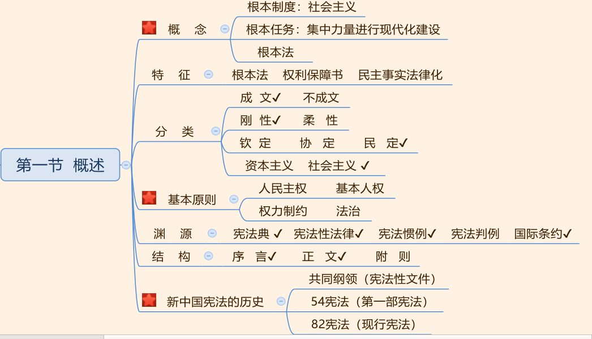

1. 概念（重点）：

   - （1）根本制度：社会主义。
   - （2）根本任务：集中力量进行社会主义现代化建设。
   - （3）地位：根本法。

2. 特征：了解即可。

3. 分类：**中国宪法属于成文、刚性、民定、社会主义类型的宪法。**

4. 基本原则（重点）：
   - （1）人民主权：主权在民，国家权力属于人民。
   - （2）基本人权：国家尊重和保障人权。
   - （3）权力制约：表现在监督。
   - （4）法治：依法治国。

5. 渊源：宪法判例**不是**我国宪法渊源。

6. 结构：序言和正文。

7. 新中国宪法的历史（重点）：

   - （1）第一部宪法性文件：共同纲领。
   - （2）第一部宪法： 54 宪法。
   - （3）现行宪法： 82 宪法。

---
## 二、我国的国家基本制度

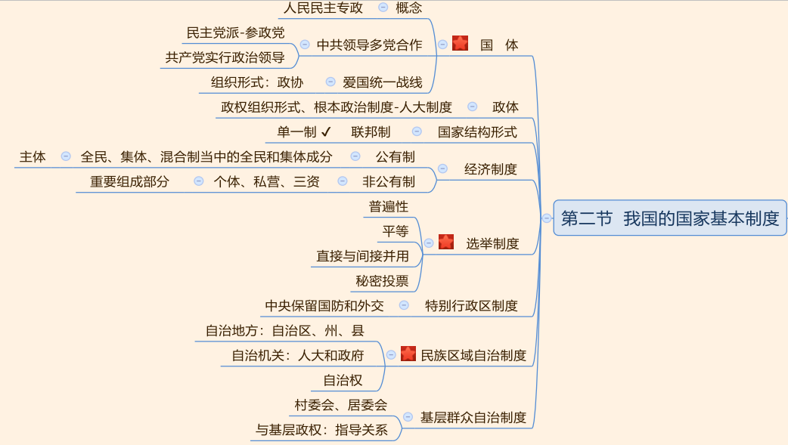

1. 国体：人民民主专政， 意味着对人民内部实行民主，对境内外敌对势力和犯罪分子实行专政。 两个特色：
   
   - （1）中共领导的多党合作制度： 其中民主党派是参政党，共产党对民主党派实行政治领导。
   - （2）爱国统一战线：组织形式是政协，是我国爱国统一战线的组织形式。

2. **政体：也称政权组织形式/根本政治制度，在我国是人大制度。**

3. 国家结构形式：我国实行单一制。

4. 经济制度：我国社会主义初级阶段，实行以公有制为主体，多种所有制经济共同发展的经济制度。
   - （1）公有制经济： 包括全民所有制、集体所有制、混合所有制中的全民和集体成分。公有制经济是主体， 其主体地位还表现在自然资源的归属上，如矿藏和水流专属于国家，城市土地专属于国家；城郊和农村的土地原则归集体，法律有例外规定的归国家。
   - （2）非公有制经济：包括个体经济、私营经济和三资企业（中外合资、中外合作和外商独资）。 非公有制经济是重要组成部分。

> 自然资源的归属：常考土地问题。

   - ①城市土地归国家（记忆方式：北上广的土地都非常值钱），城市郊区土地原则归集体，但法律有例外规定的归国家。
   - ②矿藏、水流、城市的土地属国家所有。口诀：城市土地上的矿泉水。
   - ③宅基地（在农村符合一定条件可分配土地用于建房子）和自留地、自留山（除普通耕地，再给予一部分土地生产农副产品），属于集体所有。口诀：宅滋滋，有房子就美滋滋。
   - ④森林、山岭、草原、荒地、滩涂等自然资源，既可以属于国家所有，也可以由法律规定属集体所有。

5. 选举制度的四项原则：
   - （1）普遍性原则：年满 18 周岁、 中国公民、 有政治权利，就享有选举权。
   - （2）平等原则：①形式平等：每个地方每个公民只有一个投票权。②实质平等：同票同权；保证各地、各民族、各方面要有适当数量的代表。
   - （3）直接与间接并用原则： 在我国， 县乡两级直接选，省市全国间接选。
   - （4）秘密投票原则：不需要写上自己的名字。

6. 特别行政区：实行高度自治，中央保留国防和外交权。

7. 民族区域自治制度：
   - （1）自治地方：**共有三级， 即自治区、自治州、自治县。 注意：民族乡不是自治地方。**
   - （2）自治机关：人大（立法自治） 和政府（行政自治）。
   - （3）自治权：制定自治条例和单行条例；经国务院批准可以建立自己的公安部队；享有变通执行权等。

8. 基层群众自治制度：
   - （1）基层群众性自治组织： 居委会和村委会，是自我服务和自我管理的组织。
   - （2） 与基层政权之间是指导关系。

---
## 三、公民的权利和义务
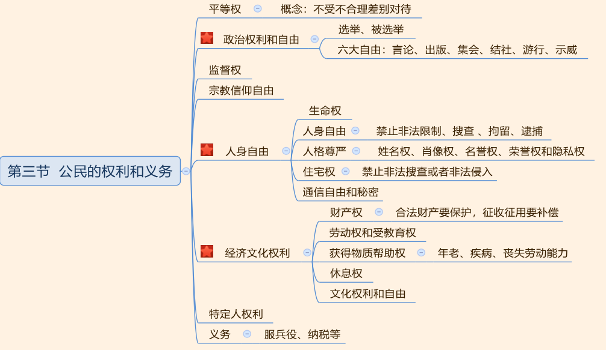
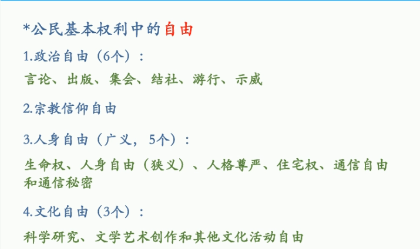

1. 平等权：不受任何不合理的差别对待。

2. 政治权利和自由：包括选举权和被选举权， 言论、出版、集会、结社、游行、示威的自由，其中言论自由居于首位。

3. 监督权和获得赔偿权： 监督权是指对一切行为可以提出批评、建议， 对违法失职行为可以提出控告、检举和申诉。

4. 宗教信仰自由：可以信也可以不信，可以信这个宗教也可以信那个宗教， 可以选择什么时候信、 信什么教派等。

5. 人身自由（重点）：
   - （1） 生命权。
   - （2） 人身自由： 禁止非法限制、搜查、拘留和逮捕。
   - （3） 人格尊严： 姓名权、 名誉权、 荣誉权和隐私权等。
   - （4） 住宅权： 禁止非法搜查或者非法侵入。
   - （5） 通信自由和秘密：有例外情况， 如为了追查刑事犯罪、 为了国家安全考虑。

6. 经济文化权利：
   - （1）财产权：公民的合法财产受保护，国家为了公共利益可以征收、征用并给予补偿。
   - （2）劳动权和受教育权：既是权利， 又是义务。
   - （3）获得物质帮助权：年老、疾病、丧失劳动能力。
   - （4）休息权：主体只有劳动者。
   - （5）文化权利和自由：如进行科学研究、欣赏电影、 进行文学艺术创作等。

7. 特定人权利：针对弱势群体和特殊群体， 如华侨、归侨和侨眷等。

8. 公民的基本义务： 如服兵役、依法纳税等。

---
## 四、我国的国家机构

### 全国人大


```
全人大职权：
监督修宪制基本
三席三高三提名
计划预算战与和
改撤人常省建置
```

- （1）地位：最高权力机关和最高立法机关。人大代表来自：地域制和职业制（军队）。
- （2）人大代表两项重要的权利：言论免责、人身受特别保护权。
- （3）职权口诀：监督修宪制基本、三席三高三提名、计划预算战与和、改撤人常省建置。

### 全国人大常委会
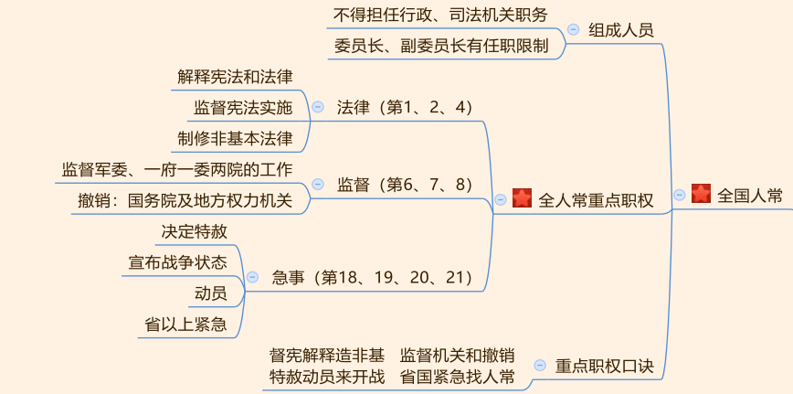

```
全人常职权：
督宪解释造非基
监督机关和撤销
特赦动员来开战
省国紧急找人常
```

- （1）组成人员不得担任行政、监察委、法院和检察院的职务，因为要防止自我监督。其中委员长、副委员长有任职限制，连续任职不得超过 10 年。
- （2）重点职权（口诀）：
  - ①督宪解释造非基， “督宪”指监督宪法；“解释”指解释宪法和法律；“造非基”指制定和修改基本法律以外的其他法律。
  - ②监督机关和撤销，“监督机关”指监督一府一委两院的工作；“撤销”指撤销国务院和地方权力机关不适当的决定。
  - ③特赦动员来开战，省国紧急找人常：特赦、动员、决定战争状态的宣布、省和全国紧急状态找全人常。

### 国务院

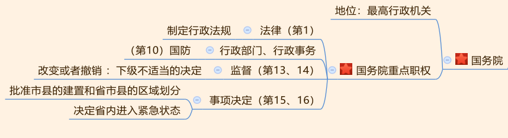

- （1）地位：是最高行政机关。
- （2）职权：可以制定行政法规；领导和管理政府部门的工作，比如民政、公安、教育等；改变或者撤销下级不适当的决定；批准市县的建置和省市县的区域划分；决定省内进入紧急状态。

### 国家元首、中央军委、监察委员会、人民法院、人民检察院

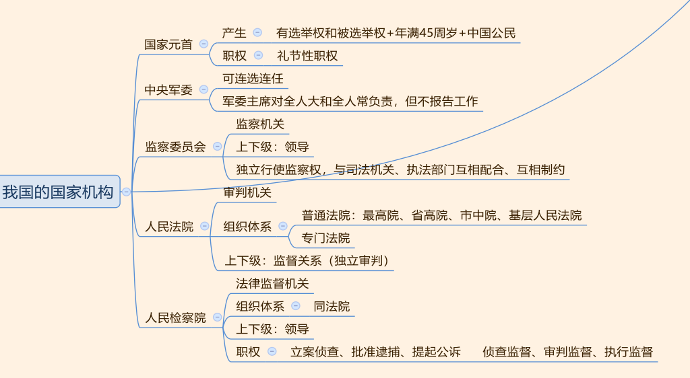

1. 国家元首：国家主席，产生有三个条件，行使礼节性职权。

2. 中央军委主席：对全国人大和人常负责，但是不汇报工作。

3. 监察委员会： 2018 年《宪法修正案》新增加的国家机关，是监察机关。 上下级之间是领导关系， 独立行使监察权。与司法机关、执法部门互相配合、互相制约。

4. 人民法院是审判机关，检察院是法律监督机关。 四级组织体系，法院上下级是监督关系。检察院上下级是领导关系。检察院的职权： 24 个字。


### 总结

#### 领导和上下级
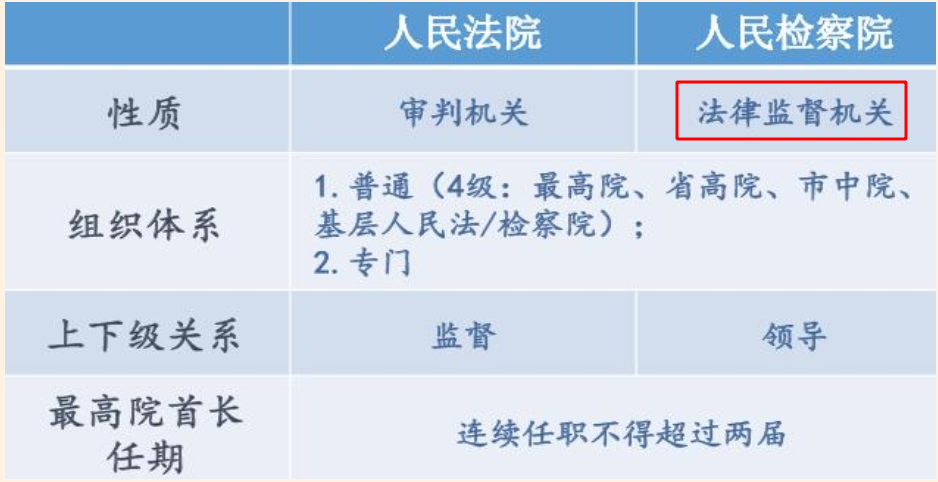

- （1）领导关系：上下级政府（比如国务院对山东省政府）、上下级监察委、上下级检察院。
- （2）指导关系：上下级政协、基层政权对基层自治组织（居委会、村委会）。
- （3）监督关系：上下级人大、上下级法院。

#### 任期问题：
1. 连续任职不得超过两届（ 8 个）：
   - （1）全国人常：正副委员长。
   - （2）国务院：正副总理、国务委员。
   - （3）三高：国家监察委员会主任，最高院院长、最高检检察长。

2. 易错点：人常和国务院都有正副职的限制，但是“三高”只限制“一把手”（监察委员会主任，最高院院长、最高检检察长）。比如某人一路高歌升到最高院的副院长，但是一直在副院长位置上不能继续上升，此时可以一直任职副院长，因为只限制“一把手”。

#### 关于建置和区域划分
1. 省级建置找人大，其他找国务院。
2. 乡的建置和区划找省政府。村经村民会议讨论，乡镇政府同意，报县政府批准。


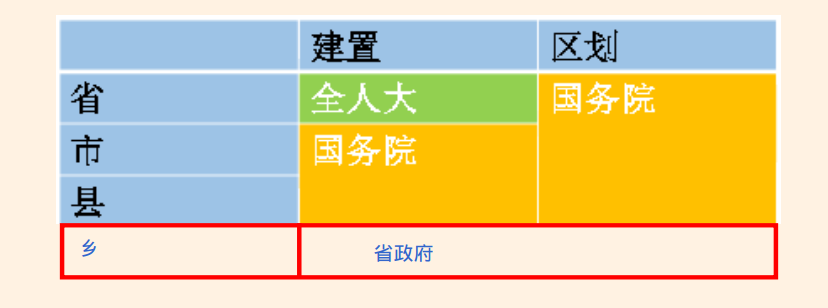

#### 紧急状态

紧急状态分两头， 省国紧急找人常， 省内紧急国务院。
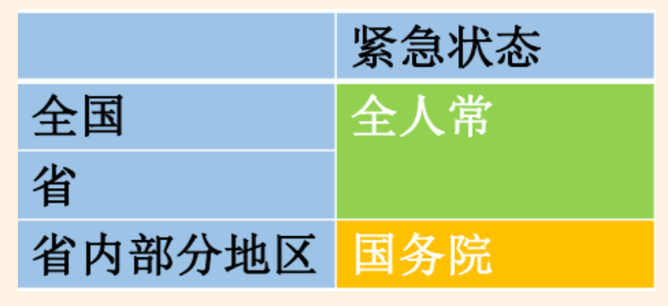

---
## 五、2018宪法修正

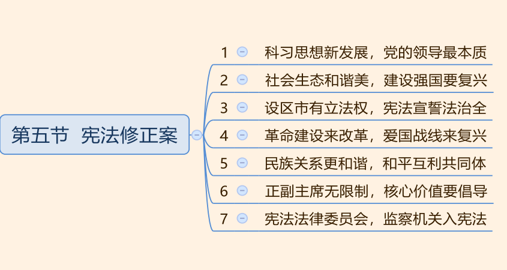

1. 宪法修正案内容非常多，但是非常简单，因为考试不会考查“为什么”，只会考查“是什么”，背过即可。做对题目关键在于精准记忆。

2. 科习思想新发展，党的领导最本质：
   - （1）“科”指科学发展观，“习”指习近平新时代中国特色社会主义思想，“新发展”指贯彻新发展理念。
   - （2）党的领导最本质：在宪法中新增“我党领导是中国特色社会主义最本质的特征”。

3. 社会生态和谐美， 建设强国要复兴：
   - （1）“社会生态”指五位一体中新增“社会建设和生态文明建设”，“和谐美”指建设和谐美丽的社会主义现代化强国。
   - （2）“建设强国”指建设社会主义现代化强国，“要复兴”指要实现中华民族的伟大复兴。

4. 设区市有立法权， 宪法宣誓法治全：
   - （1） 设区市有立法权： 设区的市有制定地方性法规的权力。
   - （2）“宪法宣誓”指国家工作人员在就职时要进行宪法宣誓，“法治全”指要健全社会主义法治。

5. 革命建设来改革， 爱国战线来复兴：
   - （1）“革命建设来改革”： 增加“改革”一词。
   - （2） 爱国战线来复兴： 在爱国战线中增加“致力于中华民族伟大复兴的爱国者”。

6. 民族关系更和谐， 和平互利共同体：
   - （1） 民族关系增加“和谐”的表述。
   - （2）“和平”指和平发展，“互利”指互利共赢开放，“共同体” 指构建人类命运共同体。

7. 正副主席无限制，核心价值要倡导：
   - （1）正副主席无限制：正副主席的任期取消“连续不能任期超过两届”的限制。
   - （2）核心价值要倡导：倡导社会主义核心价值观。

8. 宪法法律委员会，监察机关入宪法：
   - （1）宪法法律委员会：将法律委员会改为宪法和法律委员会。
   - （2）监察机关入宪法：监察机关的相关问题。

## 六、其他
1. 我国《宪法》的修改，必须由全国人民代表大会以`全体代表的三分之二以上`的多数通过。

2. 法律的修改，`全体代表的二分之一以上`的多数通过。

3. 如果`全国人民代表大会常务委员会`认为必要,或者有`五分之一以上的全国人民代表大会代表提议`,可以`临时召集全国人民代表大会会议`。

4. 历届三中全会时间一览
   - （1）十一届三中全会（1978年12月18日—22日）
   > 否定“两个凡是”，开展“真理问题大讨论”，重新确立“解放思想，实事求是”的思想路线，确立邓小平为核心的党领导集体，坚持“改革开放”和四项基本原则，把工作重心转移到经济建设上来。

   - （2）十二届三中全会（1984年10月20日）
   > 改革由农村走向城市，确立以公有制为基础的有计划的商品经济。

   - （3）十三届三中全会（1988年9月26日—30日）
   > 治理和整顿经济秩序。

   - （4）十四届三中全会（1993年11月11日—14日）
   > 提出建立社会主义市场经济体制。

   - （5）十五届三中全会（1998年10月12日—14日）
   > 提出建设中国特色社会主义新农村。

   - （6）十六届三中全会（2003年10月11日—14日）
   > 对完善社会主义市场经济体制提出了新的思路和举措。

   - （7）十七届三中全会（2008年10月9日—12日）

   > 通过了《关于推进农村改革发展若干重大问题的决定》，完善土地流转，激活农村金融。

   - （8）十八届三中全会（2013年11月9日—12日）
   > 提出完善和发展中国特色社会主义制度，推进国家治理体系和治理能力现代化。到2020年，在重要领域和关键环节改革上取得决定性成果。


1. 党的十八届四中全会提出依法治国的核心是依宪治国，这也是依法治国的首要问题/关键。

2. 党的十八届六中全会提出新形势下加强和规范党内政治生活，必须以**党章**为遵循。

3. 全面依法治国/法制建设的新十六字方针： 科学立法、公正司法、 严格执法、 全民守法。

4. 依法治国的常考点。
   - （1） 首次提出：党的十五大。
   - （2） 根本目的： 实现对人民的当家作主。

