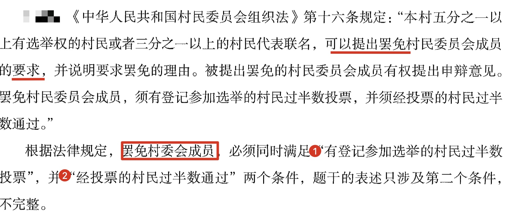
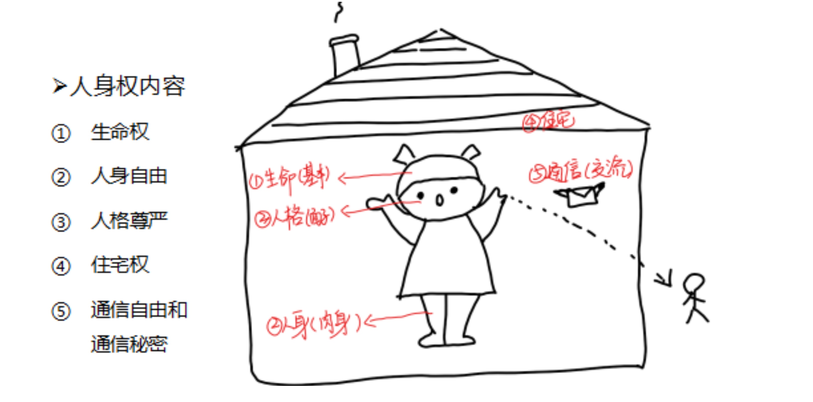
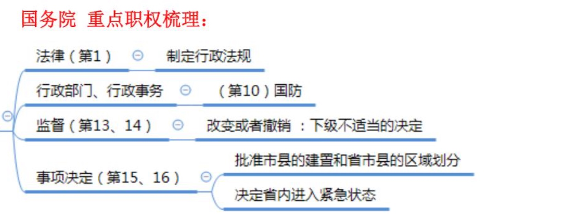
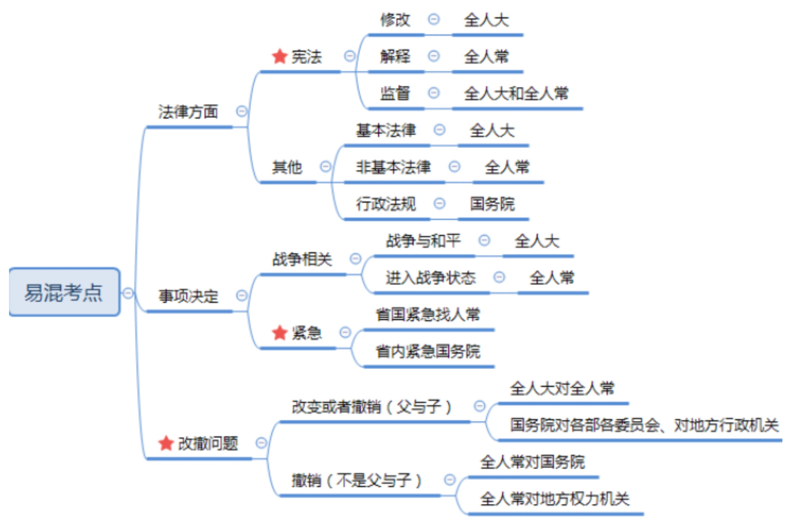
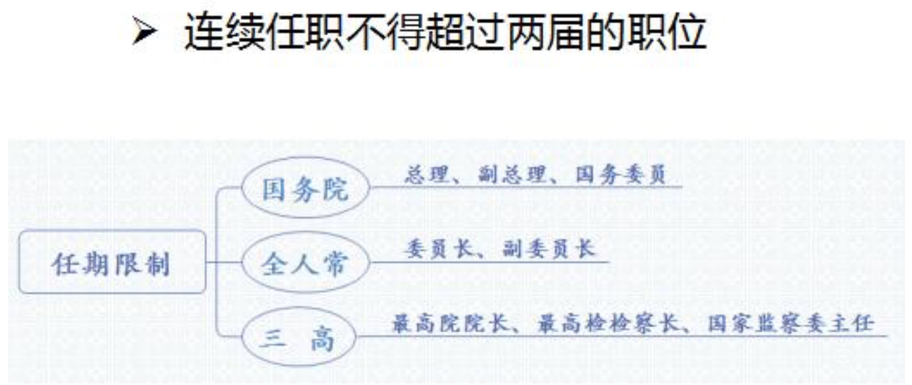
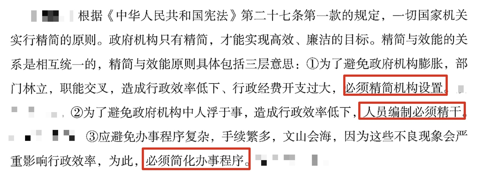
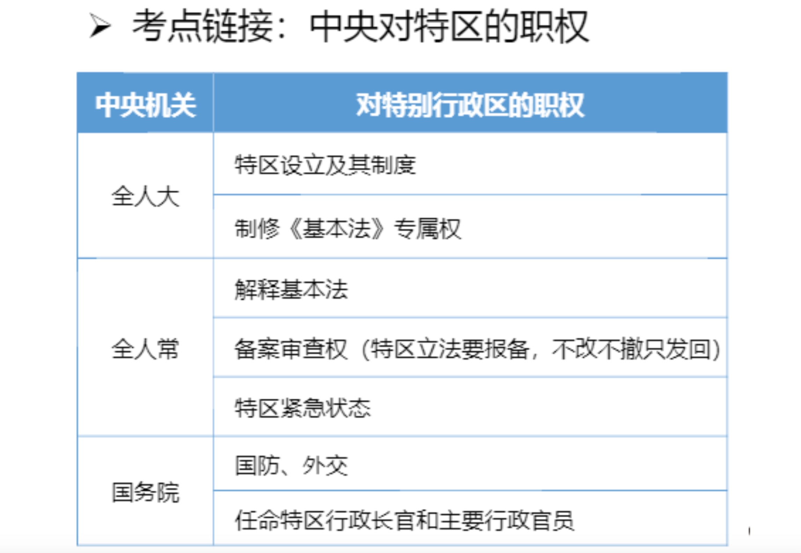

## 一、宪法概述


1. 概念（重点）：

   - （1）根本制度：社会主义。
   - （2）根本任务：集中力量进行社会主义现代化建设。
   - （3）地位：根本法。

2. 特征：宪法是我国的根本法，主要表现在三方面:
   
   - (1)内容根本:规定一个国家最重要最根本的内容。
   
   - (2)效力最高:体现在三个方面
     - 1立法依据:宪法是其他法律的立法依据，比如民法、刑法都是根据宪法制定出来的。
     - 2不得冲突:其他任何法律法规不能和宪法相冲突。
     - 3行为准则:宪法是一切公民、国家机关和社会团体的最高行为准则。
   
   - (3)制修严格:宪法的制定和修改程序比普通的法律更为最严格。题干“宪法的最高效力”对应效力最高的内容。A 项 正确:立法依据。B 项正确:行为准则。C、D 项错误:内容根本、制修严格不是效力最高的体现，而是和效力最高并列的关系。注意:如果问“宪法作为根本法体现在哪里”，则 ABCD 项都正确。

3. 宪法的传统分类方式为：

   - (1)从宪法是否具有统一法典的形式，把宪法分为成文宪法和不成文宪法；
   - (2)从效力和修改程序的不同，把宪法分为刚性宪法与柔性宪法；
   - (3)从制定宪法的机关不同，把宪法分为钦定宪法、协定宪法和民定宪法。

4. 分类：**中国宪法属于成文、刚性、民定、社会主义类型的宪法。**

5. 基本原则（重点）：
   - （1）人民主权：主权在民，国家权力属于人民。
   - （2）基本人权：国家尊重和保障人权。
   - （3）权力制约：表现在监督。
   - （4）法治：依法治国。

6. 法的渊源：
   - **宪法判例不是我国宪法渊源**。目前，最高人民法院和最高人民检察院的司法解释以及判例等不能视为我国法的渊源，但是，我们不得不承认，最高人民法院和最高人民检察院的司法解释实际上起到了法的渊源的作用。
   - 中国现时成文法的渊源包括：宪法、法律、行政法规、地方性法规、自治条例、行政规章、特别行政区法、国际条约。其中宪法、法律、行政法规在中国法的渊源体系中分别居于核心地位和尤为重要的地位。

7. 结构：序言和正文。

8. 新中国宪法的历史（重点）：

   - （1）第一部宪法性文件：共同纲领。
   - （2）第一部宪法： 54 宪法。
   - （3）现行宪法： 82 宪法。

9.  司法解释 是法定解释，一定要有法定效力，比如最高人民法院专门出台一个司法解释，以条文形式规 定如何应用。关键区别:是否有法律效力，有法律效力为司法解释，没有法律效力为学理解释(比如：教科书没有法律效力，写书是学术上的行为，不是基于司法职权作出的司法解释，而是基于自身的学识出的教科书，属于学理解释)。


---
## 二、我国的国家基本制度


1. 国体：人民民主专政， 意味着对人民内部实行民主，对境内外敌对势力和犯罪分子实行专政。 两个特色：
   
   - （1）中共领导的多党合作制度： 其中民主党派是参政党，共产党对民主党派实行政治领导。
   - （2）爱国统一战线：组织形式是政协，是我国爱国统一战线的组织形式。

2. **政体：也称政权组织形式/根本政治制度，在我国是人大制度。**

3. 国家结构形式：我国实行单一制。

4. 经济制度：我国社会主义初级阶段，实行以公有制为主体，多种所有制经济共同发展的经济制度。
   - （1）公有制经济： 包括全民所有制、集体所有制、混合所有制中的全民和集体成分。公有制经济是主体， 其主体地位还表现在自然资源的归属上，如矿藏和水流专属于国家，城市土地专属于国家；城郊和农村的土地原则归集体，法律有例外规定的归国家。
   - （2）非公有制经济：包括个体经济、私营经济和三资企业（中外合资、中外合作和外商独资）。 非公有制经济是重要组成部分。

> 自然资源的归属：常考土地问题。

   - ①城市土地归国家（记忆方式：北上广的土地都非常值钱），城市郊区土地原则归集体，但法律有例外规定的归国家。
   - ②矿藏、水流、城市的土地属国家所有。口诀：城市土地上的矿泉水。
   - ③宅基地（在农村符合一定条件可分配土地用于建房子）和自留地、自留山（除普通耕地，再给予一部分土地生产农副产品），属于集体所有。口诀：宅滋滋，有房子就美滋滋。
   - ④森林、山岭、草原、荒地、滩涂等**自然资源，既可以属于国家所有，也可以由法律规定属集体所有**。

5. 选举制度的四项原则：
   - （1）普遍性原则：年满 18 周岁、 中国公民、 有政治权利，就享有选举权。
   - （2）平等原则：①形式平等：每个地方每个公民只有一个投票权。②实质平等：同票同权；保证各地、各民族、各方面要有适当数量的代表。
   - （3）直接与间接并用原则： 在我国， 县乡两级直接选，省市全国间接选。
   - （4）秘密投票原则：不需要写上自己的名字。

```
涉及选举时委托的问题。如果今天办选举，但是甲外出打工不能投票，则甲可以委托他人代为投票，委托他人投票需要满足三个条件:

(1)必须经过选举委员会同意。

(2)需要通过书面的形式委托，选举是严肃的形式，用正式的形式才能显示出对选举的尊重。

(3)委托的对象是选民，即被委托的对象要有选举权。

题中打电话的形式不满足书面条件;同时 14 岁的儿子没有选举权，为无效投票。
```

6. 特别行政区：实行高度自治，中央保留国防和外交权。

7. 民族区域自治制度：必须是少数民族聚居在一起、集中的地方才能自治，而且是以区域基础实行的区域自治。考试干扰项:“聚居”换成“居住”，“区域自治”换成“民族自治”，更换后都错误。
   - （1）自治地方：**共有三级， 即自治区、自治州、自治县。 注意：民族乡不是自治地方。**
   - （2）自治机关：人大（立法自治） 和政府（行政自治）。
   - （3）自治权：制定自治条例和单行条例；经国务院批准可以建立自己的公安部队；享有变通执行权等。

8. 基层群众自治制度：
   - （1）基层群众性自治组织： 居委会和村委会，是自我服务和自我管理的组织。
   - （2）与基层政权之间是指导关系。

> 村委会的罢免



> 村委会任期
> **村委会、居委会每届任期 3 年**，其它一般都是每届任期 5 年，如总理、主席、人大代表。村委会是村民自我管理、教育、服务的基层群众自治组织，自治组织**不会让政府委派**。《村委会组织法》规定任何组织、个人都不能指定委派、撤换村委会委员。**村委会委员由村 民直接选举选出来**。人民愿意选一个人这个人就可以一直干，如某个大妈深得信任，**可以连选连任**，无任期限制。

> 村委会选举原则
> 村委会采用直接选举，原则:双过半，村委会选举中双过半需要满足**登记村民过半数到场**选举活动有效，**到场中有过半数同意**候选人当选。

> “登记参加选举的村民有 3000 人”为基础，半数为 1500 人，1600 人参加满足第一个半数。人数大于 800 人可以当选。 看的不是全体村民而是登记参加的，有些村民无选举权或者未登记。选举 结果选出来是谁就是谁，乡政府不能指定、替换干涉结果。

---
## 三、公民的权利和义务


1. 平等权：不受任何不合理的差别对待。

2. **政治权利和自由**：包括选举权和被选举权， 言论、出版、集会、结社、游行、示威的自由，其中言论自由居于首位。

3. 监督权和获得赔偿权： **监督权是指对一切行为可以提出批评、建议，对违法失职行为可以提出控告、检举和申诉**。

4. 宗教信仰自由：可以信也可以不信，可以信这个宗教也可以信那个宗教， 可以选择什么时候信、 信什么教派等。

5. 人身自由（重点）：

   
   - （1） 生命权。
   - （2） 人身自由： 禁止非法限制、搜查、拘留和逮捕。
   - （3） 人格尊严： 姓名权、 名誉权、 荣誉权和隐私权等。
   - （4） 住宅权： 禁止非法搜查或者非法侵入。
   - （5） 通信自由和秘密：有例外情况， 如为了追查刑事犯罪、 为了国家安全考虑。

6. 经济文化权利：
   - （1）财产权：公民的合法财产受保护，国家为了公共利益可以征收、征用并给予补偿。
   - （2）劳动权和受教育权：既是权利， 又是义务。
   - （3）获得物质帮助权：年老、疾病、丧失劳动能力。
   - （4）休息权：主体只有劳动者。
   - （5）文化权利和自由：如进行科学研究、欣赏电影、 进行文学艺术创作等。

7. 特定人权利：针对弱势群体和特殊群体， 如华侨、归侨和侨眷等。

8. 公民的基本义务： 如服兵役、依法纳税等。

---
## 四、我国的国家机构
### 国家机构的组织和活动原则

1. 民主集中制原则:
   - (1)列宁同志最早提出民主集中制原则，因为列宁同志是伟大的革命先驱，专业“闹 革命”。革命时期不能一味强调民主，例如:穿越到革命年代，晚上开会决定今晚准备革命， 民主讨论几点开枪，开会讨论完何时开枪问题，国民党反动派可能已开始逮捕行动，此时必 须要集中，“家有千口，主事一人”，确定时间，按点开枪列宁为革命最早确立民主集中制原则，提出革命不仅要民主还要集中。
   
   - (2)**民主集中制地位(常考):根本组织原则。我党、我国国家机关根本组织原则是民主集中制。例如:全国人民代表大会的根本组织原则仍是民主集中制。通常将国家机关拆开考，比如政府的根本组织原则等，都选择民主集中制**。

2. 社会主义法治原则:也称法治原则，指任何国家机关及工作人员要严格依法办事，不能让领导的个人意志凌驾于法律之上，也不能让政策凌驾于法律之上。例如:行政机关官司打输，原因是很多时候行政机关的行事依据不是来自于法律。而是某个领导的批示、会议纪 要等，全面依法治国之后，这类情况基本没有。

3. 责任制原则(重点):任何一个国家机关及其工作人员对自己的决定和后果要承担责任，在我国具体有两种负责制:
   - (1)集体负责制:集体讨论，少数服从多数，最终共同做出决定。
   - (2)个人负责制:又称首长负责制，即首长个人做决定，首长个人负责。
   - (3)考查方式:经常考查哪些机关实行集体负责制，哪些机关实行个人负责制。
     - ①集体负责制:各级人大和人常、人民法院和人民检察院实行集体负责制，记忆口诀: “法、检、人”。人大和人常是国家权力机关、立法机关，需做重大决策，正确性要比速度 重要，因此要集体负责，集中全体智慧使决策更全面、更准确;法院是审判机关，检察院是 法律监督机关，二者负责办理案件，正确性比速度重要，所做的决定要避免主观性和片面性， 因此要集体负责、集体决策。
     
     - ②个人负责制:国务院及其部委、地方政府和中央军委实行个人负责制，即**行政机关和军事机关实行个人负责制，记忆方法:“行、军”**。原因:国务院及其部委、地方政府是行政机关，行政事务特别多，要讲究效率;中央军委也是个人负责制，打起仗来时间就是生命，讲究果断、迅速。

4. 密切联系群众，为人民服务原则:在我国，国家一切权力属于人民，人民是国家的主人，国家机关及其工作人员是人民的公仆，要从群众中来到群众中去，全心全意为人民服务。

5. 精简和效率原则:比如证明“我二大爷是我二大爷”就违背了精简和效率原则。

6. 注意:现行宪法对监察委没有作出明确规定，但从司法考试角度看，2018 年国家司法考试官方教材中将监察委员会写在集体负责制模块。


### 全国人大


#### （一）地位、职权、组成、任期

1. 难点:各个机关的职权。全国人民代表大会的职权有 16 项，需要全部记忆。全人常和国务院的职权有 20 多项，不需全部记忆，重点记忆易混淆的选项、考点即可。 

2. 地位: **最高国家权力机关** 和 **最高国家立法机关**。 
   - (1)最高国家权力机关:国家一切权力属于人民，全国人民代表大会代表全国人民，是最高国家权力机关。
   - (2)最高国家立法机关:《宪法》由全人大制定。 

3. 组成:地域制和职业制共同组成。 
   - (1)地域制:由省、自治区、直辖市、特别行政区选出的代表组成。 
   - (2)职业制:军队选出的代表组成。

4. 任期:全国人民代表大会每届任期 5 年。可以连选连任，没有届数限制。例如:山西省申纪兰同志连续担任 13 届人大代表，每届 5 年，共担任人大代表 65 年，与人大共成长; 陶华碧(老干妈)、成龙也担任多届人大代表。

5. 会议:全国人民代表大会每年举行 1 次，由全国人民代表大会常务委员会召集。

#### （二）职权
1. 修改宪法。

2. 监督宪法的实施。

3. 制定和修改刑事、民事、国家机构的和其他的基本法律。 

4. 选举中华人民共和国主席、副主席。 

5. 根据中华人民共和国主席的提名，决定国务院总理的人选;根据国务院总理的提名，决定国务院副总理、国务委员、各部部长、各委员会主任、审计长、秘书长的人选。 

6. 选举中央军事委员会主席;根据中央军事委员会主席的提名，决定中央军事委员会其他组成人员的人选。

7. 选举国家监察委员会主任。

8. 选举最高人民法院院长。

9. 选举最高人民检察院检察长。 

10. 审查和批准国民经济和社会发展计划和计划执行情况的报告。 

11. 审查和批准国家的预算和预算执行情况的报告。 

12. 改变或者撤销全国人民代表大会常务委员会不适当的决定。

13. 批准省、自治区和直辖市的建置。

14. 决定特别行政区的设立及其制度。 

15. 决定战争与和平的问题。

16. 应当由最高国家权力机关行使的其他职权。

```
全人大职权：
监督修宪制基本
三席三高三提名
计划预算战与和
改撤人常省建置

1. 监督修宪制基本:监督宪法、修改宪法、制定基本法律。 

2. 三席三高三提名: 
(1)三席:国家主席、副主席、中央军委主席。
(2)三高:最高院院长、最高检检察长、最高监察机关国家监察委员会主任。
(3)三提名:根据主席的提名决定总理人选;根据总理的提名决定国务院其他人员; 根据中央军委主席的提名决定中央军委其他人员。

3. 计划预算战与和:“计划”指国家发展计划，“预算”指国家预算，“战与和”指战 争与和平的路线问题。

4. 改撤人常省建置:“改撤人常”指改变、撤销全人常不适当的决定;“省建置”指省、 自治区、直辖市以及特别行政区的设立制度问题。

```

#### （四）权力
1. 言论免责权:人大代表在人大各种会议上的发言和表决不受法律追究，如果一个人大代表每说一句话都会考虑是否会将他逮捕，会影响履行人大代表的职责。注意:强调必须在 人大会议上。

2. 人身受特别保护权:逮捕、审讯县级及以上人大代表，要经过许可，现行犯除外。例 如:甲是人大代表，此时正在召开人民代表大会，他发现自己旁边坐着情敌，想到自己此生 最爱的女孩被他抢走，于是殴打情敌，想要对方的命，此时甲的行为不需经过许可，可直接 采取强制措施。

3. 审议权:对政府工作报告可以审议，审议结束后，是否通过按表决器表决。 

4. 提出议案权、质询、罢免权: (1)提出议案权:比如全国人大代表可以提议是否要放开三胎的提案。 (2)提出质询权:比如对政府工作报告的某些内容不理解，可提出质询。 (3)提出罢免权:可以选举，也可以罢免。

5. 提出建议、批评和意见。 

6. 参加各项选举和表决:比如选举国家主席、副主席进行投票表决。 

7. 信息、物质等各项保障权:保障人大代表知情权，为人大代表提供信息资料、物质保障、补贴、物质便利等。 

8. 其他权利。

#### （五）总结
- （1）地位：最高权力机关和最高立法机关。人大代表来自：地域制和职业制（军队）。
- （2）人大代表两项重要的权利：言论免责、人身受特别保护权。
- （3）职权口诀：监督修宪制基本、三席三高三提名、计划预算战与和、改撤人常省建置。

### 全国人大常委会


#### （一）地位、职权、组成、任期
1. 性质:全国人民代表大会常务委员会是全国人民代表大会的常设机关，在全国人民代表大会闭会期间处理日常性、事务性的工作，与全国人民代表大会是领导与被领导的关系。 全国人常是“儿子”，全国人大是“父亲”。

2. 组成:全国人民代表大会常务委员会的组成人员**不得担任国家行政机关、监察机关、审判机关和检察机关的职务**。原因:防止自我监督(护犊子)，例如:甲在全国人民代表大 会常务委员会任职，负责监督国家行政机关、监察机关、审判机关、检察机关的工作，但他 身又是监察机关的人，这就导致自我监督(灯下黑)，不能既是运动员又是裁判员。注意: 监察机关是最新设立的机关。

> 全国人常组成人员限制为一府一委两院，即政府、监察委、检察院、法院。

3. 任期:委员长、副委员长连续任职不得超过两届，即 10 年。公基考试常考连续任职 不得超过两届的职位与可以连续任职的职位。

#### （二）职权
1. 解释宪法，监督宪法的实施。 

2. 制定和修改除应当由全国人民代表大会制定的法律以外的其他法律。 

3. 在全国人民代表大会闭会期间，对全国人民代表大会制定的法律进行部分补充和修改，但是不得同该法律的基本原则相抵触。 

4. 解释法律。

5. 在全国人民代表大会闭会期间，审查和批准国民经济和社会发展计划、国家预算在执 行过程中所必须作的部分调整方案。

6. 监督国务院、中央军事委员会、国家监察委员会、最高人民法院和最高人民检察院的 工作。

7. 撤销国务院制定的同宪法、法律相抵触的行政法规、决定和命令。

8. 撤销省、自治区、直辖市国家权力机关制定的同宪法、法律和行政法规相抵触的地方 性法规和决议。

9. 在全国人民代表大会闭会期间，根据国务院总理的提名，决定部长、委员会主任、审 计长、秘书长的人选。

10. 在全国人民代表大会闭会期间，根据中央军事委员会主席的提名，决定中央军事委 员会其他组成人员的人选。

11. 根据国家监察委员会主任的提请，任免国家监察委员会副主任、委员。

12. 根据最高人民法院院长的提请，任免最高人民法院副院长、审判员、审判委员会委 员和军事法院院长。

13. 根据最高人民检察院检察长的提请，任免最高人民检察院副检察长、检察员、检察 委员会委员和军事检察院检察长，并且批准省、自治区、直辖市的人民检察院检察长的任免。

14. 决定驻外全权代表的任免。 

15. 决定同外国缔结的条约和重要协定的批准和废除。 

16. 规定军人和外交人员的衔级制度和其他专门衔级制度。 

17. 规定和决定授予国家勋章和荣誉称号。

18. 决定特赦。

19. 在全国人民代表大会闭会期间，如果遇到国家遭受武装侵犯或者必须履行国际间共 同防止侵略的条约的情况，决定战争状态的宣布。

20. 决定全国总动员或者局部动员。 

21. 决定全国或者个别省、自治区、直辖市进入紧急状态。 

22. 全国人民代表大会授予的其他职权。

```
全人常职权：
督宪解释造非基
监督机关和撤销
特赦动员来开战
全权代表全人常
省国紧急找人常

1. 督宪解释造非基:“督宪”指监督宪法;“解释”指解释宪法和法律;“造非基”指制 定和修改基本法律以外的其他法律。

2. 监督机关和撤销:“监督机关”指监督一府一委两院的工作;“撤销”指撤销国务院和地方权力机关不适当的决定。

3. 特赦动员来开战，省国紧急找人常:特赦、动员、决定战争状态的宣布、省和全国紧急状态找全人常。


1. 法律(1、2、4):解释宪法和法律，监督宪法实施，制定和修改基本法律以外的其他 法律，全人大闭会期间部分补充和修改基本法律。

2. 监督(6、7、8):监督军委、一府一委两院的工作;全人常与国务院、全人常与地方 权力机关之间都是监督关系，不是“父与子”的关系，只能撤不能改。

3. 急事(18-21):都属于比较紧急的事儿，属于全人常的职权。
```

#### （三）总结

- （1）组成人员不得担任行政、监察委、法院和检察院的职务，因为要防止自我监督。其中委员长、副委员长有任职限制，连续任职不得超过 10 年。
- （2）重点职权（口诀）：
  - ①督宪解释造非基， “督宪”指监督宪法；“解释”指解释宪法和法律，法律解释与法律具有同等效力；“造非基”指制定和修改基本法律以外的其他法律。
  - ②监督机关和撤销，“监督机关”指监督一府一委两院的工作；“撤销”指撤销国务院和地方权力机关不适当的决定。
  - ③特赦动员来开战，省国紧急找人常：特赦、动员、决定战争状态的宣布、省和全国紧急状态找全人常。

### 国务院


#### （一）性质、地位、组成、任期
1. 性质和地位:中央人民政府，也是我国最高国家行政机关。实行首长/个人负责制， 即总理负责制。李克强总理拍板、负责。

2. 组成和任期:总理、副总理、国务委员连续任职不得超过两届。 

3. 工作:开会，具体是开全体会议和常务会议。 (1)全体会议:每两个月开一次，全体人员都要参加。 (2)常务会议:每周开一次，类似例会。参会人员有总理、副总理、国务委员、秘书长。记忆方法:开会“三大巨头”是总理、副总理、国务委员，秘书长负责端茶倒水。(3)注意:会议重点掌握时间及常务会议参加人员。

#### （二）职权
1. 根据宪法和法律，规定行政措施，制定行政法规，发布决定和命令。 

2. 向全国人民代表大会或者全国人民代表大会常务委员会提出议案。 

3. 规定各部和各委员会的任务和职责，统一领导各部和各委员会的工作，并且领导不属于各部和各委员会的全国性的行政工作。 

4. 统一领导全国地方各级国家行政机关的工作，规定中央和省、自治区、直辖市的国家行政机关的职权的具体划分。

5. 编制和执行国民经济和社会发展计划和国家预算。 

6. 领导和管理经济工作和城乡建设、生态文明建设。 

7. 领导和管理教育、科学、文化、卫生、体育和计划生育工作。 

8. 领导和管理民政、公安、司法行政等工作。 

9. 管理对外事务，同外国缔结条约和协定。

10. 领导和管理国防建设事业。 

11. 领导和管理民族事务，保障少数民族的平等权利和民族自治地方的自治权利。 

12. 保护华侨的正当的权利和利益，保护归侨和侨眷的合法的权利和利益。 

13. 改变或者撤销各部、各委员会发布的不适当的命令、指示和规章。 

14. 改变或者撤销地方各级国家行政机关的不适当的决定和命令。 

15. 批准省、自治区、直辖市的区域划分，批准自治州、县、自治县、市的建置和区域划分。 

16. 依照法律规定决定省、自治区、直辖市的范围内部分地区进入紧急状态。 

17. 审定行政机构的编制，依照法律规定任免、培训、考核和奖惩行政人员。 

18. 全国人民代表大会和全国人民代表大会常务委员会授予的其他职权。


```
1. 法律(第1):国务院制定行政法规。 

2.行政部门、行政事务(第10):国防属于行政事务。记忆方法:法国。 

3.监督(第13、14):改变或者撤销。只要属于领导关系都是可改可撤。 

4.事项决定(第15、16):根据口诀来记忆。

- 第 15 条(难点):关于建置和区域划分。
(1)建置:现在有广东省、广西壮族自治区，如果向国家提出设置广南省，要不要设置广南省属于建置问题。

(2)区域划分:比如广南省设立好，则从东到西，从南到北有多大面积，如何划分， 称作区域划分。

(3)建置与区域划分: 
   1改撤人常省建制，省级建置问题是全国人民代表大会的职权，市、县的建置找国务院。 
   2区域划分不管是哪级，都属于国务院管理。 
   3口诀:省级建置找人大，其他找国务院。 
   4注意:乡的建置和区划找省政府。村经村民会议讨论，乡镇政府同意，报县政府批准。 
   
- 第 16 条:依法决定省、自治区、直辖市的范围内部分地区进入紧急状态。 
(1)省一级和全国进入紧急状态找全人常。
(2)省内部分地区进入紧急状态找国务院。
(3)口诀:紧急状态分两头，省国紧急找人常，省内紧急国务院。 
(4)例如:全国、某一个省进入紧急状态，此时由全人常决定;假设四川省内部分地区(成都)进入紧急状态，由国务院决定。
```


#### （三）总结
- （1）地位：是最高行政机关。
- （2）职权：可以制定行政法规；领导和管理政府部门的工作，比如民政、公安、教育等；改变或者撤销下级不适当的决定；批准市县的建置和省市县的区域划分；决定省内进入紧急状态。



1. 法律方面: 
   - (1)宪法(重点):中国特色社会主义法律体系中，宪法位于法律顶端，也是我国的根本大法。现行宪法是82宪法，修改宪法的主体是全人大。在日常使用过程中，被修改的宪法可能会出现问题，需要随时随地解释，由全人常进行解释。全人大和全人常监督宪法实施，开会和闭会期间都要监督。
   - (2)其他:法律分层级。涉及社会重大问题的基本法律由全人大制定。基本法律以外 的法律，如《反不正当竞争法》等小法由全人常制定。行政法规也属于广义的法律，由国务院制定。

2. 事项决定:
   - (1)战争相关:“计划预算战与和”，战争与和平的路线问题找全人大。如果有人武 装侵略，情况很紧急，由全人常决定进入战争状态。
   - (2)紧急状态(重点):分两头，省级、国家级找全人常，省内部分地区找国务院。 

3. 改撤问题(监督): 
   - (1)改变或者撤销:“父子”关系，即隶属、领导与被领导关系，可改可撤。全人大对全人常，国务院对各部各委员会、对地方行政机关都属于“父子”关系，可改可撤。 
   - (2)撤销:监督关系，只能撤不能改。全人常对国务院;全人常对地方权力机关非“父子”关系，只能撤不能改。

4. 《立法法》第8条规定：“下列事项**只能制定法律**：……（四）犯罪和刑罚;（五）对公民政治权利的剥夺、限制人身自由的强制措施和处罚;……（八）基本经济制度以及财政、税收、海关、金融和外贸的基本制度;（九）诉讼和仲裁制度。”第9条规定：“本法第8条规定的事项尚未制定法律的，**全国人民代表大会及其常务委员会有权作出决定，授权国务院可以根据实际需要，对其中的部分事项先制定行政法规，但是有关犯罪和刑罚、对公民政治权利的剥夺和限制人身自由的强制措施和处罚、司法制度等事项除外。**”

### 国家元首、中央军委、监察委员会、人民法院、人民检察院


1. 国家元首：国家主席，产生有三个条件，行使礼节性职权。

2. 中央军委主席：对全国人大和人常负责，但是不汇报工作。

3. 监察委员会： 2018 年《宪法修正案》新增加的国家机关，是监察机关。 上下级之间是领导关系， 独立行使监察权。与司法机关、执法部门互相配合、互相制约。

4. 人民法院是审判机关，检察院是法律监督机关。 四级组织体系，法院上下级是监督关系。检察院上下级是领导关系。检察院的职权： 24 个字。


### 总结

#### 领导和上下级


- （1）领导关系：上下级政府（比如国务院对山东省政府）、上下级监察委、上下级检察院。
- （2）指导关系：上下级政协、基层政权对基层自治组织（居委会、村委会）。
- （3）监督关系：上下级人大、上下级法院。

#### 任期问题：
1. 连续任职不得超过两届（ 8 个）：
   - （1）全国人常：正副委员长。
   - （2）国务院：正副总理、国务委员。
   - （3）三高：国家监察委员会主任，最高院院长、最高检检察长。



2. 易错点：人常和国务院都有正副职的限制，但是“三高”只限制“一把手”（监察委员会主任，最高院院长、最高检检察长）。比如某人一路高歌升到最高院的副院长，但是一直在副院长位置上不能继续上升，此时可以一直任职副院长，因为只限制“一把手”。

#### 关于建置和区域划分
1. 省级建置找人大，其他找国务院。
2. 乡的建置和区划找省政府。村经村民会议讨论，乡镇政府同意，报县政府批准。


#### 紧急状态

紧急状态分两头， 省国紧急找人常， 省内紧急国务院。


---
## 五、2018宪法修正


1. 宪法修正案内容非常多，但是非常简单，因为考试不会考查“为什么”，只会考查“是什么”，背过即可。做对题目关键在于精准记忆。

2. 科习思想新发展，党的领导最本质：
   - （1）“科”指科学发展观，“习”指习近平新时代中国特色社会主义思想，“新发展”指贯彻新发展理念。
   - （2）党的领导最本质：在宪法中新增“我党领导是中国特色社会主义最本质的特征”。

3. 社会生态和谐美， 建设强国要复兴：
   - （1）“社会生态”指五位一体中新增“社会建设和生态文明建设”，“和谐美”指建设和谐美丽的社会主义现代化强国。
   - （2）“建设强国”指建设社会主义现代化强国，“要复兴”指要实现中华民族的伟大复兴。

4. 设区市有立法权， 宪法宣誓法治全：
   - （1） 设区市有立法权： 设区的市有制定地方性法规的权力。
   - （2）“宪法宣誓”指国家工作人员在就职时要进行宪法宣誓，“法治全”指要健全社会主义法治。

5. 革命建设来改革， 爱国战线来复兴：
   - （1）“革命建设来改革”： 增加“改革”一词。
   - （2） 爱国战线来复兴： 在爱国战线中增加“致力于中华民族伟大复兴的爱国者”。

6. 民族关系更和谐， 和平互利共同体：
   - （1） 民族关系增加“和谐”的表述。
   - （2）“和平”指和平发展，“互利”指互利共赢开放，“共同体” 指构建人类命运共同体。

7. 正副主席无限制，核心价值要倡导：
   - （1）正副主席无限制：正副主席的任期取消“连续不能任期超过两届”的限制。
   - （2）核心价值要倡导：倡导社会主义核心价值观。

8. 宪法法律委员会，监察机关入宪法：
   - （1）宪法法律委员会：将法律委员会改为宪法和法律委员会。
   - （2）监察机关入宪法：监察机关的相关问题。

## 六、其他
1. 我国《宪法》的修改，必须由全国人民代表大会以`全体代表的三分之二以上`的多数通过。

2. 法律的修改，`全体代表的二分之一以上`的多数通过。

3. 如果`全国人民代表大会常务委员会`认为必要,或者有`五分之一以上的全国人民代表大会代表提议`,可以`临时召集全国人民代表大会会议`。

4. 全国人民代表大会和地方各级人民代表大会选举法》第47条规定：“罢免县级和乡级的人民代表大会代表，须经**原选区过半数**的选民通过。罢免由县级以上的地方各级人民代表大会选出的代表，须经**各该级人民代表大会过半数**的代表通过;在代表大会闭会期间，须经常务委员会组成人员的过半数通过。罢免的决议，须报送上一级人民代表大会常务委员会备案。”


5. 历届三中全会时间一览
   - （1）十一届三中全会（1978年12月18日—22日）
   > 否定“两个凡是”，开展“真理问题大讨论”，重新确立“解放思想，实事求是”的思想路线，确立邓小平为核心的党领导集体，坚持“改革开放”和四项基本原则，把工作重心转移到经济建设上来。

   - （2）十二届三中全会（1984年10月20日）
   > 改革由农村走向城市，确立以公有制为基础的有计划的商品经济。

   - （3）十三届三中全会（1988年9月26日—30日）
   > 治理和整顿经济秩序。

   - （4）十四届三中全会（1993年11月11日—14日）
   > 提出建立社会主义市场经济体制。

   - （5）十五届三中全会（1998年10月12日—14日）
   > 提出建设中国特色社会主义新农村。

   - （6）十六届三中全会（2003年10月11日—14日）
   > 对完善社会主义市场经济体制提出了新的思路和举措。

   - （7）十七届三中全会（2008年10月9日—12日）

   > 通过了《关于推进农村改革发展若干重大问题的决定》，完善土地流转，激活农村金融。

   - （8）十八届三中全会（2013年11月9日—12日）
   > 提出完善和发展中国特色社会主义制度，推进国家治理体系和治理能力现代化。到2020年，在重要领域和关键环节改革上取得决定性成果。


6. 党的十八届四中全会提出依法治国的核心是依宪治国，这也是依法治国的首要问题/关键。

7. 党的十八届六中全会提出新形势下加强和规范党内政治生活，必须以**党章**为遵循。

8. 全面依法治国/法制建设的新十六字方针： 科学立法、公正司法、 严格执法、 全民守法。

9. 依法治国的常考点。
   - （1） 首次提出：党的十五大。
   - （2） 根本目的：实现对人民的当家作主。

10. 精简与效能原则



11. 有权决定逮捕的是法院和检察院，公安机关负责执行逮捕。

12. 只能因为**刑事犯罪的需要**，**国家安全**的需要，有权检查公民通信的机关:国家安全机关、公安机关、检察机关。法院不可以检查通信。

13. 中央对特区的职权



14. 各级关系
```
1.监督关系(上下级人大、上下级法院)。 
2.指导关系(上下级政协、基层政权对居委会、村委会)。 
3.领导关系(上下级政府、上下级监察委、上下级检察院)。

人大是父亲，人常是孩子，父亲对孩子做出的事情可以改变和 撤销。国务院违法应当由全国人常撤销，全国人大很忙不管这些。全国人常和直辖市的人大人常是监督关系，监督关系只能撤销不能改变。
```

15. **监察委员会行使监察权**，我国可以行使侦查权的是**公安机关对刑事案件行使侦查权**，监察委员会专业进行监察，没有侦查权。监察委员会也享有调查权，如针对一些贪污贿赂、渎职可以调查。

16. 一团 30 提议案;三团十一搞罢免。全国人大代表有提出议案的权力和罢免一些领导的权力。提案:一个团，如山东、新疆代表团或者 30 个代表联名。罢免:看一个 官员“不顺眼”可以提出罢免，但是罢免的时候需要 3 个以上代表团或者十分之一以上代表才可以提出罢免。