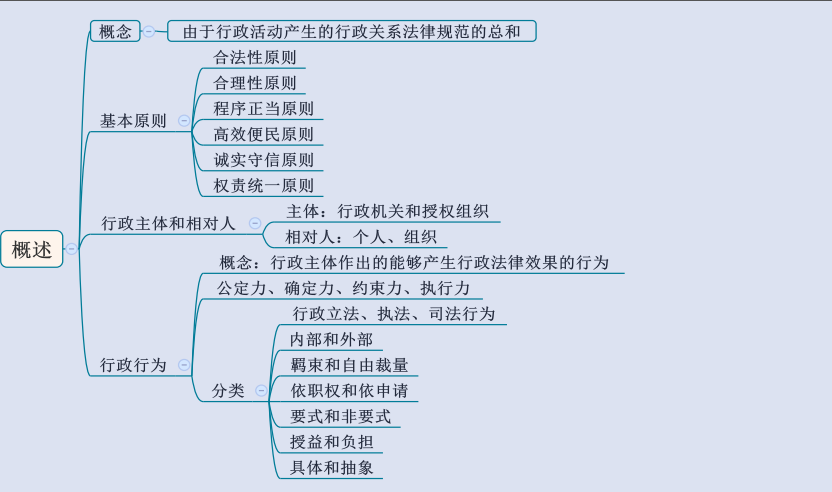
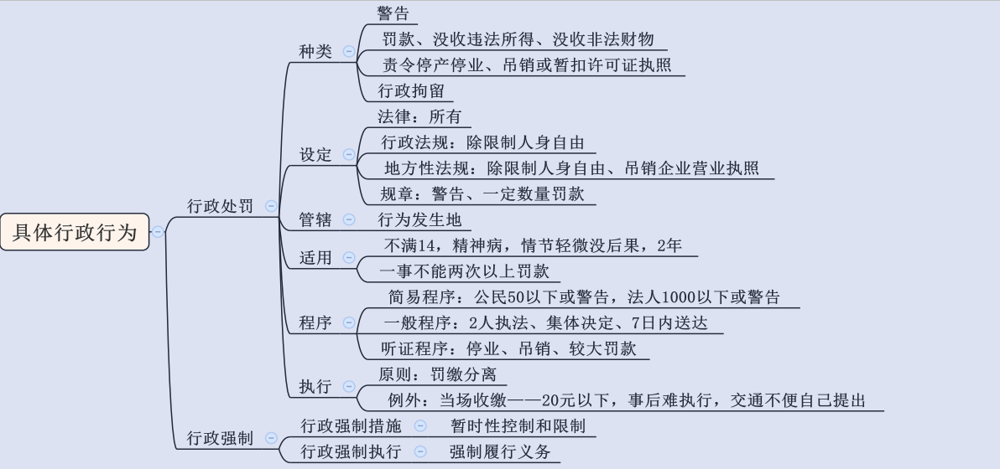
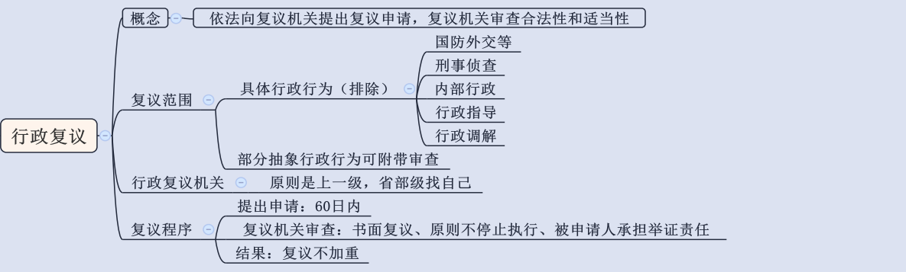
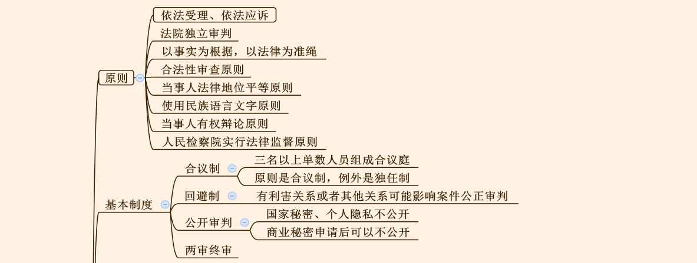
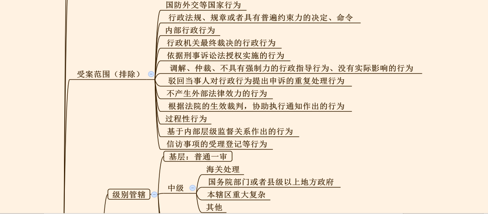
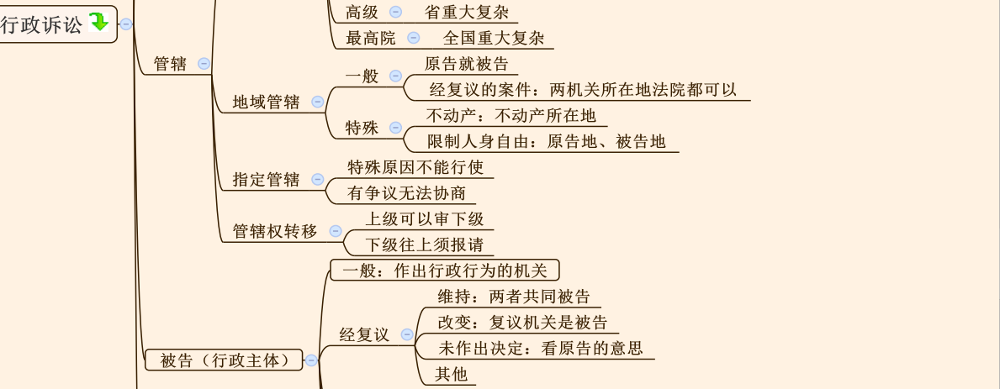
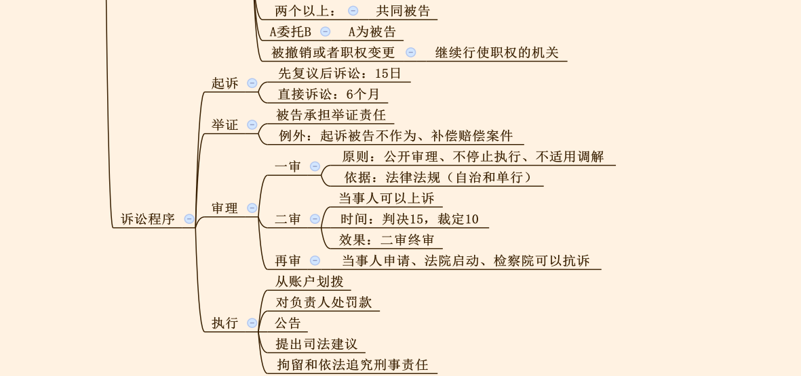
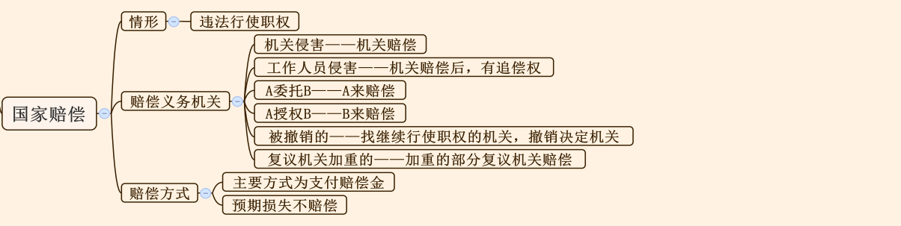

## 一、行政法概述

1. 概念： 无需记忆， 理解行政关系是一种管理与被管理的关系即可。

2. 基本原则：
   - （1）共讲解 3 个考点，要理解 6 项原则的含义。
   - （2）补充考点：首要原则是合法性原则；行政法核心是为了控制行政权。

3. 行政主体和行政相对人：
   - （1）行政主体包括行政机关和法律法规授权组织，行政机关包括政府、行政部门，还有派出机关和派出机构。
   - （2）行政相对人既有可能是个人也有可能是组织。

4. 行政行为：
   - （1）概念： 需要满足两个条件， 即行政主体作出、 能够创设行政上的权利和义务。
   - （2）效力： 公定力（推定合法）、 确定力（不可以随意变更）、 约束力（有效力）、 执行力（强制执行）。

5. 行政行为分类： 共 7 种分类方式，具体和抽象的分类需要重点掌握。
   - （1）具体行政行为：针对特定的一个或特定的一类对象。
   - （2）抽象行政行为： 行政立法行为和具有普遍约束力的决定、 命令。

---
## 二、具体行政行为

1. 行政处罚：
   - （1）种类：四类。
     - ①声誉罚：警告。
     - ②财产罚（与钱有关）：罚款、没收违法所得、没收非法财物。
     - ③行为罚：责令停产停业、吊销或暂扣许可证执照。
     - ④人身自由罚：行政拘留。
   
   - （2）设定：只有法律能够设定行政拘留。
   
   - （3）管辖：行为发生地的县级以上的行政机关享有管辖权。
   
   - （4）适用：
     - ①不满 14 周岁、精神病人不能控制自己行为、情节轻微没有后果，超过 2 年追责失效的不予处罚。
     - ②一事不再罚：指一个行为不能进行两次以上的罚款的处罚。
   
   - （5）程序：
     - ①简易程序：由 1 人执法，当场决定，当场送达。针对公民 50 以下罚款或警告；法人1000 元以下罚款或警告。
     - ②一般程序：要求 2 人执法，且在听取陈述申辩时不能加重处罚。
     - ③听证程序：责令停业、吊销执照或许可证、进行较大数额的罚款。

   - （6）执行：
     - ①原则：罚缴分离，由银行代收代缴。
     - ②例外：当场收缴： 20 元以下罚款；事后难以执行；交通不便自己提出。

2. 行政强制：
   - （1）行政强制措施：指暂时性的控制。口诀：“限制查封洞口”，“限制”指限制公民人身自由；“查封”指查封场所、设施或者财物；“洞”指冻结存款、汇款；“口”指扣押财物。
   
   - （2）行政强制执行：强制其履行义务。比如加处罚款、加收滞纳金、拍卖、划拨、排除妨碍、代履行等。

3. 其他行政行为

   - （1）行政许可
   - （2）行政征收
   - （3）行政给付
   - （4）行政奖励
   - （5）行政确认

---
## 三、行政复议

1. 概念：行政复议原则针对具体行政行为。复议机关审查合法性和适当性（合理性）。

2. 范围：
   - （1）具体的行政行为可以提出复议申请，排除下列五个：
     - ①国防外交等；
     - ②刑事侦查行为：刑事上的拘留、逮捕；
     - ③内部行政行为：行政机关对自己的工作人员作出行政处分的行为；
     - ④行政指导：无强制力；
     - ⑤行政调解：无强制力。
   
   - （2）部分抽象行政行为：可附带性审查，不能单独提出。

3. 行政复议机关：原则找上一级，省部级找自己。

4. 复议程序：
   - （0）申请： 60 日内。
   - （1）被申请人应当自收取到申请书或笔录复印件之日起10日内，提出书面答复。
   - （2）复议机关审查原则：采用书面复议的方式、原则不停止执行、被申请人承担举证责任。
   - （2）结果：可维持、撤销、责令重新作出，但是复议不加重。

---
## 四、行政诉讼

1. 行政诉讼的基本原则（理解含义即可）：
   - （1） 依法应诉原则：告官要见官。
   - （2）独立审判原则：不受任何行政机关、社会团体和个人的干涉。
   - （3）合法性审查原则。
2. 基本制度：
   - （1） 合议制： 三人以上单数人员组成合议庭，组成方式可能是审判员+人民陪审员，也可能都由审判员组成。
   - （2） 回避制： 审判人员有利害关系或者其他关系可能影响案件公正审判的需要回避。
   - （3）公开审判： 涉及国家秘密、个人隐私，属于法定不公开；涉及商业秘密经申请可以不公开审理。 注意：未成年人的案件在刑事上不公开审理，在行政诉讼和民事诉讼上公开审理。
   - （4）两审终审：一个案件经过两级法院裁判就宣告终结。
3. 受案范围：共 14 个，重点掌握前 4 个，后面 9 个是法律的司法解释。
4. 管辖：
   - （1）级别管辖：
     - 基层管辖：普通一审案件；
     - 省高院管辖：省重大、复杂案件；
     - 最高院管辖：全国重大、复杂案件；
     - 市中院管辖：海关处理案件、国务院部门或者县级以上地方政府案件、本辖区重大、复杂案件等。
   - （2）地域管辖：一般找机关地法院。两类特殊管辖：
     - ①不动产：找不动产所在地法院；
     - ②限制人身自由：增加原告所在地法院。

   - （3）指定管辖（理解即可）：找上级指定，包括特殊原因和有争议无法协商。
   
   - （4）管辖权的转移（理解即可）：上下级之间，上级可以审下级；下级往上须报请。 

5. 被告（行政主体）：若在考试中出现“行政诉讼的被告是？ A 项： 行政机关； B 项：行政主体” ， 应优先选择行政主体。**原因： 行政主体不仅包括行政机关，还包括法律、 法规授权的组织，因此行政主体更严谨。 若题目不严谨， 无行政主体， 可选行政机关。**
   - （1） 一般：作出行政行为的机关。
   - （2） 两个以上：共同被告。
   - （3）经行政复议后：
     - ①维持：视为同流合污，两者共同被告。
     - ②改变：复议机关是被告。
     - ③未作出决定：看原告的意思。
   - （4） A 委托 B， A 为被告； A 授权 B， B 为被告。
   - （5）被撤销或者职权变更：继续行使职权的机关。

6. 诉讼程序：
   - （1） 时间： 先复议后诉讼， 15 日；直接诉讼， 6 个月。
   - （2）举证：被告承担举证责任。 例外：起诉被告不作为、补偿赔偿案件。
   - （3）审理：
     - ①一审：原则，公开审理、不停止执行、不适用调解；依据，法律法规，自治条例和单行条例。
     - ②二审：原告和被告都可上诉；判决 15 日，裁定 10 日；二审终审制。

     - ③再审：当事人申请、法院启动、检察院抗诉。

   - （4）执行：账户划拨、对负责人处罚款、公告、提出司法建议、拘留和依法追究刑事责任。

---
## 五、国家赔偿

1. 种类：行政赔偿和刑事赔偿。
2. 情形：违法行使职权。
3. 赔偿义务机关（重点） ： 谁犯错谁赔偿。
   - （1）机关侵害：机关赔偿。

   - （2）工作人员侵害：机关赔偿后，有权追偿。
   - （3） A 委托 B——A 来赔偿。
   - （4） A 授权 B——B 来赔偿。
   - （5）机关被撤销：找继续行使职权的机关或撤销决定的机关。
   - （6）复议机关加重的：加重的部分由复议机关赔偿。
   - （7）赔偿方式：支付赔偿金，预期损失不赔偿。