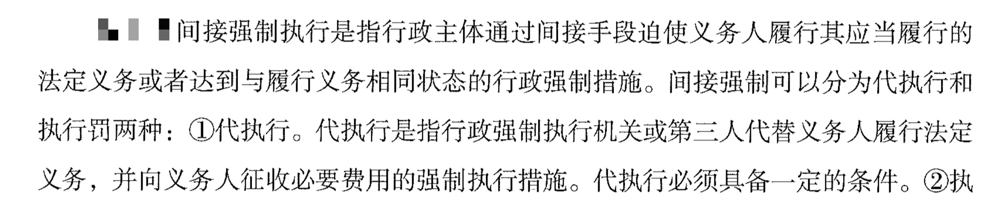
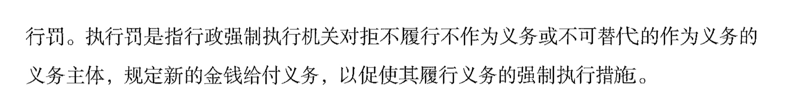

## 一、行政法概述

1. 概念： 无需记忆， 理解行政关系是一种管理与被管理的关系即可。

2. 基本原则：
   - （1）共讲解 3 个考点，要理解 6 项原则的含义。
   - （2）补充考点：首要原则是合法性原则；行政法核心是为了控制行政权。

> 程序正当原则：依照法律规定的程序办事，具体而言，若体现了**行政公开、公众参与、回避这三种内在原则，则是程序正当原则**。如：听公众的意见，体现公众参与原则，属于程序正当原则之一。

> 依法不执行指按照法律规定的不执行，即按照法律为依据来免除特定人的相应责任，体现行政法中的**合法性原则，即依照法律规定办事**。

> 合法性原则(首要原则)，即按照现有法律规定办事，没有授权不能做，即无授权即禁止。

3. 行政主体和行政相对人：
   - （1）行政主体包括行政机关和法律法规授权组织，行政机关包括政府、行政部门，还有派出机关和派出机构。
   - （2）行政相对人既有可能是个人也有可能是组织。

4. 行政行为：
   - （1）概念： 需要满足两个条件， 即行政主体作出、 能够创设行政上的权利和义务。
   - （2）效力： 
     - 公定力（推定合法，行政行为一经做出即具有被推定为合法、有效的法律效力，未经法定程序 变更或撤销前，公民和组织不得否认行政行为的效力）
     - 确定力（不可以随意变更）
     - 约束力（有效力） 
     - 执行力（强制执行）。

5. 行政行为分类： 共 7 种分类方式，具体和抽象的分类需要重点掌握。
   - （1）具体行政行为：针对特定的一个或特定的一类对象。
   - （2）抽象行政行为： 行政立法行为和具有普遍约束力的决定、文件、命令、立法都是抽象行政行为。

---
## 二、具体行政行为

### 1. 行政处罚：
   - （1）种类：四类。
     - ①声誉罚：警告。
     - ②财产罚（与钱有关）：罚款、没收违法所得、没收非法财物。
     - ③行为罚：责令停产停业、吊销或暂扣许可证执照。
     - ④人身自由罚：行政拘留。
   
   - （2）设定：只有法律能够设定行政拘留。
   
   - （3）管辖：行为发生地的县级以上的行政机关享有管辖权。
   
   - （4）适用：
     - ①不满 14 周岁、精神病人不能控制自己行为、情节轻微没有后果，超过 2 年追责失效的不予处罚。
     - ②一事不再罚：指一个行为不能进行两次以上的罚款的处罚。
   
   - （5）程序：
     - ①简易程序：由 1 人执法，当场决定，当场送达。针对公民 50 以下罚款或警告；法人1000 元以下罚款或警告。
     - ②一般程序：要求 2 人执法，且在听取陈述申辩时不能加重处罚。
     - ③听证程序：责令停业、吊销执照或许可证、进行较大数额的罚款。

   - （6）执行：
     - ①原则：罚缴分离，由银行代收代缴。
     - ②例外：当场收缴： 20 元以下罚款；事后难以执行；交通不便自己提出。

### 2. 行政强制：
   - （1）行政强制措施：指暂时性的控制。口诀：“限制查封洞口”，“限制”指限制公民人身自由；“查封”指查封场所、设施或者财物；“洞”指冻结存款、汇款；“口”指扣押财物。
   
   - （2）行政强制执行：强制其履行义务。比如加处罚款、加收滞纳金、拍卖、划拨、排除妨碍、代履行等。

> 间接强制执行：代执行、执行罚

### 3. 行政处分
> 警告、记过、记大过、降级、撤职、开除(开除公职)

### 4. 其他行政行为

- （1）行政许可
  - 1. 行政许可:通常以许可证、执照等证书的形式出现。比如当老师需要有教师资格证，这是一种执照;开业时需要营业许可证、营业执照，这是一种许可证、执照，都是典型的行政许可。
  - 2. 特征:根据公民、法人或者其他组织的申请，因此行政许可是依申请的行政行为，而非依职权的行政行为;经依法审查，准予其从事特定活动的行为，意味着给其权利，因此是**授益性的行政行为**。行政许可都是针对特定的主体，因此是具体的行政行为。

- （2）行政征收
  - 1. **有行政主体收的才能称为行政征收**，比如某人去法院打官司，需要交诉讼费，此时法院收取的诉讼费不能叫做行政征收，主体是法院，而法院是司法机关，不是行政主体。
  - 2. 方式:**以强制、无偿方式取得财产所有权**。比如典型是我国的税收，工资超过起征点要交税，国家强制交税，即同意也得交，不同意也得交;也具有无偿性，也不会因为交税多了而奖励一套房子。
  - 3. 表现:我国的行政征收主要表现为各种税和费。比如个人所得税、增值税、资源费、环保税(以前为排污费)等。

- （3）行政给付
  - 也称行政物质帮助。行政主体在特定情况下，依法向符合条件的申请人提供物质利益或赋予其与物质利益有关的权益的行为。包括:抚恤金、生活补助费、低保、安置、救济、优待、社会福利等。

- （4）行政奖励
  - 对为国家和社会做出重大贡献的单位和个人，给予物质或精神鼓励的具体行政行为。比如屠呦呦发现青蒿素，国家给予奖励。再比如前段时间，川航发生飞行事故，飞机机长最终平安降落，国家给予奖励。

- （5）行政确认

 > 行政确认主要形式有:确定、认可、证明、登记、批准、鉴证、鉴定。
 

  - 1. 行政确认:相对比较重要。 
    
    - (1)概念:指行政主体依法对相对人的法律地位、法律关系和法律事实进行甄别，给予确定、认可、证明并予以宣告的具体行政行为。 
    - (2)注意:此处难点为行政许可和行政确认的区分。 
  
  - 2. **行政许可:指从无到有的过程，或理解为从违法到合法的过程**。比如驾驶证，当没有驾驶证时则没有开车上路的权利;当有驾照后就有了开车上路的权利。如果没有驾照非要开车，此时属于违法行为;当有驾照时开车上路则属于合法的行为，因此颁发驾照属于行政许 可行为，即从无到有。比如营业许可证，没有营业许可则不能从事;有营业许可后才可以从事相应的经营。
  
  - 3. **行政确认:指相对人本来就有法律地位、法律关系和事实，机关只是给予确定、证明、认可。从有到认可的过程**。
    
    - (1)比如某天甲申请伤残鉴定，其本来就有伤在身，需要机关证明、认可其为残疾人，才可以更好地享受福利待遇，因此是确认的过程。
    - (2)比如某天李某想要进行房产登记，需要先有套房子，付完首付成为房子主人后，才可以进行登记，被别人认可房子是自己的，因此也是确认的过程。
    - (3)注意:在我国，结婚登记属于行政确认。在我国，如果两个人不结婚住在一起，属于合法同居，而不是非法同居，因为我国早已经没有非法同居的概念，即意味着两个人从在一起到结婚登记不是从违法到合法的过程，只是机关对两人的关系进行进一步的确定和认可的过程，因此结婚登记属于行政确认。我国早已没有非法同居的概念，否则没有很多电视剧可以看，比如《婚前试爱》、《试婚》等。

- （6）行政救济，讲行政复议、行政诉讼时提及过行政救济，指政府做的某件事侵害了百姓的合法 权益，百姓可以找其上级或找法院提出行政诉讼，复议、诉讼完后发现确实不对，如罚款罚得不对，需要对百姓进行相应赔偿，**涉及国家赔偿，即行政救济**。

---
## 三、行政复议

1. 概念：行政复议原则针对具体行政行为。复议机关审查合法性和适当性（合理性）。

2. 范围：
   - （1）具体的行政行为可以提出复议申请，排除下列五个：
     - ①国防外交等；
     - ②刑事侦查行为：刑事上的拘留、逮捕；
     - ③内部行政行为：行政机关对自己的工作人员作出行政处分的行为；
     - ④行政指导：无强制力；
     - ⑤行政调解：无强制力。如：对民事纠纷的仲裁、调解或者处理不服的不能申请行政复议。
   
   - （2）部分抽象行政行为：可附带性审查，不能单独提出。抽象行为不能单独提出复议，但其中的某些抽象行为可以附带审查，如国务院部门的规定、乡级政府的规定。规章不能提出附带审查，规章属于法的范畴。

3. 行政复议机关：原则找上一级，**省部级找自己**。（自我管辖）

4. 复议程序：
   - （0）申请： 60 日内。
   - （1）被申请人应当自收取到申请书或笔录复印件之日起10日内，提出书面答复。
   - （2）复议机关审查原则：采用书面复议的方式、原则不停止执行、被申请人承担举证责任。
   - （2）结果：可维持、撤销、责令重新作出，但是复议不加重。

---
## 四、行政诉讼

1. 行政诉讼的基本原则（理解含义即可）：
   - （1） 依法应诉原则：告官要见官。
   - （2）独立审判原则：不受任何行政机关、社会团体和个人的干涉。
   - （3）合法性审查原则。
2. 基本制度：
   - （1） 合议制： 三人以上单数人员组成合议庭，组成方式可能是审判员+人民陪审员，也可能都由审判员组成。
   - （2） 回避制： 审判人员有利害关系或者其他关系可能影响案件公正审判的需要回避。
   - （3）公开审判： 涉及国家秘密、个人隐私，属于法定不公开；涉及商业秘密经申请可以不公开审理。 注意：未成年人的案件在刑事上不公开审理，在行政诉讼和民事诉讼上公开审理。
   - （4）两审终审：一个案件经过两级法院裁判就宣告终结。
3. 受案范围：共 14 个，重点掌握前 4 个，后面 9 个是法律的司法解释。
4. 管辖：
   - （1）级别管辖：
     - 基层管辖：普通一审案件；
     - 省高院管辖：省重大、复杂案件；
     - 最高院管辖：全国重大、复杂案件；
     - 市中院管辖：海关处理案件、国务院部门或者县级以上地方政府案件、本辖区重大、复杂案件等。
   - （2）地域管辖：一般找机关地法院。两类特殊管辖：
     - ①不动产：找不动产所在地法院；
     - ②限制人身自由：增加原告所在地法院。

   - （3）指定管辖（理解即可）：找上级指定，包括特殊原因和有争议无法协商。
   
   - （4）管辖权的转移（理解即可）：上下级之间，上级可以审下级；下级往上须报请。 

5. 被告（行政主体）：若在考试中出现“行政诉讼的被告是？ A 项： 行政机关； B 项：行政主体” ， 应优先选择行政主体。**原因： 行政主体不仅包括行政机关，还包括法律、 法规授权的组织，因此行政主体更严谨。 若题目不严谨， 无行政主体， 可选行政机关。**
   - （1） 一般：作出行政行为的机关。
   - （2） 两个以上：共同被告。
   - （3）经行政复议后：
     - ①维持：视为同流合污，两者共同被告。
     - ②改变：复议机关是被告。
     - ③未作出决定：看原告的意思。
   - （4） A 委托 B， A 为被告； A 授权 B， B 为被告。
   - （5）被撤销或者职权变更：继续行使职权的机关。

6. 诉讼程序：
   - （1） 时间： 先复议后诉讼， 15 日；直接诉讼， 6 个月。
   - （2）举证：被告承担举证责任。 例外：起诉被告不作为、补偿赔偿案件。
   - （3）审理：
     - ①一审：原则，公开审理、不停止执行、不适用调解；依据，法律法规，自治条例和单行条例。
     - ②二审：原告和被告都可上诉；判决 15 日，裁定 10 日；二审终审制。

     - ③再审：当事人申请、法院启动、检察院抗诉。

   - （4）执行：账户划拨、对负责人处罚款、公告、提出司法建议、拘留和依法追究刑事责任。

---
## 五、国家赔偿

1. 种类：行政赔偿和刑事赔偿。
2. 情形：违法行使职权。
3. 赔偿义务机关（重点） ： 谁犯错谁赔偿。
   - （1）机关侵害：机关赔偿。

   - （2）工作人员侵害：机关赔偿后，有权追偿。
   - （3） A 委托 B——A 来赔偿。
   - （4） A 授权 B——B 来赔偿。
   - （5）机关被撤销：找继续行使职权的机关或撤销决定的机关。
   - （6）复议机关加重的：加重的部分由复议机关赔偿。
   - （7）赔偿方式：支付赔偿金，预期损失不赔偿。

---
## 六、其他
1. 党员对党组织作出的处分不服，可提出申诉。

2. 2018 年修订了《中国共产党纪律处分条例》，有以下几个亮点：
   - （1）将习近平新时代中国特色社会主义思想作为党员纪律处分工作的指导思想。
   - （2）增加了维护中央权威，维护习近平同志的核心地位。
   - （3）将四个意识写入《中国共产党纪律处分条例》。

3. 党员的处分分为：**警告、 严重警告、撤销党内职务、留党察看、开除党籍**。

4. 事业单位的处分分为：**警告、记过、 降级或者撤职、 开除**。公务员的处分与事业单位的处分只有一点区别，公务员多一个记大过， 即警告、记过、记大过、 降级或者撤职、开除。

5. 工商行管理机关是所有公司的登记机关。

6. 依法行政的基本保证是依法执政。

7. 行政机关：人民政府(中央到县乡，五级)、政府部门(各种局，如公安局、 环保局、卫生局)、派出的派出机关、派出机构。(派出机关是政府所派，常考街道办。派出机构是政府部门派出的，常见的是各种所，如派出所、税务所等)

8. 公务员的培训：**初任培训**(对新录用的进行基本知识和技能方面的培训)、**任职培训**(对晋升的领导进行的 培训)、**专门业务培训**(对某一项专业知识或技能进行培训，如 2018 年我国许多地方首次出 现非洲猪瘟疫，如何防治需要培训公务员的专门知识和技能)、**在职培训**(更新知识，如中央经济工作会议召开，各个机关、事业单位、国企等会组织学习)。