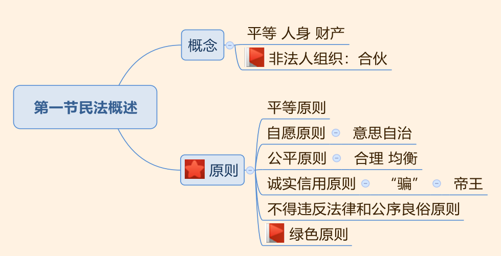
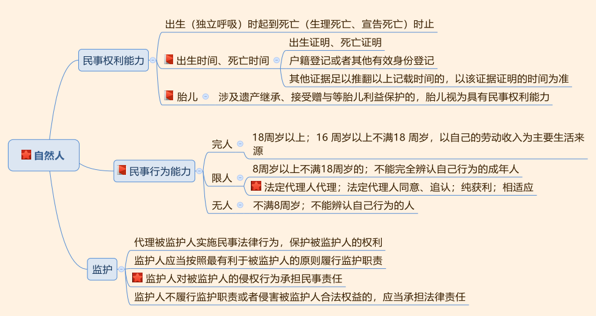
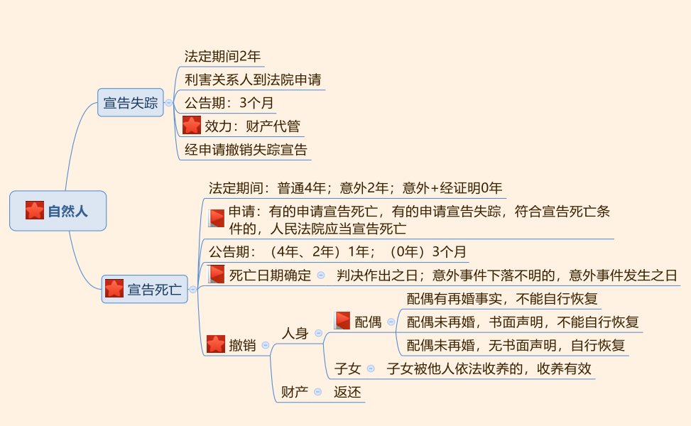
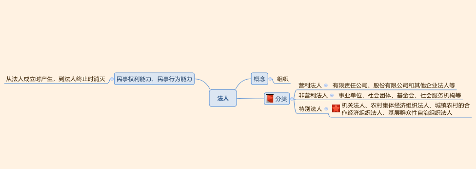
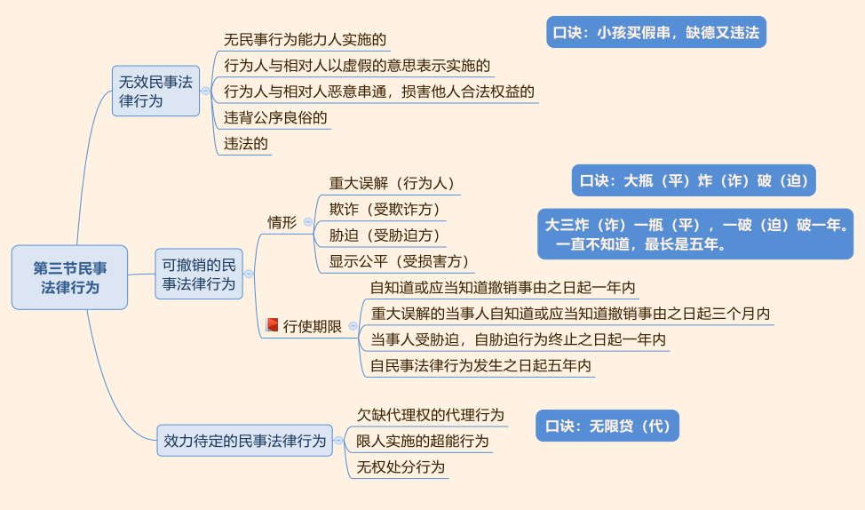
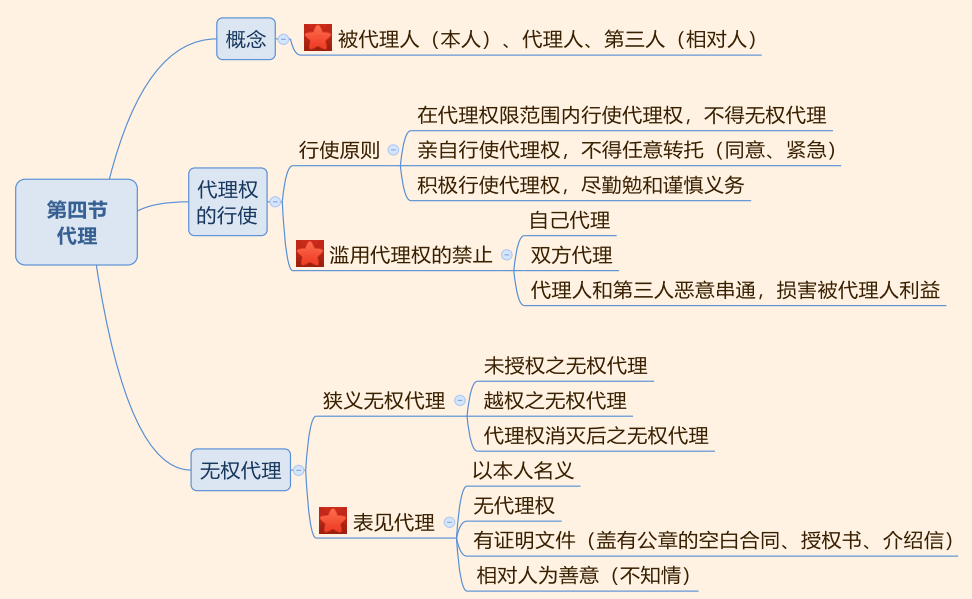
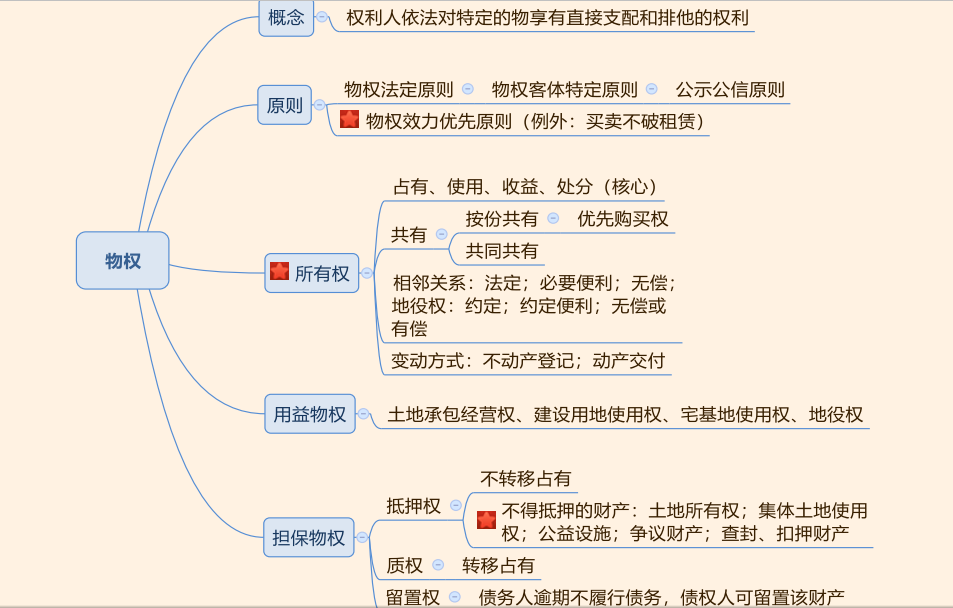
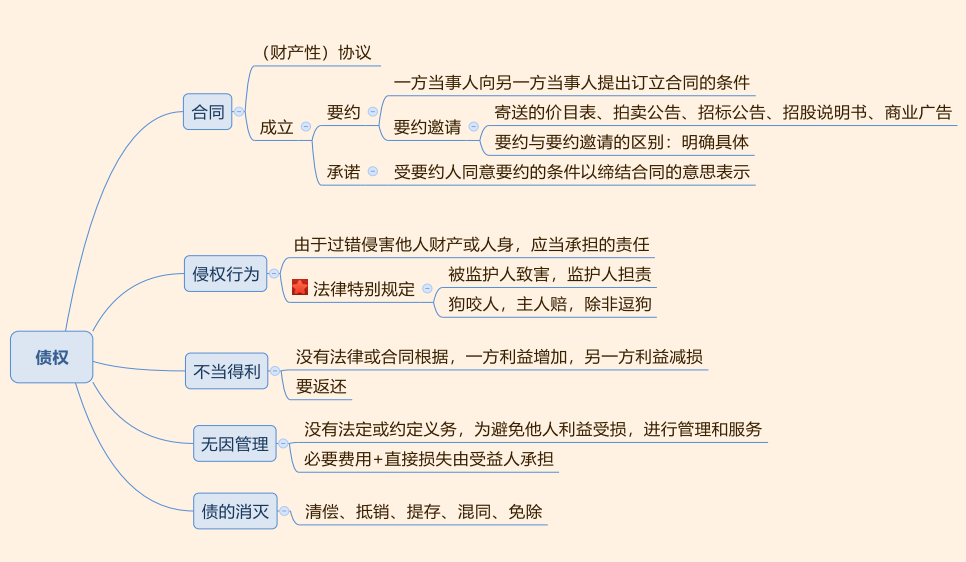

## 一、民法概述

1. 民法的概念：平等（地位平等）、人身、财产。
2. 非法人组织：新增民法主体，典型合伙。
3. 民法的六大基本原则：清楚原则的名字、意思、基本含义，对应准确。

---
## 二、民事主体

### 自然人

1. 民事权利能力：
   - （1）始于出生，终于死亡：出生时间、死亡时间有证明，看证明；没证明，看登记，有其他证据可以推翻证明和登记按照其他证据为准。
   - （2）胎儿：涉及遗产继承、接受赠与时，胎儿视为具有民事权利能力。
2. 民事行为能力： 年龄节点， 8、 16、 18。
   - 完人包括 16-18 周岁自己赚钱自己花的人；
   - 限人从事四类行为有效；
   - 无人（不满 8，不能辨认自己的行为）做事必须要有法定代理人代理实施。
3. 监护：监护人是“背锅侠”，对被监护人的侵权行为承担民事责任。
4. 宣告失踪：法定期间 2 年，利害关系人去法院申请，没有申请顺序要求，法院公告 3个月，宣告失踪后发生的效力是财产代管，经申请可以撤销宣告。
5. 宣告死亡：
- （1）利害关系人有人申请宣告死亡，有人申请宣告失踪， 符合宣告死亡条件的， 法院
应当宣告死亡。 公告期间（4 年和 2 年-1 年； 0 年-3 个月）。
- （2）死亡日期： 一般情况死亡时间看判决； 意外事件看出事那天。
6. 亡者归来， 
   - 配偶有再婚事实或进行书面声明，不能恢复。
   - 配偶未再婚没有书面声明可以自行恢复夫妻关系。
   - 子女被他人依法收养的收养关系依然有效，财产可以返还。

> 考点：年龄周边的“以上”、“以下”包含本数，“不满”不包含本数。

- （1） 18 周岁以上的自然人是完全民事行为能力人（正确），原因：**做题不考虑成年精神病，我国对此采取个案审查制**，不是由个人解释，必须通过特定民事诉讼程序认定，做题不需要考虑此问题，遇到这一句话直接判定正确。
- （2）遇到“某人 17 岁”要有敏感度。 16 周岁换成 14 周岁不可行，刑法中 14 周岁是
关键年龄节点，民法中 14 没有独立意义。
- （3）一个 17 岁的盲人，通过盲人按摩赚了很多钱，可以自己赚钱自己花，此时可以视为完人： 17 岁在 16-18 之间，通过盲人按摩赚钱说明可以做到自己赚钱自己花，残疾人只是烟雾弹，在法律上没有意义，不能歧视残疾人。
- （4） 17 岁的富二代超级有钱，钱来自父亲，可以满足自己超级奢侈的生活，此时不可以视为完人：年龄上不满 18，不属于 16 周岁以上不满 18 周岁，自己挣钱自己花的人，属于限制行为能力人。

### 法人

- （1）组织、集体。
- （2）营利法人、非营利法人、 **特别法人（基层群众性自治组织法人，居委会、村委会获得相应法人资格）**。
- （3）法人的民事权利能力、行为能力同时产生同时消灭。

---
## 三、民事法律行为

1. 区分**无效民事法律行为**、**可撤销的民事法律行为**、**效力待定的民事法律行为**。通过记忆口诀区分。
2. 可撤销的民事法律行为：法律保护受害人，保护弱势一方的利益。
   - （1）重大误解：行为人双方都行使撤销权。
   - （2）欺诈：受欺诈方行使撤销权。
   - （3）胁迫：受胁迫方行使撤销权。
   - （4）显失公平：受损害一方行使撤销权。

## 四、代理

1. 概念：掌握本人的含义，“本人”指的是“被代理人”。
2. 代理权行使：
   - （1）行使原则：亲自行使代理权，不得任意转托，但本人同意和紧急情况下可以转托。
   - （2）滥用代理权的禁止：三种情形，理解意思即可。
3. 无权代理： 重点掌握表见代理。一个行为同时符合四个构成要件则为表见代理。

---
## 五、民事权利

### 物权

1. 物权概念：权利人依法对特定的物享有直接支配和排他的权利。
2. 原则：四个原则。重点掌握物权效力优先原则，理解买卖不破租赁。
3. 所有权：
   - （1）处分处于核心地位。
   - （2） 共有： 按份共有人的优先购买权。
   - （3）相邻关系和地役权做好区分。
   - （4） 变动方式： 不动产登记，动产交付。
4. 用益物权： 注意归属。
5. 担保物权：包括抵押权、质权、留置权。 抵押权和质权的区别是担保物是否转移占有。
重点掌握不得抵押的财产。

### 债权

1. 合同： 财产性协议。
   - （1） 合同成立两个阶段：要约和承诺。
   - （2） 重点记忆要约邀请的种类： 记准《合同法》第 15 条规定。
   - （3）要约和要约邀请的区别： 明确具体。

2. 侵权行为之债： 重点看两种法律特别规定，掌握这两种情况下谁是最终责任的主体。

3. 不当得利：
   - （1） 判断什么行为是不当得利。
   - （2） 不当得利需返还。

4. 无因管理：
   - （1）判断什么行为是无因管理，即学雷锋做好事。
   - （2）无因管理过程中支出的必要费用和直接损失由受益方承担。

5. 债的消灭： 记准五种原因，以多选题的方式考查。

### 知识产权：

1. 概念：知识产权包括著作权、专利权、商标权（多选题）。
2. 著作权： 3 个考点。
   - （1）保护方式：自动保护。
   - （2）分类：记 4 个著作人身权即可。
   - （3）保护期限： 分两种情况记忆。
3. 专利权：
   - （1）包括发明、实用新型和外观设计专利。
   - （2） 有效期：分两种情况（ 20 年和 10 年）记忆， 起算时间点均从申请之日计算。
   - （3）所有专利均不能续期。
4. 商标权：
   - （1）驰名商标和普通商标的保护范围不同。
   - （2）商标有效期限： 10 年，从核准注册之日起计算。
   - （3）商标可以续期： 提前 1 年可以续期，称为续展期， 可以往后延长 6 个月，称为宽限期，续期一次再保护 10 年。

### 人身权
