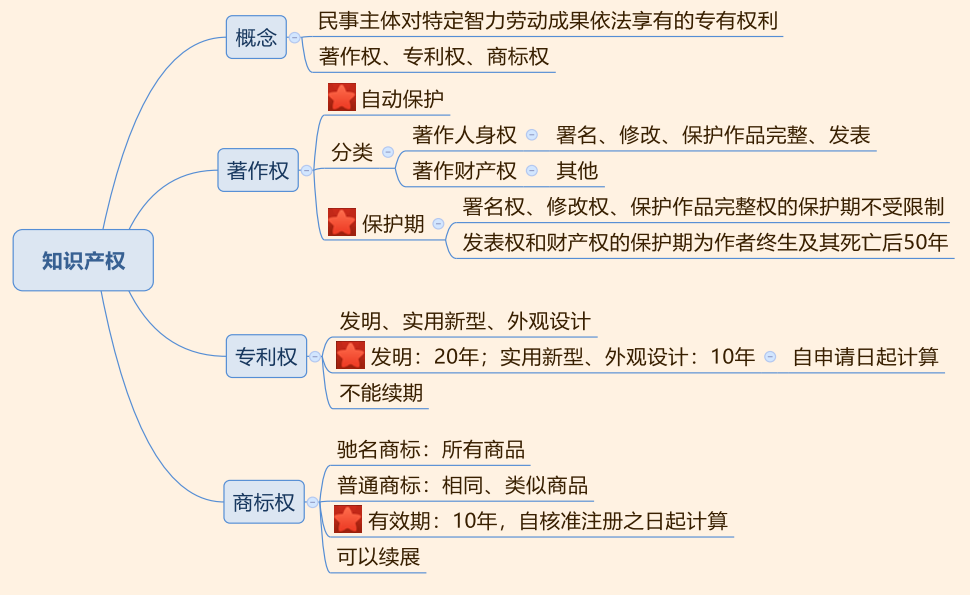
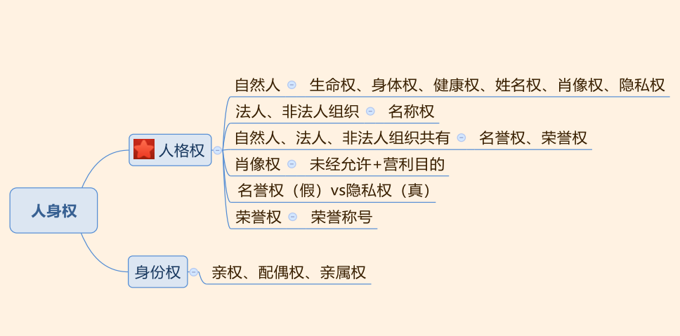
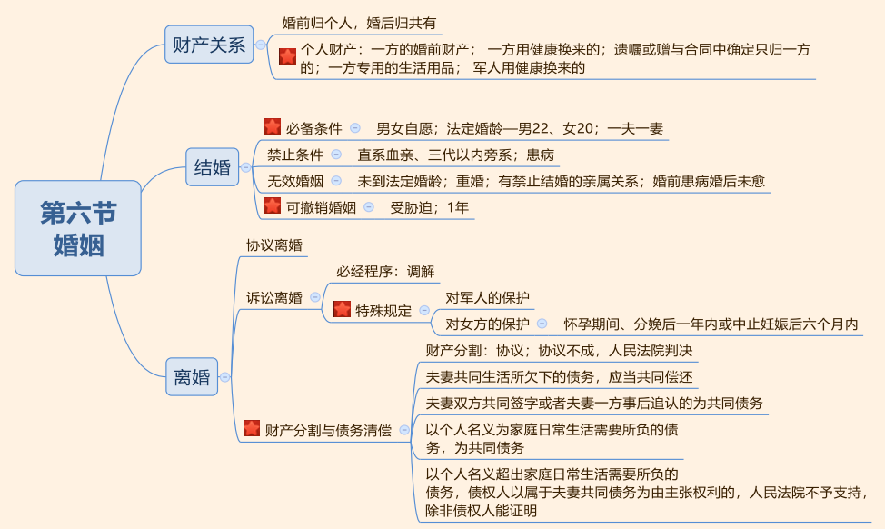
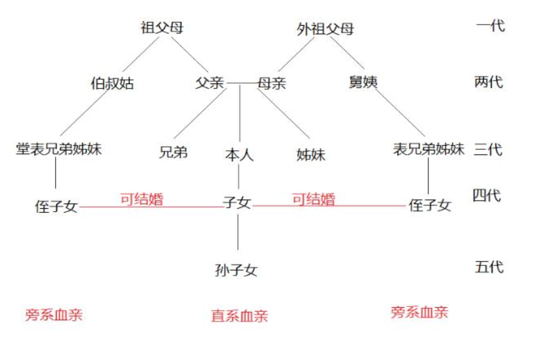
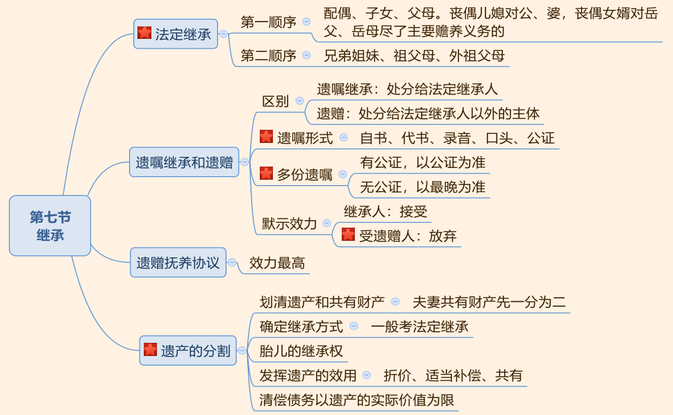
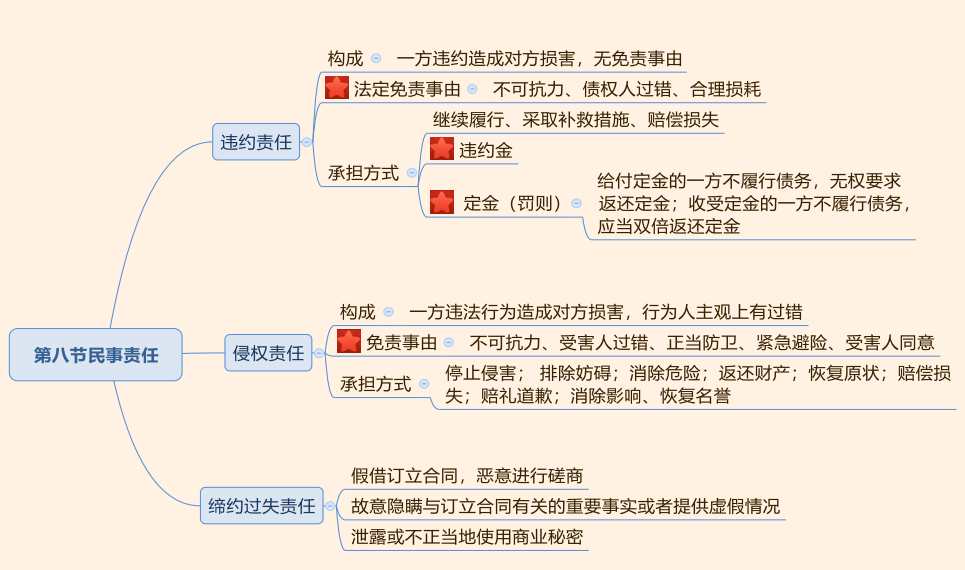
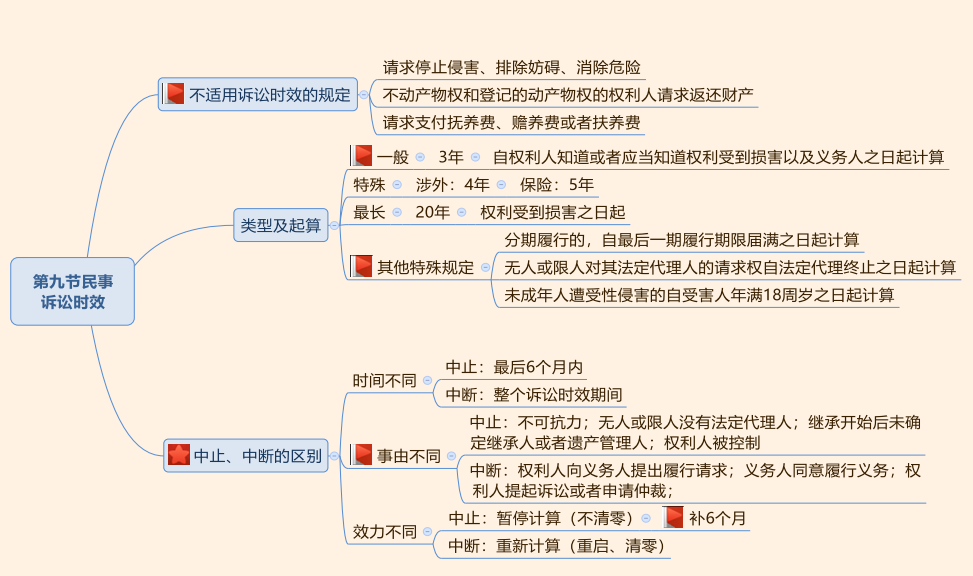
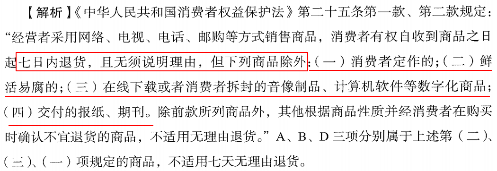
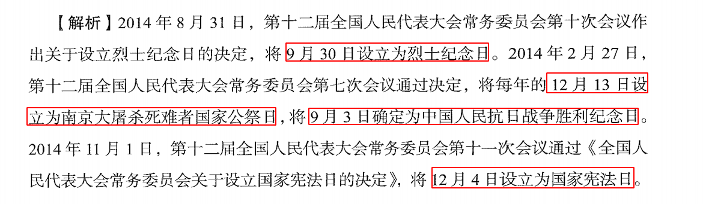

## 一、民法概述


1. 民法的概念：平等（地位平等）、人身、财产。
2. 非法人组织：新增民法主体，典型合伙。
3. 民法的六大基本原则：清楚原则的名字、意思、基本含义，对应准确。

---
## 二、民事主体

### 自然人


1. 民事权利能力：
   - （1）始于出生，终于死亡：出生时间、死亡时间有证明，看证明；没证明，看登记，有其他证据可以推翻证明和登记按照其他证据为准。
   - （2）胎儿：涉及遗产继承、接受赠与时，胎儿视为具有民事权利能力。
2. 民事行为能力： 年龄节点， 8、 16、 18。
   - 完人：包括 16-18 周岁自己赚钱自己花的人；
   - 限人：从事四类行为有效；
   - 无人：（不满 8，不能辨认自己的行为）做事必须要有法定代理人代理实施。
3. 监护：监护人是“背锅侠”，对被监护人的侵权行为承担民事责任。
4. 宣告失踪：法定期间 2 年，利害关系人去法院申请，没有申请顺序要求，法院公告 3个月，宣告失踪后发生的效力是财产代管，经申请可以撤销宣告。
5. 宣告死亡：
   - （1）利害关系人有人申请宣告死亡，有人申请宣告失踪， 符合宣告死亡条件的， 法院应当宣告死亡。 公告期间（4 年和 2 年-1 年； 0 年-3 个月）。
   - （2）死亡日期： 一般情况死亡时间看判决； 意外事件看出事那天。
6. 亡者归来
   - 配偶有再婚事实或进行书面声明，不能恢复。
   - 配偶未再婚没有书面声明可以自行恢复夫妻关系。
   - 子女被他人依法收养的收养关系依然有效，财产可以返还。


> 考点：年龄周边的“以上”、“以下”包含本数，“不满”不包含本数。

- （1） 18 周岁以上的自然人是完全民事行为能力人（正确），原因：**做题不考虑成年精神病，我国对此采取个案审查制**，不是由个人解释，必须通过特定民事诉讼程序认定，做题不需要考虑此问题，遇到这一句话直接判定正确。
- （2）遇到“某人 17 岁”要有敏感度。 16 周岁换成 14 周岁不可行，刑法中 14 周岁是
关键年龄节点，民法中 14 没有独立意义。
- （3）一个 17 岁的盲人，通过盲人按摩赚了很多钱，可以自己赚钱自己花，此时可以视为完人： 17 岁在 16-18 之间，通过盲人按摩赚钱说明可以做到自己赚钱自己花，残疾人只是烟雾弹，在法律上没有意义，不能歧视残疾人。
- （4） 17 岁的富二代超级有钱，钱来自父亲，可以满足自己超级奢侈的生活，此时不可以视为完人：年龄上不满 18，不属于 16 周岁以上不满 18 周岁，自己挣钱自己花的人，属于限制行为能力人。

### 法人


- （1）组织、集体。
- （2）营利法人、非营利法人、 **特别法人（基层群众性自治组织法人，居委会、村委会获得相应法人资格）**。
- （3）法人的民事权利能力、行为能力同时产生同时消灭。

### 非法人组织

  - 能够以自己的名义从事相应的民事活动。典型：合伙，甲和闺蜜一起开小饭店，共同出资、共同分享赚的钱、出事一起扛，这种共同出资、共享利益、共担风险的组织形式是合伙。

---
## 三、民事法律行为


1. 区分**无效民事法律行为**、**可撤销的民事法律行为**、**效力待定的民事法律行为**。通过记忆口诀区分。
2. 可撤销的民事法律行为：法律保护受害人，保护弱势一方的利益。
   - （1）重大误解：行为人双方都行使撤销权。
   - （2）欺诈：受欺诈方行使撤销权。
   - （3）胁迫：受胁迫方行使撤销权。
   - （4）显失公平：受损害一方行使撤销权。

## 四、代理


1. 概念：掌握本人的含义，“本人”指的是“被代理人”。
2. 代理权行使：
   - （1）行使原则：亲自行使代理权，不得任意转托，但本人同意和紧急情况下可以转托。
   - （2）滥用代理权的禁止：三种情形，理解意思即可。
3. 无权代理： 重点掌握表见代理。一个行为同时符合四个构成要件则为表见代理。

---
## 五、民事权利

### 物权


1. 物权概念：权利人依法对特定的物享有直接支配和排他的权利。
2. 原则：四个原则。重点掌握物权效力优先原则，理解买卖不破租赁。
3. 所有权：
   - （1）处分处于核心地位。
   - （2） 共有： 按份共有人的优先购买权。
   - （3）相邻关系和地役权做好区分。
   - （4） 变动方式： 不动产登记，动产交付。
4. 用益物权： 注意归属。
5. 担保物权：包括抵押权、质权、留置权。 抵押权和质权的区别是担保物是否转移占有。重点掌握不得抵押(学校、医院、幼儿园等以公益为目的的事业单位、社会团体的教育医疗卫生设施)的财产。


#### 关于`抵押权`、`质权`、`留置权`例子

```
【抵押】你管同桌借2000块钱，说明天就还。你答应你同桌如果明天你还不了的话，这个手机就归你同桌了，但是现在这个手机还是你的，你可以继续用到明天。如果明天还钱了，那没事；如果明天你还不了钱，他明天就可以把你的手机通过拍卖等处分方式的所得用来抵这2000元的债务。这是抵押。

【质押】你管同桌借2000块钱，说明天就还。你把手机现在就塞你同桌手里，答应他如果明天你还不了的话，这个手机就归你同桌了。如果明天还钱了，那手机还你；如果明天你还不了钱，他明天就可以把你的手机通过拍卖等处分方式的所得用来抵这2000元的债务。这是质押。

【留置】下课了，你让你同桌去小卖部帮你买瓶水，回来你给他钱。你同桌去买了，回来你发现自己没带钱，而你同桌是一个很讲信用的人，你没钱那瓶水就不给你。你同桌就对这瓶水拥有的就是留置权。

```
---
```
抵押权：指债权人对于债务人或第三人 `不移转占有而提供担保` 的财产，在债务人不履行债务或发生当事人约定的实现抵押权的情形时，依法享有的就该财产折价或拍卖、变卖的价款优先受偿的权利。          

比如将房子抵押给银行，在还不起债时，银行享有对房子拍卖后钱的优先受偿的权利。

质权：指债务人或第三人 `将其动产或权利移交债权人占有` ，将该财产作为债权的担保，债务人不履行义务时，债权人享有依法以该财产折价或拍卖、变卖的价款优先受偿的权利。

比如将汽车质押给债权人，在还不起债时，债权人享有对汽车拍卖后钱的优先受偿的权利。

留置：指债权人享有的在债务人不履行到期债务时，对其已经合法占有的债务人的动产予以留置，并就该动产折价或拍卖、变卖所得的价款优先受偿的权利。

比如将汽车送到修理厂修理，到期不付款，修理厂有将汽车留置的权利。

区分：

1.留置 是法定担保，抵押和质押 是约定担保。法定担保优先于约定担保。
2.质押，留置 是移转占有，而抵押(类似约定、合同保证)是不移转占有。
3.留置担保的是动产，抵押担保的是动产和不动产，质押担保的是动产和权利。

```

### 债权


1. 合同： 财产性协议。
   - （1） 合同成立两个阶段：要约和承诺。
   - （2） 重点记忆要约邀请的种类： 记准《合同法》第 15 条规定。
   - （3）要约和要约邀请的区别： 明确具体。
     - 要约: 内容具体；向特定人做出；一经做出即受到该意思表示拘束
     - 要约邀请: 向不特定第三人发出；内容不具体；不具有使自己受其拘束的意思表示

2. 侵权行为之债： 重点看两种法律特别规定，掌握这两种情况下谁是最终责任的主体。

3. 不当得利：
   - （1） 判断什么行为是不当得利。
   - （2） 不当得利需返还。

4. 无因管理：
   - （1）判断什么行为是无因管理，即学雷锋做好事。
   - （2）无因管理过程中支出的必要费用和直接损失由受益方承担。

5. 债的消灭： 记准五种原因，以多选题的方式考查。
   - 清(清偿)、提(提存)、消(抵销)、同(混同)、免(免除)

### 知识产权：


1. 概念：知识产权包括著作权、专利权、商标权（多选题）。
2. 著作权： 3 个考点。
   - （1）保护方式：自动保护。
   - （2）分类：记 4 个著作人身权即可。
   - （3）保护期限： 分两种情况记忆。
3. 专利权：
   - （1）包括发明、实用新型和外观设计专利。
   - （2） 有效期：分两种情况（ 20 年和 10 年）记忆， 起算时间点均从申请之日计算。
   - （3）所有专利均不能续期。
4. 商标权：
   - （1）驰名商标和普通商标的保护范围不同。
   - （2）商标有效期限： 10 年，从核准注册之日起计算。
   - （3）商标可以续期： 提前 1 年可以续期，称为续展期， 可以往后延长 6 个月，称为宽限期，续期一次再保护 10 年。

### 人身权



1. 人格权：
   - （1）自然人享有的权利：生命权、身体权、健康权、姓名权、肖像权、隐私权。
   - （2）法人、非法人组织所专享的权利：名称权。
   - （3）民事主体所共有的权利：名誉权、荣誉权。
   - （4）肖像权：未经允许+营利目的。
   - （5）名誉权和隐私权的区别：看对方表述真假，表述为假侵犯名誉权，表述为真侵犯隐私权。
   - （6）荣誉权：享有前提是必须拥有荣誉称号。荣誉权归属的争议按“三步走”处理。
2. 身份权： 掌握归属，包括亲权、配偶权、亲属权。

> 关于精神赔偿：自然人因下列人格权利遭受侵害，法院应当受理
   - （1）生命权、健康权、身体权
   - （2）姓名权、肖像权、名誉权
   - （3）人格尊严权、人身自由权
   - （4）违反社会公共利益、社会功德侵害他人隐私或者其他人格利益，受害人以侵权为由向法院起诉请求赔偿精神损害的法院应当受理。


### 婚姻




1. 结婚：
   - （1）必备条件： 主要掌握法定婚龄，即男性 22 周岁，女性 20 周岁。
   - （2）禁止条件：掌握直系血亲、三代以内旁系血亲， 婚前患有医学上认定不应当结婚的疾病禁止结婚。
   - （3）无效婚姻和可撤销婚姻：重点记忆可撤销婚姻的情形，即受胁迫。

2. 财产关系：重点注意婚姻法规定的个人财产。即记准哪些是个人财产， 排除个人财产后，一般的都是夫妻共有财产。

3. 离婚： 主要关注诉讼离婚。
   - （1） 诉讼离婚： 对两个人群进行特别保护，即军人和女性。
   - （2）财产分割和债务清偿：重点掌握债务清偿，通过最高法给的司法解释来掌握。

### 继承



1. 法定继承：记忆第一顺序、第二顺序法定继承人。

2. 法律中**子女**指婚生子女、非婚生
子女、养子女、有抚养关系的继子女

3. 遗嘱继承和遗赠：
   - （1）区分给“圈里人”还是“圈外人”。
   - （2）遗嘱的形式：共 5 种。**代书、录音、口头遗嘱了解即可，此三项遗嘱形式需要有两个以上的见证人在场见证。**
   - （3）多份遗嘱：有公证遗嘱看公证遗嘱，没有公证遗嘱看最晚立的那份遗嘱。
   - （4）默示效力：继承人默示视为接受继承；受遗赠人默示视为放弃。

4. 遗赠抚养协议：效力最高。

5. 遗产分割：理解前 3 条。

6. 遗嘱不论是自己书写还是由他人代写， 不论是否到公证处公证，都是有效的民事法律行为。


### 民事责任



1. 违约责任：
   - （1）法定免责事由（重点）：不可抗力、债权人过错、合理损耗。
   - （2）承担方式：重点看违约金条款和定金罚则，两者只能择其一适用，不能同时主张。
2. 侵权责任：重点掌握免责事由。
3. 缔约过失责任：理解三种情形即可。

#### 定金与违约金的区别
> 定金与违约金都是当事人一方应向另一方交付的款项，并且都有担保合同履行的作用。但定金与违约金是不同的。其主要区别有以下几项：

1. 根本目的不同：定金是以确保债权的实现为根本目的，因此定金属于担保的一种形式。而违约金根本目的是制裁违约行为，是民事责任的承担方式、是约束双方履行合同的一种赔偿损失。

2. **交付的时间不同：定金是签订合同时或之前预先支付的，作为签订合同或履行合同的担保，具有双倍返还的惩罚性;违约金是双方在合同种约定的，违约方应支付的赔偿金，不事先支付**。

3. 发生的根据不同：定金是由当事人双方在定金合同中约定的，而违约金一般是当事人自己约定的。定金是交付后才生效，也就是说，即使双方合同约定了定金，但是定金实际没有交付，则该定金条款不生效;而违约金是诺成生效的，只要双方签字约定，就具有法律效力。

4. 确定的标准不同：定金的数额不能超过法律规定的数额，根据担保法的规定，定金最高不能超过合同标的额的20%，超过部分无效。而违约金因具有预定赔偿金的性质，是根据违约可能造成的损失额来确定。

5. 生效条件不同：定金是支付以后生效的，如果商品销售没有完成作为合同担保的一种方式，应当双倍偿还定金;违约金是诺成生效的，只要合同成立，违约条款处理，违约金就生效了。

6. 作用不相同：定金的作用：一是证明合同成立;二是保证合同履行;三是具有惩罚和预付款的作用。合同履行后，定金应当收回，或者抵作价款。违约金的作用：一是惩罚和保证。只要出现由于当事人过错，不履行或不适当履行合同事实的，不论是否给对方造成损失，都必须给付违约金。二是补偿侵害造成的损失。如受侵害方能举证证明违约行为所造成的损失大于违约金金额时，还有权请求违约方补偿不足部分。违约方支付违约金后，只要对方认为违约方还有继续履行合同的必要并坚持要求违约方继续履行合同的，违约方还有继续履行合同的义务。

### 诉讼时效



1. 不适用诉讼时效的规定：考查多选题。
2. 类型及起算：
   - （1）一般（新法新规定）： 3 年，起算时间点要按新法规定重点记忆。
   - （2）其他特殊规定（新法新规定）： 3 种情况起算时间按法律特别规定记忆。
3. 中止、中断的区别：时间、事由、效力不同。

## 六、其他法律知识

- 无理由退货


---
- 国家宪法日12月4日、烈士纪念日9月30日


---
- x


