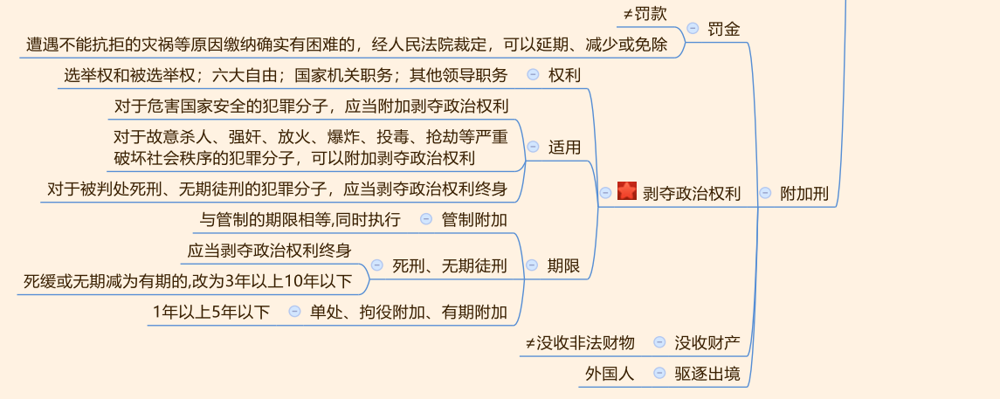

## 一、刑法概述

1. 刑法： 规定犯罪和刑罚的法律。

2. 基本原则： 考查简单， 罪刑法定、 平等适用刑法和罪责刑相适应原则。

3. 适用范围： 黄金考点。
   - （1）空间效力：
     - ①属地管辖权（重点）： 需要掌握犯罪地的认定。
     - ②属人管辖权：区别对待。有身份的人： 一律追究； 百姓： 轻罪可以不追究。
     - ③保护管辖权： 同时符合双重犯罪的标准。
     - ④普通管辖权：基于国际条约(它的修改与制定与我国人大代表、人常无关)，我国也在条约上签字，对于国际共同打击的犯罪，我国可以管辖。
   - （2）时间效力： 溯及力原则“从旧兼从轻” 。

---
## 二、犯罪与犯罪构成

1. 犯罪（多选题）： 三个特征--严重社会危害性、违反刑事法律规范、依法受到刑罚处罚。

1. 四个要件（黄金考点）：**主体、主观方面、客体和客观方面。**

2. 主体：
   - （1） 自然人（重点）：完全刑事责任能力、完全无刑事责任能力、相对刑事责任能力（8种 行为：**烧杀奸抢，商贩抱头**） ,减轻： 4 类人不同的规定，需要掌握口诀。
   - （2） 单位：双罚和单罚。

3. 主观方面：
   - （1） 故意：直接故意和间接故意。
   - （2） 过失自信：疏忽大意和过于自信。
   - （3） 补充考点： 意外事件。

4. 客体(抽象的)：区分犯罪对象(具体的)。

5. 客观方面： 重点掌握危害行为， 包括作为和不作为（应为、能为而不为）。

> “应为”的义务来源：
1. 法律法规明文规定的义务：赡养父母。

2. 职务、业务要求的义务： 例如消防队员的职务要求救火。

3. 先行行为引起的义务： 行为人因为自己的行为导致的，例如成年人带儿童游泳是先行行为，导致成年人有保护儿童的义务。

> 注意：
- （1）不满 14 周岁：小于 14 周岁，截止到 14 周岁生日当天，生日当天是不满 14 周岁的最后一天，也是杀人放火不承担责任的最后一天。第二天就是已满 14 周岁不满 16 周岁的相对无刑事责任能力的范围。

- （2） **8 种严重行为： 针对已满 14 周岁不满 16 周岁的人**。记忆两个名词： 日本鬼子和城管，日本侵华进行“烧杀奸抢”，城管来了“商贩抱头”， 利用谐音记忆，“烧” 指放火，“杀”指故意杀人，“奸”指强奸，“抢”指抢劫；“商”指故意伤害致人重伤或死亡，“贩”指贩卖毒品，“抱”指爆炸，“头”指投毒。在《刑法修正案（三）》 中，投毒罪改为投放危险物质罪，但在我国《刑法总则》中依然是投毒罪。

- （3）精神病问题：共分为三类， 全疯、 半疯和不疯。
  - ①不疯： 正常人，完全刑事责任能力。
  - ②全疯：完全无刑事责任能力，杀人放火不负刑事责任。
  - ③半疯：包括两种，一是间歇性精神病，即一会儿疯，一会儿不疯，是“非全日制” 状态， 疯的时候完全无刑事责任能力，不疯的时候完全有刑事责任能力。 二是半迷糊状态，量刑可宽大处理，可从减（可以从轻或减轻处罚）。

- （4）醉酒的人：应当承担刑事责任，与正常人一样，对于醉酒的人该怎么办就怎么办，考试中出现对于醉酒的人应当从轻或者减轻处罚，都是错误的表述。这是为了防止有些人趁着酒劲做坏事。

---
## 三、排除犯罪的行为

1. 正当防卫：

   - （1）考点：
     - ①他人：**见义勇为**的行为属于正当防卫。正当防卫可以是为保卫国家、公共、他人、见义勇为而实行防卫。不负刑事责任。
     - ②正在进行：事前、事后都不行。
     - ③不法侵害：现实存在的，不能有“被害妄想症”。
     - ④制止：是正当防卫的意图，防卫挑拨、互相斗殴均不构成正当防卫。
     - ⑤防卫的对象：针对不法侵害人本人。

   - （2）防卫过当：
      - ①超过必要的限度是防卫过当。
      - ②注意：没有防卫过当罪，构成什么定什么，一般定过失类犯罪。
      - ③量刑时，应当减轻或者免除处罚。
  
   - （3）无过当防卫：明确哪些属于严重危及人身的暴力犯罪，此时“打死勿论”。

2. 紧急避险：
   - （1）概念要点：
     - ①遇到危险：危险是现实存在的，危险可以来自于人、动物、自然界。
     - ②不得已：明确四个字，即保大放小。
   - （2）不适用在职务上、业务上负有特定责任的人，记住消防队员在火场的例子。
   - （3）避险过当：量刑时，应当减轻或者免除处罚。

3. 假想防卫：行为人误以为有不法侵害而进行防卫，构成假想防卫，警察来制止行为，不明身份时，被打伤。不法侵害是误以为的，是假象的。不需要负刑事责任，但要负民事上的责任。构成假想防卫的三个条件:
   - 不法侵害实际不存在，是行为人假象的;
   - 行为人主观目的是防卫;
   - 行为人客观上造成无辜者的伤害。

---
## 四、故意犯罪形态

1. 预备：
   - （1）犯罪预备：犯罪的准备阶段， 由于意志以外的原因停下来。
   - （2）犯罪预备行为： 准备工具、制造条件。 常考五种情况： **踩点、蹲点、买凶器、练技术、出发在路上。**
   - （3）量刑标准： 对于预备犯，可以比照既遂犯从轻、减轻或免除处罚。

2. 未遂：
   - （1）欲而不能。(客观原因造成)
   - （2）量刑标准：对比未遂犯， 可以比照既遂犯从轻或减轻处罚。

3. 犯罪中止（黄金考点）：
   - （1）能而不欲。(主观原因)
   - （2） 必须在犯罪过程中，事后采取补救措施的不成立中止。
   - （3）有效性：必须能有效防止犯罪结果的发生。
   - （4）量刑标准：没有造成损害的，应当免除处罚；造成损害的，应当减轻处罚。量刑非常轻

## 五、共同犯罪

1. 共同犯罪成立的条件：至少两人，二人是故意的共同行为（一起商量，一起去干）。

2. 排除情形（重点）：
   - （1）同时犯：不约而同、偶然遇到、 缘分。
   - （2）超出共同故意之外的犯罪。
   - （3）间接正犯：两种情形。利用小孩干坏事；利用他人不知情。

3. 共犯的分类：
   - （1）主犯：重点掌握犯罪集团的首要分子（ 黑帮老大的问题）；犯罪集团至少 3 人；黑帮老大对集团所实施的全部罪行承担责任。
   - （2）从犯：
     - ①起到次要、辅助作用。
     - ②对于从犯，应当从轻、减轻或者免除处罚。
   - （3）胁从犯：明确胁从犯的概念和量刑标准。
   - （4）教唆犯：
     - ①按照所起的作用处罚。
     - ②教唆不满 18 周岁的人犯罪应当从重处罚。
     - ③被教唆的人没有犯被教唆的罪，对于教唆犯可以从轻或者减轻处罚。

## 六、刑法

1. 五大主刑：

   - （1） 管制： 不关押， 回家待着； 参加劳动同工同酬， 期限 3-2-3， 即单判一个罪 3 个月以上 2 年以下， 数罪并罚最长不超过 3 年。

   - （2） 拘役： 6 个考点。 
     - ①关起来， 时间较短， 短期剥夺自由。 
     - ②由公安机关执行。 
     - ③在拘役所或者看守所执行。 
     - ④每月可以回家 1-2 天。 
     - ⑤参加劳动酌量发给报酬（ 区别于“同工同酬”）。 
     - ⑥期限 1-6-1， 即单判 1 个月以上 6 个月以下， 数罪并罚不得超过 1 年。

> **拘留**不是我国刑罚，刑事拘留为《刑事诉讼法》的强制措施;行政拘留为《行政法》的行政处罚，都不是我国的刑罚。
   
   - （3） 有期徒刑： 重点掌握关于年限问题。
     - ①犯一个罪时， 判处 6 个月以上， 15 年以下。
     - ②数罪并罚情况下， 刑期相加， 若刑期总和≥35 年， 最高不得超过 25 年； 如果刑期总和＜35 年， 最高不得超过 20 年。
   
   - （4） 无期徒刑： 若判决之前需先关押， 一旦判完， 应进行刑期折抵。 刑期折抵需区分情况： 管制 1 天折抵 2 天； 拘役和有期徒刑 1 天折抵 1 天； 无期徒刑不能进行刑期折抵。
   
   - （5） 死刑（ 非常重要， 标小星星）： 重点掌握哪些人不得判处死刑。
     - ①限制： **犯罪时**不满 18 周岁、 **审判时**怀孕、 **审判时**已满 75 周岁。
     - ②核准程序： 判处死刑立即执行要报请最高院核准， 死缓可以由省高院核准。
     - ③死缓的三种结果： 若两年没有故意犯罪， 两年后减为无期徒刑； 若两年内有重大立功表现（ 针对重大案件或重大发明）， 两年后减为 25 年有期徒刑； 若两年内有故意犯罪， 需区分情况： 情节恶劣， 报请最高院核准后执行死刑； 故意犯罪情节不恶劣， 重新计算两年的缓刑期。

2. 附加刑：可单独适用
   - （1） 罚金： **罚金≠罚款， 罚金是刑法上的概念， 罚款是行政法上的概念。** 遭遇不能抗拒的灾祸等原因缴纳确实有困难的， 经人民法院裁定， 可以延期、 减少或者免除。
   - （2） 剥夺政治权利（黄金考点）：
     - ①剥夺的是哪些权利：剥夺选举权和被选举权；言论、出版、集会、结社、游行、示威自由的权利；担任国家机关职务的权利；担任国有公司、企业、事业单位和人民团体领 导职务的权利。
     - ②适用： 两个“应当”， 一个“可以”。
     - ③判处剥夺政治权利的六种判法及每一种的期限。
     - ④剥夺政治权利的年限计算： 两者相加。
   - （3） 没收财产≠没收非法财物。
   - （4） 驱逐出境： 适用对象是外国人。

> 剥夺政治权利的期限

1. 判处管制附加剥夺政治权利的， 剥夺政治权利的期限与管制的期限相等， 同时执行。
2. 在死刑缓期执行减为有期徒刑或者无期徒刑减为有期徒刑的时候， 应当把附加剥夺政治权利的期限改为 3 年以上 10 年以下。
3. 除以上规定外， 剥夺政治权利的期限为 1 年以上 5 年以下。

> 刑法的执行机构

- 死刑立即执行由人民法院执行。
- 社区矫正机构是指由司法局、司法所的人找到被判处管制的人通过聊天、劳动改造等矫正犯罪心理、纠正行为恶习等。
- 剥夺政治权利由公安机关执行。刑罚执行中人民检察院不执行任何刑罚， 出现“人民检察院没收罚金/执行死刑/执行死缓等”全部错误。
- 有期徒刑在监狱执行，判处有期徒刑的剩余刑期在 3 个月以下的在看守所执行。

> 主刑和附加刑:
(1)管制由社区矫正机构执行，不关押。
(2)拘役由公安机关执行，1-6-1。 
(3)有期、无期、死缓在监狱执行。有期徒刑剩余刑期 3 个月以下的由看守所执行。虽然有期徒刑 6 个月以上、15 年以下，但是因为先行羁押 1 天折抵有期徒刑 1 天，如果某人先行羁押特别久，最后折抵之后不到 3 个月，此时在看守所执行。
(4)死刑立即执行和罚金、没收财产由法院司法警察执行。 
(5)剥夺政治权利、驱逐出境由公安机关执行。 
(6)注意:没有人民检察院，所以执行中出现“人民检察院”全部错误。

## 七、量刑

1. 累犯： 两种， 即一般累犯和特殊累犯。
   - （1） 一般累犯： 同时满足三个条件， 即两个故意、 两个有期、 五年之内。
   - （2） 特殊累犯： 后罪发生在前罪刑罚执行完毕或赦免以后， 只对罪名有要求， 即前后两罪都是三种罪之一， 无需考虑中间间隔时间、 判处何种刑罚， 均称为特别累犯。
   - （3） 不满 18 周岁的人犯罪不成立累犯（ 既不成立一般累犯， 也不成立特殊累犯）。
   - （4） **对于累犯应当从重处罚： 不得缓刑、 不得假释、 可以减刑（非常重要）**。

2. 自首：
   - （1） 明确两种自首。
   - （2） 对于自首， 可以从轻或减轻处罚， 犯罪较轻的， 可以免除处罚。

3. 立功： 揭发、 检举别人或者提供重要线索从而侦破其他案件。

4. 缓刑：
   - （1） 适用对象： 被判处拘役、 3 年以下有期徒刑的犯罪分子。
   - （2） 特殊规定： 针对三种人（ 老、 幼、 孕）， 符合条件的话应当适用缓刑； 累犯和黑帮老大绝对不能缓刑。
   - （3） 缓刑的三种结果。

---
## 八、刑罚的执行:包括减刑和假释

1. 减刑：
   - （1） 对象： 针对四种， 即 管制、 拘役、 有期徒刑、 无期徒刑。减刑对象针对主刑，如：罚金为附加刑，不能减刑。
   - （2） 限度：
     - ①管制、 拘役、 有期徒刑不少于原判刑期的 1/2。
     - ②无期徒刑不能少于 13 年。

2. 假释：
   - （1） 对象： 针对被判处有期徒刑、 无期徒刑的。
   - （2） 限度： 与减刑一样。
     - ①有期徒刑执行原判刑期 1/2 以上。
     - ②无期徒刑实际执行 13 年。
   - （3） 禁止（ 不能被假释的人）： ①累犯。 ②`犯故意杀人、 强奸、 抢劫、 绑架、 放火、 爆炸、 投放危险物质或者有组织的暴力性犯罪`+`被判处 10 年以上有期徒刑或无期徒刑`。
   - （4） 考验期： 有期徒刑以剩余刑期为考验期； 无期徒刑考验期 10 年。
   - （5） 三种结果： 与缓刑相似， 可结合记忆。

---
## 九、分则

### 一、 公职人员犯罪类型

> 职务侵占罪：是指**非国家工作人员将财产据为己有**，不会归还，而且职务侵占罪针对**非公共财物**。

> 挪用特定款物罪：违背专款专用原则，即从一种**公家用途**挪用到另一种**公家用途**，比如: 专项扶贫资金挪用到盖政府大楼。如果用作“营利性商业活动”给个人用，则不算。

> 挪用资金罪：挪用公司资金罪又叫做挪用资金罪，是指**非国家工作人**员挪用本单位的钱进行非法活动、营利活动(数额较大)、挪用本单位的钱三个月没有归还，有三个之一的构成挪用资金罪。

1. 公职人员的犯罪类型共有六个， 重点掌握贪污罪和受贿罪。

2. 贪污罪：
   - （1） 主体： 国家工作人员， 受委托管理、 经营国有财产的人员。
   - （2） 贪污罪： 非法占有公共财物， 拿钱时不想归还。 注意区分贪污罪与职务侵占罪的区别。

3. 挪用公款罪： 三种情形。 注意与挪用资金罪作好区分。

4. 受贿罪：
   - （1） 索取、 非法收受都定受贿罪。
   - （2） 财物： 包括货币、 物品、 财产性利益。
   - （3） 谋取利益： 有为他人承诺、 实施、 实现三种情形之一， 定受贿罪。

5. 巨额财产来源不明罪： 比较罕见， 由犯罪嫌疑人承担举证责任的罪名。

6. 滥用职权罪→故意； 玩忽职守罪→过失。

---
### 二、 其他罪名

1. 抢劫罪：
   - （1） 暴力、 胁迫、 其他方法压制反抗、 强行取财。
   - （2） 其他方法： 行为人采取致使被害人不能、不知、不敢反抗的方法。（甲为获取财产，将乙灌醉，拿取财产，属于抢劫）

2. 转化犯（ 黄金考点）：
   - （1） 携带凶器抢夺， 定抢劫罪。
   - （2） 前提： 盗窃、 诈骗、 抢夺。 目的： 为了窝藏赃物、 抗拒抓捕、 毁灭罪证。 手段：当场使用暴力或者以暴力相威胁， 三个要件同时满足才能转化为抢劫罪。
   - （3） 聚众“打砸抢”： 针对首要分子转化为抢劫罪。

3. 盗窃罪：
   - （1） 窃取数额较大、 多次盗窃、 入户盗窃、 携带凶器盗窃、 扒窃。
   - （2） 盗窃的既遂标准（ 没有数额要求）： 财物脱离主人控制。

4. 诈骗罪的逻辑： 虚构事实， 隐瞒真相， 让对方产生错误的认识， 进而自己处分财产。

5. 抢夺罪与抢劫罪区分： 力在物上是抢夺， 力在人上是抢劫。 掌握抢夺转化为抢劫的两种情形。

6. 侵占罪： 占有三种物(保管物、 遗忘物、 埋藏物)，且拒不归还。

7. 拐卖妇女、 儿童罪： “ 出卖” 作广义的理解； 区分拐骗儿童罪、 绑架罪。

8. 收买被拐卖的妇女、 儿童罪： 《刑法修正案（九）》 关于量刑作出变化， 需要注意。

9. 绑架罪：关于绑架， 区分一般情况与 15 岁的， 绑架罪和抢劫罪做好区分。

10. 非法拘禁罪： 为索取债务非法扣押他人， 成立非法拘禁罪。

11. 故意伤害罪： 针对他人下手， 不能自杀、 自伤。

12. 故意杀人罪（黄金考点）： 针对他人下手， 不能自杀、 自伤。 安乐死、 溺婴、 大义灭亲都构成故意杀人罪。

13. 区分遗弃罪与故意杀人罪。

14. 强奸罪： 包括普通强奸和奸淫幼女。 《刑法修正案（ 九）》 中删除“ 嫖宿幼女罪”。

15. 敲诈勒索罪： 对方产生恐惧心理， 进而处分自己财产。 注意与抢劫罪的程度的区分。

16. 危险驾驶罪（ 黄金考点）： 不要求结果， 只要有行为被发现， 定危险驾驶罪。

17. 交通肇事罪（ 黄金考点）： 主观上必须是过失的， 区分“ 因逃逸致人死亡” 与故意杀人罪。 司机是自己逃跑还是带上伤者逃跑、 隐藏、 遗弃， 造成严重后果的， 定罪不同。

18. 作弊入刑： 《刑法修正案（ 九）》 入刑， 三个罪名。

19. 侮辱国旗、 国徽、 国歌罪： “ 侮辱国歌” 是《刑法修正案（ 十）》 内容。

20. 交通

21. **为了索取债务(合法债务，不受法律保护的债务，比如赌债、高利贷等)非法扣押、拘禁他人定非法拘禁罪**。例外(有且只有一种):**为索取不受法律保护的债务**(赌债、高利贷等)，控制被害人后，以杀害、伤害相**威胁**为**绑架罪**。比如王某欠潘某 100 万赌债，某一天潘某将王某控制住 (绑架)，并威胁“如果不还钱我就将你给宰了”，潘某为绑架罪。

22. 拐卖妇女、儿童罪

    - 1.拐卖妇女、儿童罪:指以出卖为目的，拐骗、绑架、收买、贩卖、接送、中转妇女、儿童的行为。
    - 2.本罪是一个多环节犯罪，实施其中任何一个行为就构成既遂。比如:以出卖孩子为目的，已经将孩子骗来，但是没有卖出去也构成既遂。
    - 3.**构成本罪必须以出卖为目的，否则构成其他罪名，如拐骗儿童罪、非法拘禁罪、绑架罪等**。目的中有“出卖”，无论是刚开始还是最后想卖都是拐卖妇女儿童罪，如果主观完全 没有“出卖”，纯粹为了自己养，构成拐骗儿童罪。只是为了关起来为非法拘禁罪;只是为 了索要父母的赎金为绑架罪。
    - 4.以出卖为目的强抢儿童(偷盗儿童)，或者捡拾儿童以后出卖的，以非法获利为目的， 出卖亲生子女的，定拐卖儿童罪。
