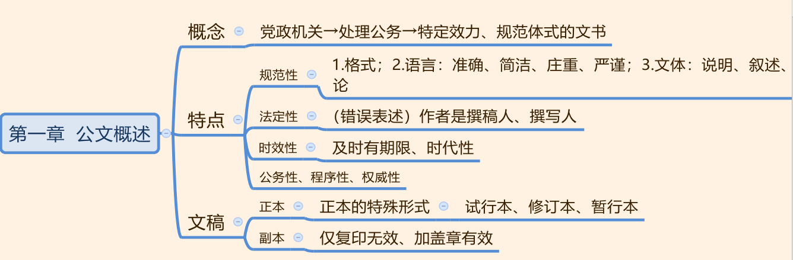
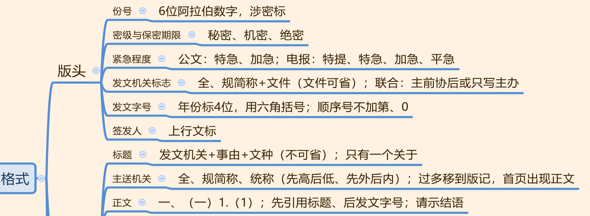
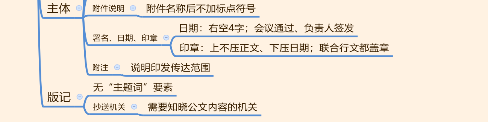
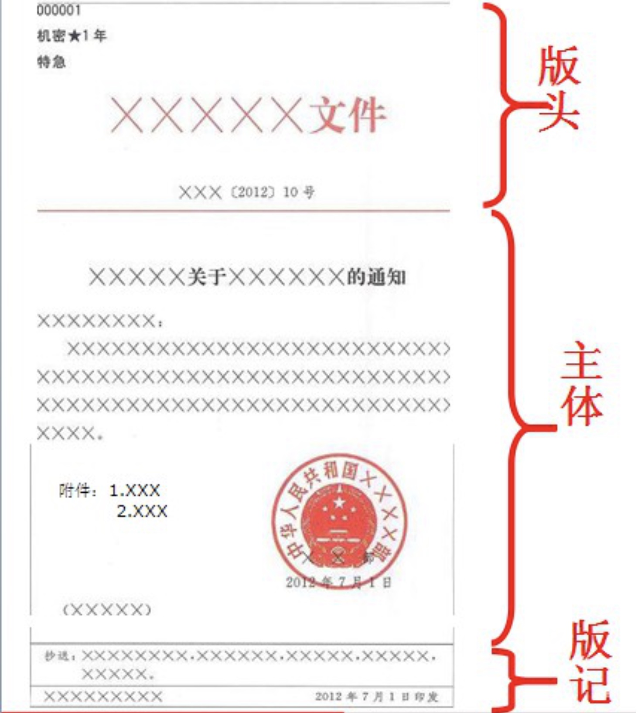
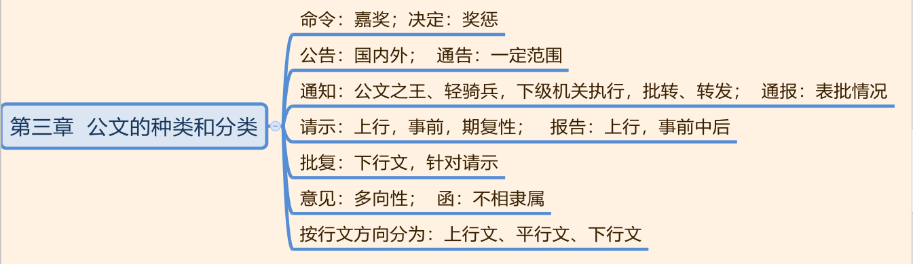
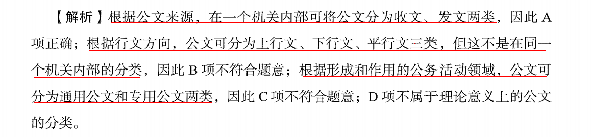
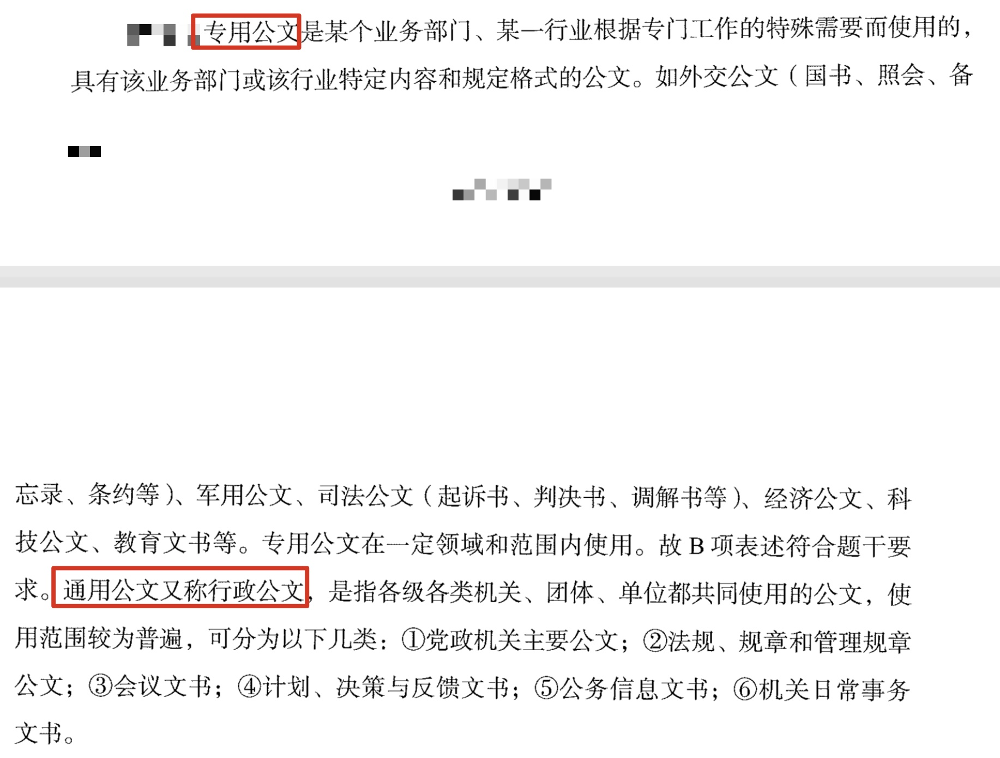
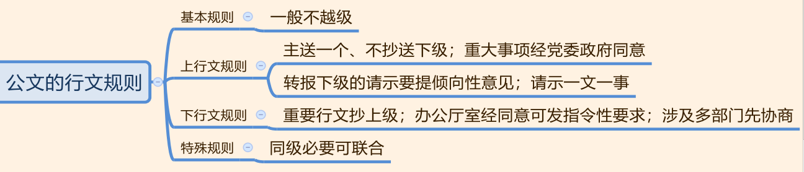
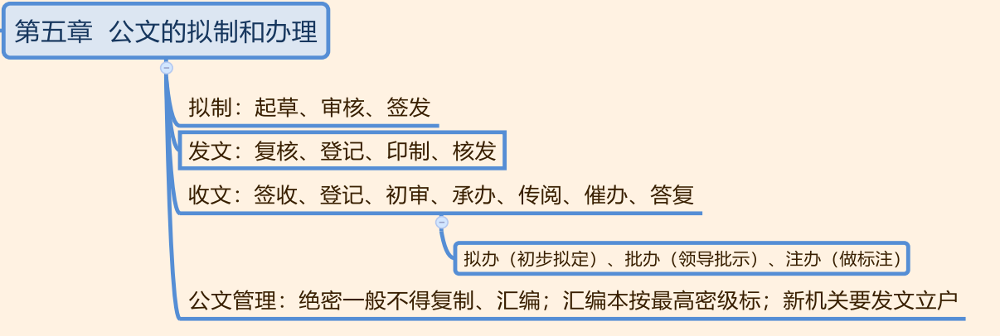

## 一、公文概述



1. 概念：由党政机关发出，用于领导下级、 履行职能，具有特定效力和规范体式的文书。

2. 特点：六大特点，重点掌握规范性、法定性和时效性。
   - （1）规范性（三层意思）： 
     - ①公文格式要规范。
     - ②公文语言表达要规范：准确（第一要求）、简洁、庄重、严谨。 
     - ③公文文体要规范：可以用说明、叙述和议论，不能抒情和描写。

   - （2）法定性：作者法定(发文机关)。常见干扰项： 公文的作者是撰稿人/撰写人（错误）。
   - （3）时效性：公文及时有期限， 内容上要体现时代性、与时俱进。
   - （4）公务性、权威性、程序性。

3. 文稿：
   - （1）正本： 正式实施的文本， 有效力。正本有三种特殊形式： 试行本、修订本、暂行本，三者均有效力，如果过了试行期、 修订期或者暂行期后要一直使用， 可以将其变成正本继续使用，因此称这三种形式为正本的特殊形式。
   - （2）副本：仅复印没有盖章则没有效力， 复印后加盖公章才有效力。

---
## 二、公文格式






### 版头
1. 份号： 由 6 位阿拉伯数字组成，若不够 6 位要添 0 凑齐 6 位数。 **只有涉密公文才需要标注份号。**

2. 密级与保密期限： 绝密（ 含有**最**重要/非常重要的保密事项，泄密会**特别严重损害**国家安全利益）、机密（ 含有重要的保密事项，泄密会严重损害安全利益）、 秘密（ 含有一般性的保密事项）。

3. 紧急程度： 公文的紧急程度只有两个， 即特急和加急。 电报的紧急程度有特提、特急、加急、平急。 注意：做题时要看清楚问的是公文还是电报。

4. 发文机关标志：
   - （1） 写法： 全称/规范化简称+文件，其中“文件”二字可以省略。
   - （2）联合行文时有两种写法：①全部写上： 主办在前，协办在后。②只写主办方。

5. 发文字号：
   - （1） 三部分组成： 机关代字（发、呈、函） +年份+顺序号。 注意：根据条例规定， 考试若出现“XX 字” 一定是错误的。
   - （2）年份：写全 4 位阿拉伯数字， 外用六角括号。
   - （3） 顺序号不加“第”、不加“0”，如“1 号”不能写成“01 号”。
   - （4） 一个公文的发文字号只有一个，联合行文时用主办方的发文字号。

6. 签发人：上行文应当标注签发人姓名。

### 主体

1. 标题：
   - （1）组成：机关+事由+文种。注意： **唯独文种不可省略**。
   - （2） 一个完整的公文标题较长， 若一行写不下， 可拆行书写，回行时要做到词义完整。
   - （3） 完整的公文标题中， 介词“关于”只有一个。

2. 主送机关：
   - （1）主送机关可写全称、规范化简称或统称（先高后低、先外后内、党政军群）。
   - （2） 主送机关太多时可移到版记，因为规定公文首页必须出现正文。

3. 正文：
   - （1）序数（考查先后顺序）：“一、” “（一）” “1.” “（ 1）”
   - （2）语言表达：准确简洁无歧义，色彩搭配要恰当。
   - （3）引用公文：**先引用标题，后引用发文字号。**
   - （4）结语：请示（常考）、函。“妥否，请批示”可以作为请示的结语，语气谦和得体。
   - （5）署名、日期和印章： 1 月 6 日开会， 1 月 8 日发公文，成文日期是 1 月 8 日。
   - （6）印章：所有联合行文单位都需要署名和盖章。

4. 附件说明： 若公文中有需要附带说明的事项，要写附件说明。
   - （1） 顺序号+附件名称。
   - （2） 公文只有一个附件时，不需要标顺序号。
   - （3） 附件名称后不加标点符号。

5. 落款：署名、日期和印章。
   - （1）署名：全称/简称，写在日期之上，居中分布。
   - （2）日期：右空四字。 会议通过的日期； 负责人签发的日期。
   - （3）印章：上不压正文， 下压成文日期。**联合行文时所有机关都要署名和盖章**。

6. 附注： 左下角加小括号，说明公文的发放和传达方式。

### 版记
> 版记包含：抄送机关、印发机关、印发日期、分割线

1. 版记（很少考查）：“抄送： XX”为抄送机关， 左下角“XXX”为印发机关， 右下角为印发日期。版记的常见考点：
   - （1）版记中无“主题词” 要素： 主题词指关键词， 旧条例要求在“抄送： XX”上方写主题词， 新版条例中删除了“主题词” 要素。
   - （2）抄送机关： 指对公文内容需要了解或知晓的机关。如市公安局给省公安厅发公文，内容比较重要， 此时需要抄送给直接上级市政府，写上“抄送：市政府”。
   - （3）印发机关：通常指发文机关的办公厅或者办公室。如省政府发文，印发机关通常是省政府办公厅；市政府发文，印发机关通常是市政府办公室。
   - （4）印发日期在成文日期之后：如一篇公文的成文日期是 1 月 3 号，印发日期为 1 月 1 日，这是不可能的， 先成文才能印发， 印发日期一定在成文日期之后。

2. 页码（简单了解）： 单页码居右空一字， 双页码居左空一字： “1、 3、 5、 7、 9”为单页码，要居右写；“2、 4、 6、 8、 10”是双页码，要居左写。 因为一般居左装订，如果把页码写在同一侧，则可能会有一侧的页码被装订进去。

3. 公文的字体字号： 对绝大多数同学只要求掌握“公文在一般情况下使用 3 号仿宋字体”即可，学有余力的同学可以掌握后面的内容。

4. 紧急公文只有特急和加急两个级别。

### 成文日期
> 《党政机关公文处理条例》规定公文的三种成文日期。

1. 单独发文：领导人签发。

2. 会议通过：会议通过的时间为准。

3. 联合行文：最后一个签发的日期为准。

--- 
## 三、公文的种类和分类


### 公文的种类

```
      常考文种总结

国内外事用公告，一定范围用通告。
表批情况用通报，执行批转用通知。
汇报工作用报告，请求批准用请示。
提出见解用意见，不相隶属请用函。
```
1. 常考 5-12 以及 14。

2. 国内外事用公告，一定范围用通告。

3. 表批情况用通报，执行批转用通知：表彰批评告知重要事项是用通报。要求下级机关执行批转用通知。

4. 汇报工作用报告，请求批准用请示。 请示请求批准上级要回复批复。

5. 提出见解用意见，不相隶属请用函。 意见具有多向性，既可以给上级、也可以给平级和下级；不相隶属都用函。

6. 会议纪要和会议记录不是法定文种，题目中出现要排除。

### 公文的分类

1. 重点是文种。

2. 文种：
   - （1）**决定**既可以奖励也可以用于惩罚
   - （2）**公告**是告知性文种，**通告**也是，但区别是**公告**是要国内外知晓，**通告**是一定范围内周知即可。
   - （3）**意见**的行文是具有多向性。
   - （3）**通知**使用频率高，是“公文之王”或公文中的“轻骑兵”。**通知可以用于转发和批转公文。**
   - （4）表批情况用**通报**。
   - （5）**请示**和**报告**都是上行文，请示不可以“先斩后奏”，报告事前、事中、事后均可。请示期待上级答复，具有期复性。**批复**是针对请示的，是下行文。
   - （6）不相隶属机关之间用**函**。
   - （7）批转公文用**通知**。
   - （8）某地的工商分局建议市局统一整治，就是提建议，用意见这一文种。意见的行文具有多向性。若题目变为工商分局想开展整治活动，请求上级批准，应该用请示。

3. 公文的分类重点是*行文方向分类*。分为上行文、平行文和下行文。

4. 15 种公文是**通用公文**，判决文书等是**专用公文**。



5. 计划是对工作目标的分别的工作任务，一份完整的计划包括五个部分，即 **现状分析、目标和任务、主要措施、实施步骤、执行要求**。

---
## 四、公文的行文规则


```
上行文行文规则
主送一个防推责，重大事项经同意。
请示转报表倾向，一文只能写一事。
公文机关对机关，双重领导可抄送。
```

```
下行文行文规则
重要行文抄上级，多个部门先协商。
办公厅室能独立，双重领导可抄送
```
1. 基本行文规则，一般情况下不得越级发文，有三种特殊情况。

2. 上行文原则上主送一个，不能抄送下级；重大事项要经本级党委同意。转报下级的请示事项不得原文转报；请示要求一文一事。

3. 下行文规则：重要的下行文要抄送给直接上级。**办公厅或办公室外其他部门不得向下发指令性要求。**

4. 特殊规则：内容涉及多部门，发下行文时要先协商一致，必要时可以联合行文。

5. 除办公厅、办公室外，其余内设机构都不得对外正式行文。


---
## 五、公文拟制和办理


1. 公文拟制：起草、审核、签发。

2. 发文：复核、登记、印制、核发。

3. 收文：签收、登记、初审后由工作人员拟办处理意见，后经领导进行批办，接下来是承办。承办涉及催办，最后给出答复。

4. 有价值的公文归档，没有价值的要销毁，有错误的公文要清退。

5. 绝密公文一般不得复制，汇编本要按照最高密级批注。

6. 新机关要发文立户。

---
## 六、公文实务
1. 文种记关键词：
   - （1）国内外发公文用公告，一定范围用通告。
   - （2）转发公文用通知。
   - （3）请示不可以先斩后奏，必须事前请示。报告可事前、事中和事后。
   - （4）函适用于不相隶属机关发公文，是平行文。

2. 行文规则：公文一律不得越级（错误），有三种特殊情况。**上行文不可以多头主送，请示不可以一文多事；涉及多部门职权范围要协商一致；同级机关必要时可以联合行文。**

3. 签发是拟制的最后一个环节。

4. 收文办理中：拟办在前，批办在后。

5. 机密公文一般不得复制汇编（错误），绝密不可以复制汇编。

6. 格式和文种是重点，文种通过关键词记忆即可，格式需要看图记忆。知识点看完后，下一步需要刷题，如果有些题目是旧的可以不纠结，一切以新条例为准。


