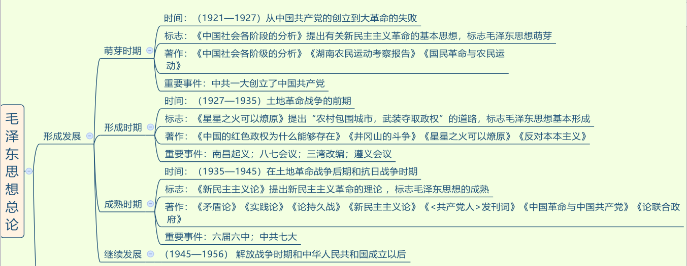
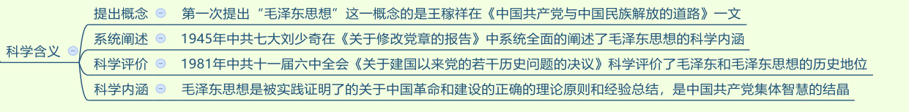
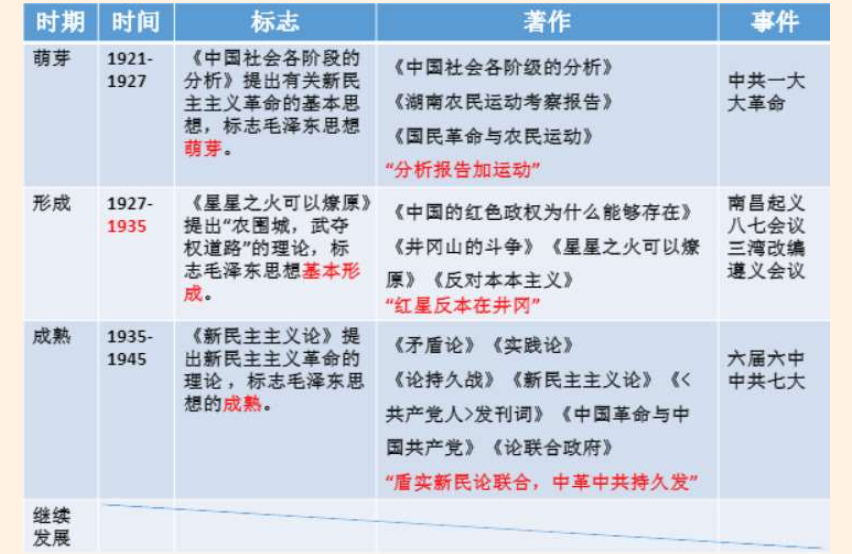
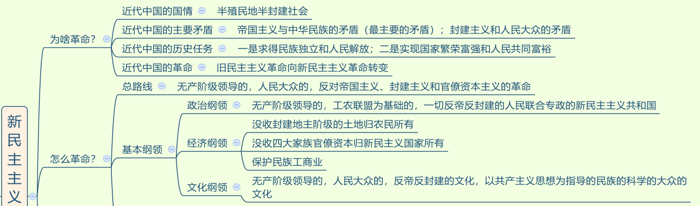
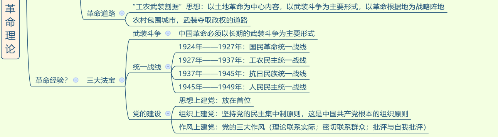

## 一、毛泽东思想概要

### (一) 毛泽东思想总论

1. 时间： 1935 年召开遵义会议，标志我党从幼稚走向成熟。

2. 标志：
   - （1）萌芽：《中国社会各阶级的分析》。
   - （2）形成：《星星之火可以燎原》，“星星”指农村。
   - （3）成熟：《新民主主义论》，提出新民主主义革命理论。

3. 著作：除考查理论贡献，还可能考查著作的排序，记住口诀即可。
   - （1）萌芽：分析报告加运动。
   - （2）形成：红星反本在井冈。
   - （3）成熟：盾实新民论联合，中革中共持久发。

4. 重要事件：
   - （1）萌芽：掌握一大的时间、地点和人员。
   - （2）形成：
     - ①南昌起义打响武装反抗国民党反动派的第一枪。
     - ②八七会议提出了“枪杠子里出政权”的霸气革命论断。
     - ③三湾改编提出党对军队的绝对领导。
     - ④遵义会议确立以`毛泽东`这个人，为核心的正确领导。
   - （3）成熟：
     - ①六届六中全会：毛六六论马。
     - ②中共七大：确立`毛泽东思想`为党的指导思想。
     
> 其他

1. 洛川会议建立敌后抗日根据地，瓦窑堡会议建立抗日民族统一战线，口诀：瓦统洛后。

### (二) 新民主主义革命

#### 1. 近代中国社会与资产阶级民主革命
> 毛泽东思想是关于革命和建设的理论。
1. 为什么要革命：
   - （1）近代中国国情：半殖民地半封建社会。
   - （2）两对主要矛盾：帝国主义和中华民族的矛盾；封建主义和人民大众的矛盾。其中帝国主义和中华民族的矛盾是最主要的，因为如果不把帝国主义赶跑，中国将亡国灭种，比如夫妻吵架时，此时邻居老王也来，这时重要的是先把老王赶跑。
   - （3）近代中国的两大历史任务：独立解放，共同富裕。
     - ①第一大任务：先要反帝反封，求得民族独立和人民解放。
     - ②第二大任务：取得民族独立和人民解放后，如果国家落后，人民不富裕，仍然会“挨打”，所以需要实现国家的繁荣富强和人民共同富裕。

2. 革命分为旧民主主义革命和新民主主义革命两个阶段：
   - （1）新旧民主主义革命的分水岭： 1919 年五四运动。原因：五四运动标志无产阶级登上历史舞台。
   - （2）区别新旧民主主义革命的根本标志：领导阶级不同。新的是无产阶级领导，旧的是资产阶级领导。

#### 2. 新民主主义革命的总路线

1. 新民主主义革命的总路线（多选）：无产阶级领导革命；人民大众一起干革命；革帝国主义、封建主义和官僚资本主义的命。**无产阶级领导是新民主主义革命总路线的核心（单选）**，原因：必须坚持无产阶级为领导（核心），国共第一次合作以失败告终，共产党以个人身份无条件加入国民党，放弃领导权，但国民党却发动四一二、七一五反革命政变，故不能再犯相同的错误。

2. 新民主主义革命的领导阶级：无产阶级。实质上是工人的领导（单选），工人是最彻底的无产阶级，革命性最强。

3. 新民主主义革命的动力：人民大众。人民大众包含：
   - （1）无产阶级：既是领导阶级也是动力，不能光领导，也要革命。
   - （2）农民阶级：是革命的主力军，“主力”即人多。
   - （3）城市小资产阶级：有一定的资产，但资产较少，这种人可以自食其力，但是不剥削人。如知识分子，可以写稿子养活自己；小商小贩；手工业者；自由职业者等。
   - （4）民族资产阶级：具有两面性，即有革命的一面，受到帝国主义和封建主义的压迫（哪里有压迫，哪里就有反抗）；有妥协的一面，本身是资本家，当革命到达一定高潮，侵犯他们的利益时，会退缩妥协。

4. 新民主主义革命的对象：三座大山，即帝国主义、封建主义、官僚资本主义（蒋、宋、孔、陈四大家族）。反对官僚资本主义，主要因为他们是资本主义（错误），原因：官僚资本主义会勾结帝国主义为自己谋利，勾结封建主义压迫人民群众，故要反官僚资本主义。

#### 3. 新民主主义的基本纲领
> 新民主主义革命的基本纲领：重点是政治纲领和经济纲领。

1. 政治纲领：现在的国体是人民民主专政，新民主主义革命时期是人民联合专政，因为当时要联合一切可以联合的阶级。

2. 经济纲领：
   - （1）**没收封建地主阶级的土地归农民所有：中心内容**。要取得革命的胜利，农民人数最多，故要拉拢农民，而农民最在意土地，当时土地在地主手里，故要斗地主。
   - （2）没收四大家族官僚资本归新民主主义国家所有：具有双重性质。第一重是具有新民主主义革命性质，第二重具有是社会主义革命的性质。
     - ①新民主主义革命的性质：新民主主义革命的对象有三个，其中包括官僚资本主义，要没收他们的资本，具有新民主主义革命的性质。
     - ②社会主义革命的性质：归国家所有，由私有变为公有。
   - （3）保护民族工商业：极具特色。在全世界范围内，凡是无产阶级要干革命，都要推翻资产阶级，而我们不仅不推翻民族资产阶级，还要保护民族资产阶级。民族资产阶级有钱，不管是中国的革命还是建设都要有经济基础，并且民族资产阶级有革命的一面，可以拉拢过来一起干革命。

3. 考点：
   - （1）经济纲领（多选）：两个没收、一个保护。
   - （2）定位（单选）：
     - ①中心内容：没收封建地主阶级的土地归农民所有。
     - ②极具特色：保护民族工商业。
     - ③具有双重性质：没收四大家族官僚资本归新民主主义国家所有。

### (三) 新民主主义革命的基本经验
> 总结革命胜利的基本经验，即一条道路和三大法宝。

1. 一条道路：农村包围城市、武装夺取政权的道路。考点：这条道路是在工农武装割据思想指引之下形成的。

> 工农武装割据思想的内容（多选题）：
   - （1）以土地革命为中心内容：要取得革命的胜利，就要拉拢农民， 农民最在意土地。
   - （2）以武装斗争为主要形式：不能以和平的方式解决，枪杆子里面出政权。
   - （3）以革命根据地为战略阵地：毛泽东将革命根据地比喻为人的屁股，人没有屁股就没办法坐下休息，要一直走或一直站着，会非常累，同样革命也需要休养生息的地方，即革命根据地。
   - （4）切割记忆：“工农”对应土地革命；“武装”对应武装斗争；“割据”对应革命根据地。

2. 三大法宝：武装斗争、统一战线、党的建设。口诀：统武党。
> 武装斗争：主要形式。武装斗争需要人民军队：

   - （1）人民军队的唯一宗旨：全心全意为人民服务，这不仅是我党的根本宗旨，也是人民军队的唯一宗旨，人民军队为人民。每次阅兵时主席会说“同志们辛苦了”，军队回应“为人民服务”，喊出了他们的心声，喊出了人民军队的唯一宗旨。
   - （2）人民军队的根本原则：党对军队的绝对领导。

> 统一战线：指要干倒一个目标时，一个人的力量很薄弱，要找同一战壕的人。如电影《老炮儿》中打架前会找战友。
   - （1） 1924 年—1927 年，国民大革命时期，要对付北洋军阀，北洋军阀的力量太过强大，因此形成国民革命统一战线，即国共第一次合作。
   - （2） 1927 年—1937 年，土地革命时期，国共十年对峙，我党躲到山里积蓄力量，拉拢农民共同对抗国民党，形成工农民主统一战线。
   - （3） 1937 年—1945 年，全面抗日战争时期，形成抗日民族统一战线。
   - （4） 1945 年—1949 年，解放战争时期，反美反蒋，形成人民民主统一战线。
   - 注意： 国民党绝大多数属于民族资产阶级，除了蒋介石等四大家族是大资产阶级。

> 党的建设：毛泽东时期就已经提出党的建设是伟大工程。
   - (1) 思想上建党：毛泽东在党的建设当中，将思想上建党放在首位。毛泽东认为有些人只是在组织上入党，但思想上非常落后，因此他认为只有在思想上入了党才能在组织上入党。区分：**十九大报告中提出，在党的建设当中将政治建设放在首位。考试问将哪个放在首位，若强调毛泽东思想则选思想建设，若没有强调则选政治建设**。

   - (2) 组织上建党：民主集中制是中国共产党的根本组织原则（单选题）。不能光民主，没有效率；也不能光集中，容易搞一言堂，要将民主和集中相结合。

   - (3) 作风上建党：毛泽东的著作《论联合政府》中提出党的三大作风，即理论联系实际、密切联系群众、批评与自我批评（多选题）。口诀：批李密。

3. 总结：新民主主义革命：中国处于双半社会，三座大山压在头上，有很多矛盾，不得不革命。
   - （1）总路线：
     - ①领导权是革命的核心。
     - ②农民阶级是革命的主力军。
   - （2）经济纲领：
     - ①三个内容（多选题）：两个没收、一个保护。
     - ②中心内容是斗地主。
     - ③没收四大家族官僚资本归新民主主义国家所有具有双重性质。
   - （3）革命经验：
    - ①一条道路：“农村包围城市、武装夺取政权”的道路。思想指引：“工农武装割据”思想。切割记忆：“工农”对应土地革命，“武装”对应武装斗争，“割据”对应革命根据地。
    - ②三大法宝：武装斗争、统一战线、党的建设。口诀：统武党（一个英勇的战士拿着两个武器，英勇的战士是我党，两个武器是指统一战线和武装斗争）

---
## 二、中国特色社会主义建设

