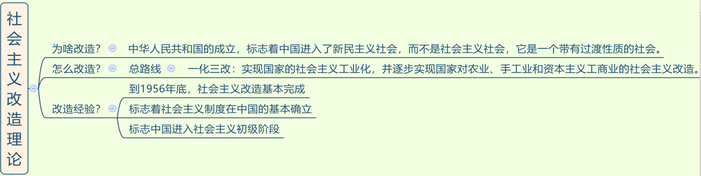

## 一、毛泽东思想概要

### (一) 毛泽东思想总论


1. 时间： 1935 年召开遵义会议，标志我党从幼稚走向成熟。

2. 标志：
   - （1）萌芽：《中国社会各阶级的分析》。
   - （2）形成：《星星之火可以燎原》，“星星”指农村。
   - （3）成熟：《新民主主义论》，提出新民主主义革命理论。

3. 著作：除考查理论贡献，还可能考查著作的排序，记住口诀即可。
   - （1）萌芽：分析报告加运动。
   - （2）形成：红星反本在井冈。
   - （3）成熟：盾实新民论联合，中革中共持久发。

4. 重要事件：
   - （1）萌芽：掌握一大的时间、地点和人员。
   - （2）形成：
     - ①南昌起义打响武装反抗国民党反动派的第一枪。
     - ②八七会议提出了“枪杠子里出政权”的霸气革命论断。
     - ③三湾改编提出党对军队的绝对领导。
     - ④遵义会议确立以`毛泽东`这个人，为核心的正确领导。
   - （3）成熟：
     - ①六届六中全会：毛六六论马。
     - ②中共七大：确立`毛泽东思想`为党的指导思想。
     
> 其他

1. 洛川会议建立敌后抗日根据地，瓦窑堡会议建立抗日民族统一战线，口诀：瓦统洛后。

### (二) 新民主主义革命


#### 1. 近代中国社会与资产阶级民主革命
> 毛泽东思想是关于革命和建设的理论。

1. 为什么要革命：
   
   - （1）近代中国国情：半殖民地半封建社会。
   - （2）两对主要矛盾：**帝国主义和中华民族的矛盾；封建主义和人民大众的矛盾**。其中**帝国主义和中华民族的矛盾是最主要的**，因为如果不把帝国主义赶跑，中国将亡国灭种，比如夫妻吵架时，此时邻居老王也来，这时重要的是先把老王赶跑。
   - （3）近代中国的两大历史任务：独立解放，共同富裕。
     - ①第一大任务：先要反帝反封，求得民族独立和人民解放。
     - ②第二大任务：取得民族独立和人民解放后，如果国家落后，人民不富裕，仍然会“挨打”，所以需要实现国家的繁荣富强和人民共同富裕。

2. 革命分为旧民主主义革命和新民主主义革命两个阶段：
   - （1）新旧民主主义革命的分水岭： 1919 年五四运动。原因：五四运动标志无产阶级登上历史舞台。
   - （2）区别新旧民主主义革命的根本标志：领导阶级不同。新的是无产阶级领导，旧的是资产阶级领导。

#### 2. 新民主主义革命的总路线

1. 新民主主义革命的总路线（多选）：无产阶级领导革命；人民大众一起干革命；革帝国主义、封建主义和官僚资本主义的命。**无产阶级领导是新民主主义革命总路线的核心（单选）**，原因：必须坚持无产阶级为领导（核心），国共第一次合作以失败告终，共产党以个人身份无条件加入国民党，放弃领导权，但国民党却发动四一二、七一五反革命政变，故不能再犯相同的错误。

2. 新民主主义革命的领导阶级：无产阶级。实质上是工人的领导（单选），工人是最彻底的无产阶级，革命性最强。

3. 新民主主义革命的动力：人民大众。人民大众包含：
   - （1）无产阶级：既是领导阶级也是动力，不能光领导，也要革命。
   - （2）农民阶级：是革命的主力军，“主力”即人多。
   - （3）城市小资产阶级：有一定的资产，但资产较少，这种人可以自食其力，但是不剥削人。如知识分子，可以写稿子养活自己；小商小贩；手工业者；自由职业者等。
   - （4）民族资产阶级：具有两面性，即有革命的一面，受到帝国主义和封建主义的压迫（哪里有压迫，哪里就有反抗）；有妥协的一面，本身是资本家，当革命到达一定高潮，侵犯他们的利益时，会退缩妥协。

4. 新民主主义革命的对象：三座大山，即帝国主义、封建主义、官僚资本主义（蒋、宋、孔、陈四大家族）。反对官僚资本主义，主要因为他们是资本主义（错误），原因：官僚资本主义会勾结帝国主义为自己谋利，勾结封建主义压迫人民群众，故要反官僚资本主义。

#### 3. 新民主主义的基本纲领
> 新民主主义革命的基本纲领：重点是政治纲领和经济纲领。

1. 政治纲领：现在的国体是人民民主专政，新民主主义革命时期是人民联合专政，因为当时要联合一切可以联合的阶级。

2. 经济纲领：
   - （1）**没收封建地主阶级的土地归农民所有：中心内容**。要取得革命的胜利，农民人数最多，故要拉拢农民，而农民最在意土地，当时土地在地主手里，故要斗地主。
   - （2）没收四大家族官僚资本归新民主主义国家所有：具有双重性质。第一重是具有新民主主义革命性质，第二重具有是社会主义革命的性质。
     - ①新民主主义革命的性质：新民主主义革命的对象有三个，其中包括官僚资本主义，要没收他们的资本，具有新民主主义革命的性质。
     - ②社会主义革命的性质：归国家所有，由私有变为公有。
   - （3）保护民族工商业：极具特色。在全世界范围内，凡是无产阶级要干革命，都要推翻资产阶级，而我们不仅不推翻民族资产阶级，还要保护民族资产阶级。民族资产阶级有钱，不管是中国的革命还是建设都要有经济基础，并且民族资产阶级有革命的一面，可以拉拢过来一起干革命。

3. 考点：
   - （1）经济纲领（多选）：两个没收、一个保护。
   - （2）定位（单选）：
     - ①中心内容：没收封建地主阶级的土地归农民所有。
     - ②极具特色：保护民族工商业。
     - ③具有双重性质：没收四大家族官僚资本归新民主主义国家所有。

### (三) 新民主主义革命的基本经验
> 总结革命胜利的基本经验，即一条道路和三大法宝。

1. 一条道路：农村包围城市、武装夺取政权的道路。考点：这条道路是在工农武装割据思想指引之下形成的。

> 工农武装割据思想的内容（多选题）：
  
   - （1）以土地革命为中心内容：要取得革命的胜利，就要拉拢农民， 农民最在意土地。
   - （2）以武装斗争为主要形式：不能以和平的方式解决，枪杆子里面出政权。
   - （3）以革命根据地为战略阵地：毛泽东将革命根据地比喻为人的屁股，人没有屁股就没办法坐下休息，要一直走或一直站着，会非常累，同样革命也需要休养生息的地方，即革命根据地。
   - （4）切割记忆：“工农”对应土地革命；“武装”对应武装斗争；“割据”对应革命根据地。

2. 三大法宝：武装斗争、统一战线、党的建设。口诀：统武党。

> 武装斗争：主要形式。武装斗争需要人民军队：

   - （1）人民军队的唯一宗旨：全心全意为人民服务，这不仅是我党的根本宗旨，也是人民军队的唯一宗旨，人民军队为人民。每次阅兵时主席会说“同志们辛苦了”，军队回应“为人民服务”，喊出了他们的心声，喊出了人民军队的唯一宗旨。
   - （2）人民军队的根本原则：党对军队的绝对领导。

> 统一战线：指要干倒一个目标时，一个人的力量很薄弱，要找同一战壕的人。如电影《老炮儿》中打架前会找战友。
  
   - （1） 1924 年—1927 年，国民大革命时期，要对付北洋军阀，北洋军阀的力量太过强大，因此形成国民革命统一战线，即国共第一次合作。
   - （2） 1927 年—1937 年，土地革命时期，国共十年对峙，我党躲到山里积蓄力量，拉拢农民共同对抗国民党，形成工农民主统一战线。
   - （3） 1937 年—1945 年，全面抗日战争时期，形成抗日民族统一战线。
   - （4） 1945 年—1949 年，解放战争时期，反美反蒋，形成人民民主统一战线。
   - 注意： 国民党绝大多数属于民族资产阶级，除了蒋介石等四大家族是大资产阶级。


> 党的建设：毛泽东时期就已经提出党的建设是伟大工程。
   
   - (1) 思想上建党：毛泽东在党的建设当中，将思想上建党放在首位。毛泽东认为有些人只是在组织上入党，但思想上非常落后，因此他认为只有在思想上入了党才能在组织上入党。区分：**十九大报告中提出，在党的建设当中将政治建设放在首位。考试问将哪个放在首位，若强调毛泽东思想则选思想建设，若没有强调则选政治建设**。

   - (2) 组织上建党：民主集中制是中国共产党的根本组织原则（单选题）。不能光民主，没有效率；也不能光集中，容易搞一言堂，要将民主和集中相结合。

   - (3) 作风上建党：毛泽东的著作《论联合政府》中提出党的三大作风，即理论联系实际、密切联系群众、批评与自我批评（多选题）。口诀：批李密。

3. 总结：新民主主义革命：中国处于双半社会，三座大山压在头上，有很多矛盾，不得不革命。
   - （1）总路线：
     - ①领导权是革命的核心。
     - ②农民阶级是革命的主力军。
   - （2）经济纲领：
     - ①三个内容（多选题）：两个没收、一个保护。
     - ②中心内容是斗地主。
     - ③没收四大家族官僚资本归新民主主义国家所有具有双重性质。
   - （3）革命经验：
     - ①一条道路：“农村包围城市、武装夺取政权”的道路。思想指引：“工农武装割据”思想。切割记忆：“工农”对应土地革命，“武装”对应武装斗争，“割据”对应革命根据地。
     - ②三大法宝：武装斗争、统一战线、党的建设。口诀：统武党（一个英勇的战士拿着两个武器，英勇的战士是我党，两个武器是指统一战线和武装斗争）

### (四) 社会主义改造的理论原则与经验总结


1. 为啥改：新中国成立后，进入新民主主义社会，因为当时存在大量的资本家和私有制。新民主主义社会是一个带有过渡性质的社会。

2. 怎么改：总路线是一化（主体）三改，也称一体两翼。

3. 改造意义： 1956 年底基本完成，标志剥削阶级和剥削制度被消灭，社会主义制度在中国基本确立，中国进入社会主义初级阶段。

### (五) 社会主义若干重大理论问题的探索成果


> 《论十大关系》：
1. 背景： 1956 年，社会主义改造基本完成，建设起社会主义制度，接下来要进行建设。毛泽东让十几个部门下去调研，听各部门报告的时候写出了《论十大关系》。

2. 《论十大关系》的基本方针（单选题）：**调动一切积极因素为社会主义建设事业服务**。

3. 建设社会主义的根本思想：根据本国国情走自己的道路。我国现在提倡四个自信，其中一个是道路自信，走中国特色社会主义道路，与毛泽东当年提出的“走自己的道路”有异曲同工之妙。

> 《关于正确处理人民内部矛盾的问题》：

1. 社会主义三大改造完成后，出现一些农民退社、工人罢工、学生罢课等反抗情绪，当时的领导干部受之前革命的影响，一发现反抗情绪就要革命。毛泽东看到这种情况，区分了当时社会存在的两种矛盾：一种是敌我矛盾，要用专政的手段解决；另一种是人民内部矛盾，要用民主的方式解决，从团结的愿望出发，经过批评的手段，最后达到团结。农民退社、工人罢工、学生罢课等属于人民内部的矛盾，要用民主的方式解决。

2. 在当时，人民内部矛盾是主要矛盾，因为人民内部矛盾较多，敌我矛盾固然有，如一些分裂分子和对抗分子，但较少，因此主力是解决人民内部矛盾。

3. 国家政治生活的主题是正确处理人民内部矛盾（考点）。

> 社会主义建设：经济建设、政治建设、文化建设、国防建设和对外关系。

> 经济建设：
   - （1） 1956 年中共八大提出的方针：既反保守又反冒进，在综合平衡中稳步前进。“左”是指超越于现实，犯冒进主义错误；“右”指落后于现实，犯保守主义错误，因此提出“既反保守又反冒进，在综合平衡中稳步前进”的方针。
  - （2） 经济体制改革的初步探索：陈云提出“三个主体、三个补充”，以计划经济为主体，同时要有市场经济作为补充。

> 社会主义政治建设
   - （1）人民代表大会制度是我国的根本政治制度。
   - （2）中国共产党同各民主党派“长期共存，互相监督”的方针。
   - （3）实现民族平等的民族区域自治制度。
   - （4）中国共产党同各民主党派“长期共存，互相监督”的方针（毛泽东提出）。后来邓小平增加“肝胆相照、荣辱与共”，因此现在坚持的是十六字方针。

> 文化建设：
1. “双百、两为”方针：
   - （1）**文化科学事业**实行“百花齐放，百家争鸣”的方针。当时有人在解放日报上发表《我的丈夫，我的蜜月》的文章，掀起一阵谩骂。此时毛泽东提出科学文化的不同派别可以自由发展、自由争论，“一花独放不是春，百花齐放春满园”，因此提出“百花齐放，百家争鸣”的方针。
   - （2）对待**历史和传统文化**采取“古为今用”的方针；对待**外国文化**采取“洋为中用”的方针。

2. **发展科学技术和教育事业，建设宏大的工人阶级知识分子队伍**。革命时期将知识分子归为小资产阶级，因为他们能写稿子赚钱，自食其力，后来周恩来提出“知识分子也是工人阶级的一部分”。原因：建国初期知识分子不被看好，因为之前上得起学的大多为地主、资本家，所以建国初期知识分子只能做一些低级的职业。但要进行社会主义文化建设，没有知识分子是不行的，因此周恩来提出，不管是体力劳动者还是脑力劳动者，都属于工人阶级的一部分。

> 社会主义国防建设和对外关系
1. 建国初期，毛泽东的三大外交方针（多选题）：
   - （1）另起炉灶：蒋介石和国民党与各国建立的外交关系，我国一概不承认。
   - （2）打扫干净屋子再请客：新中国成立之初，有很多帝国主义在中国的残余势力，要先将其扫出去。
   - （3）一边倒：建国初期，我国国力很弱，一穷二白，在国际上的地位很低。当时国际上有以苏联为主的社会主义阵营和以美国为首的资本主义阵营，中国倒向以苏联为首的社会主义阵营。

2. 周恩来是一位出色的外交家。之前有记者问周总理“为什么中国人走的路叫马路”，周总理回答“我们走的是马克思主义道路”，记者又问“中国人为什么低头走路”，周总理回答“低着头走路是在走上坡路，仰着头走路是在走下坡路”。时政考点： 2018 年是周恩来诞辰 120 周年。

3. **和平共处五项原则**：

   - （1）周恩来于 1953 年会见印度代表团（考点）时首次提出。
   - （2） 1954 年，中印缅共同倡导。
   - （3） 1955 年万隆会议，广泛接受。
   - （4）内容：互相尊重主权和领土完整（前提和核心）、互不侵犯、互不干涉内政、平等互利、和平共处。

### （六）毛泽东思想活的灵魂

> 毛泽东思想的活的灵魂

1. 毛泽东思想的活的灵魂（多选题）：实事求是（最基本）、群众路线、独立自主。

2. 实事求是的思想路线：
   - （1）《反对本本主义》中第一次提出**实事求是的思想路线**。
   - （2）对实事求是下定义是在《改造我们的学习》这一著作中。“实事”指客观世界存在的万事万物；“求”指探求、探索；“是”指客观规律；“实事求是”是指探索千变万化的万事万物背后的本质规律。实事求是是思想路线，做任何事情时思想的出发点都是从实际出发。
   - （3）**实事求是是毛泽东思想的精髓**：毛泽东这辈子最讨厌教条主义，当时王明与毛泽东争夺领导权，王明可以用多国语言翻译《共产党宣言》，毛泽东争吵不过，便写下了《反对本本主义》。

3. 群众路线：
   - （1）提出这一概念的是周恩来。
   - （2）定位：党的根本工作路线。要想获得正确的工作方法，不能拍脑袋决策、拍胸脯保证、拍大腿后悔、拍屁股走人，而要从群众中来，到群众中去。
   - （3）内涵：一切为了群众，一切依靠群众；从群众中来，到群众中去。

4. 独立自主：中国革命和建设的基本立足点。中国不管革命还是建设，都要靠自己。

> 在新的历史条件下，坚持和发展毛泽东思想
1. 毛泽东思想是马克思主义同中国具体实际相结合的第一次历史性飞跃的理论成果。第二次历史性飞跃是中国特色社会主义理论体系。

2. 毛泽东思想已经过时（错误）

> 总结
1. 三大法宝统武党：武装斗争、统一战线、党的建设（捅我党）。

2. 三大灵魂实群主：实事求是、群众路线、独立自主（是群主）。

3. 三大作风理密批：理论联系实际、密切联系群众、批评与自我批评（批李密）。

4. 三大反对主宗八：整风运动（1942 年），反对主观主义以整顿学风、反对宗派主义以整顿党风、反对党八股以整顿文风（祖宗八）。

5. 工农武装割据三内容（切割记忆）：工农对应土地革命，武装对应武装斗争，割据对应根据地建设。

> 总结


---
## 二、中国特色社会主义建设

> 组成部分


> 基础理论


> 总体布局(五位一体)


> 基本条件与领导核心


### （一） 总论

#### 邓小平理论
1. 初步形成时期（十一届三中全会到十二大）：
   - （1）十一届三中全会（重点）： 1978 年召开。
     - ①2018 年正值改革开放 40 周年（时政考点）。
     - ②主题报告（单选题考点）：《解放思想、实事求是、团结一致向前看》，也被称为《改革开放的宣言书》。
     - ③补充：意义和作用（多选题考点，也有地方作为简答题和论述题考查），即拨乱反正。表现在三个方面：
       - 第一，思想上，之前华国锋提出的“两个凡是”，即“凡是毛主席作出的决策我们都坚决维护，凡是毛主席作出的指示我们都始终不渝地遵循”的观点是错误的，后确立“解放思想实事求是”的正确思想路线。
       - 第二，政治上，结束“以阶级斗争为纲”，把重点转移到经济建设上来，对内实行改革、对外实行开放。
       - 第三，组织上，形成了以邓小平为核心的中央领导集体。注意：以毛泽东为核心的正确领导是在遵义会议上确立的。
     - （2） 1982 年党的十二大：提出“建设有中国特色的社会主义”这一历史性命题，与现在的表述“建设中国特色社会主义”多了“有”“的”，因为我们越来越自信，已经建成有中国特色社会主义。

2. 形成轮廓（1987 年党的十三大）：阐述了社会主义初级阶段理论，提出社会主义初级阶段的基本路线。

3. 走向成熟（十三大到十四大）：
   - （1） 1992 年南方谈话（考查重点）：于国内环境而言，改革开放越往前推进越让人怀疑，市场经济只有资本主义才可以有，社会主义也可以有么？比如出现 1989 年政治风波。于国际环境而言， 1989 年东欧剧变、 1991 年苏联解体，让人认为社会主义是一种空想。邓小平在 80 多岁的高龄到南方的省市进行视察，发表一系列讲话，合称“南方谈话”。
   - （2）南方谈话内容：
     - ①“三个有利于”（多选题考点）：是否有利于发展社会主义社会的生产力（最基本）、是否有利于增强社会主义国家的综合国力、是否有利于提高人民的生活水平。其中“是否有利于发展社会主义社会的生产力”是最基本的，因为只有生产力发展起来，人民的生活水平和综合国力才能提高。（“三个有利于”，可以记忆为两个“力”，一个“平”）
     - ②“黑猫白猫”理论：“不管是黑猫还是白猫，能抓到老鼠就是好猫”，即不管是计划经济还是市场经济，只要符合“三个有利于”，能够促进生产力发展、提高我国的综合国力，都是可以的，而不用拿姓资姓社来乱扣帽子。
     - ③提出社会主义本质理论。
   - （3） 1982 年 10 月，江泽民主持召开十四大：在会议上回应南方谈话，明确提出经济改革的目标就是建立社会主义市场经济体制，也即是肯定市场经济。

4. 指导思想（党的十五大）： 1997 年这一年， 2 月邓小平逝世， 7 月香港回归， 9 月党召开十五大，并将邓小平理论确立为党的指导思想。

5. 口诀：十一三中要开放（十一届三中全会决定要实行改革开放），十二小平提中特（十二大邓小平提出“建设有中国特色的社会主义”），十三阶段路线定（十三大系统阐述社会主义初级阶段及社会主义初级阶段路线理论），南方三猫论本质（南方谈话、三个有利于、黑猫白猫、社会主义本质理论），十四目标在市场，十五小平成指导。

6. 掌握时间：之前开会时间不固定，后华国锋提出每五年召开一次，十一大不常考，此后从 1982 年十二大开始，以五年一次类推，十三大是 1987 年、十四大是 1992 年，直至 2017 年的十九大。

#### 邓小平理论的内容

1. 主题（常考单选题）：什么是社会主义，怎样建设社会主义。判断：邓小平理论的主题是“什么是社会主义”（错误），原因：不完整，邓小平理论不仅回答了什么是社会主义，还提出了很多方案，即“怎样建设社会主义”。

2. 精髓：
   - （1）毛泽东思想的精髓：实事求是。
   - （2）邓小平理论的精髓：解放思想、实事求是。
   - （3）关系：解放思想是实事求是的前提，只有思想解放，才能实事求是；实事求是是解放思想的目的。

3. 主要内容：社会主义本质理论、社会主义初级阶段理论、改革开放理论、社会主义市场经济理论。市场经济理论在经济中讲解，本节课讲解前三个理论。

4. 三步走战略：邓小平在十三大时提出，我国目前已经实现了第一步和第二步。低级阶段的小康已经实现， 2020 年要实现的是全面建成小康社会。

5. 补充：“小康”的相关考点。
   - （1）小康：“小康”是古时就有的词语，出自《诗经》，即“民亦劳止，汔可小康”。
   - （2）邓小平将小康发展上升到我国的发展战略（十三大提出）。

#### 三个代表
1. 主题（单选题考点）： 建设什么样的党，怎么样建设党。

2. “三个代表”（多选题考点）：
   - （1）内容：代表先进生产力，代表先进文化，代表中国最广大人民的根本利益。
   - （2）有些地方可能与时政结合考查：我国经济发展的主线是供给侧结构性改革，其对立面是需求侧。之前国家依靠投资、出口、消费“三驾马车”拉动内需，我国已成为世界第二大经济体。但国人不在国内消费，转而去外国消费，比如去日本抢购马桶盖，说明我国产品虽然有，但质量不精良。因此要从供给侧入手进行改革，即从生产端入手，提供高质量的、有效的产品给百姓。我党不断推进供给侧改革，是因为中国共产党代表先进生产力的发展要求。

3. 贯彻“三个代表”重要思想，关键在坚持与时俱进，核心在坚持党的先进性，本质在坚持执政为民。 口诀：关于（与时俱进）、心进（党的先进性）、本质（执政为民）。

#### 科学发展观（考查比较少，考对应关系）
1. 科学发展观的第一要义：发展。发展中存在很多问题，比如生态问题、食品安全问题，只是发展中的问题要在发展中解决，其核心还是发展。

2. 科学发展观的核心：以人为本。我们发展不是为了 GDP、为了数字好看，而是为了人（人们群众），核心就是以人为本。因此出现“核心”，基本都与“人”（人心）相关。

3. 科学发展观的基本要求：全面协调可持续。

4. 科学发展观的根本方法：统筹兼顾。

#### 习近平新时代中国特色社会主义思想
1. 习近平新时代中国特色社会主义思想：不是凭空提出。时代背景：新时代，是中国发展新的历史方位。注意：“新时代”不能表述为“新未来”“新方向”，要完全按照政治表述记忆。

2. 十九大报告提出“三个意味”（多选题考点）：
   - （1）意味着从站起来、富起来到强起来的伟大飞跃：中国的近代史是一部屈辱史，被帝国列强“单打”“双打”“混合打”，在民族危难之际，毛泽东带领我们站起来，邓小平改革开放带领我们富起来，习近平带领我们强起来。
   - （2）高高举起了中国特色社会主义伟大旗帜：在全世界范围内，我们飘扬的是“具有中国特色社会主义的伟大旗帜”。**常考“伟大旗帜”，即中国特色社会主义伟大旗帜**。之前表述为“举起”，后改为“高举”，十九大表述为“高高举起”，通过字里行间可以感觉出我们越来越自信。
   - （3）为解决人类问题贡献了中国智慧和中国方案：国家越来越强大，探索出属于自己的道路，成为世界第二大经济体，有底气提供智慧和方案，表明其他国家也可以向中国学习。
   - （4）关键词：“强”“高”“智慧”。

3. 主题：
   - （1）邓小平理论：什么是社会主义，怎样建设社会主义。核心词：“社会主义”。
   - （2）三个代表：建设什么样的党，怎样建设党。核心词：“党”。
   - （3）科学发展观：实现什么样的发展，怎样发展。核心词：“发展”。
   - （4）习近平新时代中国特色社会主义思想（单选题）：坚持和发展什么样的中国特色社会主义，怎样坚持和发展中国特色社会主义。核心词：“中国特色社会主义”。

4. 五个“是”（多选题考点）：
   - （1）是对马克思列宁主义、毛泽东思想、邓小平理论、“三个代表”重要思想、科学发展观的继承和发展：习近平新时代中国特色社会主义思想是对前人理论的继承和发展的基础上形成的。
   - （2）是马克思主义中国化的最新成果：与马克思主义中国化的关系。
   - （3）是党和人民实践经验和集体智慧的结晶：与我们每个人都有关系。
   - （4）是中国特色社会主义理论体系的重要组成部分：与中特理论体系的关系。中特理论体系包含“邓、三、科、习”，“习”是其中的重要组成部分。
   - （5）是全党全国人民为实现中华民族伟大复兴而奋斗的行动指南：思想提出来是为了指导实践，属于行动指南。
   - （6）考点：
     - ①多选题：知道正确考点，即选项中出现五个“是”的内容知道什么表述是正确的。
     - ②单选题：第二个“是”常考。马克思主义中国化的两大成果：第一大理论成果是毛泽东思想，第二大理论成果是中国特色理论体系。马克思主义中国的最新理论成果：习近平新时代中国特色社会主义思想。

### （二）社会主义初级阶段理论和社会主义本质理论

#### 社会主义初级阶段理论
1. 社会主义初级阶段的科学含义（多选题考点）：
   - （1）从国家性质而言，是社会主义社会。
   - （2）从国家的发展程度而言，还处于社会主义初级阶段。
   - （3）社会主义初级阶段特指我国才会经历，因为我国没有经历资本主义社会，就直接跨入到社会主义社会。资本主义社会是财富高度集中和生产的社会，而我们进入社会主义社会，虽然生产关系转变了，但是生产力还比较落后，需要经历一个初级阶段来发展生产力。我国不能逾越社会主义初级阶段，是生产力不可以逾越，而不是生产关系不可以逾越。比如：某人从小就是神童，小学毕业直接跨入到高中，但是初中的课程还是需要补上，否则高中会跟不上。

2. 社会主义初级阶段的基本路线：
   - （1）提出过程：十三大首次提出，口诀“十三阶段路线定”；十七大增加“和谐”；十九大（掌握）增加“美丽”，“国家”变为“强国”。若选项中无“美丽”“强国”，则为错误表述。
   - （2）核心内容：**一个中心，两个基本点。“一个中心”指以经济建设为中心，“两个基本点”即坚持四项基本原则、坚持改革开放**。
     - ①兴国之要（常考）：以经济建设为中心。
     - ②强国之路：改革开放。
     - ③立国之本：四项基本原则。
     - **坚持四项基本原则**：坚持社会主义道路、坚持人民民主专政、坚持共产党的领导、坚持马克思主义毛泽东思想，**这是立国之本**；**坚持改革开放**。
   - （3）坚持社会主义初级阶段基本路线 100 年不动摇（邓小平临终前千叮咛万嘱咐）。

3. 社会主义初级阶段的主要矛盾（重点）：十九大发生变化，改为“人民日益增长的美好生活需要和不平衡不充分的发展之间的矛盾”。
   - （1）美好生活：以前强调物质文化生活，即吃饱穿暖即可；现在提出更高要求，要求政治民主、生态美丽、社会和谐，内容越来越丰富。
   - （2）不平衡（重点）：可能还会考我国不平衡体现在哪些方面。比如：城乡不平衡（中国的北上广比欧洲还欧洲，中国的农村比非洲还非洲，差别太大）、区域不平衡（东中西部）、收入分配不平衡（如一般事业单位月工资 3000-5000 元，但双十一马云的收入、王健林的一个小目标就是一个亿）。
   - （3）不充分：指生产力发展不充分。注意：不平衡和不充分不能调换，原因：不平衡的问题已经产生严重影响，比如有些人不满“官二代”“富二代”“拆二代”而报复社会，从而影响社会和谐和生产力发展，故当前需要先解决不平衡的问题。

4. 一变：主要矛盾发生变化；两不变：基本国情没有改变，还处于社会主义初级阶段；国际地位没有改变，我国还是世界最大的发展中国家。因为我国的 GDP 总量虽然排名世界第二，但人均排名还非常靠后。


#### 社会主义本质理论
1. 社会主义本质理论（邓小平在南方谈话中提出）：解放生产力、发展生产力，消灭剥削、消除两极分化，最终达到共同富裕。
   - （1）解放生产力、发展生产力：关键词“生产力”，从生产力上定位，贫穷不属于社会主义，因此社会主义首先必须大力解放和发展生产力。
   - （2）消灭剥削、消除两极分化：生产力对应生产关系，贫富差距不能过大，要消灭剥削、消除两极分化。
   - （3）最终达到共同富裕：此为发展目标，糅杂了生产关系和生产力的统一；“共同”对应生产关系，“富裕”对应生产力。

2. 判断：
   - （1）消灭剥削、消除两极分化意味着搞平均主义（错误），原因：平均主义指做与不做、做好做坏都一样，即吃“大锅饭”。
   - （2）共同富裕是同步/同等富裕（错误），原因：先让一部分人富起来，先富带动后富，最终实现共同富裕。
   - （3）贫穷不属于社会主义，富裕才是社会主义（错误），原因：①“贫穷不属于社会主义”表述正确，因为社会主义是要大力解放和发展生产力。②“富裕才是社会主义”表述错误，比如美国虽然富裕，但属于资本主义，应该是“共同富裕才是社会主义”。
   - （4）社会主义社会只有发展生产力的问题，不存在解放生产力的问题（错误），原因：“解放生产力”如一些固化的制度阻碍生产力的发展，比如近年办证或者出国时需要开具“你妈是你妈”等证明，类似制度束缚生产力的发展，因此依然有解放生产力的问题存在。

#### 坚持科学发展
1. “发展才是硬道理”：邓小平在南方谈话中提出。

2. “执政党要把*发展作为执政兴国的第一要务*”：不会考查谁提出，而考查执政兴国的第一要务是什么：（发展）。

3. 科学发展观第一要义是发展。

4. 解决我国一切问题的基础和关键是发展：发展中存在诸多的问题，但只能在发展中解决问题。

5. 习总书记提出“五大发展理念”：十八届五中全会提出，十九大重申。
   - （1）多选题考点：创新、协调、绿色、开放、共享，即“创、协、绿、开、共”。
   - （2）单选题考点：
     - ①永续发展的必要条件：绿色。“永续发展”指可持续发展，与生态、环境相关，即绿色。
     - ②精准扶贫基于的理念：共享。“共享”即强调每个人都要共享社会发展的成果，即在人身上，比如精准扶贫。“协调”：强调地区和区域之间协调，比如京津冀协调发展、长江经济带，体现的是“协调”。
     - ③发展的动力：创新。
     - ④开放：不常考。

### （三）推进全面改革和坚持对外开放

1. 改革开放的开端： 1978 年十一届三中全会。改革开始于农村，即安徽凤阳小岗村，当时有十几个人聚集在一起签定生死状，开始实行家庭联产承包责任制。注意：深圳是开放的开端，改革先于开放，因此改革开放的开端是指对内改革的开端。

2. 改革是中国的第二次革命：邓小平同志提出； 今年的博鳌亚洲论坛上习近平也一再强调这句话。第一次革命是新民主主义革命（毛泽东带领的反帝、反封、反官僚主义的革命）；第二次革命是改革，虽然没有枪林弹雨，没有流血，但解放和发展了我国的生产力。新民主主义革命带领中国人民站起来，改革带领我们富起来。

3. 改革的性质：社会主义制度的自我完善和自我发展。改革不改方向，依然要坚持社会主义制度，在此基础上不断完善和发展社会主义制度。注意：将“完善和发展”表述成“变革”“推翻”“否定”等都是错误的。

4. 判断改革是非得失的标准：“三个有利于”，不以信“资”还是信“社”来判断。

5. 处理好改革、发展和稳定的关系：
   - （1）改革是动力：只有改革，才有可能发展。
   - （2）发展是目的。
   - （3）稳定是前提：不管改革还是发展，都需要稳定的前提。

6. 总目标：
   - （1）方向：**坚持完善和发展中国特色社会主义制度**。
   - （2）路径：**推进国家治理体系和治理能力的现代化**。国家治理体系是指为治理国家而制定一系列制度，将所有制度归纳为一个体系。同时，运用制度的人其治理能力也要现代化。
   - （3）意义：*改革开放是当代中国最鲜明的特色*。时间轴： 1840 年之前是古代； 1840 年1949年是近代； 1949 年新中国成立后进入现代； 1978 年之后是当代。

7. 邓小平提出对外开放的理论依据（多选题）：
   - （1）对世界而言，现在的世界是开放的世界： 如有一首歌《You and me》， 说明世界各个国家同住地球村，联系越来越紧密。世界是开放的世界，我们要紧跟时代发展的潮流，对外开放。
   - （2）对中国而言，中国的发展离不开世界：中国曾有过一段血泪史，清朝末年实行闭关锁国导致落后，落后就要挨打，因此要开放中国的大门，做大中国的朋友圈。

8. 对外开放的进程（考查排序）：
   - （1）点： 如歌词“1979 年那是一个春天，有一位老人在中国的南海边画了一个圈”，“圈”指经济特区。以“点”的方式从经济特区深圳开始开放，取得了不错的成果，深圳因此从一个小渔村变得非常富有。
   - （2）线：开放 14 个沿海港口城市。
   - （3）面：开放长江三角洲、珠江三角洲、闽南三角洲等。
   - （4）大面：开放上海浦东新区。中国地图像一只鸡，上海浦东新区处在鸡胸脯的肥沃位置，打开浦东新区，以它为龙头，向内陆推进，打开更大的面。
   - （5）球： 2001 年我国加入世界贸易组织。
   - （6）开放顺序：点-线-面-大面-球。

9. 具体内容：
   - （1） 1980 年开放 4 个经济特区：深圳、珠海、汕头、厦门。记忆口诀：生（深圳）下（厦门）三头（汕头）猪（珠海）。
   - （2） 1988 年开放海南经济特区， 2018 年是海南成为经济特区 30 周年。
   - （3）我国现在有 19 个国家级新区，第一个是上海浦东新区；最后一个是河北雄安新区，承接北京的非首都功能，如北京的学校、工厂、医院等将有步骤地转移到雄安新区。

10. 实施互利共赢的开放战略：中国始终坚持对外开放的政策， 在对外开放中始终不渝地坚持实施互利共赢的战略。

### （四）建设中国特色社会主义总布局（“五位一体”总布局）
1. 政治建设：
   - （1）基本目标：发展社会主义民主政治。做到三者统一：党的领导、人民当家作主和依法治国（党人法）。
   - （2）制度：
     - ①一个根本政治制度：人民代表大会制度。
     - ②三个基本政治制度。

2. 文化建设：
   - （1）社会主义核心价值体系。
   - （2）社会主义核心价值观（三个层面）：国家、社会、个人。
   - （3）社会主义道德建设。

3. 社会建设：
   - （1）坚决打赢脱贫攻坚战。
   - （2）共建、共治、共享的社会治理格局。

4. 生态文明建设：
   - （1）生态文明理念。
   - （2）走生产发展、生活富裕、生态良好的文明发展道路，达到人与自然和谐共生。


### （五） 实现祖国统一和中国特色社会主义外交
1. 对内： “一国两制”。
   - （1）邓小平针对台湾问题提出，第一次成功实践是 1997 年香港回归。
   - （2）“一国两制” 的基础是一个中国。

2. 对外：
   - （1）构建人类命运共同体。
   - （2）新型国际关系：相互尊重、公平正义、合作共赢。
   - （3）全球治理观：共商、共建、共享。

### （六） 中国特色社会主义领导核心理论


1. 以党的政治建设为统领。
2. 政治建设是党的根本性建设。
3. 思想建设是党的基础性建设。

## 三、十九大


---
## 四、总结


1. 三个理论：
   - （1）国情论：建设中国特色社会主义，要从实际出发，最大的实际是国情，即我国处于社会主义初级阶段。 1956 年底社会主义三大改造基本完成后，我国进入社会主义初级阶段。
   - （2）本质论：以毛泽东为核心的第一代领导集体犯了严重的“左”的错误，在探索如何建设社会主义时犯了错，毛泽东认为社会主义的公有制程度越高越好，一味搞“一大二公”，吃大锅饭，从生产关系上看人民平等不平等，结果导致人民贫穷。毛泽东等人对社会主义建设的探索并不成功。邓小平上台后，明确了社会主义的本质，不仅从生产关系上定位，而是把生产力放在首位，解放和发展生产力，再从生产关系上消灭剥削，消除两极分化，最终达到共同富裕。
   - （3）改革开放理论：邓小平指明了一条道路，即对内改革、对外开放，实行改革开放，*改革开放是发展中国特色社会主义的必由之路*。

2. 怎样建设：在领导人的不断探索下，提出了“五位一体” 总布局。

3. 两个逻辑：是什么、怎么办。
   - （1）政治建设：
     - ①发展社会主义民主政治，做到三者统一：党的领导、人民民主和依法治国（党人法）。
     - ②制度： 1 个根本政治制度，即人民代表大会制度； 3 个基本政治制度。
   - （2）文化建设：坚守中华文化立场，文化自信。
     - ①社会主义核心价值体系： a 灵魂：马克思主义指导思想； b 精髓：民族精神和时代精神。
     - ②社会主义核心价值观（24 字）：三个层面，即国家、社会、个人。
     - ③社会主义道德建设：核心是为人民服务，原则是集体主义，重点是诚实守信，着力点是四德建设（社会公德、职业道德、家庭美德、个人品德）。
   - （3）社会建设：构建和谐社会。
     - ①打赢脱贫攻坚战： a 基本方略：两个精准，即精准扶贫、精准脱贫。 b 内容：将扶贫和扶志、扶智相结合。 c 扶贫地区：深度贫困地区。
     - ②社会治理格局：共建、共治、共享。
   - （4）生态文明建设：建设美丽中国。
     - ①树立新的理念：不能征服自然、顺服自然，以前毛泽东提出要向大自然开炮，这已经不符合现在的发展，现在提倡尊重自然、顺应自然和保护自然。
     - ②走人与自然和谐共生的文明发展道路：生产发展、生活富裕、生态良好，在三者间找到其平衡点。

4. 条件：
   - （1）对内：实现祖国统一，实行一国两制。
   - （2）对外：构建人类命运共同体。
     - ①新型国际关系：互相尊重、公平正义、合作共赢。
     - ②全球治理观：共商、共建、共享。
5. 中国特色社会主义建设的领导核心：中国共产党。
   - （1）党的宗旨：全心全意为人民服务。
   - （2）党的性质：两个先锋队。
   - （3）十九大提出六个建设，其中政治建设摆在首位，是党的根本性建设；思想建设是党的基础性建设。


```
会议主线
一大立党二立纲，三大国共要合作。
四大领导工农盟，八七枪杆出政权。
三湾军队要听党，古田军队建新军。
遵义军事与组织，瓦窑抗日统一线。
洛川全面建敌后，六届六中马中化。
七大确定毛指导，七届二中转城市。
八大主矛和建设。十一三中要开放。
十二小平提中特，十三阶段路线定。
十四目标在市场，十五小平成指导。
十六提出三代表，十七科学发展观。
十八全面成小康，十九走进新时代。
```

1. 一大立党二立纲，三大国共要合作： 1921 年 7 月 23 日一大，建立中国共产党；二大提出最高革命纲领和最低革命纲领； 1924 年国民党一大的召开标志国共第一次合作形成。

2. 四大领导工农盟，八七枪杆出政权： 1925 年四大，确立无产阶级领导和工农联盟；1927 年八七会议，毛泽东提出“枪杆子里面出政权” 的霸气革命论断。

3. 三湾军队要听党，古田军队建新军： 1927 年三湾改编，确立党对军队的绝对领导；1929 年古田会议，提出建立新型人民军队。

4. 遵义军事与组织，瓦窑抗日统一线： 1935 年长征途中召开遵义会议，取消博古、李德的军事指挥权，确立以毛泽东为核心的正确领导； 1935 年瓦窑堡会议，提出抗日民族统一战线。

5. 洛川全面建敌后，六届六中马中化： 1937 年洛川会议，提出建立敌后抗日根据地；1938 年六届六中全会，在《论新阶段》中提出马克思主义中国化，口诀是“毛六六论马”。

6. 七大确定毛指导，七届二中转城市： 1945 年七大，确立毛泽东思想为党的指导思想；1949 年七届二中全会，解放战争即将取得胜利，“进京赶考”。

7. 八大主矛和建设，十一三中要开放： 1956 年八大，提出“既反保守又反冒进，在综合平衡当中稳步前进”的建设方针； 1978 年十一届三中全会提出实行改革开放。

8. 十二小平提中特，十三阶段路线定： 1982 年十二大，提出建设有中国特色的社会主义； 1987 年召开十三大。

9. 十四目标在市场，十五小平成指导： 1992 年十四大，建设经济体制改革的目标，即建立社会主义市场经济体制； 1997 年十五大，邓小平理论成为指导思想。

10. 十六提出三代表，十七科学发展观： 2002 年十六大提出三个代表； 2007 年十七大提出科学发展观。

11. 十八全面成小康，十九走进新时代： 2012 年十八大提出全面建成小康社会； 2017年十九大，走进新时代。