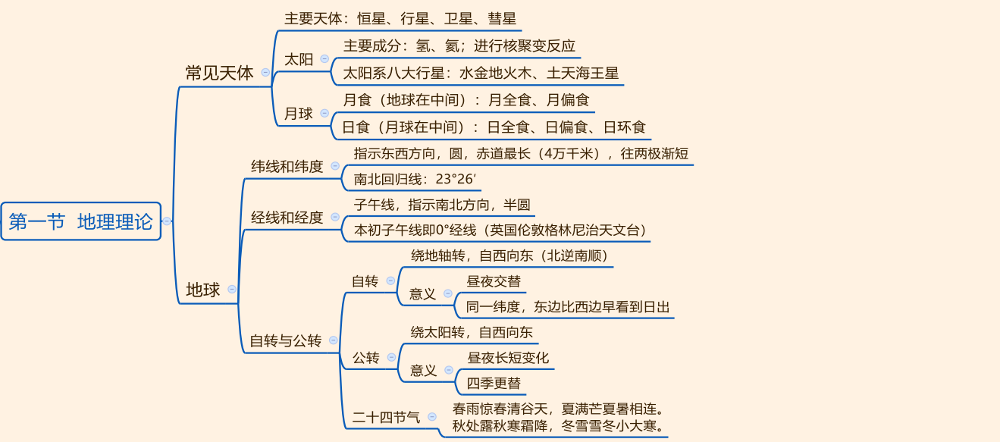
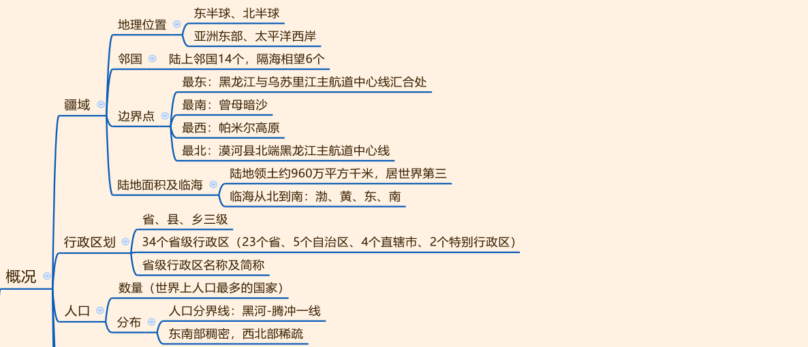
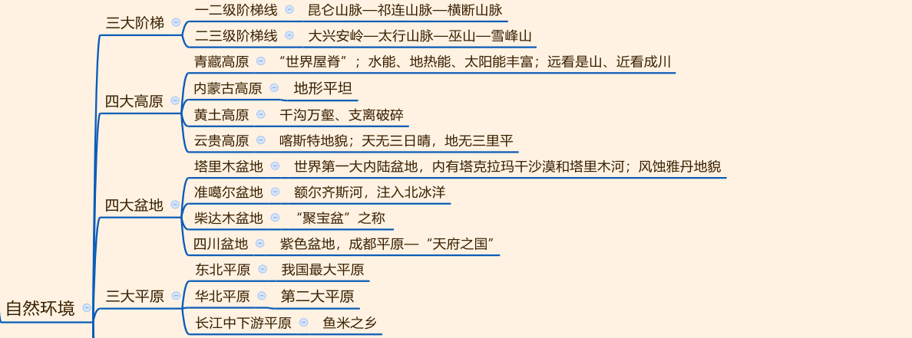
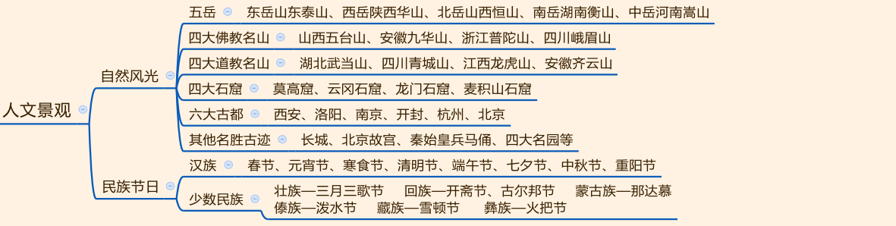
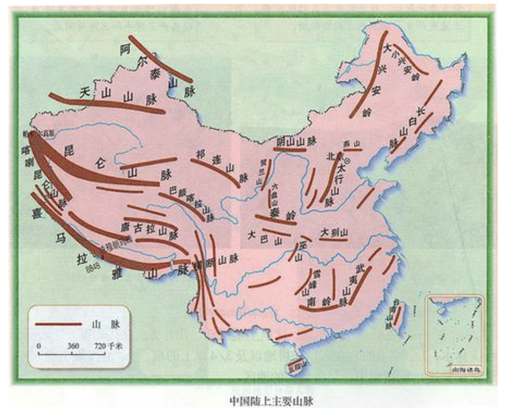
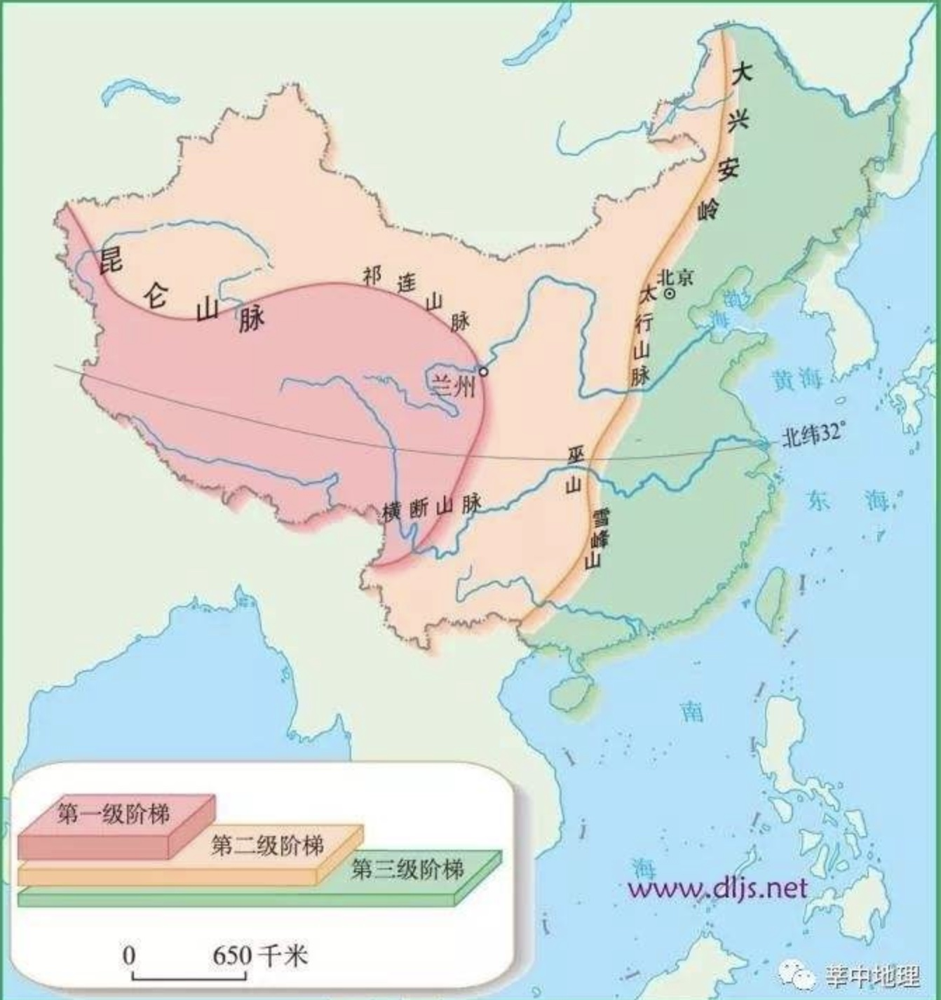

## 一、地理理论

1. 天体：
   - （1）恒星：炽热气体，可以自己发光的，典型的恒星是太阳。
   - （2）行星：椭圆轨道绕恒星运行的， 比如地球绕太阳运动。
   - （3）卫星：绕行星运行，比如月球绕着地球运动。
   - （4）彗星： 特殊的是哈雷彗星，回归周期是 76 年。

2. 太阳：
   - （1）太阳是一个炽热的气体球， 是一颗恒星， 主要成分是氢和氦，最主要的是氢；太阳可以自我发光，能量来源于内部的核聚变。
   - （2）大气结构： 从里到外共三层，光球层（肉眼可视、最内层）、色球层、日冕层（最外层）。
   - （3）太阳活动：太阳大气在活动，太阳活动时看到一个个变暗的地方是太阳黑子；太阳表面出现增大增强变亮是耀斑；太阳风会产生极光。

3. 太阳系（太阳的家族）：
   - （1）八大行星：名称和顺序，即水金地火(小行星带)木、土天海王星。
   - （2）水星：离太阳最近（第一颗），中国古代称为“辰星” 。
   - （3）金星： 比较“叛逆” ，逆向自转， 由于亮度特别高，古代被称为“启明星” 、长庚星” 、 “太白金星” 。
   - （4）木星： 八大行星中质量和体积都是最大的。

4. 月球：
   - （1）月食：地球位于太阳和月球的中间，地球遮住太阳的光芒。 类型：月全食、月偏食。
   - （2）日食：月球位于太阳和地球的中间，此时看不见太阳。 类型：日全食（全部看不到）、日偏食（一部分看不到）、日环食。

5. 地球：
    - （1）形状：两极略扁、赤道略鼓， 地球平均半径是 6371 千米。
    - （2）纬线：是一个个的圆，指示东西方向。特殊纬线：南、 北回归线，度数是 23°26′ 。
    - （3）经线： 是一个个半圆， 连接南北两个极点，指示南北方向。特殊经线： 0° 经线（本初子午线）、 180° 经线。

6. 地球运动：
   - （1）自转：地球绕地轴转，方向自西向东。意义（两个）：昼夜交替；同一纬度东边比西边早看到日出。
   - （2）公转：地球绕太阳转，方向和自转一样。意义（两个）： 四季更替； 地球上各地昼夜长短的变化。

7. 二十四节气：春雨惊春清（清明）谷天，夏满（小满）芒夏暑相连，秋处（处暑）露秋寒霜降，冬雪雪冬小大（小在前，大在后）寒。

## 二、中国地理

1. 地理概况：
   - （1）位置：我国位于东半球、北半球、亚洲东部、太平洋西岸。
   - （2）领土四端：最南是南海的曾母暗沙，最北是黑龙江的漠河。
   - （3）面积邻国：我国面积 960 万平方千里，位居世界第三，陆上邻国 14 个，隔海相望的有 6 个。
   - （4）我国海域：自北向南四大近海依次是渤海、黄海、东海、南海。
   - （5）行政区划：共有 34 个省级行政区域，其中 23 个省、 5 个自治区、 4 个直辖市， 2个特别行政区。
   - （6）人口分界线：我国人口分布不均，黑龙江的黑河——云南的腾冲一线（东南人口稠密，西北人口稀疏）。
   - （7）少数民族：分布特点是大杂居/大散居、小聚居，交错杂居，其中人口最多的是壮族，人口最少的是塔塔尔族，主要分布在新疆境内。
   - （8）自然资源：①土地资源绝对数量大，人均少、耕地比重小。②水资源人均少，仅为世界平均水平的 1/4，水资源分布不均，典型的南丰北缺/南多北少。

2. 地势特征：西高东低，呈三级阶梯状分布。

> - 我国地势第一阶梯和第二阶梯的分界山脉是昆仑山脉、祁连山脉、横断山脉一线，第二阶梯和第三阶梯的分界山脉是大兴安岭、太行山、巫山、雪峰山一线，我国东西走向的山脉主要有三列：天山-阴山，昆仑山-秦岭，南岭。

> - 中国地势西高东低，呈三级阶梯分布，第一级阶梯包括青藏高原和柴达木盆地，地形以高原为主;第二级阶梯包括塔里木盆地、准噶尔盆地、四川盆地、内蒙古高原、黄土高原、云贵高原，地形以高原、盆地为主;第三阶梯主要包括东北平原、华北平原、长江中下游平原，以及辽东丘陵、山东丘陵和江南丘陵，地形以平原和丘陵为主。

> - 我国**东北﹣西南走向**的山脉主要分布在东部，自西向东分为三列：西侧的一列包括大兴安岭、太行山、巫山、雪峰山等，**同时也是我国第二、三级阶梯分界线**;中间的一列包括长白山、武夷山等;最东边的一列是台湾岛上的台湾山脉.

1. 四大高原：
   - （1）“远看是山，近看成川”形容青藏高原，水能、地热能、太阳能丰富。
   - （2）内蒙古高原畜牧业发达。
   - （3）黄土高原地表特征：千沟万壑、支离破碎。
   - （4）“天无三日晴，地无三尺平”形容云贵高原的贵州一带，广泛分布喀斯特地貌（与石灰岩有关）。

2. 四大盆地：
   - （1）塔里木盆地：世界第一大内陆盆地，分布着雅丹地貌，风力侵蚀形成。
   - （2）准噶尔盆地：注入北冰洋的河流是额尔齐斯河。
   - （3）柴达木盆地：“聚宝盆”，青海省境内。
   - （4）四川盆地：土壤紫色，称为“天府之国”。
   - （5）我国四大盆地分别是：塔里木盆地、准噶尔盆地、柴达木盆地、四川盆地，柴达木盆地位于青藏高原上，平均海拔3000米左右，位于我国第一阶梯上;准噶尔盆地位置最北、纬度最高。

3. 三大平原：面积最大的是东北平原，有肥沃的黑土地；其次是华北平原，“鱼米之乡”是长江中下游平原。

4. 水文：
   - （1）长江：世界第三长河，我国第一长河，发源于唐古拉山，流经 11 个省级行政区，最终注入东海。
   - （2）黄河：发源于巴颜喀拉山，流经 9 个省级行政区，最终注入渤海。
   - （3）我国最大的淡水湖是江西北部的鄱阳湖，我国最大的咸水湖是青海省的青海湖。

5. 岛屿：我国最大的岛是台湾岛，我国最大的群岛是浙江的舟山群岛，我国最大的半岛是山东半岛。

6. 山脉：阴山、秦岭重点把握；贺兰山、六盘山、横断山脉是南北走向。

7.  人文：
   - （1）五岳：山东泰山，陕西华山，山西恒山，湖南衡山，河南嵩山。
   - （2）民族节日：三月三歌节是壮族节日，开斋节、古尔邦节是回族节日，那达幕大会是蒙古族节日，雪顿节是藏族节日。

10. 五湖四海：五湖：一般指洞庭湖、鄱阳湖、太湖、巢湖、洪泽湖。四海：指渤海、黄海、东海和南海。

